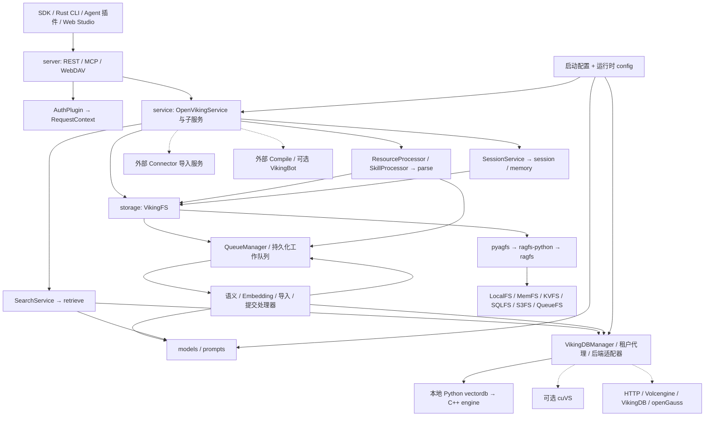
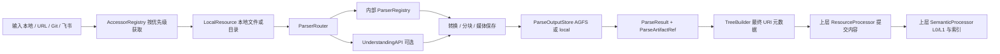
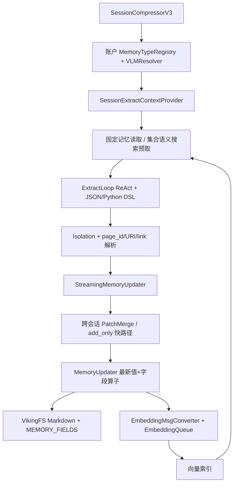
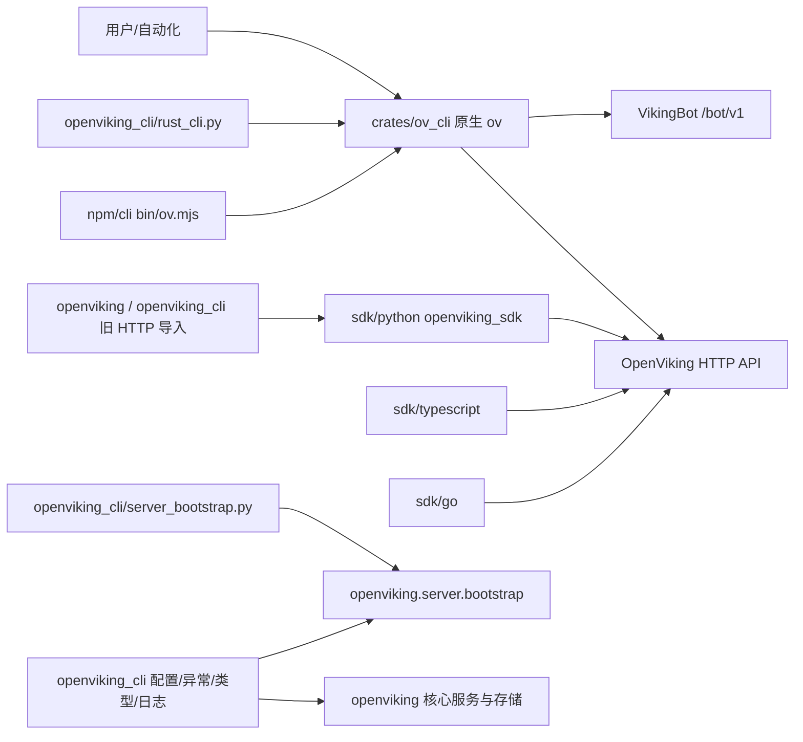
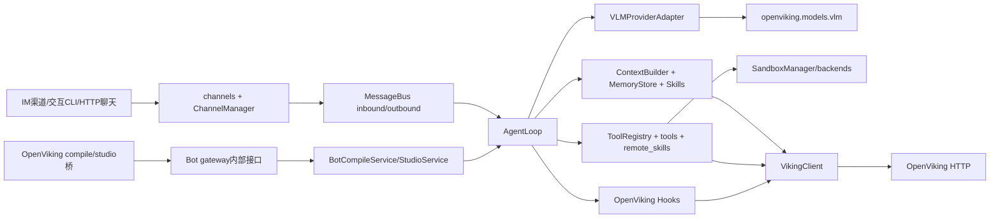
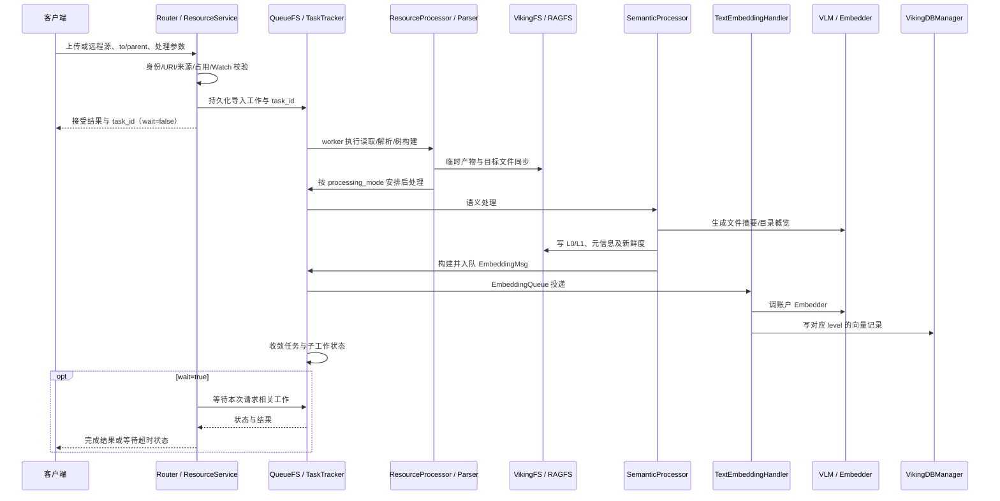

# OpenViking 项目结构、模块职责与依赖关系

> 分析日期：2026-10-02。源码基线：`df32bf6e50a40843438f9491a26069ca4bd08f1f`。本文描述当前检出的实现；目录名、类名和历史注释与实现不一致时，以实际代码为准。

## 阅读导航

- [分析范围与源码规模](#1-分析范围与阅读方式)
- [目录结构、总图与入口](#2-项目结构与总体关系)
- [共享数据契约、身份和 URI](#3-跨模块共享的数据契约)
- [HTTP / MCP 服务](#4-http--mcp-服务模块)
- [业务服务与持久化任务](#5-service业务编排与持久化任务)
- [解析、模型、会话记忆和训练](#6-解析模型提示词与会话记忆模块)
- [检索与上下文装配](#7-retrieve检索与上下文装配)
- [存储、Rust 和 C++](#8-storagerust-文件系统与-c-检索引擎)
- [配置与账户资源](#9-config启动配置运行时配置与账户资源)
- [Connector、日志回放、隐私和观测](#10-connector日志回放隐私与观测)
- [CLI、SDK、Bot、Studio 和插件](#11-clisdkbotweb-studio-和插件生态)
- [调用链与依赖矩阵](#12-跨模块调用链与依赖方向)
- [构建、测试、部署和文档](#13-构建测试部署与文档站)
- [重要边界与源码阅读顺序](#14-容易误读的模块边界与阅读顺序)
- [源码定位与静态 import 索引](#15-源码依据与静态依赖索引)

## 1. 分析范围与阅读方式

本仓库是一个多语言单仓库：Python 承担服务与上下文处理，Rust 承担文件系统和 CLI，C++ 承担本地检索引擎，TypeScript/React 承担客户端、插件和管理界面，Vue 用于文档站主题，另有 Go SDK。

本文按“可独立说明职责的包、子包、组件”组织模块。对第一方源码清点文件、提取定义和导入关系，并沿入口、状态变化、异步任务和跨语言边界阅读实现；测试按所验证的模块归类。第三方内嵌源码按被调用的接口、构建关系和职责说明，不逐文件复述外部库实现。提示词、配置文件、构建与部署脚本也纳入关系分析。

以下统计来自该基线的 Git 跟踪文件，以 Python、Rust、C/C++、Go、JS/TS、Vue、Shell、HTML/CSS、SQL、SCM 等源码后缀计数，包含测试、生成代码和重复的插件共享副本；不包含 Markdown、YAML/JSON 配置、锁文件、图片、字体及构建产物。“行数”包含注释和空行，不能直接视为业务代码规模。

| 目录 | 源码类文件数 | 行数 | 范围 |
| --- | ---: | ---: | --- |
| `openviking/` | 728 | 213,310 | Python 核心及解析查询资源；其中 Python 文件 704 个 |
| `openviking_cli/` | 55 | 13,581 | 命令启动、兼容客户端和共享配置/类型 |
| `crates/` | 154 | 108,077 | Rust CLI、RAGFS、Python 绑定及 Rust 测试 |
| `src/` | 65 | 14,155 | C++ 本地向量与标量检索 |
| `sdk/` | 50 | 16,999 | Python、TypeScript、Go SDK 及其测试 |
| `web-studio/` | 427 | 77,497 | 管理界面及前端支持代码 |
| `bot/` | 193 | 65,708 | VikingBot、消息渠道、工具、Studio、部署及测试 |
| `agent-plugins/` | 8 | 1,659 | 通用 Agent 插件代理；技能 Markdown 另计 |
| `examples/` | 554 | 152,157 | 接入插件、独立框架集成、演示与测试 |
| `benchmark/` | 131 | 49,570 | 检索、记忆、任务和 GPU 性能基准 |
| `tests/` | 805 | 246,970 | 核心测试及专项测试框架 |
| `third_party/` | 325 | 103,437 | 内嵌第三方 C/C++ 库 |
| `docs/` | 55 | 10,748 | 文档站前端、主题、校验脚本 |
| `.github/` | 11 | 673 | CI 支持脚本；工作流 YAML 另计 |
| `scripts/` | 5 | 953 | 构建支持、维护和安装检查 |
| `deploy/` | 4 | 288 | 容器启动等源码脚本；Helm YAML 另计 |
| `npm/` | 2 | 134 | CLI npm 启动与安装脚本 |
| `setup.py` | 1 | 592 | Python 包与原生产物构建 |
| **合计** | **3,573** | **1,076,508** | 上述源码后缀口径 |

源码覆盖校核还对 Git 跟踪的 1,946 个 Python 文件（含测试、示例和基准）进行了 AST 解析，未发现语法解析失败。静态导入与符号清点用于防止遗漏，具体职责判断仍结合模块实现与关键调用路径。

本文是静态架构分析，不代表所有后端、模型供应商和外部服务已在本机启动验证。涉及可选、实验性或占位实现时，会单独说明。

## 2. 项目结构与总体关系

### 2.1 目录地图

```text
OpenViking/
├── openviking/              核心服务、解析、检索、会话、存储、模型和观测
│   ├── server/             REST / MCP / WebDAV 入口与鉴权
│   ├── service/            业务编排及基础设施生命周期
│   ├── core/               Context、命名空间、目录和 URI 规则
│   ├── parse/              输入访问、格式解析、上下文树构建
│   ├── resource/           资源刷新、Watch、来源与 URI 变更协调
│   ├── retrieve/           召回、意图分析、技能包查找、上下文装配
│   ├── session/            消息、归档、工作记忆、长期记忆与训练
│   ├── storage/            VikingFS、向量数据库、QueueFS、ACL、缓存等
│   ├── pyagfs/             Rust 文件系统的 Python 兼容与异步接口
│   ├── models/             Embedding、VLM、Rerank 供应商适配
│   ├── prompts/            YAML/Jinja2 提示词模板
│   ├── config/             集群/账户运行时配置与资源解析
│   ├── connector/          外部 Connector 导入委托
│   ├── ingest/             外部 Agent 会话日志回放
│   ├── crypto/ privacy/    文件加密、技能敏感值配置与恢复
│   ├── telemetry/          单次操作统计与追踪
│   ├── metrics/            指标、探针、Prometheus/OTel 导出
│   ├── observability/      请求上下文、事件、Usage/Audit 投影
│   ├── usage_reporter/     会话使用数据报告
│   ├── eval/               IO 录制/回放与 RAGAS 评估
│   ├── integrations/       独立 LangChain 包的旧路径兼容
│   ├── message/ utils/     消息协议、处理器和共享工具
│   └── web_studio/         前端构建产物的包内宿主
├── openviking_cli/         启动器、历史路径兼容、共享基础定义
├── crates/
│   ├── ov_cli/             Rust HTTP 命令行客户端
│   ├── ragfs/              Rust 文件系统、后端插件、锁、缓存与快照
│   └── ragfs-python/       PyO3 Python 绑定
├── src/                    C++ 本地索引与持久化引擎
├── sdk/{python,typescript,go}/  独立 HTTP SDK
├── bot/                    可选 VikingBot Agent 应用
├── web-studio/             React 管理界面源码
├── agent-plugins/ examples/    通用插件、各 Agent 接入和框架集成
├── benchmark/ tests/       质量与性能验证
├── third_party/            C++ 内嵌依赖
├── deploy/ scripts/ .github/  部署、构建维护和 CI
└── docs/                   独立 VitePress 文档站
```

### 2.2 运行时主图

箭头 `A → B` 表示 A 调用或使用 B；虚线表示可选路径。此图展示主要运行关系，不把所有 Python import 混成同一张图。



核心组合点是 `OpenVikingService`。它创建子服务，再把 VikingFS、VikingDBManager、模型资源解析器、任务跟踪器和队列处理器注入相应模块。请求入口主要负责协议、参数、身份、URI 规范化和返回结构；文件与索引管理集中在存储层，解析、记忆提取和检索拥有各自的领域算法。

### 2.3 入口与进程边界

| 入口 | 实际实现 | 后续方向 |
| --- | --- | --- |
| `ov`、`openviking` | `pyproject.toml` → `openviking_cli.rust_cli:main` | 启动分发的 Rust `ov` 二进制 → HTTP 服务 |
| `openviking-server` | `openviking_cli.server_bootstrap:main` | 启动 FastAPI/Uvicorn；`ingest` 子命令分流到日志回放 |
| Python 公共客户端 | `openviking.__getattr__` / `openviking.client` | 旧路径兼容类 → 独立 `openviking_sdk` HTTP 实现 |
| HTTP 服务工厂 | `openviking.server.app.create_app` / `create_worker_app` | 应用生命周期 → `OpenVikingService.initialize` |
| MCP | `openviking.server.mcp_endpoint` | Streamable HTTP `/mcp` → 同一核心服务与鉴权 |
| `vikingbot` | `vikingbot.cli.commands:app` | 可选 Agent/渠道网关进程 |
| Web Studio | `web-studio/src` → 包内 `openviking/web_studio/dist` | 浏览器调用服务 HTTP API；服务托管 SPA |

`openviking_cli` 这个名称容易产生误解：其中 `utils/config`、`exceptions`、`session/user_id` 和 `retrieve/types` 是服务端也在使用的共享定义。它并非完全位于系统最外层。当前 `openviking` 顶层只公开 HTTP 客户端兼容导出，不能依据历史教程假设仍提供旧的嵌入式客户端公共 API。

## 3. 跨模块共享的数据契约

### 3.1 Context 与三层内容

`openviking/core/context.py` 定义 `Context`、`Vectorize`、`ContextType`、`ResourceContentType` 和 `ContextLevel`。

| 概念 | 内容 | 使用者 |
| --- | --- | --- |
| `Context` | URI、父 URI、摘要、内容类型、分类、level、账户/所有者、时间、关联 URI、MD5、向量化输入 | 解析、语义处理、记忆更新、Embedding 消息、向量存储 |
| `ContextType` | `resource`、`memory`、`skill` | 检索分组、目录分类、不同处理策略 |
| L0 / `level=0` | `.abstract.md` 摘要 | 轻量预览、召回文本 |
| L1 / `level=1` | `.overview.md` 概览 | 目录和文件内容理解、上下文装配 |
| L2 / `level=2` | 原始或解析后详细内容 | 读取正文、详细召回、多模态内容 |
| `Vectorize` | 文本及图片引用 | 稠密/稀疏/多模态 Embedding 输入 |
| `BuildingTree` | 根上下文、层级节点及临时产物关联 | Parser → ResourceProcessor/TreeBuilder |

L0/L1 是带格式协议与新鲜度状态的语义产物，并不是将原文机械截断得到的文本。向量记录使用 URI 与 level 共同区分；检索把 L0/L1 的显示 URI 恢复为对应的 `.abstract.md` / `.overview.md` 路径。正文、摘要文件和向量记录存在关联，但分别有自己的存储与更新步骤。

### 3.2 身份、URI、租户和 Peer

`server/identity.py` 定义 `Role`、`ResolvedIdentity`、`RequestContext`、`ToolContext`。`RequestContext` 携带用户/账户、角色、actor peer、调用凭证及可信后台任务标记，是协议层传向服务、文件系统、模型和向量后端的共同参数。

| 逻辑 URI | 意义 |
| --- | --- |
| `viking://resources/...` | 当前账户范围内共享的资源树 |
| `viking://agent/skills/...` | 当前账户共享技能 |
| `viking://user/{user_id}/...` | 明确用户的内容根 |
| `viking://user/{user_id}/memories/...` | 用户记忆 |
| `viking://user/{user_id}/peers/{peer_id}/memories/...` | 该用户与特定 Peer 相关的记忆 |
| `viking://user/{user_id}/skills/...` | 用户技能 |
| `viking://user/{user_id}/sessions/{session_id}` | 会话内容与归档 |
| `viking://~/...` | 在已鉴权的请求边界展开到当前用户根 |
| `viking://temp/...`、`viking://upload/...`、`viking://queue/...` | 内部临时、上传和队列命名空间，公开操作另有访问限制 |

账户通常不直接出现在逻辑 URI 字符串中；文件系统把账户上下文映射到物理路径，向量层加入账户和所有者过滤。所以相同 `viking://resources/foo` 在不同账户中不是同一份数据。目录预设中个别历史文字写“globally shared”，应理解为共享资源命名空间，不能据此绕过账户隔离。

`actor_peer_id` 控制当前用户下 Peer 子树的视图，不改变账户或用户身份。默认检索目标也由 `core/retrieval_targets.py` 按上下文和 URI 类型解析，不能用字符串拼接替代这些规则。旧 `viking://session/...` 仅在相应请求边界转为用户会话 URI；内部 canonical parser 会拒绝旧形状。

### 3.3 其余核心工具

| 模块 | 功能与关系 |
| --- | --- |
| `core/directories.py` | 为账户共享根和用户根初始化目录、L0/L1 及索引消息；Peer 等具体叶目录按需创建 |
| `core/identifiers.py`、`peer_id.py` | 校验账户/用户/Peer 标识，阻止非法路径片段进入命名空间 |
| `core/namespace.py`、`uri_validation.py` | 解析内容归属、请求别名和允许的目标类型，供 API、FS、检索和记忆共享 |
| `core/path_variables.py` | 解析动态路径变量，含日历变量提供器；API/MCP 在边界使用 |
| `core/skill_loader.py`、`mcp_converter.py` | 解析/校验 `SKILL.md`；将 MCP 工具定义转换成技能形式 |
| `core/retrieval_types.py` | 共享检索类型，减少引入重型运行时模块 |
| `concurrency.py` | 为跨事件循环资源提供并发控制与借用/退出支持，被配置与模型资源使用 |

## 4. HTTP / MCP 服务模块

### 4.1 应用生命周期与基础组件

`server/app.py` 是 HTTP 应用装配点。`create_app` 注册路由、中间件、异常处理、MCP、可选 OAuth 和 Studio；lifespan 配置执行器，装配指标/Usage Audit/追踪，初始化核心服务及鉴权，再接受流量。结束时关闭观测后台工作、鉴权任务和由应用拥有的核心服务。

| 模块 | 职责 | 主要依赖 |
| --- | --- | --- |
| `server/bootstrap.py`、`config.py` | 服务配置校验和启动支持；worker/Bot 等启动参数 | 启动配置模型、Uvicorn、鉴权注册表 |
| `dependencies.py` | 注册和读取当前服务/ServerConfig | `OpenVikingService` |
| `models.py`、`responses.py`、`error_mapping.py` | Pydantic 请求/响应、统一错误码与 HTTP/存储异常映射 | 共享异常、存储错误 |
| `request_id.py`、`timing_middleware.py`、`profile_middleware.py` | 请求 ID、耗时、可选性能剖析 | ASGI、日志、观测上下文 |
| `body_dump_middleware.py` | 可配置的 HTTP body 追踪附加 | 观测 span；属于显式启用的调试能力 |
| `local_input_guard.py` | 区分远程源、上传 ID 与服务器本地路径，限制公共入口的本地读取 | Connector 路由、路径和 URL 安全工具 |
| `temp_upload_store.py`、`upload_token_store.py` | 上传暂存、文件标识、授权 token 与传输入口 | VikingFS、上传临时目录 |
| `resource_ingest.py`、`skill_ingest.py` | 把已上传/远程资源转交业务服务；统一技能安装流程 | ResourceService、技能源解析 |
| `openviking_assets.py` | OpenViking 资产地址解析/预检 | 请求身份、资源访问 |
| `user_config.py` | 用户级默认添加位置、记忆/自动提交策略的持久化与校验 | VikingFS、SessionService |
| `telemetry.py` | HTTP 路由的操作级统计包装 | telemetry.execution |
| `skill_package_update.py`、`skill_source_metadata.py` | 保持技能包根锁的更新/回滚、来源元数据存取 | VikingFS、技能源协议 |

### 4.2 路由与业务模块对应表

完整 URL 由各 `APIRouter.prefix` 与路由路径组合。下面按职责列出路由文件，便于从接口定位实现。

| `server/routers` 模块 | 接口范围 | 实际调用 |
| --- | --- | --- |
| `filesystem.py` | `/api/v1/fs`：ls/tree/stat/attrs/mkdir/rm/cp/mv | `service.fs` |
| `content.py` | `/api/v1/content`：正文/摘要/概览、下载、写入、批量写、标签、重建索引 | FSService、`service.reindex` |
| `resources.py` | `/api/v1/resources`、`/skills`：上传与添加 | ResourceService、resource/skill ingest |
| `search.py` | `/api/v1/search`：find/search/recall/grep/glob | SearchService、context assembler、FSService |
| `skills.py` | `/api/v1/skills`：列表、包级查找、校验、更新、删除 | 技能处理器、SearchService、FSService |
| `sessions.py` | `/api/v1/sessions`：消息、批量追加、配置、上下文、归档、工具输出、commit/extract | SessionService、Session |
| `watches.py` | `/api/v1/watches`：任务查询/修改/触发/删除 | WatchScheduler/WatchManager |
| `tasks.py` | `/api/v1/tasks`：任务读取、分页与取消 | TaskTracker |
| `snapshot.py` | `/api/v1/snapshot`：commit/log/show/diff/restore/ignore | FSService → RAGFS Git 快照 |
| `pack.py` | `/api/v1/pack`：OVPack 导入/导出、备份/恢复 | PackService |
| `compile.py` | `/api/v1/compile`：创建、能力、幂等提交查询 | CompileService/ExternalTaskService |
| `agent_evolution.py` | 经验关联轨迹与结果分布 | AgentEvolutionService |
| `acl.py` | `/api/v1/acl`：授权规则、grant/revoke | AclManager / VikingFS |
| `privacy_configs.py` | 敏感值配置的当前值、历史版本、激活 | UserPrivacyConfigService |
| `user_settings.py` | 用户资源/技能默认添加位置 | 用户设置持久化工具 |
| `admin.py` | 账户、用户、角色、密钥、组、运行时配置、记忆模板、历史数据迁移 | APIKeyManager、RuntimeConfigManager、DeletionService |
| `console.py` | Dashboard、token、context commits、audit | UsageAuditQueryService |
| `stats.py` | 记忆与指定会话统计 | stats 聚合 |
| `observer.py`、`debug.py` | 组件状态、健康、向量检查 | DebugService/Observers、租户向量代理 |
| `metrics.py` | `/metrics` | CollectorManager 与导出器 |
| `system.py` | `/health`、`/ready`、系统状态、等待处理、一致性/同步状态 | 核心服务、FS、向量后端 |
| `openviking_assets.py` | 资产 resolve/preflight | 资产解析工具 |
| `webdav.py` | `/webdav/resources`：PROPFIND/GET/PUT/MOVE 等 | FSService/资源导入；复用服务端身份 |
| `bot.py` | `/bot/v1`：聊天、流、反馈及兼容 Compile | HTTP 转发到 Bot 网关 |
| `bot_studio.py` | 管理侧 Bot 连接、凭证、会话及 onboarding | Bot Studio 网关代理 |

路由并非全都是简单的一行转发。例如技能替换需要取消旧任务、取得树锁和维护隐私占位；搜索要合并类型、时间、标签过滤并规范化结果；这些边界逻辑仍位于 server。

### 4.3 鉴权、API Key 与 OAuth

```text
HTTP / MCP 请求
  → auth.resolve_identity / AuthPlugin
  → ResolvedIdentity
  → RequestContext(account, user, role, actor_peer)
  → URI 规范化 + 角色检查
  → 服务层
  → 文件系统命名空间检查 / ACL / 向量账户与所有者过滤
```

| 子模块 | 职责与边界 |
| --- | --- |
| `auth/plugin.py`、`registry.py` | `AuthPlugin` 生命周期与接口、按 `auth_mode` 注册/选择实现 |
| `auth/plugins/dev.py` | localhost 开发模式，返回 ROOT 身份；服务配置验证限制绑定地址 |
| `auth/plugins/api_key.py` | 从 API Key/OAuth token 获取身份；忽略客户端身份声明头；ROOT 密钥的数据接口访问有单独限制 |
| `auth/plugins/trusted.py` | 上游可信身份头，可验证共享 root key；维护身份登记与批量刷新 |
| `auth/plugins/ldap.py`、`oidc.py` | 可选 LDAP/OIDC 验证与身份映射；需要相应外部服务/依赖 |
| `auth/identity_mapping.py`、`health_check.py`、配置模型 | 外部身份到内部账户/用户映射，以及配置和健康检查 |
| `api_keys/new.py`、`models.py` | 当前账户/用户/组/角色/密钥登记和删除围栏；持久化、缓存及刷新 |
| `api_keys/legacy.py` | 历史 Key 数据格式的兼容/迁移实现 |
| `oauth/{provider,storage,router,otp}.py` | OAuth 授权提供器、SQLite token/client/code 存储、授权/同意/验证码页面；与 MCP SDK 的授权路由组合 |

鉴权解决“调用者是谁”，命名空间/ACL/索引过滤解决“能访问哪些内容”。三者共同工作，不能把任意 `X-OpenViking-Account/User` 头都视为可覆盖 API Key 身份。

### 4.4 MCP 与 Web UI

`mcp_endpoint.py` 使用 FastMCP，注册文件、检索、资源/技能、会话/记忆、Watch、健康等工具。MCP 的身份中间件调用 REST 使用的身份解析函数，通过 contextvars 传播 `RequestContext`；工具调用核心服务，不另建一套数据库。MCP session manager 的生命周期归 FastAPI 主应用管理。

HTTP 服务也托管内置静态页面和 Web Studio SPA。`openviking/web_studio/__init__.py` 只是产物定位宿主，前端业务源码在根目录 `web-studio/`。

## 5. service：业务编排与持久化任务

### 5.1 核心组合与初始化

`service/core.py` 中的 `OpenVikingService` 管理依赖所有权和关闭顺序。

1. 读取启动配置，建立默认账户/用户，创建子服务。
2. 为嵌入式本地数据目录取得进程级独占锁；解析加密配置后构造 RAGFS 绑定。
3. 创建 AGFS/RAGFS 客户端、QueueManager、VikingDBManager、AclManager 和 TaskTracker。
4. 初始化上下文集合和运行时配置源，建立账户感知的 VLM、Embedding、向量配置资源解析器。
5. 创建 VikingFS，初始化账户/用户目录；创建资源/技能处理器及 SessionCompressor。
6. 向 FS、Search、Resource、Session、Pack、Debug、AgentEvolution 等子服务注入依赖。
7. 注册标准语义/Embedding 队列和导入、重建、会话提交、外部任务、清理队列，恢复任务工作索引。
8. 按配置启动 Watch 和会话自动提交；启动队列 worker、可选 MinerU 预检及运行时配置刷新。

关闭时停止新增后台工作和调度器，停止队列，再关闭模型资源、向量存储和 RAGFS，清除服务登记并释放数据目录锁。HTTP 应用只关闭由自己创建、拥有的服务对象。

### 5.2 子服务职责

| 模块 / 主要对象 | 功能 | 依赖与协作 |
| --- | --- | --- |
| `fs_service.py` / `FSService` | 文件/目录读写、列表/分页、复制移动删除、ACL、标签、grep/glob、Git 快照 | VikingFS；变更协调器、Watch、隐私恢复、资源记忆引用清理 |
| `resource_service.py` / `ResourceService` | 新增/刷新资源、解析路径分流、目标预留、持久化导入任务、技能入库、wait | ResourceProcessor、SkillProcessor、ConnectorDelegate、队列、TaskTracker、Watch |
| `search_service.py` / `SearchService` | find/search/skill package；验证查询、关键字能力和图片查询 | VikingFS、Session 上下文、Retriever |
| `session_service.py` / `SessionService` | 创建/加载/删除会话、commit/extract、有效策略计算、自动提交 | Session、SessionCompressorV3、用户策略、RuntimeConfigManager、TaskTracker |
| `session_auto_commit.py` | 空闲/消息数/token 阈值触发提交；下一次检查时刻和近期保留策略 | SessionService、会话状态、有效自动提交策略 |
| `resource_memory_link_service.py` | 资源添加理由形成记忆引用；删除资源前后寻找并清理引用 | SessionService、记忆 Markdown 链接、VikingFS、向量层 |
| `pack_service.py` / `PackService` | OVPack 导入/导出与备份/恢复 | VikingFS、OVPack 格式、向量层和账户向量契约 |
| `reindex_executor.py` | vectors_only/语义产物维护等重建编排，锁、任务、队列与计数 | VikingFS、向量后端、模型解析器、QueueFS |
| `compile_service.py` / `CompileService` | 校验 Compile 请求、能力与 provider 调用；配置外部或 Bot 本地网关 | ExternalTaskService、CompileAPIClient、MemoryCompileRunner |
| `memory_compile.py` | memory 模式 Compile 的验证和后台执行 | 记忆 consolidation/compile、TaskTracker、向量层 |
| `external_task_service.py` | 外部异步任务统一提交/轮询/取消/恢复、幂等性、目标串行与错误重试 | provider 协议、持久化任务及 `external_task` 队列 |
| `agent_evolution_service.py` | 经验与轨迹 lineage 查询、结果分布统计 | 向量/文件中的精确元数据；此服务不执行策略训练 |
| `debug_service.py` | 按账户展示队列、模型、向量、检索、锁、FS 和系统健康 | storage/observers 与模型资源解析器 |
| `deletion.py` | 账户/用户删除围栏、撤销身份、持久化清理任务、幂等恢复 | 身份管理、队列、向量/文件、配置、OAuth、Usage Audit |
| `legacy_migration.py` | 旧 session/数据布局的预检、复制迁移与清理 | 文件系统、身份登记、任务 |
| `skill_sources.py` | Git 技能源解析、临时上传来源和技能包枚举/预检 | Git 工具、SkillLoader、临时文件生命周期 |

`to` 指定精确资源目标，已有内容按新源同步；`parent` 指定父目录，名称碰撞会预留新名字。资源刷新、移动、删除与 Watch 目标的占用关系会共同检查，不能把这些操作理解为普通 `shutil` 文件复制。

### 5.3 任务状态与队列工作分离

| 模块 | 作用 |
| --- | --- |
| `task_tracker.py` | 不可变 `TaskRecord` 快照、状态迁移、阶段/事件、任务取消、等待、按账户用户分页、恢复与清理 |
| `task_store.py` | `TaskStore` 协议及 AGFS 持久化实现，把任务记录保存在系统目录 |
| `task_work_index.py` | 从 QueueFS 重建任务工作索引，关联父子工作、活跃执行、取消和失败；传递 task context |
| `task_queue_middleware.py` | 入队/处理/ack 时维护任务工作索引；QueueFS 保持持久化工作的事实来源 |
| `task_tracker_concurrency.py` | store IO 限流、按键串行、跨循环调度、取消后已开始工作完成边界 |
| `task_events.py`、`task_pagination.py`、`task_processing_time.py` | 事件历史、带范围校验的分页 cursor、工作耗时累计和等待暂停 |

任务记录是面向用户的状态；队列消息是恢复后继续执行的工作。一次资源/会话操作可产生多级语义和 Embedding 子工作。队列进入空闲、单条消息被 ack、任务完成是有关联但不等价的事件；取消需要阻止新子工作并处理正在运行的工作。

## 6. 解析、模型、提示词与会话记忆模块

### 6.1 parse：输入访问、格式解析与产物

| 子模块/文件 | 功能与关联 | 关键源码证据 |
|---|---|---|
| `base.py` | `ResourceNode` 表示结构节点、`ParseResult` 包含来源、格式、警告、临时目录与产物句柄；兼容旧树/临时 URI。内容既可取本地 content_path，也可异步从 VikingFS 读取。提供媒体策略、表格 Markdown、lazy_import 基础工具 | `ResourceNode:165`、`ParseResult:290`、`ensure_artifact_ref:318` |
| `accessors/base.py` | 两层架构的获取层协议 `DataAccessor` 和 `LocalResource`；记录原始来源、metadata、临时性、飞书计划；临时资源提供 cleanup，局部内容生命周期与解析输出生命周期区分 | `LocalResource:41`、`DataAccessor:101` |
| `accessors/registry.py` | 动态注册访问器，按 priority 排序，先匹配者获取输入；支持自定义访问器和共享单例。实际顺序 Feishu 100 > Git 80 > WebFeed 60 > HTTP 50 > Local 1 | `_register_defaults:53`、`register:95`、`get_accessor:135`、`access:156` |
| `accessors/local_accessor.py` | 识别真实本地路径，排除远程资源形式；验证文件/目录存在并返回非临时 LocalResource | `can_handle:31`、`access:65` |
| `accessors/git_accessor.py` | 识别 Git URL/SSH URI、解析 branch/commit；HTTP 鉴权配置并构造 git 环境；执行 clone，GitHub/GitLab 可下载源码 ZIP，写仓库标记；处理路径安全、取消后的子进程与临时目录清理 | `access:96`、`_parse_repo_source:244`、`_git_clone:377`、ZIP 分支 `454/551/644` |
| `accessors/http_accessor.py` | URLTypeDetector 利用扩展名、HEAD/响应头、Content-Disposition、IANA MIME、magic bytes（含 Office ZIP）决定格式；下载 HTTP 文件、转换代码平台 blob→raw、应用请求验证/网络 guard；普通页面可转 WebImporter | `detect:164`、`access:442`、`_download_url:544`、`_finalize_download_metadata:662` |
| `accessors/mime_types.py` | MIME 解析、后缀类型匹配与偏好扩展名，供 HTTP 检测和飞书文件下载使用 | `IANAMediaType:16`、`get_preferred_extension:312` |
| `accessors/web_feed_accessor.py` | sitemap/sitemapindex/RSS/Atom 入口；`site=True` 可指定站点并发现 feed，`site=False` 可退回 HTTP。递归 sitemap、同主机/include/exclude/robots 过滤、页面数/深度/并发/礼貌间隔控制；feed 内正文可直接镜像为 HTML | `can_handle:269`、`access:283`、`_collect:449`、`_mirror:605` |
| `accessors/web_importer.py` + `web_crawler` | 普通网页爬取，与 feed 导入分开；按 depth/max_pages/路径过滤爬页面和可下载文件，镜像成临时目录；Scrapy 在独立 multiprocessing worker 运行，middleware 对每个请求/重定向做 validator；收集成功/失败/跳过项 | `import_to_directory:76`、`ScrapyWebCrawler.crawl:81`、`OpenVikingWebSpider.parse:91`、`RequestValidatorMiddleware.process_request:11` |
| `accessors/feishu_accessor.py` | 飞书/Lark 特化获取，覆盖 docx、旧 doc、wiki、sheet、base/bitable、mindnote、drive file/folder；生成 Markdown/下载媒体，递归 wiki/文件夹有节点/深度/文件数/总下载预算与 skipped 项；preflight 先做身份和根权限确认。请求可用临时用户 token 或应用凭证 | `_access:459`、`preflight_source:663`、`_fetch_document:830`、wiki `1109`、docx `2300`、sheet `2904`、base `3049` |
| `accessors/feishu_session.py`、`feishu_token.py`、`feishu_import.py` | 请求级 FeishuAccessContext/FeishuApiSession 避免共享可变凭证；tenant token 缓存按域名+app_id+app_secret 哈希隔离。FeishuImportPlan 记录真实/待远程解析条目、预算与 checkpoint_key | `FeishuApiSession:49`、`FeishuTenantTokenCache.bind:59`、`FeishuImportPlan:34` |
| `registry.py` | 内容解析层：默认 text、markdown、pdf、html、anydoc、zip、directory、image/audio/video；按扩展名选择，未知真实文件退回 text；目录单独路由，纯内容字符串走 text。`.ts` 用 MPEG-TS 探针消除 TypeScript/视频扩展名冲突 | `ParserRegistry.__init__:36`、`get_parser_for_file:78`、`parse:103` |
| `parser_router.py`、`backend.py`、`mode.py` | 在内部解析器和外部 UnderstandingAPI 之间选择；支持显式 internal/understanding 与扩展白名单；已经由飞书转成 Markdown 的内容保持内部解析；Understanding 不支持直接 `split_content=False`。mode 验证拆分/不拆分选项 | `should_use_understanding_api:47`、`parse:108`、`normalize_parser_backend:14`、`normalize_parse_mode:21` |
| `understanding_api.py` | 对接外部 Files/Responses API：URL 或本地上传、较大文件分块上传、异步轮询解析状态、checkpoint response_id 恢复、下载解析结果 ZIP 并安全解压到统一输出存储。可直接提交满足条件的 URL；支持飞书应用/用户认证转换 | `parse:97`、`submit_file:316`、`submit_url:335`、`can_submit_url_directly:364`、`_poll_response:629`、`_multipart_create_file:717` |
| `output.py` | backend-agnostic 解析产物抽象 `ParseOutputStore`；AGFS 临时 URI 与本地目录两种实现；writer 维护内容 MD5 manifest、创建/写入/清理；copy_artifact_tree 在产物之间安全复制或移动；确定单一文档根/可折叠单文件 | `ParseArtifactRef:47`、`ParseArtifactWriter:160`、`AgfsParseOutputStore:299`、`LocalParseOutputStore:400`、`resolve_artifact_doc_root:530` |
| `directory_scan.py`、`gitignore.py` | 获取目录清单并分类可处理/不支持/跳过项；include/exclude、嵌套 .gitignore、隐藏文件/目录、符号链接、空白文件和资源限额；strict 可因不支持格式报错。GitignoreMatcher 将嵌套规则转换到导入根路径 | `scan_directory:180`、`GitignoreMatcher:56` |
| `image_rewrite.py`、`image_validation.py` | 从解析产物建立 `.image_mappings.json`，最终把 Markdown/HTML 图片引用改写到 viking URI；保留代码块/内联代码等受保护区域；PIL 图片检查拒绝损坏/无用图片 | `build_artifact_image_mappings:36`、`rewrite_image_uris:256`、`is_valid_image:20` |
| `tree_builder.py` | 把临时产物与资源作用域转换为目标 URI/Context/BuildingTree；路径规范化、资源媒体目录和 repository org/repo 命名、parent 是否存在/可创建、单文件折叠。只形成临时到最终的元数据，不在此移动整个产物 | `resolve_target_uri:83`、`finalize_from_temp:143` |
| `vlm.py` | 兼容 VLM 处理器：图片/表格/页面理解，批页面调用、统一文档分析、图片意义筛选；使用 prompts 和统一 VLM。不是 Markdown 解析的默认步骤 | `VLMProcessor:42`、`understand_image:65`、`batch_analyze_document:319` |
| `resource_detector` | 当前 DetectInfo/VisitType/SizeType/RecursiveType 声明；size.py、recursive.py、visit.py 仅占位，不应画成正在工作的通用检测管线 | `detect_info.py:14`，其余三个文件只有版权行 |

#### 内容解析器的职责与调用方式

| 包/文件 | 行为 | 关联/可选特性 |
|---|---|---|
| `parsers/base_parser.py` | async parse/parse_content 协议，支持扩展名、统一读文本 | 读文件用编码归一化，UTF-8/CP1252/Latin-1 兼容回退；按需取 VikingFS |
| `parsers/markdown.py` | 两步布局规划→实际写入；按标题、token 长度切分、合并小节、大表格按行拆；frontmatter metadata、可不拆分/单输出折叠；本地图片导入、文件名去重、相对文档链接/标题锚点改写 | `parse_content:265`、`_compute_layout:385`、`_apply_layout:467`；默认解析不调 LLM，L0/L1 在后续资源语义阶段生成。图片限定在输入/派生媒体的允许目录，不读任意绝对路径（`_resolve_image_path:957`） |
| `parsers/text.py` | TextParser 是 MarkdownParser 的格式适配器 | 文本文件/字符串复用同一分块与输出逻辑（`parse:30`） |
| `parsers/html.py` | BeautifulSoup 做特殊页面预处理、trafilatura 抽取正文/标题、noscript 信息、Markdown 清理 | 结果交 MarkdownParser（`parse_content:222`），HTML 不单独负责向量化 |
| `parsers/pdf.py` | PDF 转 Markdown 再走 MarkdownParser；本地 pdfplumber 提取文字/表格/图片、书签和字体标题，避免重复图像/缓存占用 | `parse:94`；可选 MinerU HTTP endpoint（`_convert_mineru:684`）；图片送派生媒体存储，不默认整页 OCR |
| `parsers/anydoc.py`、`anydoc_converter.py`、`anydoc_renderer.py` | Office/EPUB 统一 AnyDoc 转换：把文档模型的段落、标题、列表、表格、代码、数学、脚注、链接/锚点、图片渲染成 Markdown；处理样式和 Markdown 转义 | `AnyDocParser.parse:56`→`AnyDocConverter.convert:59`→renderer，再 MarkdownParser。PIL 验证图片，派生媒体保存后供 Markdown 引用 |
| `parsers/directory.py` | 目录先扫描，再为每文件安排 native/Understanding/直接上传任务，保存结构并合并子产物；收集逐文件状态、失败/跳过统计，外部解析独立并发限流/超时；飞书 import plan 可恢复 response checkpoints | `parse:125`；有 .git 或仓库 marker 委托 CodeRepositoryParser；`_parse_understanding_jobs:788`、`_merge_parser_result:876` |
| `parsers/code/code.py` | CodeRepositoryParser 保存仓库内容、Git metadata 与原始目录结构；直接目录上传，文档与代码类型标记；包含旧 clone/zip helper，但当前获取层 GitAccessor 已承担远程获取 | `parse:112`、`_upload_directory:608`；不要把它误写成 Python 编译器或代码执行器 |
| `parsers/code/ast` | 用语言识别和 grammar 查询提取代码骨架/接口概要。providers 优先使用 maintained tag query + aider/grep_ast RepoMap；没有维护 query 时再用 process engine；所选提取器失败/空或只有 import 时标记转 LLM 摘要 | `providers.extract_skeleton_result:49`、`process_engine.extract_process_skeleton:172`、`aider_repomap._extract_with_grep_ast:62`；23 个 .scm 是不同语言 definition/reference 捕获规则 |
| `parsers/zip_parser.py` | 安全解压 ZIP 到临时目录、去 macOS metadata、单根目录展开后委托 DirectoryParser；结束清理本地临时目录 | `parse:48`；ZIP 是容器展开，不直接生成语义摘要 |
| `parsers/upload_utils.py`、`text_encoding.py`、`constants.py` | 目录文件上传/MD5 manifest、编码归一化、文本/代码/媒体扩展表与空文件检测 | 识别 BOM、控制字符/疑似二进制、charset-normalizer 多编码候选与中日韩脚本一致性；用于原样上传的文本，防止乱码 |
| `parsers/media/image.py`、`audio.py`、`video.py` | 读取真实二进制并创建 ParseArtifactRef；校验图片/媒体 magic 与后缀；图片 SVG 可转 PNG，大图生成衍生资源；audio parse_content 兼容 base64/data URL | ImageParser `parse:81`、AudioParser `parse:64`、VideoParser `parse:58`；解析阶段保存媒体，不把模型描述当作二进制原文 |
| `parsers/media/large_image_processor.py`、`naming.py`、`utils.py` | 大图尺寸/体积阈值、低清预览、网格、tile/overlay；统一媒体命名、类型/存储路径、图片描述和音视频摘要 | `process_large_image:426`；`generate_image_summary:251`、`_generate_media_summary:421` 接收账户 VLM 并可用 semaphore；音视频走支持媒体的模型 backend，输出规范化 Markdown，有拒答和空响应判定 |

#### parse 实际调用链



外部 URL 在满足 `should_use_understanding_directly` 条件时可绕过本地获取，直接向 Understanding 提交。目录是编排容器：普通目录逐文件选解析器，Git 目录则保留源码结构走 CodeRepositoryParser。解析产物可放本地，但最终资源定位/身份/提交仍由 VikingFS 与上层工作流处理。

### 6.2 session：会话、工作记忆、长期记忆与技能

| 文件/子包 | 作用 | 依赖与关联/证据 |
|---|---|---|
| `session/session.py` | 会话领域对象、SessionMeta/Stats、持久化消息和 meta、配置、归档、上下文恢复、工具结果接口、两阶段 commit 与 QueueFS 恢复 | `Session:411`；消息 authoritative append `697`，`commit_async:1236`，`resume_queued_commit:1680`，`_run_memory_extraction:1928`，`get_session_context:2492` |
| `session/__init__.py` | 创建 compressor 并导出 Session 相关接口 | `create_session_compressor:18` 始终创建 V3；旧 `memory.version` 参数已弃用且忽略，不再选择 V2 |
| `archive_store.py` | 只读查看 history/archive_NNN 的 messages/overview/abstract/meta/done/failed 状态；去重、归档覆盖区间、汇总已完成抽取消息、兼容的 uncovered_messages helper；当前context/Phase2跳过旧failed原文，context reset 边界 | `ArchiveStore:95`、`scan_states:239`、`uncovered_messages:480` |
| `retention.py` | 将消息按 UserTurn/AssistantStep 聚合；识别工具 transport 不作为新用户请求；按近期轮次和 token 预算保留，最新超大轮可局部归档/最小原始尾部，active context 另作预算截断 | `build_turns:121`、`fit_active_messages_to_budget:230`、`plan_retention:441` |
| `checkpoints.py` | 局部轮次归档时为保留原文创建/恢复累计 checkpoint；Phase 2 索取对应摘要，给活跃上下文插入 checkpoint ContextPart | `CheckpointPlanner:63`、`collect_requests_for_phase2:210`、`insert_terminal_checkpoints:396` |
| `working_memory.py` | 七区工作记忆的 prompt/tool schema、消息格式化、增量操作恢复与合并保护 | 七区 `81`：Session Title、Current State、Task & Goals、Key Facts & Decisions、Files & Context、Errors & Corrections、Open Issues；`merge_wm_sections:956` 防标题漂移/关键事实、路径、待解决项丢失，工具输出内联图数据会脱敏 |
| `auto_commit_policy.py` | 自动提交阈值、空闲时间、保留条数、最短提交间隔的验证/默认值/限界 | 默认值 `19` 起；没有存储 policy 的会话自动提交保持关闭。设置 policy 后缺字段用 recommended defaults |
| `memory_policy.py` | 每个 session/commit 的 self/peer/working_memory 开关与 memory_types 过滤 | `MemoryPolicy:88`；选择 experiences 时扩展关联代理演化类型；working memory 可单独禁用 |
| `extraction_batch.py` | 将超长抽取输入按消息/token 限额分批，优先保持整轮/助手步骤单元；超大单轮才细拆 | `plan_extraction_batches:87`；由 effective auto_commit_policy 限额驱动，summary/长期记忆可复用 |
| `tool_output_externalizer.py` | 同轮工具输出超过字符预算时外置；source read 可用已有 source_ref，无需重复保存；保留可读 synopsis + 引用；抽取前 hydrate 完整工具结果并去内联 base64 图片 | `externalize_group:313`、`hydrate_for_extraction:123` |
| `tool_result_store.py`、`tool_result_synopsis.py` | 按内容 SHA256 与 tool_id 持久化原始 output/metadata；提供 read/search/list。对 JSON/YAML/XML/CSV/TSV/code/text 做确定性结构摘要和采样，无需 LLM | `ToolResultStore:100`、`write:124`、`generate_tool_result_synopsis:366` |
| `compressor_v3.py` | 长期记忆和代理演化的统一组织器；账户 Schema/VLM、普通记忆抽取/流式合并、cases→轨迹/经验训练、可选 session skills、memory_diff 与抽取遥测 | `extract_long_term_memories:419`、`_extract_user_memories:662`、`train_from_extracted_cases:941`；首条 CaseSpec 控制消息可 fast path 保存 canonical case，跳过普通 case 再抽取 |
| `memory/core.py`、`dataclass.py` | ExtractContextProvider 接口；MemoryTypeSchema/Field/Data/File、临时 WikiLink/持久 StoredLink、ResolvedOperation(s)、来源/跳过诊断与容错模型 | `ExtractContextProvider:17`、`MemoryTypeSchema:222`、`ResolvedOperation:341`；区分模型生成的未决 operation 与存储 apply result |
| `memory/memory_type_registry.py` | YAML→字段类型、merge_op、目录/文件名/content/embedding/overview 模板、operation_mode、stage、peer_enabled；加载内置→experimental→custom/configured override；初始化 singleton 文件 | `MemoryTypeRegistry:29`、`_load_schemas:43`、`_parse_memory_type:187`；普通目录只 glob 顶层 YAML，experimental 不默认递归加载 |
| `memory/account_templates.py` | 账户级记忆模板覆盖：只允许指定可编辑属性，Schema/安全模板验证；路径锁、staging + 同 mount 替换发布；解析时构造账户 registry 快照而不修改部署默认 | `account_memory_template_path:56`（`/local/{account}/_system/memory_templates/{type}.yaml`）、`update_account_memory_template:299`、`resolve_account_memory_registry:423` |
| `memory/session_extract_context_provider.py` | 组装带消息索引/时间/说话人的会话输入，图片先描述为文字，输出语言检测；读取固定记忆、按会话 query 搜索集合记忆、prefetch/read 构建绑定 | `prepare_extraction_messages:121`、`prefetch:481`、`get_tools:617`；普通抽取主要给 read 工具，搜索主要在服务端预取 |
| `memory/extract_loop.py` | ReAct 抽取编排：生成动态 schema，provider prefetch，VLM 工具调用/最终操作，校验 URI 与 page_id，补读未读现有文件，格式/patch/event resolution 修复，最后 link 解析 | `ExtractLoop.run:195`、`resolve_operations:767`、`finalize_operations:1045`；不在 loop 中直接写文件 |
| `memory/extraction_output_protocol` | 抽取输出协议抽象，JSON 容错解析或默认 Python-shaped SDK DSL；DSL 使用 AST 白名单解释/编译 create/set/update/edit/drop/delete/link 成结构化操作，受控安全表达式/体积限制 | `create_extraction_output_protocol:17`；`python_protocol._PythonProgramCompiler.compile:648`。没有对模型生成代码作普通 Python exec，不能称“执行任意 Python” |
| `memory/schema_model_generator.py`、`page_id_map.py` | 根据 YAML 的字段/合并算子动态创建 Pydantic operations model 和提示词契约；读出的文件绑定临时 page_id，最终解析成真实 URI | `create_flat_data_model:100`、`create_structured_operations_model:248`、`PageIdMap:54` |
| `memory/memory_isolation_handler.py` | 从 RequestContext、message.peer_id、ranges 确定 self/peer 的可读写范围，补系统身份字段、过滤 schema、渲染目录/生成 URI，并给不可写项结构化 skip reason | `get_read_scope:139`、`allows_schema:195`、`calculate_memory_uris:347`；peer 记忆在当前用户的 peers 子作用域，不任意跨用户写 |
| `memory/streaming_memory_updater.py` | 进程内按 account/user 共享 updater；以 peer_id + memory_type 划分 count/time 批次，按账户模板再分组，跨会话合并改动建议；add_only 立即应用；分布式文件/树锁保护 apply；返回仅属于提交者的结果 | `submit:172`、`_process_batch:411`、`_apply_operations:490`、`acquire_memory_operation_lease:2206`；submit 等待它所在批次确实 merge/apply 完成 |
| `memory/patch_merge_context_provider.py` | 把 before/after MemoryFile 的字段 diff、metadata 与候选现有记忆提供给第二阶段合并 loop；prefetch 必须文件加候选，隐藏系统字段，通常关闭 runtime tools | `prefetch:174`、`_render_field_diff_patches:245`；普通记忆跨会话合并与策略 optimizer 复用 |
| `memory/memory_updater.py` | 优先回读磁盘值（非迁移异常可回退预取）→按字段 merge_op 应用→更新 version/provenance/link/backlink→序列化 Markdown + MEMORY_FIELDS；URI 改名/替换删除验证及继承链接，避免失败写入导致删除、同 URI upsert/delete 冲突；维护资源引用与目录 overview；写 embedding queue | `apply_operations:858`、`_apply_upsert:1354`、`_vectorize_memories:1744`、`generate_overview:1903` |
| `memory/merge_op` | immutable（空值可首次设置）、replace、数值 sum、string patch；工厂根据字段决定类型与行为；patch_handler 支持 SEARCH/REPLACE/DELETE、行号、转义、相似匹配和详细失败信息 | `factory.create:23`、`patch.apply:39`、`patch_handler.apply_str_patch:862` |
| `memory/tools.py` | 内部 read/search/ls 工具 registry；read 返回去系统字段、带行号/page_id 的记忆；search 调 VikingFS.search 并过滤 sidecar/裁减；ls 递归清单服务 consolidation | `MemoryReadTool.execute:213`、`MemorySearchTool.execute:293`、`MemoryLsTool:329` |
| `memory/consolidation_context_provider.py`、`merge_policy.py` | 已有记忆整理工作流，不靠新会话抽取：selected types/目录、递归 inventory、read/search/ls、语言抽样，复用 isolation/ExtractLoop；shared merge policy 约束保留事实 | `ConsolidationExtractContextProvider:30`、`build_consolidation_isolation_handler:233` |
| `memory/agent_trajectory_context_provider.py`、`agent_experience_context_provider.py` | 代理演化分阶段上下文：轨迹阶段分析已归档会话并可联合提取技能；经验阶段将新轨迹与已有经验/源轨迹预取内容提炼成通用经验 | `AgentTrajectoryContextProvider:29`、`AgentExperienceContextProvider:45` |
| `memory/experience_lineage.py`、`graph_view.py` | 识别已成功读取的 Experience、规范 URI 与 lineage/search tags、轨迹结果标签；MemoryGraph 从 MEMORY_FIELDS 关系生成交互 HTML 图 | `collect_read_experience_uris:103`、`experience_source_tags:72`、`MemoryGraph.build_graph:177` |
| `memory/vision_message_normalizer.py` | ImagePart 转 VLM image_url，获取描述后替换成 TextPart，保留 message 身份/时间/原始文本 | `replace_image_parts_with_descriptions:78`；失败降级空描述，不把 base64 当文字抽取 |
| `memory/utils` | 序列化与版本、URI 安全生成、content/description 模板沙箱、links 渲染/解析、resource refs、JSON 修复/容错、输出语言、line numbers、消息格式、streaming batcher | `MemoryFileUtils:132`、`content_template.render_content_template:290`、`uri.generate_uri:169`、`StreamingBatcher.submit:84`/`flush:114`；这些工具服务抽取和训练，不是单独 HTTP 服务 |
| `skill/session_skill_context_provider.py`、`dedup.py`、`skill_operation_updater.py` | 技能 Schema 专用 registry，列出现有 skills 并用 read 按需拿 SKILL.md；同批正文签名去重；字段合并后交 SkillProcessor 在对应 scope 安装并回报实际 URI | `load_skill_extract_registry:32`、`SessionSkillContextProvider:86`、`dedup_session_skill_operations:15`、`SkillOperationUpdater._apply_upsert:92` |

#### 会话提交的实际时序

1. `add_messages_async` 经权威追加路径读取/保存活跃 `messages.jsonl`，可把超长工具结果外置到 `tool-results/{id}/output.txt` 与 metadata，同时维护会话 `.meta.json`。
2. `commit_async`（1236）在 session 目录精确分布式路径锁下重新读磁盘活跃消息和 meta，计算 effective memory/event/retention policy、分配 archive_NNN。默认 `keep_recent_count=0` 归档所有消息；可保留近期条数或 `turn_budget` 模式。
3. Phase 1 写 recoverable intent + archive raw `messages.jsonl`，把 `SessionCommitMsg` 入持久 QueueFS，创建 task tracker；随后写保留的 root messages/meta 并发布 `phase1.status=ready`。入口返回 task_id，不表示所有模型抽取已完成。
4. Queue 消费后 `resume_queued_commit` 验证 Phase 1 就绪、完成/失败 markers，重构归档消息；Phase2 只处理当前归档并恢复其 completed_memory_steps；旧失败归档原文不会自动纳入新抽取，已有 `.failed.json` 的投递按失败终态处理。
5. Phase 2 hydrate 工具原文，工作记忆摘要/对应 checkpoint 与 V3 长期记忆抽取并行；成功的长期记忆 step 先持久化已处理 message IDs，避免兄弟任务失败或重启后重复应用；瞬时模型错误有有限重试。
6. 工作记忆写 `.abstract.md`/`.overview.md`；长期记忆写普通记忆、轨迹、经验或技能及 `memory_diff.json`；尝试等待本次 telemetry 关联索引工作，更新 meta，最后写 `.done` 并完成 task；索引等待超时会记录错误后继续完成，故 `.done` 不保证索引全就绪。必需抽取步骤失败不发布 `.done`，写 `.failed.json` 并标任务失败。context reset 用一个空 completed archive 建立上下文边界。

关键区分：工作记忆是继续当前会话的七区摘要/检查点；长期记忆是跨会话复用的 schema 文件；session skills 是可安装的 SKILL.md；工具原文外置是存储和上下文预算机制，三者不能写成同一个摘要模块。

#### 长期记忆写入与检索关系



注意：资源语义处理与普通记忆索引不是同一条分支。普通记忆 `_vectorize_memories` 明确建 Context/Vectorize→EmbeddingMsgConverter→`vikingdb.enqueue_embedding_msg`（1744 起），应在总体架构图中画出 EmbeddingQueue。普通记忆文件向量是 DETAIL 层；目录 overview/abstract 另行处理。

#### 内置记忆类型（来自当前 YAML）

| 类型 | 存储形态/目标 | 当前默认/约束 |
|---|---|---|
| profile | user memories 根下 profile.md | enabled；稳定当前状态，patch |
| identity、soul | user memories 根下 identity.md/soul.md | enabled；代理身份/人格边界，多字段、singleton、upsert |
| preferences | preferences/{user}/{topic}.md | enabled；身份字段与主题区分文件 |
| entities | entities/{category}/{name}.md | enabled；真实第三方对象与持久关系 |
| events | events/{year}/{month}/{day}/{event_name}.md | enabled；add_only；日期和原始聊天范围由 ExtractContext 模板供给 |
| cases | cases/{case_name}.md | enabled；peer_enabled=false；可执行任务/输入/rubric/evidence |
| trajectories | trajectories（模板命名规则） | enabled；agent stage、add_only；保存执行轨迹、case、结果与经验来源 |
| experiences | experiences/{experience_name}.md | enabled；agent stage、upsert；一般化、可复用的情境/策略/原因 |
| tools、skills | memories/tools、memories/skills 统计/经验卡片 | **enabled=false**；存在文件不表示默认运行 |
| session_skills | user skills/{skill_name}/SKILL.md | 单独 `skill_extract/session_skills.yaml` enabled；由 `session_skill_extraction_enabled` 控制；与 disabled 的 memories/skills 不是同一种数据 |
| experimental_memory/profile、entities | 覆盖 profile/entities 规则 | 只有 `experimental_memory_switch` 开启才替换默认 Schema |

### 6.3 session.train：文本策略训练与评估

这里的“训练”更新经验/技能 Markdown 文本政策，不是反向传播模型权重。语义梯度 `PatchSemanticGradient` 是 before/after MemoryFile、base_version、rationale、links、confidence 与 metadata。策略 `PolicySet` 是一个目录里的 Policy 文件快照。

| 子模块 | 职责与关系 | 源码证据 |
|---|---|---|
| `domain.py`、`interfaces.py`、`context.py`、`gradients.py` | 定义 Policy/PolicySet（Experience/ExperienceSet 是兼容别名）、Case/Rubric、Rollout/Analysis/Trajectory、UpdatePlan/ApplyResult、Epoch/EvaluationResult 与扩展协议；PipelineContext 给各 stage 独立 runtime context 与 lifecycle hooks | PolicySet `51`、SemanticGradient `26`、PipelineContext `30`、PatchSemanticGradient `14` |
| `engine.py` | 公共 analyze→estimate→plan→apply 核心；analysis/gradient 并行；plan/apply 在 policy_set 树锁下重新 reload 最新磁盘策略，避免使用旧快照写入 | `PolicyTrainingEngine:28`、`plan_and_apply:80` |
| `pipeline.py` | OfflinePolicyOptimizationPipeline 编排 CaseLoader→snapshot→rollout→PolicyTrainer，按 epoch 更新策略、可每轮 evaluation，hooks 可提前停止；eval 仅执行/用 rollout 自带 evaluation，不再学习；train_from_rollouts 跳过已有的装载/执行步骤 | `train:77`、`eval:168`、`train_from_rollouts:196` |
| `components/case_loader.py` | ListCaseLoader 提供批次；TrialCaseLoader 扩展重复试验并保留原始 case 身份与 trial metadata | `ListCaseLoader:17`、`TrialCaseLoader:32` |
| `components/rollout_executor.py`、`snapshotter.py` | 单轮 LLM executor 将经验政策与 case input 组成 prompt，经账户 VLM 返回 user/assistant Messages；内容哈希 snapshotter 生成可复现策略版本 ID | `SingleTurnLLMRolloutExecutor:23`、`ContentHashPolicySnapshotter:17` |
| `components/trajectory_analyzer.py` | 可用外部 evaluator 或 rollout 自带评价，加入评价反馈；AgentTrajectoryContextProvider/ExtractLoop 抽取并持久化 trajectories，同时技能改动转 gradients；读出的 trajectory 成训练样本 | `analyze:81`、`extract_trajectory_memories:141`、`_run_trajectory_extract_phase:201` |
| `components/gradient_estimator.py` | AgentExperienceContextProvider/ExtractLoop 从轨迹与已有经验提炼改动，只返回语义梯度，不直接 apply | `ExperienceGradientEstimator:41`、`estimate:58`、`_run_extract_loop:96` |
| `components/policy_optimizer.py` | 把一个或多批梯度转 field diff，通过 PatchMergeContextProvider/ExtractLoop 和最新 PolicySet 合并成计划；处理 source trajectory 链、旧版本、替换源与名称/URI | `PatchMergePolicyOptimizer:46`、`plan:60`、`_run_merge_extract_loop:118` |
| `components/policy_trainer.py` | BatchPolicyTrainer 直接复用 engine；StreamingPolicyTrainer 在 count/time 窗口聚合语义 gradients，分块 plan/apply、提交者结果切片；registry 按账户/用户/策略根隔离 | Batch `49`、Streaming `131`、`submit_rollout:200`、`submit_gradients:248` |
| `components/policy_updater.py`、`skill_policy_updater.py` | DryRunPolicyUpdater 只模拟；MemoryFilePolicyUpdater 将计划转普通记忆操作，经 MemoryUpdater 落经验；SkillPolicyUpdater 经 SkillOperationUpdater/SkillProcessor 落 SKILL.md，管理技能删除和实际根 URI | `MemoryFilePolicyUpdater:73`、`SkillPolicyUpdater:38` |
| `components/session_commit.py` | 远程 trainer：HTTP 创建会话、追加 CaseSpec + rollout messages + evaluation、commit 并轮询 task；memory policy 限 cases/trajectories/experiences，关闭 working memory。服务端 compressor 的 fast path 与此协议配合 | `SessionCommitPolicyTrainer:36`、`_commit_one:119`、`_training_commit_memory_policy:325` |
| `components/dataset_service.py`、`remote.py` | 可创建 FastAPI benchmark/environment 服务，case 分页、异步 rollout 提交/状态查询；RolloutExecutionStore 用本地 spool JSON 记录 running/completed/failed，remote executor 并发 HTTP/轮询、处理超时和瞬时状态；敏感字段报错内容脱敏 | `create_dataset_service_app:318`、`RolloutExecutionStore:125`、RemoteCaseLoader `31`、RemoteRolloutExecutor `104` |
| `components/report_builder.py`、`reporter.py`、`progress.py` | 汇总 accuracy/reward/stddev/试验/内存使用/提交 trace，lifecycle hook 产出报告；console/plain/Rich 进度呈现，提前停止 decision 扩展 | PipelineReportBuilder `23`、PipelineLifecycleHook `27`、ProgressPrinter `88` |
| `components/event_recorder.py`、`rollout_artifact_recorder.py` | JSONL stage 事件以及每 case/trial 的 rollout/messages/tools/evaluation/memory_context/memory_diff 与可分析 prompt 持久化，建立索引和 latest pointer，区分 rollout_done/commit_submitted/done/failed | JsonlEventRecorder `20`、RolloutArtifactRecorder `47` |
| `batch_runner.py`、`run_batch_train_eval.py`、`.sh` | 完整远程批训练驱动：装配 HTTP client、RemoteCaseLoader/Executor、SessionCommitPolicyTrainer、pipeline/hooks；baseline/final evaluation、epoch evaluation、index/trial filters，baseline 和首轮 rollout 缓存、报告与 artifacts；shell 加载用户 env/保留已有 export，执行 Python module | `run_batch_train_eval:251`、`_build_pipeline:714`、`CachedEpochZeroTrainRolloutExecutor:808` |

普通会话代理演化链：`SessionCompressorV3` 从普通抽取后磁盘 canonical cases 建 Rollout→`TrajectoryRolloutAnalyzer` 写 trajectories→`ExperienceGradientEstimator` 产 experience gradients→`StreamingPolicyTrainer`/`PatchMergePolicyOptimizer`→`MemoryFilePolicyUpdater` 写 experiences；可同时对技能 gradients 使用另一独立 skill trainer→SkillPolicyUpdater。来源 case、trajectory、experience 链接与 experience 快照在 compressor 收敛。agent_evolution/memory_types 可停止这条分支；关闭 agent evolution 后仍可能由单独 session skill 开关抽取技能。

批 benchmark 链：CLI `.sh/.py`→`batch_runner`→RemoteCaseLoader 从 dataset service 拿 Case→RemoteRolloutExecutor 提交任务并轮询→执行的 Rollout 带 evaluation→`SessionCommitPolicyTrainer` 向 OpenViking HTTP 提交→服务端 Session/Compressor→上述长期记忆/演化链→报告和逐样例 artifacts。baseline/eval 仅执行测量，训练 epoch 才提交学习。

### 6.4 models：Embedding、VLM 与 Rerank

| 子模块 | 功能/厂商范围 | 对外关系与源码证据 |
|---|---|---|
| `embedder/base.py` | EmbedResult 可含 dense/sparse/both；Dense/Sparse/Hybrid 抽象和 CompositeHybrid 并发组合；输入多模态/文本兼容、token 截断、请求作用域 query embedding cache、async 并发限流/重试、token metrics、FailoverEmbedder 多凭证切换 | `EmbedResult:245`、`EmbedderBase:272`、`embed_compat:171`、`CompositeHybridEmbedder:637`、`FailoverEmbedder:766`；供写索引与查询使用 |
| `embedder/openai_embedders.py` | OpenAI-compatible/Azure dense API、dimensions 与 extra_body、client pool/loop scoped async cache、部分服务的多模态；OpenAI sparse/hybrid 类明确抛 NotImplementedError | Dense `29`、sparse `439`、hybrid `459`；不能把类存在写成 OpenAI 原生支持 sparse/hybrid |
| `embedder/volcengine_embedders.py`、`vikingdb_embedders.py` | Ark 与 VikingDB dense/sparse/hybrid，各自 payload/SDK 和鉴权；dense 多模态支持受配置控制，query/document input_type 参数、向量截断归一化与 sparse 转换 | VolcengineDense `158`、Sparse `365`、Hybrid `530`；VikingDBClientMixin `23`。注意 Ark hybrid/sparse 虽调用 multimodal_embeddings，其 supports_multimodal 当前为 false |
| `embedder/dashscope_embedders.py` | DashScope OpenAI-compatible text 与原生 qwen 多模态 embedding；fusion、res_level、video frames、dimension、输入 parts 转换 | `DashScopeDenseEmbedder:53`、`embed_content:292` |
| `embedder/jina_embedders.py`、`voyage_embedders.py`、`cohere_embedders.py`、`gemini_embedders.py`、`minimax_embedders.py` | 分别封装 query/document task、维数和归一化、原生 API envelopes/token usage；Gemini 使用 google.genai、Minimax requests/httpx、Cohere原生 HTTP；不能假定每个厂商支持同一 sparse/多模态接口 | 各文件的 DenseEmbedder 类；Gemini `embed:192`、Cohere `embed:135`、Minimax `embed:201` |
| `embedder/litellm_embedders.py` | LiteLLM 统一 text dense embedding、provider 前缀/透传参数、维数截断、同步/异步 | `LiteLLMDenseEmbedder:21` |
| `embedder/local_embedders.py` | 本地 GGUF/llama_cpp embedding，支持模型规范/缓存/首次下载/本地路径、query instruction；错误转配置错误 | `LocalDenseEmbedder:76`、`_resolve_model_path:127`、`embed:197`；可选 llama_cpp 运行环境 |
| `vlm/base.py`、`registry.py` | VLMBase 同步/异步文本、图片、tools接口、ToolCall/VLMResponse 和媒体能力；VLMFactory 选择 volcengine/openai/azure/kimi/glm/litellm/openai-codex；FailoverVLM 主备与 MultiCredentialVLM 有序凭证切换/回切/汇总统计 | `VLMFactory.create:349`、`FailoverVLM:416`、`MultiCredentialVLM:778`；provider 注册表 `VALID_PROVIDERS:9` |
| `vlm/backends/openai_vlm.py`、`glm_vlm.py`、`kimi_vlm.py` | OpenAI/Azure chat completions，消息 sanitize、图片 URL/base64、工具调用反序列化、thinking/reasoning 参数区分、http clients；GLM/Kimi 在此基础上定制 coding plan endpoint/headers/model alias | `OpenAIVLM:77`、`_apply_completion_params:182`；GLMVLM `15`、KimiVLM `26` |
| `vlm/backends/volcengine_vlm.py`、`volcengine_media.py` | Ark SDK 文本/图片/tool调用与 request_id、token/失败度量；音视频 Files upload→processing→Responses→抽取文本→finally 远程删除，定义支持格式/体积与可重试错误 | `VolcEngineVLM:56`、`supports_media:157`、`understand_media:207`、`_attempt:243`、`_delete_remote_file:315` |
| `vlm/backends/litellm_vlm.py` | 多厂商 completion/acompletion，model 前缀/provider推断、native auth forwarding、Gemini endpoint处理、图片/tool payload、thinking/max tokens/额外配置保护、usage统计 | `LiteLLMVLMProvider:156`、`_build_kwargs:281` |
| `vlm/backends/codex_vlm.py`、`codex_responses_adapter.py`、`codex_auth.py` | Codex 的 Responses API 适配成项目使用的 chat completions 形态（system instructions、function_call/output、图片）；设备码登录、导入/自有认证存储、刷新 access_token、OS 文件锁/原子写/owner 区分，401 后刷新重试 | `CodexVLM:40`、`CodexCompletionsAdapter:229`、`resolve_codex_runtime_credentials:555`；属于项目里的模型 provider 适配，与分析工具自身无关 |
| `vlm/llm.py`、`token_usage.py` | StructuredVLM 提供 JSON/Pydantic 输出与 json_repair；TokenUsageTracker 按模型/厂商加线程锁统计并 merge 主备调用 | StructuredVLM `148`、TokenUsageTracker `150`；供上层结构化任务和监控 |
| `rerank/base.py`、`volcengine_rerank.py` | rerank token/metrics 通用层；VikingDB AK/SK SignerV4；`RerankClient.from_config` 同时作为 rerank provider 分发工厂 | RerankBase `40`、RerankClient.from_config `192`；返回输入顺序的 score list；许多错误分支降级 None，检索层决定回退 |
| `rerank/openai_rerank.py`、`cohere_rerank.py`、`litellm_rerank.py`、`jev_rerank.py` | OpenAI-compatible rerank envelopes（含 DashScope nested）、Cohere 原生、LiteLLM、Jev 逐篇相关性/全候选 choice strategy，统一 rerank_batch | OpenAIRerankClient `40`、Cohere `22`、LiteLLM `28`、Jev `104` |
| `network.py` | 分发式 ModelNetworkAdapter 扩展网络端点，按 extended scheme 获取注入的 httpx/requests client；普通 HTTP(S) 保持 SDK/default client；无适配器时对专用 scheme 明确报错 | `ModelNetworkAdapter:23`、`register_model_network_adapter:60`、`create_optional_async_httpx_client:131` |

模型配置/账户解析层负责选厂商、凭证和构造包装，models 只实现能力。models 对 telemetry/metrics/observability 的直接依赖意味着调用统计不是各业务模块手动凑数；业务调用通过 request context/telemetry stage 关联。embedding 缓存限于 request scope 的 query，不是持久化语义内容缓存。

### 6.5 prompts 与 message：提示词和消息协议

`PromptManager`（manager.py:52）查找优先级是显式 templates_dir→环境变量→配置 prompts.templates_dir→内置目录；custom 单个 prompt 不存在时可回落内置（`_resolve_template_path:139`）。load 缓存受 RLock 保护，YAML 用 Pydantic 校验 metadata/variables/template/llm_config。render（162）补默认变量、检查 required/基本类型、按 max_length 截断，然后 Jinja2 渲染。`get_llm_config` 只是返回模板配置，上层仍要调 VLM。

45 个 YAML 资源按用途分组：compression（WM创建/增量/旧 structured summary）、indexing（相关性打分）、memory（长期记忆 schemas 和 experimental overrides）、parsing（图片/音视频描述、分章/上下文/语义组）、processing（互动/策略/tool链学习）、retrieval（intent_analysis、SFT v4/v7、recall digest）、semantic（code/document/file/目录 L0/L1）、skill（overview/privacy）、skill_extract（session_skills）、test（skill test generation）、vision（图片意义筛选、图表/页面理解、批次统一分析）。资源存在不能证明当前默认调用；例如 structured_summary、vision 兼容模板和 experimental overrides 要以调用/配置分支为准。

`Message`（message.py:19）是 role+parts，额外有 id、peer_id、created_at、turn_id、message_kind、source_message_ids；`content` 仅方便读取首个 TextPart，不能代表全部消息。`estimated_tokens`（42）遍历所有 TextPart/ContextPart.abstract/ToolPart 字段，并调用 CJK-aware estimator；ImagePart 不在这一步计数，后续图片描述模型 usage 另记。`to_dict/from_dict/to_jsonl` 支持新分片和旧 content 兼容。

`TextPart` 是原文；`ContextPart` 是 URI+类型+L0 摘要；`ImagePart` 是 OpenAI-style image_url；`ToolPart` 有工具身份、input/output/status、耗时/token、skill_uri、工具原文外置 ref/SHA256/storage/source offset/limit、group预算与错误信息。这些分片既服务会话恢复，也服务长期记忆抽取、轨迹评价和 experience lineage。序列化时可选字段按需要保存；image URL 不能为空；未知分片有文本回退。

## 7. retrieve：检索与上下文装配

### 7.1 检索服务与实际召回行为

| 模块 | 功能与依赖 |
| --- | --- |
| `hierarchical_retriever.py` / `HierarchicalRetriever` | 当前执行一次全局 dense/sparse/关键词召回；URI 去重，按配置重排、过滤阈值、转换 L0/L1 显示路径，记录统计 |
| `intent_analyzer.py` / `IntentAnalyzer` | 根据输入和会话信息生成 typed queries；使用账户 query planner/VLM 与 prompts |
| `skill_package_retriever.py` | 技能专用包级分页召回，扩大分页直到取得足够不同包；不会把普通 find/search 改成包级 API |
| `skill_results.py` | 将命中归并到技能根/SKILL.md，去重并检查技能包可见性 |
| `memory_lifecycle.py` | 记忆使用/反馈及相关生命周期处理，协作文件、向量和会话模块 |
| `retrieval_stats.py` | 收集结果数量、分数、耗时、重排使用等，供 Observer/metrics 使用 |

`find` 使用直接查询；`search` 在意图分析启用且适用时使用会话上下文。关闭 `enable_intent` 会跳过会话归档读取/意图分析。图片查询要求多模态 Embedding，通常默认限制 L2，并跳过文本 rerank；关键词查询要求后端与 content 全文索引支持，不能保证所有向量适配器都可执行。

当前 `HierarchicalRetriever.retrieve` 的关键步骤是：

```text
TypedQuery + RequestContext
  → VikingDBManagerProxy 绑定租户身份
  → 语义模式计算 dense / sparse 查询向量
  → search_in_tenant 或 search_by_keywords_in_tenant
  → 同 URI 保留最高召回分数
  → 可选 rerank（候选数量通常扩大为 limit 的 2 倍）
  → 最终分数阈值过滤
  → 转换 MatchedContext、排序、截取 limit
```

树状 URI、分层内容和当前全局向量召回可以同时存在。类名中的 Hierarchical 不意味着此版本逐层树遍历检索。重排失败、空结果或结果数量异常时会回退召回分数；召回分数与 rerank 分数应按各自契约理解。

### 7.2 context_assembler 子模块

`search` 的 `mode="context"` 执行一次服务端上下文装配，减少插件各自进行多轮 search/read/budget 的差异。旧 `/api/v1/search/recall` 是该流程的 deprecated 预设入口。

| 文件 | 职责 |
| --- | --- |
| `params.py`、`models.py` | 装配参数、配额、detail、排除 URI、Peer 惩罚及结果/候选/计划模型 |
| `pipeline.py` | 主流程：会话加载 → 查询扩展 → 候选获取 → 按需读取 → token 预算 → 渲染/可选重写 → 去重账本 |
| `expansion.py` | 基于会话和 query planner 生成扩展查询，失败时使用原始查询 |
| `gather.py` | 按分类/目标并发调用 SearchService；合并、去重、过滤并应用其他 Peer 惩罚 |
| `budget.py` | 总 token 预算、单条预算与超长摘要降级，选择可返回条目 |
| `tiers.py` | 为不同类别选择摘要/概览/正文层级，按需预取内容 |
| `render.py` | 把条目组合成可插入 Agent 上下文的文本 |
| `rewrite.py` | 可选 query planner 生成相关记忆 digest；验证引用 URI，报告无相关内容/失败等状态 |
| `ledger.py` | 会话级召回历史，支持跨轮冷却；持久化失败为 best effort |
| `recall_preset.py` | 把旧 recall 参数折叠为新 AssembleParams，补充弃用信息 |

装配流程使用请求级 query Embedding 缓存共享同一查询的并发计算；只读取计划层级确实需要正文的候选。digest 判定“无相关记忆”时不会把本轮未服务给用户的 URI 写入冷却账本。

## 8. storage、Rust 文件系统与 C++ 检索引擎

正式文件及 L0/L1 sidecar 由 VikingFS/RAGFS 保存，向量与标量记录由 VikingDBManager/后端适配器保存。Python 到原生有两条独立边界：`pyagfs → ragfs-python → ragfs` 处理文件；`storage/vectordb/engine → C++ stable ABI` 处理本地检索与 KV。

### 8.1 storage：文件门面、向量后端和索引维护

| 模块 | 主要对象/功能 | 直接关联与依赖 |
|---|---|---|
| `viking_fs/__init__.py` | `VikingFS` 将 Access/Ops/Sync/Grep/Semantic/Snapshot/Vector 七个 mixin 组合成业务文件系统门面 | 持有 AGFS 异步适配器、vector_store、ACL manager、查询嵌入、VLM resolver、检索配置；110 行类组合、127 行依赖注入 |
| `viking_fs/_base.py` | 全局初始化/获取、录制开关、公共检索参数校验、filter-only 结果转换 | `init_viking_fs` 196；`get_viking_fs` 286 |
| `viking_fs/_access.py` | RequestContext、URI 归一化、账号隔离、资源 ACL、Actor peer 可见性、旧 session 兼容、逻辑/原生路径互转 | `AclManager`、core.namespace、identity；`_uri_to_path` 687：`viking://...` → `/local/{account_id}/...`，不隐式加入 space |
| `viking_fs/_ops.py` | read/write/mkdir/rm/cp/mv/stat/exists/glob/tree/ls/临时树持久化等；移动/复制协调文件、vector URI 和 sidecar 链接 | RAGFS 路径锁、`abstract_overview`、`vector_ids`、vector_store；`_OpsMixin` 134 |
| `viking_fs/_sync.py` | `SyncDiff`、自顶向下目录 diff-and-merge，产出变更集合 | 复用 VikingFS 的 tree/mv/rm；`sync_tree` 是内容同步原语，不是独立数据库 |
| `viking_fs/_grep.py` | 文件 grep、AGFS native grep、加密文件 grep、可用时远端向量库 fulltext grep，附 tags | grep 配置、vector_store、AGFS；缓存 count/fulltext 可用性 |
| `viking_fs/_semantic.py` | abstract/overview/find/search/write_context；filter-only find；组装 HierarchicalRetriever 和 QueryPlan 搜索 | core retrieval targets/types、retrieve、embedding provider、rerank、tenant vector proxy；`find` QUICK 路径，`search` 更完整检索路径 |
| `viking_fs/_snapshot.py` | commit/restore/show/diff/log、.ovgitignore、multi-write 状态/重试；restore 后安排向量重建 | RAGFS git_*、权限/路径锁、Reindex 队列、task tracker |
| `viking_fs/_vector.py` | 删除、复制、更新 URI 的向量记录与获取后端/embedder | 向量迁移与 vector_store |
| `viking_vector_index_backend.py` | `VikingVectorIndexBackend` 按 account 懒加载后端；`_SingleAccountBackend` 对单 collection 执行；`_AsyncVectorAdapter` 将同步 adapter 放到线程；实现租户/namespace/ACL 过滤、分页 inventory、tag patch、URI 迁移补偿 | `create_collection_adapter`、RequestContext、ACL、core.namespace、异步 keyed lock；类分别在 1136、292、198 行 |
| `vikingdb_manager.py` | `VikingDBManager` 在统一后端上加入 EmbeddingQueue；`VikingDBManagerProxy` 在方法调用中自动绑定 ctx | queue manager、backend；28、161 行。代理不是另一个数据库 |
| `collection_schemas.py` | 集中 context collection 的字段/schema/default index；初始化校验 embedding 模型元数据与兼容性；`TextEmbeddingHandler` 消费消息、生成 dense/sparse、应用 MERGE/字段 patch/删除、落库、重试与请求统计 | account embedding provider、models.embedder、vector backend、queue ProcessResult、circuit breaker、telemetry；75、293、482 行 |
| `expr.py` | 后端无关表达式：And/Or/Eq/In/Range/Contains/TimeRange/RawDSL/PathScope | 被 ACL、retrieve、业务后端使用；adapter 再编译成 DSL/SQL |
| `acl.py` | `AclSpec/DirectAcl/EffectiveAcl/AclManager`；显式授权和继承，context collection 中物化 ACL 字段与 grant tokens，更新子树 | core.namespace、identity、FilterExpr、runtime account config；277 行管理器 |
| `abstract_overview.py` | `.abstract.md/.overview.md` 的 OKF YAML frontmatter 解析/渲染/保护、正文用于预览和 embedding、URI 转移重写、freshness 计数、原子刷新写回 | ContextLevel、VikingFS、PathLock；182 parse、348 public-write metadata 保护、533 write、671 freshness plan |
| `content_write.py` | `ContentWriteCoordinator` 面向创建/修改/批量写文件与 tags：同步内容写入、路径/ACL 校验、刷新父目录语义或直接向量化、memory 更新、等待请求任务 | VikingFS、SemanticQueue、embedding_utils、memory updater、RNFV 共享字段意图、request wait tracker；119 行 |
| `resource_rnfv.py` | 不可变事实模型：R=RequestIntent，N=NewArtifactSnapshot，F=FormalTreeSnapshot，V=VectorIndexSnapshot；VectorRecordSnapshot 保留实际 record ID 与 hydrated scalars | IngestOptions；92 RequestIntent、201 RNFVSnapshot |
| `resource_diff.py` | 构建 N/F/V inventory，依据内容 MD5、kind/topology、向量 level/MD5/完整性判定 ContentState、IndexState；排除控制文件；产生 ResourceDiffResult | bounded_map、resource_rnfv、parse artifact store；195 resolve、411 artifact inventory、535 RNFV snapshot |
| `resource_rfv.py` | 对已有正式树进行 F/V 快照与维护检查；不虚构新输入 N；sidecar/文件 embedding source 指纹 | resource_diff、VikingFS、content_hash、vector backend；83 build、333 resolve |
| `context_update_plan.py` | 将 RNFV/RFV 编译为 `ContextUpdatePlan`：ContentTreeAction（同步）、SemanticPlan（异步最小 DAG closure）、DirectIndexAction（直接索引变更）；执行前 hydrate 所需标量并保存旧实际 ID | diff/rnfv、IndexAction/FieldPatch、artifact store、AgfsResourceTarget；823 build、1258 from snapshot、1344 同步内容动作 |
| `resource_target.py` | `AgfsResourceTarget` 是计划执行所需正式树 write/read/mkdir/delete 接口 | VikingFS 和 lease_ref；21 行 |
| `index_action.py` | `IndexAction` + `FieldPatch`，序列化精确 scalar mutation/seed；执行时按最新 base 做 tags merge/replace | tags helper；23、34 行 |
| `vector_ids.py` | 唯一稳定主键规则：`MD5(account_id + ':' + seed_uri)`；L0 seed=.abstract.md，L1=.overview.md，L2=文件 URI | 各索引生产者、迁移、ovpack、stat；52 行 |
| `vector_migration.py` | URI scope 边界判定、迁移后的 record 重写、旧范围记录删除，保留 dense payload/更新 owner 元数据与引用 | namespace、vector_ids、abstract_overview、backend FilterExpr；68 行 |
| `index_consistency.py` | 从正式 FS 推导应有 L0/L1/L2，核查对应 URI+level 的记录缺失并返回报告；内容指纹比较由 resource_diff/resource_rfv 承担 | 用于 export dense snapshot、检查/修复；152、204 行 |
| `stats_aggregator.py` | memory health 与 session extraction 统计，复用已有索引与 hotness_score | retrieve.memory_lifecycle、backend；36 行 |
| `internal_names.py` | Python 对 storage 内部 multi-write 元数据、lock 名称的统一隐藏判定，镜像 Rust internal_names | listing、资源导入、打包、同步 |
| `errors.py` | 向量/存储异常、embedding rebuild/configuration 错误与 LockAcquisitionError/ResourceBusyError | 原生绑定映射与 API error mapping |
| `transaction/__init__.py` | 兼容空包；Python 旧事务/路径锁实现已经移到 Rust | `__all__=[]`，不应描述成独立 Python 事务引擎 |

#### 8.1.1 `storage/queuefs`

| 文件/组 | 职责 | 依赖/关键关系 |
|---|---|---|
| `queue_manager.py` | 标准队列名、每队列独立 daemon 线程与 asyncio loop，按队列控制并发、启动/停止/等待、从持久消息恢复 TaskWorkIndex | Embedding、Semantic、ExternalParse、AddResource、Reindex、SessionCommit、ExternalTask、UserDeletion；`QueueManager` 86，`setup_standard_queues` 188，线程 loop 288 |
| `named_queue.py` | AGFS control-file 队列封装、dequeue handler、middleware 链、错误/状态/延迟统计、size/status/snapshot/clear/ack | `NamedQueue` 73；224 行 dequeue：pending → processing → handler → ACK；异常未 ACK 可恢复，交付至少一次 |
| `queue_middleware.py` | Enqueue/Process/Ack/Clear context 与中间件协议 | service.TaskWorkQueueMiddleware 是组合时导入，避免 service↔queue 导入环 |
| `process_result.py` | SUCCESS/FAILED/REQUEUED/CANCELLED 的显式消费结果；REQUEUED 表示处理器已经自己保存新消息 | 由队列统一维护统计；处理器不直接改统计 |
| `embedding_msg.py`、`embedding_msg_converter.py`、`embedding_queue.py` | 按 IndexAction 定义 Embed/UpdateFields/Delete/Noop payload，验证账号/seed；Context→消息；专用队列 | TextEmbeddingHandler 消费，实际 ID 优先保留计划提供的旧 record ID |
| `semantic_msg.py`、`semantic_queue.py` | 序列化 semantic plan、锁交接、owner/telemetry、coalesce key；合并判断 stale 消息 | SemanticProcessor 处理；无关 request/task 不能被错误合并 |
| `semantic_processor.py` | 对 resource/memory/skill 调度摘要生成；调用 VLM prompts、媒体摘要；写 sidecar；向量化；熔断/临时错误重新入队；维护任务/telemetry | 92 行类，依赖 VLMResolver、SemanticTreeExecutor、SemanticLockScope、embedding_utils |
| `semantic_executor.py` | `SemanticTreeScheduler` 共享节点执行器，`SemanticTreeExecutor` 依子文件/子目录摘要完成情况自底向上生成目录 L0/L1；minimal semantic plan、复用 unchanged 摘要、freshness、向量槽 | 103、170 行；事件驱动 DAG 而非递归同步 LLM 调用 |
| `semantic_lock.py` | SemanticLockScope 从 handoff 采用 tree/exact lease、释放范围 | Rust PathLock；旧 lock file handoff 兼容 |
| `semantic_work.py` | resource/memory 与 skill 的队列消息生命周期；取消、结束、重入队、tracking 和 lease 保活 | `SemanticMessageWork` 31、`SkillSemanticMessageWork` 109；skill 写入 settle 后再释放 |
| `semantic_ops/freshness_policy.py` | 父目录刷新决策和 pending/direct-child 计数；FreshnessAction/FreshnessDecision | abstract_overview 更新时选择立即/延后聚合；28 行 |
| `add_resource_msg.py`、`add_resource_processor.py` | 可持久化分阶段 AddResource 工作，包括 source/prepared artifact 与锁交接；完整任务到终态后 ACK | staged/shared source、ResourceService、task tracker、watch 执行记录 |
| `reindex_msg.py`、`reindex_processor.py` | 可持久化重建索引任务，采用/重新获取 lease 与 deferred handoff | task tracker、VikingFS/业务重建接口 |
| `session_commit_msg.py`、`session_commit_processor.py` | commit-session 队列任务、memory extraction 工作调度及取消 settle | session/service 与 task work index |
| `external_task_processor.py` | 执行注册的外部 task；处理 TaskWorkRejected/取消 | service.ExternalTaskService |

#### 8.1.2 `storage/vectordb`：独立可复用的向量引擎 API

| 子包 | 功能 | 关键实现 |
|---|---|---|
| `project` | `IProject/Project` collection 容器；`ProjectGroup` 管多个 LocalProject；Local/HTTP/Volcengine/private VikingDB 项目发现、创建和关闭 | local_project.py 40：path 为空全内存，非空磁盘；project_group.py 44；远程项目使用对应 collection client |
| `collection` | `ICollection/Collection` 稳定接口与 delegation；CRUD、index lifecycle、search by vector/id/scalar/random、aggregation；LocalCollection 和远端实现 | collection.py 21/205；local_collection.py 159 `get_or_create_local_collection`、219 LocalCollection；vikingdb/volcengine/http collection 与 API clients；result.py 统一 DataItem/SearchResult/Fetch/Update 等 |
| `index` | `IIndex/Index`，`IndexEngineProxy`，LocalIndex，VolatileIndex/PersistentIndex；normalization、delta 应用、标量 rebuild、版本 dump；CuVSDenseIndex 可选 GPU 影子索引 | local_index.py 107、358、1280、1373；cuvs_index.py 894；低层 dense engine 与 scalar filter engine 分工 |
| `meta` | collection/index 元数据，field dictionary、vector dimension、index config；VolatileDict 与 PersistentDict/FileStore | collection_meta.py 37、index_meta.py 45、local_dict.py 73/85 |
| `store` | `CandidateData`（vector/sparse/scalar JSON/TTL）、`DeltaRecord`（UPSERT/DELETE 新旧 fields）、多逻辑表 KV 接口/批操作；`StoreManager` 协调候选、delta、TTL；BytesRow/serializable 编解码 | store_manager.py 32；local_store.py 15 根据 path 选 engine.PersistStore/VolatileStore，逻辑表通过 key 前缀实现 |
| `engine` | CPU variant 动态装载与纯 Python facade，native capsule 生命周期，request/result 转换，Schema/BytesRow 与 C++ KV/index 导出 | __init__.py 113 variant selection，186 export；_python_api.py 453 build_abi3_exports；缺失 native 的占位符在使用时抛 ImportError |
| `utils` | Pydantic schema/record/index validation，标量 DSL/type 转换（含 date_time epoch ms/geo 拆字段）、thread-safe map、Snowflake auto ID、xxhash label、路径/JSON/锁/日志安全 | data_processor.py 57；validation.py 99/136/183；str_to_uint64.py 6 产生内部 uint64 label |
| `service` | 另一个 FastAPI 向量数据库服务，可通过 HTTP adapter 使用；collection/data/index/search endpoints、Pydantic request/response、health/lifespan | api_fastapi.py，server_fastapi.py；它不同于主 `openviking/server` API |

本地写入：`LocalCollection.upsert/update/delete` → validation/DataProcessor → `StoreManager`（同步批写 candidate+delta+TTL）→ 更新所有 LocalIndex。读取：query/filter → engine 的 label/score → StoreManager 按 label 取回 scalar projection/vector → 统一 SearchItemResult。record 的外部字符串主键和 C++ uint64 label 通过 xxhash 关联。

PersistentIndex 将索引版本存入 index 目录并保存完成标记；collection 的 scheduler 定期 persist、清 TTL、清过期 delta。恢复时先装载已完成的 index，再从 Store delta 追赶。索引与 Store 不共用一套存储格式：Store 使用 LevelDB 的 KV，向量/标量 index 使用自有 dump 文件。

#### 8.1.3 `storage/vectordb_adapters`

`factory.py:16` 注册 `local/cuvs/http/volcengine/vikingdb/opengauss`；`create_collection_adapter:26` 支持动态 Python 类路径，要求 subclass CollectionAdapter。

| 适配器/子模块 | 作用 | 后端/依赖 |
|---|---|---|
| `base.py` | CollectionAdapter 编译 typed FilterExpr、字段编码/截断/投影、upsert/query/count/clear；构建默认 index、统一分数与结果 | `Collection/ICollection`；90 行 |
| `local_adapter.py` | LocalCollectionAdapter 创建磁盘/内存 LocalCollection；CuVSCollectionAdapter 注入 dense GPU config | 18、97 行；持久化和标量仍走本地引擎 |
| `http_adapter.py` | HTTP Collection service 的客户端适配 | requests/http_collection |
| `volcengine_adapter.py` | 公有 VikingDB：AK/SK console+data API；API key 为 Bearer 数据平面路径 | volcengine clients，远程 URI/filter 编码与日期规范化 |
| `vikingdb_private_adapter.py` | 私有 VikingDB project/collection API | VikingDBClient；独立 console 与 data-plane 操作 |
| `opengauss_adapter.py` | SQL-backed collection 工厂、连接/元数据、standalone/distributed 能力验证 | psycopg2 线程连接池、DataVec；56 行 |
| `opengauss/connection.py` | pooled cursor 与 connection proxy，checkout/commit/rollback/release | psycopg2.ThreadedConnectionPool；34、108 行 |
| `opengauss/catalog.py` | collection/metadata table 建表，分布式 workers 检查和分片/metadata 分发，catalog 回读确认 | CN/spq/Citus 兼容函数，不能仅靠调用成功判定 distributed |
| `opengauss/sql.py` | identifiers 安全引用、type/vector/date 转换、DSL→parameterized SQL、PathScope depth contract、距离操作符/index spec | 31 行列出 hnsw/hnsw-pq/hnsw-rabitq/ivfflat/ivf-pq/ivf-rabitq/diskann |
| `opengauss/collection.py` | OpenGaussCollection 存一张 typed SQL 数据表；物理向量 index + scalar index + index metadata；CRUD/vector/scalar/aggregate；空表训练索引 deferred materialize/bulk ingest | 109 行；850 行 create_index；实际不由 C++ 维护 ANN |
| `opengauss/metadata.py` | 升级旧 persisted index metadata，消费历史重复字段 | CLI opengauss index config 的 shared constants |

#### 8.1.4 `storage/ovpack` 与 observers

| 模块 | 功能/关联 |
|---|---|
| `ovpack/format.py` | ZIP namespace/constants、路径/扩展名/冲突/vector mode、content SHA256、JSONL 与 dense FP32 bytes |
| `ovpack/index.py` | 导出 portable scalar/index records，匹配 URI/level，构建 manifest |
| `ovpack/manifest.py` | 读/验证 manifest schema、根路径/owner 映射、index/dense metadata |
| `ovpack/policy.py` | 允许 scope、export/import policy、backup package、排除内部/watch 控制文件 |
| `ovpack/validation.py` | ZIP member 安全、大小/路径/重复检查、内容哈希、index records 与 dense refs 完整性 |
| `ovpack/vectors.py` | 纯 dense snapshot 的 model/config compatibility；auto/require/recompute 选择，URI owner/id 重写与恢复 |
| `ovpack/operations.py` | import/export/backup/restore，正式文件读写、manifest 打包、冲突处理与按情况重新向量化；497 export、581 backup、641 restore |
| `observers/base_observer.py` | status table/JSON、健康/error 协议 |
| `observers/filesystem_observer.py` | RAGFS filesystem operation 统计 |
| `observers/queue_observer.py` | 队列积压/消费/错误和语义树运行状态 |
| `observers/vikingdb_observer.py` | context collection/index/backend 状态 |
| `observers/models_observer.py` | VLM/embedder/reranker token 与调用使用情况 |
| `observers/retrieval_observer.py` | retrieval 质量统计；空检索是有效结果，不简单当成错误 |

ovpack 默认可以只打包内容/portable scalars；include_vectors 要求索引完整、纯 dense、配置可支持。恢复时 dense snapshot 需 embedding provider/model/dimension 等兼容；不兼容 auto 重算，require 抛错（vectors.py 183）。这是可移植 ZIP 内容协议，不能说是直接复制 LevelDB/index 目录。

### 8.2 resource：处理模式、来源与 Watch

| 文件 | 作用与依赖 | 依赖 / 补充 |
| --- | --- | --- |
| `__init__.py` | 对外导出 WatchManager、WatchTask | — |
| `processing_mode.py` | 两种模式 `semantic_and_vectors`（默认）与 `vectors_only`，严格归一化；后者可以跳过语义生成直接索引 | — |
| `staged_source.py` | StagedSource 将 SOURCE 阶段的 LocalResource 拷到 task-owned `viking://temp/.../source/`，任务 worker 再 materialize 到本地；限制 bundle 路径，目录复制不跟随 symlink；76 stage、111 materialize | — |
| `shared_source.py` | SharedSource 引用已有 `viking://upload/...`，worker 仅下载临时本地副本；shared upload 的 TTL 归原 upload store 管，不由资源任务删掉；28、75 行 | — |
| `watch_manager.py` | WatchTask 模型 + WatchManager CRUD/owner 权限/URI 冲突/执行状态；在 VikingFS 保存 `.watch_tasks.json`，tmp 写入/轮换 bak/rename，加载可由 bak 恢复；native watch 独占目标，connector watch 可共享；56、176、221、296 行 | — |
| `watch_scheduler.py` | due task 扫描、并发限额、正在执行去重、按保存的 RequestContext 调 ResourceService；等待 ingestion task、超时取消/记状态，处理 source/target missing、auth refresh | ResourceService、ConnectorDelegate、watch manager、URI mutation coordinator；42 行 |
| `uri_mutation_coordinator.py` | 同进程按 account+URI path boundary 维护稳定访问 lease 与 exclusive mutation lease；避免 watch 执行同时 target move/delete；线程 lock+Future 可跨 event loop | 47 行，不是替代原生跨进程 PathLock |
| `watch_storage.py` | 三个 watch 控制 URI 与判断；listing/content writes/import/export 统一隐藏/限制 | — |
| `git_watch_auth.py` | 保存 repo-bound HTTPS auth_state、执行时校验 repo identity 再还原 request-local token | utils.git_auth；private storage 与 public response 分离 |
| `feishu_watch_auth.py` | app credentials 绑定、tenant/user token 获取/刷新、永久 refresh 错误分类、auth_state expiry/更新 | parse.accessors.feishu_token、FeishuConfig、HTTP OAuth client；166 行 |

WatchTask.to_dict 不返回 auth_state、connector_states；to_storage_dict 才持久化它们（watch_manager.py 103/134）。watch 的间隔单位是**分钟**（watch_interval、calculate_next_execution_time）。

### 8.3 utils：处理器与共享工具

这个包并非纯工具集合；ResourceProcessor/UnifiedResourceProcessor/SkillProcessor/Summarizer 是跨层业务编排器，实际依赖 parse、service、session、storage、models/config。

| 文件 | 功能/关键依赖 | 依赖 / 补充 |
| --- | --- | --- |
| `resource_processor.py` | ResourceProcessor 是资源导入总编排：prepare/source config/accessor/parser → ParseArtifactRef/output store → TreeBuilder resolve target → RNFV diff+plan → 同步 formal content actions → Semantic/Embedding 队列；处理资源锁、已有目标/增量、向量/summary/tag/ACL、清理 staged artifact；87 类、303 canonical plan commit、676 process_resource | — |
| `media_processor.py` | UnifiedResourceProcessor 统一 local/URL/raw content：AccessorRegistry 得 LocalResource → ParserRouter/registry 解析 → understanding API 特殊路径，MIME/extension/empty file guard | parse.accessors/backend/mode/registry、metrics；76 行 |
| `skill_processor.py` | SkillProcessor 导入目录/ZIP/SKILL.md/字典/MCP schema 转 skill；校验 name、拆 privacy 配置、写 SKILL/辅助文件，准备 L0/L1、提交 skill semantic/embedding 与 tracking | SkillLoader、mcp_converter、privacy、VikingFS/vector、VLMResolver；90 行 |
| `summarizer.py` | Summarizer 为 resource 目录/父目录发 SemanticMsg，返回/等待队列状态；自己不实现 LLM 摘要模型 | Semantic queue 与 request wait tracker；27 行 |
| `embedding_utils.py` | 文本/图像/其他媒体类型识别、选择 content/summary embedding source、预算截断、目录 L0/L1 与文件 L2 Context/消息构建，merge scalar/tag/ACL intention、入队/request tracking | config embedding、Context/Vectorize、EmbeddingMsgConverter、VikingFS；399 directory、583 file、782 index_resource |
| `embedding_input.py` | 原始 embedding text token guard/truncation；从 config 解析 max_input_tokens | — |
| `agfs_utils.py` | RagfsBindingConfig、runtime sections（encryption/pathlock/cache/log）、queuefs mount 模式/SQLite 路径、backend→Rust plugin 映射、backup/redirect/S3/Git 配置；创建 RAGFSBindingClient 并挂载 `/local`、queue | 23 config、167 runtime config、278 plugin config、554 create、607 mount；默认正式数据在 `{data_path}/viking` |
| `code_hosting_utils.py` | 严格 repo URL/SSH/scp 与浏览页面/blob URL 分类/解析；平台与自定义域名允许列表 | parser config；GitHub/GitLab/Gitee/Bitbucket/Azure 等 route 不完全相同 |
| `git_auth.py` | Git HTTPS request-local token 验证、拒绝 URL userinfo、process-local Git extraHeader 环境变量，凭据不放 argv | parser/accessor/watch 共用 |
| `network_guard.py` | 解析远端 host/DNS，拒绝非 public IP；配置允许 private network/白名单域可放行；httpx request hooks 每次请求/redirect 验证 | config.code hosting、PermissionDeniedError；98 行 |
| `path_safety.py` | URI relative path/safe join、禁止 absolute/drive/../encoded path escape、literal filename `#`、目标 whitespace 规范化 | — |
| `zip_safe.py` | 修复 ZIP 错误 UTF8 flag 文件名、Zip Slip 检查，拒绝逃出目标目录的成员 | — |
| `content_hash.py` | 正式存储最终 bytes 的 MD5，供 diff/embedding source 一致性 | — |
| `process_lock.py` | 数据目录的进程级 OS 独占非阻塞锁、引用计数释放（Windows/POSIX），避免多个服务误共用同一 workspace | — |
| `circuit_breaker.py` | thread-safe 模型 API 熔断、恢复探测、retry_after，按错误类别决定是否计失败 | — |
| `model_retry.py` | structured/text API error 分类与低基数 metric error code；同步/异步退避；primary-backup 自动切换、N credential ordered failover | models 与队列共用；206 classify、395/435 retry、475/569 switcher |
| `async_client_cache.py` | 每 event loop 缓存 async HTTP/模型客户端与 close/aclose；避免客户端跨 worker loop 复用 | — |
| `image_search.py` | MIME/data URI、oversize image downsampling（仅模型请求不改正式存储）、multimodal embedding input | Pillow、media_limits |
| `media_limits.py` | 媒体与内联大小常量，文件体积及宽/高阈值判断 | — |
| `message_format.py` | 删除结构空 assistant 消息，工具调用/result 可读渲染 | — |
| `multimodal.py` | 在日志/消息副本中用占位符删去 data URI image payload | — |
| `token_estimation.py` | CJK-aware token 估算、结构 token 估算、保留 head/tail 的预算截断 | — |
| `search_filters.py` | 公共 context_type/level/relative or absolute time shortcuts 合并 metadata filter，统一 timezone aware datetime | — |
| `time_decay.py` | events 的固定时间衰减 fusion spec 与 VikingDB post-process operator、protection duration 校验；native 后端对应实现也存在 | — |
| `time_utils.py` | ISO 8601 解析与统一 UTC 毫秒格式、当前 timestamp | — |
| `tags.py` | k=v tag 校验/稳定去重、AND filter、按 key merge，memory_type 在普通 tags 更新时保留 | — |
| `ingest_options.py` | 跨资源/summary/embedding stage 可序列化 tags mode、ACL update 等意图 | imports storage.acl，runtime 导入边界要留意 |
| `log_correlation.py` | task/telemetry/queue msg 关联 ID | — |
| `exceptions.py` | credential failover 等 utility exceptions | — |
| `__init__.py` | 从 CLI utils 和本包集中兼容导出 logger/URI/LLM/code URL helpers | — |

### 8.4 pyagfs 与 ragfs-python：Python / Rust 桥接

| 模块 | 功能/关系 | 依赖 / 补充 |
| --- | --- | --- |
| `pyagfs/__init__.py` | 先加载已安装 ragfs_python，再从 `openviking/lib` 寻找兼容 ABI 的 native extension；公开 `AGFSBindingClient=RAGFSBindingClient` 兼容别名；没有 Rust 时 import 不直接失败，get_binding_client 显式报错；101/131 行 | — |
| `pyagfs/async_client.py` | AsyncAGFSClient 用 asyncio.to_thread 执行 blocking binding，取消时保护需要 settle 的写入；从 `/local/{account}` 推导 immutable FsContext，传 account/pathlock/bypass；move/copy 不允许跨 encryption account | 18/36/73/83 行 |
| `pyagfs/protocols.py` | 最小同步 AGFS 客户端 Protocol，业务层不依赖具体 native 类 | — |
| `pyagfs/helpers.py` | logical AGFS copy/upload/download、递归目录与流式 chunks，same-mount copy fast path；逻辑读写保持加密域正确 | — |
| `pyagfs/exceptions.py` | 与 Rust Error 的细分映射；GitConcurrentCommitError，GitRestoreWritebackPartialError 表示 ref 已前移但文件回写部分失败 | — |
| `ragfs-python/src/lib.rs` | PyO3 RAGFSBindingClient，构造自己的 Tokio runtime/RagfsStack；GIL detach + `FS_CTX.scope` + block_on 统一执行；bindings 提供 mount/unmount/FS操作/PathLock/metrics/cache/system-sync/git | 1465 类、1484 run_scoped、1503 pymethods；import Python LockAcquisitionError 共用异常类型 |
| `ragfs-python/src/git.rs` | GitConfig 选择 local/S3 ObjectStore/RefStore/IndexStore；请求 parser、DTO→PyDict、错误映射、受大小/行数约束的 diff text | 由 lib.rs 的 git_* 薄 wrapper 调用；pyo3+similar |

PyO3 用 `abi3-py310`，crate features 默认 extension-module+s3，ragfs dependency 强制 cache。native binary 缺失要构建/安装，不存在 Python 文件系统降级实现。

### 8.5 crates/ragfs：文件系统、后端、缓存、锁和快照

| 模块 | 功能 | 依赖与证据 |
|---|---|---|
| `lib.rs` | crate 公共模块/traits 类型导出 | cache/cache_runtime 受 feature；s3 plugin/backend 受 feature；31 起 |
| `core/filesystem.rs` | Send+Sync+Any FileSystem trait，文件/目录/read/write/rename/replace/truncate、tree/glob/grep，default algorithms | 194 行 trait；没有 account 参数污染每个方法 |
| `core/context.rs` | `FsContextInner/PathLockContext` immutable Arc + Tokio task_local，携带 account/borrowed lease/auto lock flags，跨 await/worker 保留 | 33 行，避免 thread_local |
| `core/types.rs` | FileInfo、WriteFlag、tree/glob/grep DTO、plugin/backends/redirect/sync 配置 | 245 metadata、379 config、578 multi backend |
| `core/plugin.rs` | ServicePlugin、PluginRegistry、health/config validation/initialize | 21 trait、110 registry |
| `core/mountable.rs` | MountableFS longest path prefix 路由、挂载/卸载、虚拟 mount 目录、同挂载 native copy/rename、跨挂载处理；每 backend 注入加密/cache/multi-write | 72 类、926 FileSystem impl |
| `core/builder.rs` | 注册 builtin plugins，验证 shared CacheRuntime 能力，装配 `Stats(PathLock(Mountable))`，配置 PathLock provider 与每 backend encryption | 145 build_configured、209 runtime stack、264 PathLock manager、278 Stats wrapper |
| `core/encryption_wrapper.rs` | EncryptionWrappedFS read/write/grep 包装；account key 派生、whole envelope 解密与局部逻辑读取、覆盖/append/replace 语义、加密大小/双路径锁 | 38 类、301 trait impl；inner FS 保持 native 其他能力 |
| `core/multibackend_wrapper.rs` + `routing/retry.rs` | MultiWriteWrappedFS 读 priority fallback、write fanout（sync/async）、redirect/exclude policy、持久化 sync work/重试、rename/删除一致性 | 433 wrapper、438 builder、1330 FS impl；依赖 multibackend.meta |
| `core/glob.rs` | shared glob compilation/分页 filter；backend 可 override 提速 | — |
| `core/grep.rs` | in-process grep 的共同 line/context collector | — |
| `core/stats.rs`、`stats_wrapper.rs` | per-operation count/failure/latency 与 StatsWrappedFS instrumentation，含外层加密/锁耗时 | stats_wrapper.rs 15/66 |
| `core/internal_names.rs` | `.path.ovlock`、`.exact.ovlock.*`、`.redirect.json`、`.sync_log.json` 单一常量与隐藏判断 | — |
| `core/errors.rs` | typed filesystem error；multi-write partial details 转给 Python | — |
| `plugins/localfs/mod.rs` | OS filesystem root sandbox、POSIX-like ops、原子 replace/native copy、ignore/grep/parallel 文件遍历、sorted tree/glob | 依 std::fs、spawn_blocking、ignore/grep/globset；路径安全限制 root |
| `plugins/memfs/mod.rs` | 真正目录树/文件 bytes 的进程内存 FS，异步 RwLock | — |
| `plugins/kvfs/mod.rs` | HashMap key/value FS，path 作为 key，以空条目模拟目录 | 46 KVFileSystem；不是 LevelDB |
| `plugins/sqlfs/mod.rs`、`backend.rs`、`cache.rs` | SQLFileSystem 将 metadata/content 存 SQLite；SQLiteBackend rusqlite，blocking DB 移出 Tokio 主 executor，list-dir LRU TTL | backend.rs 474 仅 SQLite 实现；MAX_FILE_SIZE=5MB；mysql/tidb 实际返回未实现 |
| `plugins/queuefs/mod.rs`、`backend.rs` | control files enqueue/dequeue/peek/size/status/messages/clear/ack；MemoryBackend 与 SQLiteQueueBackend；pending+processing、ACK、startup stale recovery | mod.rs 232 FS、815 plugin、backend.rs 164 trait；Python NamedQueue 在其上工作 |
| `plugins/queuefs/cache_backend.rs`、`cache_protocol.rs` | shared CacheRuntime-backed distributed queue，命名 key、Lua named scripts、inflight owner/recovery，控制值 schema | 可选 cache feature；不是普通文件缓存 |
| `plugins/s3fs/mod.rs`、`client.rs`、`cache.rs`、`tree.rs` | AWS SDK 与 S3 compatible（MinIO/TOS），prefix/delimiter/marker 模拟目录、range read、copy、pagination，tree 从 flat listing 重建，LRU/TTL list/stat | optional s3 feature；mod.rs 187 FS、client.rs 364 client；tree.rs 文档明确 flat list→tree |
| `plugins/serverinfofs/mod.rs` | 只读插件/runtime 元信息虚拟文件系统 | 14 FS、304 plugin |
| `plugins/mod.rs` | builtin plugin 集中导出 | — |
| `cache/*` | CachedFileSystem provider-independent read/stat/list-dir 缓存；policy/path eligibility，generation envelope/invalidation、metrics、namespace；显式 opt in | wrapper.rs 53；作用于 FS backend，非 embedding cache |
| `cache_runtime/*` | provider-independent typed key/value/list/set/script runtime，能力检查、脚本注册、sync facade+executor | mod.rs 50 CacheRuntime、328 SyncFacade；api/error/provider/script/executor 五个基础模块 |
| `cache_runtime/redis/*` | fred Redis deployment config、single/cluster/sentinel client 与 Runtime provider | shared Runtime 给 CacheFS/QueueFS/PathLock |
| `cache_runtime/dynamic/*` | libloading 装载 v1 C provider ABI；function table、allocation ownership/decode budget/error/capability 安全校验 | abi.rs、loader.rs、provider.rs、config.rs；include/openviking_cache_provider_v1.h 是 ABI 对外合同 |
| `cache_runtime/memory.rs` | feature test-utils 的 MemoryMockProvider，用于测试与 smoke validation | 不是生产 Redis 配置的降级 provider |
| `lock/manager.rs` | PathLockManager 是 exact/tree 冲突语义与 lease_registry 单一实现；batch、refresh/release/release_selected、borrow/handoff/adopt、metrics | 482 类；715/730 acquire、1679 handoff、1700 adopt |
| `lock/provider.rs` | PathLockProvider 存 token；MemoryPathLockProvider/FilesystemPathLockProvider；后端可提供原子 acquisition 能力 | 58 trait、139/249 providers |
| `lock/cache_provder.rs` | RedisPathLockProvider，借 shared CacheRuntime 的 Redis scripts/capability | 443 类，文件名确实拼成 provder |
| `lock/resolver.rs`、`codec.rs` | lock path 与 token `{owner_id}:{time_ns}:{E/T}` 编解码 | exact/tree path 两类 |
| `lock/wrapper.rs` | PathLockWrappedFS 自动保护 create/write/truncate/remove/remove_all/rename/replace | 25 类、119 FS impl；所有语义委托 manager |
| `lock/types.rs`、`metrics.rs`、`mod.rs` | owned/borrowed lease 与 handoff ref、conflict/error/observe、metrics、导出 | — |
| `multibackend/config.rs`、`factory.rs`、`types.rs` | backup/primary encryption/redirect/exclude 验证，实例化 plugins 与逐 backend wrappers | factory.rs 55 build_multi_write_fs |
| `multibackend/meta.rs` | `.redirect.json/.sync_log.json` serialized read-modify-write、FsContextResolver、PathSerializer、seq/状态 | 96 MetaStateStore、426 PathSerializer |
| `multibackend/admin.rs` | system_sync_status/retry 的管理接口 | 77、138 行，VikingFS _snapshot 可调用 |
| `crypto/mod.rs` | 与 Python crypto 完全同字节协议的 envelope：L1 root→HKDF account L2→随机 L3 file key；AES-256-GCM wrap/content | hard-coded constants、header/version/provider；AES-GCM/HKDF/SHA256 |
| `shape/manifest.rs`、`probe.rs`、`validate.rs` | backend plaintext/encrypted physical shape guard（backend_meta.json）；legacy 文件采样推断、mixed/mismatch 拒绝、空 backend 写 guard | validate.rs 25 ensure_backend_shape；避免按错误 encryption mode 读取旧数据 |
| `metrics/mod.rs` | 原生 subsystem metric model/snapshot，对 binding/observer 导出 | — |
| `git/service.rs` | GitService 把 VFS/object/ref/index stores 组合，commit/show/log/restore，CAS conflict/noop、scope restore、partial writeback、ignore/stat cache/blob dedup | 46 类、130 commit、775 show、882 log、981 restore |
| `git/enumerate.rs`、`ignore.rs` | 按 account 枚举 snapshot 文件，排除 runtime/temp/tasks/queue/upload/vector-derived 文件；保留 L0/L1 sidecar；.ovgitignore 是受限 subset、明确不支持 negation | enumerate.rs 37 prune、ignore.rs 47 parse |
| `git/object_store.rs`、`ref_store.rs`、`index_store.rs` | content-addressed Git object trait、branch ref CAS trait、带 parent_oid/saved_at 防 racy-clean 的 persisted stat cache | index_store.rs 65 CommitIndex、111 IndexStore |
| `git/tree_builder.rs`、`commit.rs`、`util.rs` | async TreeEditor 修改/生成 Git tree、构造 commit、Git loose object SHA1/header/zlib 编解码、bounded read | 用 gitoxide gix-object/hash/actor/date，而非调用外部 git CLI 完成 snapshot |
| `git/backends/local.rs`、`s3.rs` | local 与 S3 ObjectStore/RefStore/IndexStore，local ref file lock/CAS，S3 conditional write/CAS 模式 | local 30/152/295；S3 70/278/565 |
| `git/config.rs`、`types.rs`、`error.rs`、`mod.rs`、`backends/mod.rs` | 配置/DTO/错误/集中导出 | — |
| `shell/main.rs` | RAGFS shell 尚未实现，只有 Coming soon 输出 | 8 行；不能当成已可用交互 shell |

### 8.6 src 与 third_party：C++ 检索及内嵌依赖

| 目录/文件组 | 功能/实现关系 |
|---|---|
| `src/abi3_engine_backend.cpp` | CPython stable ABI facade；Schema/BytesRow/IndexEngine/KVStore 用 PyCapsule 持有；转换 Python request/dict/list/bytes；长计算/IO `call_without_gil` 释放 GIL；2010 方法表。是 C API/Py_LIMITED_API=3.10，不是 pybind11 |
| `src/abi3_x86_caps.cpp` | CPUID/XGETBV 检测 CPU/OS 支持 SSE3/AVX2/AVX512，export supported variants |
| `src/index/index_engine.h/.cpp`、`index_manager.h` | IndexEngine 外部门面/IndexManager 虚接口，search/upsert/delete/filter/dump/state |
| `src/index/detail/index_manager_impl.h/.cpp` | IndexManagerImpl 组装 scalar/vector/meta，读写 shared_mutex，DSL parse/filter bitmap→vector recall；scalar sort/count；time-decay recall topk×3/fusion；native filter token 与 dense layout 给 GPU route |
| `src/index/detail/meta/*` | ManagerMeta + ScalarIndexMeta + VectorIndexMeta/BruteForceMeta JSON metadata，dump/load paths |
| `src/index/detail/fields_dict.h`、`search_context.h`、`index/common_structs.h` | scalar fields JSON 分类、filter/sorter context、Add/Delete/Search/Filter/State DTO |
| `src/index/detail/vector/common/bruteforce.h`、`vector_index_adapter.h`、`vector_recall.h` | flat brute-force index，label↔logical offset 映射，dense contiguous buffer，delete swap-last 更新映射；有过滤只遍历 bitmap offset；heap topk；binary save/load |
| `vector/common/vector_base.h`、`space_ip.h`、`space_l2.h`、`space_int8.h` | VectorSpace + IP/L2 kernel，多种 ISA SIMD/ARM KRL；L2 的 ranking score=1-distance；normalized IP 纯 dense 对外映射 (IP+1)/2 |
| `vector/common/quantizer.h`、`quantization_int8.h` | FP32/INT8 encoder；INT8 附 scale，L2 再附 norm²，metric 解码利用这些 metadata |
| `vector/sparse_retrieval/*` | SparseDatapoint/View、dataset/row index、term→ID、距离/稀疏 holder，dense+sparse alpha 混合；不是全文 BM25 引擎 |
| `scalar/scalar_index.*` | ScalarIndex 按 schema 建 FieldBitmapGroupSet，add/delete 使用新旧 scalar 字段，dump/load scalar_index.data |
| `scalar/bitmap_holder/bitmap.*` | CRoaring wrapper，位集合交并差/contains/cardinality/serialization |
| `scalar/bitmap_holder/bitmap_field_group.*` | field value→bitmap、字段 group 集合，字符串/数值/path/list 等字段更新与查询 |
| `scalar/bitmap_holder/ranged_map.*` | 数值 range/sort、2D geo range，label offset 数据关联 |
| `scalar/bitmap_holder/dir_index.*` | 路径 trie，path prefix 与相对 depth 聚合 leaf bitmaps |
| `scalar/filter/op_base.*`、`filter_ops.*`、`sort_ops.*` | DSL operator tree；And/Or/Noop/Must/MustNot/Range/Prefix/Contains/Regex/LabelIn；Sorter/Counter，scalar/geo sort 与 aggregation |
| `store/bytes_row.*` | Schema/BytesRow、fixed header offsets/变长字段编解码，batch/字段投影；与 Python serializable/CandidateData 同行格式 |
| `store/kv_store.h`、`common_structs.h` | KVStore virtual contract、StorageOp batch |
| `store/persist_store.*` | **LevelDB**，DB Open、Snapshot 一致批读、sync WriteBatch 批写/删、字典序 seek/page；实际持久候选/delta/TTL |
| `store/volatile_store.*` | std::map + shared_mutex 内存 KV，支持同一分页/批操作 contract |
| `common/*` | RapidJSON alias/helpers、binary IO、string/utils/zip sort、spdlog logging setup、recall/sparse request DTO |
| `src/CMakeLists.txt` | C++17、stable ABI、engine_common static store、每 ISA 独立 engine_index、backend .so/.pyd；关闭 third-party tests/examples；ARM link krl；把 vendored LevelDB/spdlog 加入 build |

#### third_party 集成边界

| 依赖 | 当前仓库实际内容 | 项目用途 |
|---|---|---|
| `leveldb-1.23` | 完整 vendored C++ LevelDB 源码、include/db/table/util 等与 upstream tests/bench/docs | src/store/PersistStore 持久 KV；CMake add_subdirectory；tests/bench 关闭 |
| `spdlog-1.14.1` | 完整 header/compiled sources，附 fmt、sinks、tests/examples | native logging；Python logging_init 传 level/output/format |
| `rapidjson` | header-only JSON 库 | scalar/filter/meta/fields JSON parsing/serialization |
| `croaring` | `roaring.c/.h/.hh` amalgamation | 标量 bitmaps；C++ roaring.hh 包装引入实现 |
| `krl` | repository local SIMD L2/IP kernels 与 headers/CMake | ARM 距离计算，src/CMakeLists 在 ARM 时才构建/链接 |

不存在 `third_party/agfs`；没有 vendored RocksDB/FAISS/HNSW 原生引擎。S3/AWS SDK、PyO3、Tokio、rusqlite/SQLite、fred Redis、AES/HKDF、gix 等是 Cargo 外部依赖，不在 third_party 内嵌。openGauss、VikingDB、Redis/S3 服务是可选外部系统；cuVS/CuPy/CUDA 是可选 GPU runtime。

## 9. config：启动配置、运行时配置与账户资源

### 9.1 两组配置代码的关系

`openviking_cli/utils/config/` 定义启动配置模型、文件/环境变量读取、默认值与供应商工厂，是整个 Python 核心使用的基础依赖。`openviking/config/` 管理运行时 Cluster/Account 文档、PATCH、刷新、失效和模型/向量资源生命周期。`server/config.py` 定义 HTTP 服务、鉴权、Bot 与观测相关设置。

```text
ov.conf / 环境变量 / 启动参数
  → OpenVikingConfig（启动基线） + ServerConfig
  → RuntimeConfigManager
      ├── Cluster 配置源 → 发布新的集群有效配置
      └── Account 配置源 → AccountConfigView
  → 领域 resolver（VLM / Embedding / VectorDB / Feishu）
  → 本次请求绑定的客户端 / 后端
```

Cluster 与 Account 是独立配置模型。具体默认值和组合规则属于领域 resolver；不能把运行时 manager 理解为任意账户字段都自动继承集群字段的递归 merge。

### 9.2 子模块与依赖

| 模块 | 功能 | 主要协作 |
| --- | --- | --- |
| `scope.py` | `ConfigScope` 标识 Cluster 或单个 Account 地址，验证账户 ID | config source |
| `source/base.py` | `ConfigSource` 读取/更新/删除契约与外部 source 参数上下文 | RuntimeConfigManager |
| `source/file_source.py` | AGFS JSON 配置、精确路径锁、备份、读取恢复与写入回滚 | AsyncAGFSClient / Rust PathLock |
| `source/memory_source.py` | 显式内存模式与测试 source | source 注册表 |
| `source/registry.py`、`assembly.py` | 注册自定义 source、动态模块/entry points；启动时选定来源 | 外部 provider 只得到 params |
| `binding.py` | 把通用 manager 绑定到 OpenVikingConfig/AccountConfig、发布 hook 和向量校验 | 启动配置模型、AGFS |
| `manager.py` | 有效配置缓存、配置更新/删除、刷新、订阅通知、失效及 scope 生命周期 | ConfigSource、校验/构造 hook |
| `merge.py` | 三态 PATCH：缺字段保持、null 删除覆盖、具体值更新；计算变更 section | binding / manager |
| `validate.py` | 限制 RuntimeField 可修改表面、拒绝冻结字段、校验模型子树 | Pydantic、RuntimeField 元数据 |
| `account_config.py` | Account VLM/query planner/Feishu/GitHub/evolution/ACL/embedding/vectordb 模型 | provider registry、领域模型 |
| `account_vector.py` | 账户模型/向量空间契约、凭证、后端连接完整性与不可变字段 | 配置校验 |
| `vlm.py` | AccountVLMProvider、ClusterVLMResolver、call-scoped VLM 句柄；选择 query planner | RuntimeConfigManager、模型工厂、并发生命周期 |
| `embedding.py` | 账户 Embedding 资源缓存、请求借用、失效和安全退出 | 向量有效配置、EmbeddingConfig |
| `vector.py` | 解析账户有效 Embedding/VectorDB，检查维度/稀疏权重/模型模式兼容性 | VikingDBManager、EmbeddingProvider |
| `feishu.py` | Feishu 账户凭证和集群部署配置的业务组合 | Feishu accessor / auth |

内置 file source 的当前路径为：

```text
/local/_system/runtime_config/cluster.json
/local/_system/runtime_config/cluster.backup.json
/local/{account_id}/_system/setting.json
/local/{account_id}/_system/setting.backup.json
```

source 只保存配置文档，不自行实施账户继承。账户存在独立模型/后端绑定时，resolver 避免把集群 endpoint/credentials 混入账户请求；允许继承的运行策略由相应代码明确选择。账户向量后端 API 当前仅暴露完整的远程 `http/volcengine/vikingdb` 绑定，本地和 cuVS 是集群后端。维度等向量空间契约与创建后可变凭证的权限不同，不能通过普通 PATCH 随意改变已有向量语义。

## 10. Connector、日志回放、隐私与观测

### 10.1 connector：外部导入委托

| 模块 | 功能与依赖 |
| --- | --- |
| `routing.py` | 检测 TOS/Git、声明的 add_type，列出支持参数/凭证参数；复用 Git URL 判定 |
| `client.py` | 用 httpx 调用外部 Connector 提交/查询任务，解包其返回结构 |
| `delegate.py` | 判定委托/本地回退/错误，构造参数与认证数据、提交、监控远端任务并更新 OV TaskRecord，协作 Watch 和资源理由记忆 |
| `auth.py` | 任务范围的外部 Feishu OAuth 凭证引用、认证参数投影与 token 上下文 |

资源导入存在两条路径：原生 ResourceProcessor/parse 和外部 Connector。`tos://` 是 Connector-only 源；Git 可以原生处理或被委托；显式声明 `add_type` 时必须满足该类型的委托配置/参数契约，不会悄悄降级为普通解析。Connector 服务自身不是仓库内一个必须启动的核心包。

### 10.2 ingest：将 Agent 日志写入会话

`ingest` 与资源文档解析不同：它读取本机外部 Agent 的会话日志，经标准化后通过 HTTP SDK 追加到 OpenViking Session，并按策略提交记忆。

| 模块 | 职责 |
| --- | --- |
| `models.py`、`normalize.py`、`peer.py` | SessionRef/Cursor/NormalizedMessage、AddMessage 请求转换和外部 Peer 标识 |
| `registry.py`、`sources/base.py` | 注册日志源；JSONL/SQLite 中间基类与增量读取契约 |
| `sources/claude_code.py`、`codex.py`、`hermes.py`、`openclaw.py`、`workbuddy.py` | 各 Agent 的日志发现、消息/工具/身份转换 |
| `sources/opencode.py`、`mimo.py` | 带实验性边界的 OpenCode/MiMo 日志适配 |
| `sources/cursor.py` | 已登记的延期占位实现；即使实验开关打开仍返回未实现错误 |
| `cursor_store.py` | SQLite 持久化读取游标、commit/幂等状态和单实例锁 |
| `replay.py` | SDK HTTP 会话操作、批量追加、崩溃后状态校准与提交 |
| `orchestrator.py` | backfill：遍历源/会话直到日志尾部，再提交 |
| `poller.py` | watch 增量轮询、脏会话状态、提交触发 |
| `cli.py` | list-sources/status/backfill/watch/run 命令 |

其依赖方向是 `日志文件 → LogSource → Normalize → SessionReplayer → SDK HTTP → server.sessions → Session`，不是直接修改服务器数据目录。CursorStore 游标表示“读到了哪里”，与 Cursor IDE 源是两个不同概念。

### 10.3 crypto 与 privacy

| 模块 | 功能与边界 |
| --- | --- |
| `crypto/config.py` | 验证加密配置、创建根密钥 provider/加密器和健康检查 |
| `crypto/providers.py` | RootKeyProvider 协议，LocalFile、Vault、Volcengine KMS provider；账户密钥与文件密钥封装 |
| `crypto/encryptor.py` | `OVE1` 文件 envelope 协议、独立随机文件 key、AES-GCM 载荷、账户 key 包装/解包与指标；与 Rust 加密层协议协作 |
| `crypto/exceptions.py` | 魔数、密钥、认证、损坏和 KMS 错误分类 |
| `privacy/helpers.py`、`models.py`、`service.py` | 用户敏感值配置路径、规范化值、版本、当前配置/历史与激活 |
| `privacy/skill_extractor.py` | 用模型识别技能中的敏感值 |
| `privacy/skill_placeholder.py` | 用占位符替换技能里的敏感块/值 |
| `privacy/skill_restore.py` | 在授权读取技能时从用户配置恢复占位值 |

文件静态加密和技能敏感值占位是两种机制。前者位于文件后端包装层；后者改变技能保存表示并在读取时恢复。两者不能等同于对向量后端、日志或任意外部模型请求做了统一加密/脱敏。

### 10.4 telemetry、metrics、observability、usage_reporter

| 包 / 子包 | 功能 | 数据方向 |
| --- | --- | --- |
| `telemetry/context.py`、`operation.py`、`request.py` | 本次操作 collector、计数/耗时、统计选择、完成快照 | 业务步骤 → 操作级统计 |
| `telemetry/execution.py`、`span_models.py`、tracer/summary 等 | 包装异步执行、关联 OTel span、生成返回 telemetry 与摘要 | 操作 → API payload / OTel / 指标桥 |
| `observability/context.py`、HTTP middleware、error/log bridge | request/account/user 上下文，HTTP 错误与日志追踪关联 | HTTP → 操作/日志/事件元数据 |
| `observability/events.py` | 进程内线程安全、best effort 的具名事件订阅/发布 | 业务或 datasource → 多个旁路消费者 |
| `metrics/core` | metric 类型、registry、运行时、刷新与 TTL/SWR | 标准化指标数据与刷新控制 |
| `metrics/datasources` | 从 HTTP、模型、队列、任务、FS、加密、检索和探针获取事件或快照 | 核心组件 → 独立数据源契约 |
| `metrics/collectors` | 把数据源转换为低基数计数/分布/状态指标；管理采集器和探针 | datasource → 指标 registry |
| `metrics/exporters`、`global_api.py`、`bootstrap.py` | Prometheus/OTel 输出、全局初始化/关闭与默认采集装配 | `/metrics` scrape 或 OTel 导出 |
| `observability/usage_audit` | 订阅事件、批量 worker、SQLite usage/audit 投影、保留期、inventory TTL、查询服务 | 事件 → SQLite → Console/Dashboard API |
| `usage_reporter` | 会话 usage context/event、提取器、sink 协议、file_log/custom sink | Session 使用记录 → 可选报告 sink |

默认指标覆盖 queue/task、Observer 状态、RAGFS/VikingDB、模型 usage、服务/模型/存储/检索/加密探针；HTTP、Embedding、VLM、Rerank、资源和会话等有相应事件采集组件。`usage_audit` 进一步区分 `subscriber`（事件选择）、`projection/schema`（表记录映射）、`worker`（有界队列/批写）、`sqlite_store`（持久化）、`api_service/time/inventory`（时间序列和产品查询）。

这些系统是业务操作的观测旁路，不是 QueueFS 工作消息总线。EventBus 当前在进程内运行；Usage Audit 的 SQLite 是其投影存储，也不是向量库或会话正文的事实来源。

#### telemetry 的具体组件

| 模块 | 职责 |
| --- | --- |
| `context.py`、`registry.py` | 绑定当前操作/阶段，按 ID 注册/解析/注销 collector |
| `operation.py`、`snapshot.py`、`backends/memory.py` | 操作级计数/耗时、摘要构建与快照；当前内存统计后端 |
| `runtime.py` | 公共 TelemetryRuntime/meter，控制运行时实现 |
| `request.py`、`execution.py` | 验证统计选择、执行协程、生成返回 payload 和追踪关联 |
| `request_wait_tracker.py` | 写请求对应语义/Embedding 工作计数、等待与清理；不能代替持久 TaskTracker |
| `resource_summary.py` | 资源语义树、队列、Embedding 完成/耗时统计，生成资源请求的 queue status |
| `span_models.py`、`tracer.py` | HTTP 根 span/操作 span 属性、OTel tracer、异步 instrumentation、本地 JSONL span exporter、上下文传播 |

#### 指标数据源与采集器对应

| 域 / 文件组 | 数据源与采集器的作用 |
| --- | --- |
| `http` | 请求次数、耗时、并发与返回状态；HTTP middleware 产生生命周期事件 |
| `model_usage` / `vlm` / `embedding` / `rerank` | 模型调用事件、latency/error/token 与累计使用汇总 |
| `resource` / `session` / `retrieval` | 导入阶段、会话生命周期、检索结果/零结果与分数质量 |
| `queue` / `task` / `task_tracker` | 持久工作状态、队列时长、任务状态和积压 |
| `ragfs` / `observer_state` / `observer_health` / `vikingdb` | 原生权威统计、组件健康/错误、collection/index 状态 |
| `cache` / `encryption` / `telemetry_bridge` | 缓存命中、加密操作、操作摘要转指标 |
| `probes` / `service_probe` / `storage_probe` / `retrieval_backend_probe` / `model_provider_probe` / `async_system_probe` / `encryption_probe` | 外部/内部能力探测、可达性及运行环境状态，刷新受 TTL/SWR 控制 |
| `feedback.py` | 可选读取 Bot feedback 数据，计算反馈统计 |
| `base.py`、`manager.py` | datasource/collector 分类契约、事件/状态/探针基类、采集管理与失败隔离 |
| `account_dimension.py` | 控制账户标签维度及 allowlist，约束指标基数 |
| `core/base.py`、`types.py`、`registry.py`、`refresh.py`、`runtime.py` | 指标协议、标签安全、Counter/Gauge/Histogram、刷新门控、默认 executor 监控与事件路由 |
| `exporters/prometheus.py`、`otel.py` | 将 registry 暴露为 Prometheus 文本或 OTel metric |

`usage_reporter/models.py` 定义 UsageContext/UsageEvent，`extractors.py` 从工具读取/搜索结果及会话中辨认记忆使用，`reporter.py` 分发，`sinks.py` 定义扩展协议，`file_log_sink.py` 以跨进程锁和小时轮转保存报告，`config.py` 创建内置或自定义 sink。它与 Console 的 Usage Audit SQLite 投影具有不同输入、输出和用途。

### 10.5 eval 与 integrations

| 模块 | 功能与依赖 |
| --- | --- |
| `eval/recorder` | IORecorder、AGFS/FS/向量调用包装、异步 JSON 记录与上下文；服务可按环境配置启用 |
| `eval/ragas` | BaseEvaluator、数据集生成、检索回答 pipeline、RAGAS 评估、记录分析和 IO 回放命令 |
| `integrations/langchain` | 将旧 `openviking.integrations.langchain.*` 路径转发到独立 `langchain_openviking.*` 包；缺包时提示安装 |

LangChain 的实际集成实现位于 `examples/langchain/src/langchain_openviking/` 并以独立包发布。核心 `integrations/langchain` 目录中的 retriever/history/store/tools 等文件是兼容转发，不应在这里寻找完整算法。

## 11. CLI、SDK、Bot、Web Studio 和插件生态

### 11.1 客户端、CLI 与共享配置



这里箭头表示调用或代码依赖，CLI/SDK 发 HTTP 请求并不等同于直接导入服务端实现。`openviking_cli.utils.config` 反而被核心代码依赖，且配置工厂懒加载核心模型、存储对象；项目存在跨顶层包的双向导入关系，模块分析不能套用“openviking 核心完全不依赖 CLI”的假设。

#### `openviking_cli/`

| 子模块 | 实际职责 | 直接关系/入口 |
| --- | --- | --- |
| `rust_cli.py` | 极薄 `ov` 包装：特殊处理 Python doctor；查开发 `target/release/ov`、wheel 内 `openviking/bin/ov`、PATH 二进制；Unix `execv`、Windows 子进程 | 业务 CLI 在 Rust；此包装不下载二进制（`rust_cli.py:42`） |
| `server_bootstrap.py` | 轻量 `openviking-server` 入口，提前识别 `--config` 设置环境，避免核心模块 logger 导入过早初始化配置；分派 `init`、`doctor`、`ingest` 与真实服务 bootstrap | `server_bootstrap.py:59`；ingest 分派 `openviking.ingest.cli`，真实服务在 `openviking.server.bootstrap` |
| `doctor.py`、`setup_wizard.py` | doctor 检查 JSON 配置、Python、原生向量引擎、AGFS、Embedding/VLM/Ollama、认证、Bot、磁盘；init 交互创建/更新 `ov.conf`，推荐本地/云模型，处理 Ollama/本地 GGUF、凭据和备份 | doctor 有实际模型 provider 探测；向导用 requests、rich、系统命令，直接 import 核心模型 |
| `_sdk_import.py`、`client/` | 旧 HTTP 导入桥接到独立 Python SDK，源码运行时可将 `sdk/python` 加入路径 | `_sdk_import.py:10`；`client/http.py`、`sync_http.py` 是 shim；`client/_http_compat.py` 是有行为的子类，不是纯重导出 |
| `exceptions.py` | 统一状态码异常：参数、URI、未找到、认证/权限、资源耗尽、deadline、解析/embedding/VLM/session 失败等 | 服务端错误与老客户端错误类型的共同接口；SDK 包内有独立异常，兼容桥转回旧异常 |
| `retrieve/types.py` | ContextType、TypedQuery、QueryPlan、MatchedContext、FindResult、检索思考/统计/trace；序列化为 HTTP/日志数据 | 被核心 retrieval 使用；自身会 import `openviking.utils.tags`，不是独立无核心依赖 DTO |
| `session/user_id.py` | Account/User 身份封装、校验、命名空间与兼容；复用核心 identifiers | 数据面身份不再以 Agent 为所有者；Peer 用于操作来源/隔离 |
| `utils/logger.py` | 按执行 trace 组织日志、QueueHandler/Listener、轮转等公共日志基础 | 被核心广泛使用；配置 singleton 与日志之间需要控制早期初始化 |
| `utils/async_utils.py` | 同步函数运行协程、共享 event loop/线程与退出处理 | 核心兼容同步用法；独立 SDK 也保有自己的轻量 `_utils.py`，不能假设是同一对象 |
| `utils/uri.py`、`llm.py`、`storage.py`、`extractor.py`、`ollama.py` | URI 基础操作、JSON/LLM文本处理、存储 helper、解析结果类型、Ollama检测/拉模型 | 对应多个核心模块及初始化工具 |

**兼容桥的实际差异。** `client/_http_compat.py:113` 继承 SDK AsyncHTTPClient；在没有显式/env/配置 timeout 时用 **180 秒**，并把池限制设为 512 总连接/128 keepalive；override 错误映射保留 `openviking_cli.exceptions` 旧类型；`update_session_config`/`commit_session` 额外支持 turn-aware retention、event_tags 等字段。Sync 兼容客户端内部替换为这个异步子类（`:201`）。因此新代码直用 `openviking_sdk` 与旧路径并非每个默认行为完全相同。

#### `openviking_cli/utils/config/`：全项目配置中心

| 配置模块 | 功能/消费者 |
| --- | --- |
| `open_viking_config.py` | 总配置模型、线程锁保护 singleton；嵌套 storage/embedding/vlm/query_planner/rerank/parser/queue/memory/agent_evolution/oauth/ingest 等；connector/parser_api/compile_api 外部服务；runtime_config 启动来源 |
| `config_loader.py`、`consts.py`、`config_utils.py` | 显式路径 → 环境变量 → `~/.openviking/` → `/etc/openviking/` 的配置定位；JSON加载、字段建议、格式化验证错误/未知字段提示 |
| `runtime_field.py` | 用 RuntimeField 标注可在运行时 API 修改的路径；收集可写、动态、冻结字段及 fallback；普通 Pydantic Field 不自动成为可写 API（`:1/:47`） |
| `embedding_config.py` | provider/model/多凭据 failover、dense/sparse/hybrid、dimension、并发、circuit breaker；`get_embedder` 直接创建核心模型实例（`:1026`） |
| `vlm_config.py` | provider alias、旧配置迁移、多凭据/backup、重试/并发、token tracker、多模态 semaphore；工厂返回核心 VLM（`:664`），供服务及 Bot |
| `rerank_config.py`、`retrieval_config.py` | rerank endpoint/model/阈值/模式；召回意图和rewrite超时/开关 |
| `storage_config.py`、`transaction_config.py`、`parse_output_config.py` | workspace 与相对路径派生、上传临时目录、AGFS/vector 配置、锁/redo恢复、本地或AGFS解析中间结果；storage 能构造 TaskTracker |
| `agfs_config.py`、`cache_config.py` | local/S3 等文件存储、queuefs SQLite/Redis、cachefs、路径锁、备份/重定向、多种Redis连接；全局缓存 provider 参数 |
| `vectordb_config.py` | local/VikingDB/Volcengine/openGauss 等后端及连接/index参数；cuVS算法、GPU memory自动选择、filter cache、microbatch、background rebuild配置 |
| `git_config.py`、`encryption_config.py` | 本地/S3 Git snapshot、作者/默认分支；本地/Vault/Volcengine KMS 加密和API-key hashing |
| `parser_config.py` | PDF/Code/Image/Audio/Video/Markdown/HTML/Text/Feishu/Directory/WebFeed/Anydoc/Semantic 全部解析/切片配置，并按类加载/验证；不是仅前端参数 |
| `queue_worker_config.py`、`reindex_config.py` | external_parse/add_resource/reindex/session_commit/external_task 工作队列并发、文件IO/向量化并发 |
| `memory_config.py`、`agent_evolution_config.py` | session自动commit、提取开关/输出形式/skills提取/链接/维护与实验项；Account级经验演进开关；兼容丢弃旧 memory 字段 |
| `oauth_config.py` | OAuth2.1 token TTL、issuer、工作目录oauth.db；opaque tokens采用散列落库 |
| `prompts_config.py`、`log_config.py`、`telemetry_config.py` | prompt目录覆盖、日志轮转、tracer服务配置 |
| `ingest_config.py` | 对话日志采集总开关、HTTP连接、状态目录、各harness路径/轮询与commit策略，运行实现位于 `openviking/ingest` |
| `ovcli_config.py` | `ovcli.conf` schema/loader，连接/认证/output/upload/额外header/plugin参数；agent_id 是 actor_peer_id 的旧兼容入口 |
| `github_config.py` | Account GitHub token的运行时配置类型 |

值得说明的配置约束：主配置 `default_agent` 已标为 deprecated/ignored（`open_viking_config.py:193` 附近）；`actor_peer_id` 与旧 `agent_id` 同时配置会拒绝。业务层只读/可写配置路径取决于 `RuntimeField`，不是嵌套项全都热更新。Server配置/鉴权本身另有 `openviking.server.config`，不能把其字段全部归在这个总配置类中。

#### 独立三语言 SDK

| 包 | 入口与子模块 | 依赖与特点 |
| --- | --- | --- |
| `sdk/python` (`openviking-sdk`) | `openviking_sdk.__init__` 导出 AsyncHTTPClient、SyncHTTPClient、Session/SyncSession、VikingURI、消息part、options、错误；`client.py` 为主体，`config.py` 连接解析，`actor_peer.py` contextvars，`uploads.py` ZIP helper，`_utils.py` 同步桥 | 安装运行依赖仅 httpx，Python≥3.8；不 import 核心 openviking；API支持资源、技能、watch、文件内容/FS、find/search/context、session/archive、任务、compile、ACL、admin、agent-evolution、assets、OVPack、snapshot等 |
| `sdk/typescript` (`@openviking/sdk`) | `OpenVikingClient` → `OpenVikingTransport` → fetch；`types.ts` 参数/响应；`errors.ts` 统一 OpenVikingError；`node-files.ts` 本地文件/目录ZIP、图片data URI、原子下载 | Node≥18；ESM/CJS/类型声明构建。连接必须显式 `baseUrl`；支持注入 fetch/Headers、AbortSignal，区分 caller abort/timeout/network。Node路径功能动态 import fs/path；ZIP用 fflate，经 tsup 打包 |
| `sdk/go` | `NewClient(Config)` → transport.go net/http；按资源/FS/content/retrieval/session/skill/watch/ACL/admin/compile/agent_evolution/assets/pack分文件；upload.go目录ZIP/临时上传、helpers.go options补齐 | Go1.22、标准库实现、无第三方模块依赖；显式 BaseURL 和 context；可注入 http.Client，默认60秒；ErrorInfo保留code/details/status |

Python配置先显式参数，再 `OPENVIKING_*`，再 `OPENVIKING_CLI_CONFIG_FILE`/`~/.openviking/ovcli.conf`（`config.py:237`）；常用URL/API_KEY/ACCOUNT/USER/ACTOR_PEER_ID/TIMEOUT，LDAP用AUTH_MODE/USERNAME/PASSWORD，OIDC用OIDC_TOKEN。构造兼容 user_id→user、agent_id→actor_peer_id（`client.py:314`）；HTTP头有 X-API-Key / X-OpenViking-Account / User / Actor-Peer，LDAP Basic或OIDC Bearer。`use_actor_peer` 用 ContextVar 只覆盖每请求Peer，不改变租户身份（`actor_peer.py:28`）。

Python Sync包装把异步调用提交到长期复用后台loop/线程，避免每次 `asyncio.run`；支持嵌套已有外部loop、fork后重置worker（`_utils.py:33/:65`）。Python客户端的 gateway_token 只在配置URL一致时继承，并在收到带 `X-VikingBot-Gateway: true` 的401 challenge后有限重试，避免把gateway凭据随意发给其他服务器（`client.py:455`）。TypeScript/Go以显式config/extra headers为主，没有Python同样的自动配置读取和专用LDAP/OIDC字段，不能描述三者功能为完全相同。

SDK只负责请求、参数/URI正规化、local ZIP上传、二进制下载和错误信封解析。Semantic解析、向量化、记忆提取与权限决策发生在服务端；SDK中的Session是远程session句柄，不是独立记忆引擎。

#### Rust CLI 与 npm 分发

`crates/ov_cli/src/main.rs:3153` 为 Tokio入口（以实际 `#[tokio::main]` 临近位置为准），clap定义参数和子命令，建立 CliContext，将身份/output/upload选项交由 `handlers.rs` 和 `commands/*` 处理。`config.rs` 加载/验证ovcli，`config_wizard/*` 管理saved configs/交互选择/连通性探测，`config_agent.rs` 提供机器可用配置命令，`i18n.rs` 管理语言选择。后续 `HttpClient` 调用 `BaseClient`（reqwest/rustls），并由output/help/error/health/status UI渲染；TUI基于ratatui/crossterm呈现目录、文本/图片、vector records。

| `commands/`子模块 | 职责/调用面 |
| --- | --- |
| `resources` | 本地/URL资源上传与提交 |
| `filesystem`、`content` | ls/tree/stat/attrs/mkdir/rm/mv/cp；read/abstract/overview/write/set-tags/reindex/get |
| `search` | find/search/grep/glob；可输出机器JSON、表格或agent格式 |
| `session` | 创建/消息batch/config/commit/context/archive；add-memory实际创建临时session→写消息→commit（`:483`） |
| `skills`、`watch` | 技能导入/检索/更新/删除/校验；定时资源watch暂停/恢复/触发 |
| `task`、`system`、`observer` | 异步任务status/cancel/list、wait/health/status/一致性/后端同步、队列/DB/模型/FS/retrieval观察 |
| `admin`、`acl`、`privacy` | 账号用户组/角色/key/account setting；资源ACL；隐私策略版本/激活/upsert |
| `pack`、`snapshot` | OVPack导入/导出/备份/恢复与Git snapshot（远程服务执行） |
| `compile` | 提交from/to/skill任务，使用服务端compile入口 |
| `chat` | 调用 VikingBot `/bot/v1`，line edit/history/Markdown/SSE流式聊天；独立chat鉴权/endpoint处理 |
| `crypto` | 在本地生成并写root/master key，而非HTTP数据操作 |
| `render_utils` | 通用展示格式助手 |

`openviking_assets.rs` 是 `openviking-assets/1` manifest客户端：解析catalog/assets YAML、credential auth_ref、调用服务端resolve/preflight、计划apply/sync与本地状态；不是另一个资源解析引擎（`:1/:529/:1032`）。`BaseClient`负责统一请求header/timeout/信封与gateway challenge；`FileUploader`处理ZIP/过滤/上传进度（`base_client.rs`）。

`Config` defaultURL为 `http://127.0.0.1:1933`（`config.rs:8`）；root-api-key下的`--sudo`限定部分管理命令；保存ovcli配置会carry over未建模字段，尤其 memory plugin拥有的 `plugin` 段（`config.rs:108` 与 `config_wizard/store.rs:760`）。CLI的实际核心运行无Python依赖，wheel入口是分发桥；有些Python-native doctor、server init仍需Python。

`npm/cli/bin/ov.mjs`按平台/架构选择optional native npm包 `@openviking/cli-{darwin|linux|win32}-{arm64|x64}`，以 execFileSync继承stdio执行同一个原生ov；`postinstall.mjs`只做版本/PATH冲突检查和提示。npm包不是TypeScript SDK，也不实现HTTP业务。

### 11.2 VikingBot：Agent、渠道和执行能力

Bot 是可选代理/聊天运行时，基于nanobot演化，入口 `vikingbot.cli.commands:app`（根pyproject提供脚本和bot extra，当前bot目录没有独立pyproject）。核心关系：



数据操作`VikingClient`用 `ov.AsyncHTTPClient`（实际旧桥→独立SDK），即便它内部把dev标成mode="local"仍走HTTP（`openviking_mount/ov_server.py:41/:75/:89/:111`）；不要把dev模式解释为内嵌同步本地数据库。但是Bot直接依赖核心 VLM、namespace、peer_id、skill_loader、media_limits、path_safety、memory链接渲染等Python代码，因此不是任意安装httpx即可独立工作的纯客户端。

| Bot子包 | 功能、依赖与关系 |
| --- | --- |
| `cli/` | Typer命令chat/gateway/status/channels/cron/feedback-stats；组装Provider、MessageBus、SessionManager、SandboxManager、AgentLoop、ChannelManager、Compile、Studio、Heartbeat；gateway启动uvicorn（`commands.py:524/:669/:789`） |
| `config/` | Pydantic多渠道、Agents、Gateway、OpenViking连接/身份、Sandbox/MCP、技能、Hooks、观测配置；从 `ov.conf.bot` 加载，未显式bot模型时继承root.vlm；OPENVIKING_CONFIG_FILE覆盖默认路径，JSON环境变量展开；managed server URL/auth mode关系 |
| `bus/` | InboundMessage、OutboundMessage（含stream/tool/feedback事件）及async队列，解耦渠道与agent |
| `channels/` | BaseChannel/ChannelManager + chat/single_turn/OpenAPI、Feishu、DingTalk、Telegram、Discord、Slack、QQ、Mochat、WhatsApp、Email；平台输入→Inbound、Outbound→平台发送；身份、图片、reaction、历史、认证由渠道适配 |
| `agent/loop.py` | agent循环、stream聚合、迭代/工具预算、普通与structured task、prompt/history构建、session提交、context压缩、反馈结果/经验写入、subagent系统消息；依赖context/provider/tools/hooks/session（`:316/:1331/:1884/:1971`） |
| `agent/context.py`、`memory.py`、`skills.py` | workspace bootstrap/system prompt，检索用户/peer记忆，按分数/类别/预算选择内容，本地SKILL.md目录/metadata/required tools；ContextBuilder为loop装配prompt |
| `agent/remote_skills.py`、`remote_skill_cache.py` | 从OV按请求身份发现/激活/下载/物化远程skill，在sandbox受限工具中执行；principal+版本隔离的host cache、并发lock/lease、校验/清理 |
| `agent/subagent.py` | 后台子任务及结果向message bus汇报，独立工具/上下文/sandbox |
| `agent/tools/` | Tool抽象/schema/resource inputs、registry执行与hooks/trace；本地file/shell、web fetch和搜索、image generation、message/spawn/cron、OV list/search/add/grep/glob/commit/multi-read/export；MCP工具接入stdio/SSE/streamable HTTP；compile专用submit工具 |
| `providers/` | LLMProvider响应/stream/tool-call规范，VLMProviderAdapter将核心VLM适配到Bot并处理重试、media和telemetry；registry提供provider信息而不重复核心后端路由；Groq语音转写 |
| `session/` | Bot逻辑Session的本地JSONL持久化、锁/clone/history、portable文件名迁移；与OpenViking远程Session分开，由openviking_mount/session_state记录同步水位/远程ID |
| `hooks/` | Hook/HooksManager及OpenVikingCompactHook等，按阈值同步未上传消息、commit、保留原始tail并重建上下文；缓存客户端按workspace+event loop+config键区分（`builtins/openviking_hooks.py:36`） |
| `openviking_mount/` | VikingClient的HTTP租户/用户/Peer适配；Mount API将viking URI映射本地scope；FUSE与session workspace集成，多个fuse_*属于适配/调试变体；optional fusepy缺失时返回不可用实现 |
| `sandbox/` | 抽象文件/执行界面；Direct（host）、SRT（Node @anthropic-ai/sandbox-runtime IPC）、OpenSandbox、AIO Sandbox后端；Manager按session创建并复制bootstrap/清理；runtime管理OpenSandbox server进程与只监听loopback等启动配置 |
| `compile/` | BotCompileService接收structured任务，下载源文档/目标checkout/skill，复用现有AgentLoop与受限tools生成Wiki/skill/artifact，验证OKF输出、readlist/readtrace、持久化task/progress，提交结果回OV；HTTP task查询/cancel/runtime协议（`service.py:1`、`router.py:48/:89`） |
| `studio/` | Studio管理IM连接/安全凭据、Feishu onboarding/provider/runtime、历史/发送证据；SQLite durable index；内部 `/studio/dispatch` 只接受loopback+internal gateway token（`router.py:9`），对外管理走OV server代理 |
| `cron/`、`heartbeat/` | 持久化cron触发agent任务、心跳读取工作区并注入系统事件；不仅是HTTP资源watch的别名 |
| `observability/`、`integrations/langfuse.py`、`utils/` | response outcomes与feedback统计、Langfuse tracing、startup readiness、媒体格式与workspace路径辅助 |
| `bridge/` | Node/TypeScript Baileys WhatsApp适配，经localhost WebSocket交给Python WhatsApp channel；可用BRIDGE_TOKEN首包auth；不是OpenViking MCP桥 |
| `workspace/` | Bot的bootstrap Markdown与内置skills/配套脚本（包括知识/应用技能）；运行时复制到session workspace |
| `demo/werewolf/` | 用Bot HTTP接口演示多人狼人杀的FastAPI/前端，属demo；不属于OpenViking核心服务 |
| `deploy/`、`scripts/`、`tests/` | Bot Docker/VKE/ECS/可选Langfuse基础设施、启动重启/清理/安装/平台部署脚本和Bot专项测试；与根deploy不能混为一套 |

Bot OpenAPI gateway提供 `/bot/v1/...` 以及root API反向代理；请求可以携带当前用户key/tenant/actor-peer，代理保留上游身份并验证health模式，而不是把所有HTTP调用重写成一个admin。Gateway Token与OpenViking API Key是两种边界。standalone（没有ov_server URL）能运行Bot但VikingClient明确报OpenViking不可用（`ov_server.py:65`）。用户入口可经OpenViking服务统一域名转发Bot；compile/studio方向则是OV→Bot内部执行→HTTP写回OV的跨服务闭环。

主要外部依赖（以根pyproject bot extra和源码导入为准）：Typer/Loguru/Rich/PromptToolkit/FastAPI/Uvicorn、MCP、各IM SDK/WebSockets/HTTPX、Langfuse、fusepy（可选）、SRT的Node npm包、opensandbox/opensandbox-server/agent-sandbox等。Bot部署/配置主要用 `OPENVIKING_CONFIG_FILE`、`VIKINGBOT_WITH_OPENVIKING_SERVER`、`VIKINGBOT_MANAGED_OV_SERVER_URL`、`OPENVIKING_BOT_STUDIO_TOKEN`；具体API-key/source继承由loader/schema验证，不应给每个渠道硬编码同一连接。

### 11.3 Web Studio：管理界面与生成的 HTTP 客户端

`web-studio/src/main.tsx:1` 初始化React19、TanStack Router、React Query、Theme/Tooltip、i18n；routeTree.gen是路由生成产物；生产注册PWA service worker，路径由 `lib/public-path` 推导（可部署在Studio子路径）。前端通过Axios wrapper及OpenAPI生成client访问OpenViking，**并未直接依赖 `sdk/typescript` 包**。

客户端生成方向：运行中的 `http://127.0.0.1:1933/openapi.json` → openapi-format → polishOpId → `@hey-api/openapi-ts` + client-axios → `src/gen/ov-client`（`script/gen-server-client/gen-server-client.sh:9`）。手写 `lib/ov-client/client.ts:153` 绑定生成SDK并注入API-key/可选trusted身份header、telemetry、错误转换；admin路径可选用adminApiKey，普通数据路径用apiKey。`use-app-connection.tsx`处理连接、server mode、account/user切换和查询缓存scope，连接草案在localStorage；SDK wrapper还使用sessionStorage保存API key。环境默认有 `VITE_OV_BASE_URL/API_KEY/ADMIN_API_KEY/ACCOUNT/USER`，但请求时会根据实际server auth mode决定header。

| 目录/功能页 | 对接/职责 |
| --- | --- |
| `routes/home` | Console dashboard summary、token trends、context commit heatmap，按身份scope与时间过滤 |
| `routes/resources` | Viking URI文件管理树、内容/abstract/overview、资源URL/本地upload导入、多任务状态、ACL/tags、格式和媒体预览、搜索palette；`-lib/api`用FS/content端点，import/upload用resources/tasks |
| `routes/retrieval` | find/search/context检索、target scope/filter/多模态query、结果/telemetry |
| `routes/sessions`、`lib/sessions` | 创建/浏览/历史/archives/context/commit；从context加archive重建完整消息、memory diff；use-chat通过Bot接口SSE显示stream与tool events |
| `routes/playground` | Agent会话、context explorer、resource refs/文件预览、终端面板，组合resource/session组件 |
| `routes/skills` | own/account-shared技能目录、详情、作用域tab、添加/更新/删除 |
| `routes/tasks`、`routes/watches` | typed任务分组/流水线与进度/events/result/cancel；watch CRUD、暂停恢复/发现资源watch历史 |
| `routes/compile` | 生成Wiki/artifact的from/to/skill等配置、capabilities probe、提交compile与查看任务 |
| `routes/agent-experience` | trajectories/outcomes、experience检索/详情、来源trace、类型/时间分布、account evolution设置 |
| `routes/users` | account/user/group/membership/role/key及memory policy/templates管理；控制面与数据面能力探测 |
| `routes/permissions` | 资源共享/权限管理及用户/组principal选择，调用ACL等API |
| `routes/settings` | 连接/认证/租户身份、admin/data capability probe |
| `routes/oauth` | OAuth同意/验证流程UI，对接服务端OAuth能力 |
| `routes/monitoring` | health、observer system/queue/vikingdb/models/retrieval/filesystem状态展示和版本判断 |
| `routes/request-logs` | Console audit/request日志、过滤、分页与指标 |
| `routes/vikingbot` | 管理Bot连接/onboarding（当前provider Feishu）、会话和平台聊天历史；浏览器调OV API，OV再调用Bot私有Studio接口 |
| `components/ui` | shadcn/Base UI通用控件；不持有业务数据库 |
| `components`、`hooks`、`lib` | layout/sidebar/providers、connection/identity/ACL hooks、client/admin/retrieval/URI与markdown/crypto/SSE等基础；业务route的-private components/hooks/lib只是组织约定 |
| `i18n`、`types/ov-server` | 中英文locale、部分手写业务DTO（sessions/tasks/content/fs/search/console/botchat）与生成schema并存 |
| `public`、service worker、styles | PWA manifest/icons/SW、字体/视觉资源与Tailwind CSS；不是第二个后端 |

主要前端外部依赖：React、TanStack Router/Query/Table/Form、Axios、Vite、Tailwind、CodeMirror（多语言编辑）、Markdown/Streamdown/Recharts/Three/二维码等；Vitest/TestingLibrary/jsdom负责单元和UI测试。Studio只是展示及发请求，数据库、权限判定、记忆/向量处理均在Python服务或Bot runtime。

### 11.4 Agent Plugins 与 examples：宿主接入和独立集成

#### `agent-plugins/`标准包

`agent-plugins/mcp.json`声明stdio server；`servers/mcp-proxy.mjs:1`将宿主stdio JSON-RPC转为OpenViking `/mcp` streamable HTTP，处理credentials/client User-Agent/Actor-Peer/timeout/log。`servers/shared/*`是共享源生成副本，编辑源应在 `examples/memory-plugin-shared/lib`（源码头注释声明）；它不在本地实现一套MCP工具或记忆引擎。`skills/`（openviking-skills/openviking-memory/ov-experience-memory/ov-kanban/ov-memory-troubleshoot）是代理工作流程说明，ov-kanban有Shell loop和task-template配套；流程skills与业务Python代码不同。

#### 共享memory插件核心

`examples/memory-plugin-shared/lib`是多个宿主集成的共同代码源。`sync.mjs:25`维护targets与传递import closure，生成Claude/Codex/agent-plugins提交副本，也为OpenCode/DSH/Pi等按pack/install生成共享模块和skills副本；这是**构建期生成依赖**，不能画成生产运行时依赖examples目录（发布包已带所需文件）。

| 共享子模块 | 作用 |
| --- | --- |
| credentials/mcp-proxy-config/mcp-proxy-core/ov-http | 读取env/ovcli/ov.conf、构造身份与UA、stdio↔HTTP MCP、fetchJSON超时/错误信封 |
| config-schema/plugin-config/workspace-config/workspace-identity/workspace-peer/workspace-registry | 统一能力/knob/旧别名、按harness和repo/machine层继承、repo/peer解析、状态目录与schema |
| recall-core/recall-compress-core/profile-inject/input-filters | server context search (`mode:context,purpose:coding`)、recall/find旧服务器fallback、分数/类型/token预算与去重、server/client/auto压缩、profile/skills catalog注入、输入过滤 |
| session-model/capture-utils/batch-send/agent-hook-runtime | 生成远程session ID、读宿主transcript并保留tool/part语义、消息batch与回退、hook阶段状态机/去重/lock |
| pending-queue/retryable/async-writer | 离线/短暂错误持久化队列、claim/replay、重试策略、可detach异步capture |
| uri-guard/doctor-core/setup-wizard/install/* | 禁止把viking虚拟URI当本地file path，诊断、交互连接配置、host配置/JSONC编辑与托管插件安装 |

实际主链是“宿主SessionStart读取profile → prompt用HTTP搜索并注入context → Stop/compact/end捕获turn写 `/api/v1/sessions/.../messages[/batch]` → commit让服务提取memory”。显式MCP调用和自动recall是两条通路。源码 `recall-core.mjs:716` 附近选择server context装配，旧服务器降为recall再find；若指定actor范围还可补查迁移前legacy Peer。默认home URI `viking://~/memories`、`viking://~/skills`由服务根据当前用户展开，不能复用老的uid-less `viking://user/memories`。

配置优先级由共享源实现：env、machine registry、repo私有config.local、repo团队config、ovcli plugin.<harness>、ovcli plugin、旧ov.conf宿主block、defaults。repo文件会剥离connection/credentials，不做环境变量展开；old knob别名仍兼容。此为共享插件工作流，不代表Python SDK配置优先级也如此。

#### 各examples目录

| 目录 | 类别 | 入口/主要关系 |
| --- | --- | --- |
| `basic-usage`、`quick_start.py`、`watch_resource_example.py` | 使用演示 | 独立 `openviking_sdk` HTTP client演示资源、检索、session/watch；`common/` recipe/resource_manager辅助演示及logging |
| `multi_tenant`、`cloud` | 多租户/云使用演示 | 通过HTTP SDK/直接HTTP创建account/user/key和分权Alice/Bob/Peer共享session；有root管理与普通用户两类请求 |
| `snapshot` | snapshot演示 | HTTP SDK/HTTP连接读取ovcli，展示commit/restore/show；local/S3/TOS ov.conf示例 |
| `openviking-assets` | 声明式导入示例 | catalog.yaml/manifest.yaml供Rust assets客户端/服务resolve使用；无独立执行代码 |
| `schemas`、workspace-config.example.json | 配置协议 | memory插件workspace schema及实例；不属于核心存储数据schema |
| `claude-code-memory-plugin` | 实用宿主插件 | hooks/hooks.json与脚本为CC session/prompt/stop/compact/subagent事件适配；MCP proxy/skills；shared是生成副本；statusline/doctor/setup/install与capture/recall/profile |
| `codex-memory-plugin` | 实用宿主插件 | Codex plugin manifest、MCP proxy、launch/rollout/transcript捕获、startup commit、recall/profile与context-compaction；shared生成副本；本地host compressor可选 |
| `agent-hook-plugin` | 薄hook宿主集成 | 单hook dispatcher+URI guard+MCP；hosts适配Cursor、TRAE/Trae CN、ZCode、Kimi Code，差别是事件/output envelope/transcript读取；运行时共享源由installer组装 |
| `opencode-plugin` | JS宿主插件 | `index.mjs`同时导出OpenCode v1 hook接口和v2setup/server；runtime/session/repo-context/recall/inject/uri guard/mcp-config分模块；compact/dispose flush并commit |
| `dsh-memory-plugin` | Cordis/DSH插件 | `index.mjs`注册agent创建/pre-step/finished/disposal/compact相关事件，runtime/capture/lifecycle管理profile/recall/session，单flight drainer重试写入；动态tools/skills及MCP |
| `pi-coding-agent-extension` | TypeScript extension | index.ts注册Pi ExtensionAPI，client/recall/sync/takeover独立模块，MCP bridge把远程tools注册到宿主，recall-ledger稳定前缀、URI guard与context takeover |
| `pi-experimental-context-management` | 实验性分支 | fork Pi集成，context-window/new_context等实验策略、read-budget/history/working-memory/window-trace；不应把其策略当所有plugin或服务默认行为 |
| `openclaw-plugin` | 较完整的OpenClaw集成产品 | index.ts注册tools/commands/context engine/hooks/services；client.ts→adapters/http-transport；routing管理identity/session/Peer、recall ranking、context lifecycle/commit/compaction、traces/import/setup/process-manager；当前runtime配置统一为remote HTTP连接（服务可在本机）；安装脚本部署插件并设置远程服务连接；shared只导入共同recall实现部分 |
| `hermes-plugin` | Python宿主 MemoryProvider | `__init__.py`实现Hermes双向memory provider，直接httpx访问OV（不是依赖整个核心）；profile/recall/skill/tool/resource/capture/session/commit/压缩/离线恢复/native memory mirror；_setup负责环境/ovcli链接和迁移；依赖Hermes内部接口，HTTP client只是连接部分 |
| `langchain` | 可分发framework adapter (`langchain-openviking`) | LangChain Retriever、ChatMessageHistory、context工具/recording/middleware与LangGraph Store；lazy创建`openviking_sdk`客户端，loop-scoped cache/contextvars peer；store用JSON data及Markdown index投影；langgraph可选dependency，无直接核心import |
| `langchain-langgraph` | framework用例 | 展示retrieval/history/middleware/recording/context与LangGraph state graph，消费上述adapter和SDK，不是另一个实现 |
| `openwebui-plugin` | 独立HTTP工具桥 | FastAPI OpenAPI tool server → 自己httpx client → OV端点；search/recall/add-memory/list/read/add-resource/session等少量精选工具，持有全局连接Settings；不是MCP server |
| `llamaparse-understanding-bridge` | 独立外部解析适配服务 | FastAPI实现Understanding files/responses协议 → LlamaParse v2 upload/parse/poll → Markdown/images打ZIP并提供result.zip_url；相反方向是OV parser_api调用此bridge；httpx、llama API key、区域/parse options/cache/并发限制 |
| `compile/graph-show` | 生成结果可视化demo | llm-wiki/wiki_graph.py通过公开HTTP读取Wiki资源并生成独立HTML；knowledge-graph/knowledge_graph.py读取本地entities Markdown和relations.jsonl、校验后生成HTML；均非compile执行器 |
| `skills` | 示例技能 | ov-add-paper、ov_dream及脚本/引用资源：编排论文入库、记忆维护/整理；技能与脚本配套不等同通用API层 |
| `grafana` | 监控演示 | Prometheus scrape + Grafana provision/dashboards，包括token、feedback baseline；消费OV metrics，不参与业务处理 |
| `k8s-helm` | 较早/简化部署演示 | Secret配置+单Pod `uv run --with openviking openviking-server`；与根deploy/helm正式chart不同 |
| `cuvs_smoke.py` | native加速烟测 | 直接import local collection/引擎测cuVS，不走HTTP，也不是使用SDK快速开始 |

OpenClaw较大的子模块组再细分：`adapters`=HTTP/本地资源打包，`routing`=memory/session URI与caller mapping，`services/context-*`=消息语义与生命周期，`plugin/*`=注册/feature gates/query/trace/tools/命令/导入/归档/旁路运行时，`registries`=tool/resource-type映射，`services/setup`/`commands/setup`=安装/配置/probe/version适配，`scripts`/setup-helper/upgrade_scripts=release/TOS上传与安装升级分发；test目录覆盖这些适配行为。当前process-manager.ts只做带timeout的health/recall预检查；config.ts把mode固定为remote，旧local字段由setup迁移处理，插件runtime不再内嵌或启动Python服务。安装脚本负责插件安装、连接配置与OpenClaw网关重启，保留已有OpenViking服务。

### 11.5 benchmark：质量、任务与性能评估

| 目录 | 所评测对象 | 实际依赖/入口 |
| --- | --- | --- |
| `RAG` | 入库→retrieve/read→LLM问答→judge/成本/延迟 | run.py读YAML选LoCoMo/FinanceBench/Qasper/SyllabusQA adapter；BenchmarkPipeline组合VikingStoreWrapper（`openviking_sdk.SyncHTTPClient`）、LLMClientWrapper/langchain_openai、metrics/monitor；scripts下载/抽样/准备数据 |
| `locomo` | 长期记忆QA及多宿主对比 | openviking import/run_eval/judge/stat；OpenClaw、ClaudeCode、Hermes、VikingBot、Supermemory各子目录分别跑真实宿主CLI/HTTP或provider；mem0通过mem0ai MemoryClient入库并通过OpenClaw-mem0 agent做QA/删除命名空间；复用导入/judge/prompt helpers；有SDK预入库、宿主端到端capture、隔离/共享namespace等不同方案 |
| `longmemeval` | 长期记忆问题 | HTTP Sync兼容client读写/检索，结合核心VLM/rerank作answer/judge；import_to_ov/run_eval/judge/stat链路，不全是轻SDK独立包 |
| `retrieval/grep/vikingdb_bm25` | 本地grep与VikingDB/BM25效果/性能对比 | 数据准备/资源入库/索引/质量/延迟脚本，调用SDK/旧HTTP兼容client；人工wiki/合成文本为数据而非源码 |
| `custom` | session消息/commit与资源/检索混合负载、contention | session_contention_benchmark.py的AsyncHTTPAdapter和CliSubprocessAdapter、阶段/任务/请求事件记录、并发runner；可对HTTP和原生CLI两入口测量 |
| `vectordb_perf` | VikingVectorIndexBackend边界吞吐/延迟/tenant filter/recall | 直接核心backend、schema、expr、RequestContext、UserIdentifier；绕过HTTP/embedding/LLM；输入fvecs/JSON wiki等，bounded并发/ground truth/报告 |
| `cuvs` | native CPU与GPU cuVS多层性能 | index（LocalIndex等微基准，排除HTTP/embedding/record/LLM）；collection adapter（filter、record/CRUD）；VikingVectorIndexBackend并发服务层；独立summarize汇总多进程结果/MAD，不能将不同层结果混算 |
| `memory_organization` | extraction/merge/organize策略A/B | 直接import memory extract_loop/updater/merge_op/isolation/templates/tool等核心；内存模拟FS/context + cases/grader/autonomous worker/report；用于核心策略实验，不连接HTTP即可模拟流程 |
| `skillsbench` | OpenClaw使用SkillsBench任务能力 | prepare/list/run/verification，调用外部OpenClaw/任务执行；与OV核心skills管理测试不同 |
| `tau2/common` | TAU-2环境与工具协议 | Tau2BenchEnv、tool provider，可Gym/native环境，rate-limit与第三方兼容包装 |
| `tau2/llm` | native LLM记忆策略矩阵 | 固定首轮user fixture、strategy/domain配置、external tau2-bench、memory-v2注入/录入、指标与plan artifacts |
| `tau2/train` | 泛化case/rollout协议接入OV session/train | Tau2CaseLoader与native/VikingBot RolloutExecutor；service_app复用 `openviking.session.train.components.dataset_service.create_dataset_service_app`，即bench既消费训练模块又提供dataset/rollout service |
| `tau2/vikingbot` | Bot+TAU-2完整agent评测/轨迹入库 | 构造AgentLoop+Tau2Tool、provision专用用户key、运行task、trajectory commit到OV、reward统计；直接依赖Bot和OV核心 |
| `aml` | Agent Memory Leaderboard Add/Search接口桥 | FastAPI server→独立AsyncHTTPClient→OV session/commit/context/search；用actor Peer隔离collection、retry/singleflight等；eval准备PersonaMem、公共Add/Search、Answer/Eval流程与ECS任务，公共eval不等于官方隐藏评分完整复现 |

测试/bench/docs/source不应把bench作为服务启动必需依赖。主要额外依赖依评测不同包括数据下载、numpy/h5py/CuPy/cuVS、tiktoken、LangChain/OpenAI wrapper、外部tau2/SkillsBench/宿主CLI；一些基准直接复用核心VLM/rerank工厂而非统一HTTP LLM层，依赖方向是bench→核心，不是核心运行时→bench。

## 12. 跨模块调用链与依赖方向

### 12.1 主依赖矩阵

本表描述运行时职责关系；第 15 节另列源码 import 依赖。`A → B` 表示 A 需要 B 提供能力，不表示 B 一定必须作为另一个进程部署。

| 调用方 | 主要被依赖模块 | 原因 |
| --- | --- | --- |
| SDK / Rust CLI / 插件 / Web Studio | server HTTP API | 共用账户身份、资源、检索、会话和任务接口 |
| server | service、auth、core、telemetry | 路由业务、鉴权和请求/结果契约 |
| OpenVikingService | config、storage、处理器、所有子服务 | 生命周期与注入组合 |
| ResourceService | utils.ResourceProcessor、parse、resource、connector、queuefs | 导入/刷新、原生或外部解析、Watch 和任务 |
| parse | accessors、parsers、core、pyagfs、models、prompts | 输入读取、格式解析、树输出与可选内容理解 |
| SessionService / Session | message、FS、archive/checkpoint、Compressor、memory、queuefs | 消息持久化与可恢复提交 |
| memory | 模板/schema、tools、models/prompts、FS、Embedding 队列 | 提取/合并/更新记忆与索引 |
| session.train | memory、retrieval、rollout provider、模型、FS | 轨迹评估、优化与策略回写；可选流程 |
| SearchService / VikingFS 检索入口 | retrieve、models、向量代理 | 意图/查询 Embedding、召回与权限过滤 |
| context assembler | SearchService、Session、FS、query planner | 多类召回、预算、按层读取、跨轮去重 |
| VikingFS | pyagfs、AclManager、VikingDBManager、queuefs | 逻辑文件视图、可见性、索引一致性和后处理 |
| VikingDBManager | 账户 vector resolver、后端 adapter、ACL、queuefs | 租户路由、索引 CRUD/search、Embedding 工作 |
| 本地 vectordb | Python collection/index/store、C++ engine | 本地数据组织、检索/标量过滤/持久化 |
| pyagfs | ragfs-python → ragfs | 进程内跨语言调用与文件后端 |
| config resolver | 启动配置、RuntimeConfigManager、models/backend | 为请求选择账户绑定资源并管理失效 |
| VikingBot | SDK HTTP + 核心模型/工具模块 | Agent 的数据访问及运行时集成 |
| metrics / Usage Audit / usage reporter | 业务事件/快照/Session usage | 指标、追踪与报告 |
| tests / benchmark / docs | 对应生产模块/API、可选服务 | 验证、质量评估与说明 |

### 12.2 资源导入与语义索引



图示为原生语义路径的主体。`processing_mode`、parse mode、外部 Understanding、是否 build_index 及 Connector 决策会改变具体步骤；资源和记忆的向量化调度并非完全相同。

### 12.3 检索与上下文输出

```text
SDK / CLI / MCP
  → 请求鉴权与 filter/URI/level 规范化
  → SearchService
  → VikingFS.find/search
  → 需要时 IntentAnalyzer + 账户 query planner
  → HierarchicalRetriever + 账户 Embedder
  → VikingDBManagerProxy（account + owner + ACL + target/filter）
  → 指定后端的向量/关键词召回
  → 去重、可选重排、阈值和结果转换
  → 普通结果 或 context assembler 的预算/层级/读取/渲染
```

内容权限过滤既影响文件读写，也影响向量候选。检索接口返回条目、拼好的上下文或 digest，具体取决于接口与 mode；普通 find/search 的 item 语义与 skills/find 的包语义不同。

### 12.4 文件变更与索引维护

```text
写入 / 移动 / 复制 / 删除 / restore
  → FSService + UriMutationCoordinator
  → VikingFS 检查命名空间、ACL、目标、路径锁
  → Rust 文件操作 / 版本快照
  → 上下文 diff / vector transfer / 失效与删除
  → 根据处理模式更新语义 sidecar、索引和父目录汇总
  → Watch 目标与资源记忆引用协调
```

文件层和向量层是两套表示。一致性检查、重建索引、内容 MD5、摘要新鲜度和幂等恢复正是维护二者关系的组件。不能把任意直接磁盘修改视为等价于调用 FSService。

### 12.5 账户配置变更与资源失效

```text
Admin configuration PATCH
  → RuntimeField / 不可变字段 / 候选向量契约校验
  → ConfigSource 在锁内持久化并备份
  → RuntimeConfigManager 更新有效视图，发出变更通知
  → VLM / Embedding / Vector resolver 重新解析
  → 原缓存资源退役，等待正在借用的调用完成后关闭
  → 后续请求使用新资源
```

账户删除还会撤销密钥身份、围栏新工作、取消存量工作，并异步清理账户文件、向量、配置、上传、OAuth token 和 Usage Audit 投影；由持久化清理任务恢复未完成步骤。

## 13. 构建、测试、部署与文档站

### 13.1 构建与发布关系

| 文件 / 模块 | 构建或依赖关系 |
| --- | --- |
| `pyproject.toml`、`setup.py` | setuptools 构建 Python 包；主包依赖独立 openviking-sdk，发现 `openviking*` 与 `bot/vikingbot*`；构建/携带原生引擎、Rust CLI、RAGFS 绑定和 Studio 产物 |
| `src/CMakeLists.txt` | C++17、本地 engine、vendored 库、Python stable ABI；x86 分变体构建 |
| `Cargo.toml` | workspace 成员仅 `ov_cli`、`ragfs`、`ragfs-python` |
| `crates/ragfs-python/Cargo.toml` | PyO3 绑定依赖本地 ragfs；maturin 构建 Python 扩展 |
| `Makefile` | 原生构建、Rust CLI 和 Studio 构建入口；Studio 产物复制到 `openviking/web_studio/dist` |
| `sdk/*` manifest | 三种 SDK 独立依赖/发布；无需把完整服务端装进 SDK 消费者 |
| `web-studio/package.json` | 前端开发与 Vite 构建；服务运行时使用静态构建产物 |
| `npm/cli` | 按平台获取 Rust CLI 可执行文件并启动；不是服务端 npm 重写 |
| `.github/workflows` | PR/主分支检查、Python/Rust/SDK/插件/文档/容器构建、发布与专项验证 |
| `.github/scripts` | 插件共享文件同步/版本校验、marketplace/channel 生成、可复现打包和安装器版本处理 |

Python 主包声明 Python ≥3.10；Rust/CMake/C++17 等来自构建配置。SDK 和各插件/前端是独立项目，应各看自己的 manifest，不能用主包的版本范围替代。

主包普通依赖包含 FastAPI/Uvicorn/Pydantic/httpx、模型 SDK、解析栈、tree-sitter、多模态/网页访问与 OTel 等。可选 extras 则包括 auth、eval/benchmark、local-embed、opengauss、OCR/Gemini 和 bot。声明了可选能力不等于所有提供器都默认启用，GPU/cuVS、模型服务、LDAP、Vault 等还各自有运行环境要求。

### 13.2 测试模块的对应关系

| 测试目录 | 对应职责 |
| --- | --- |
| `tests/server`、`tests/api_test` | API、鉴权、参数/错误协议、上传、管理、MCP、后台任务和端到端数据操作 |
| `tests/service`、`tests/unit/service` | 生命周期、资源路由、会话服务、任务编排与取消 |
| `tests/session`、`tests/unit/session*` | commit 恢复/竞争、消息、压缩、retention、模板、记忆增量/合并、工作记忆与训练 |
| `tests/storage`、`tests/transaction` | VikingFS、语义/Embedding 队列、锁、diff、移动复制、ACL、快照与恢复 |
| `tests/agfs`、`tests/pyagfs`、`tests/engine`、`tests/vectordb` | Rust/Python 边界、本地 C++ ABI、collection/filter/store、cuVS/openGauss/远程后端 |
| `tests/parse` | Accessor、格式解析、输出后端、树、媒体、PDF/AnyDoc/代码等 |
| `tests/retrieve`、`tests/models`、`tests/prompts` | 检索/上下文装配、模型调用/缓存/重试和提示词 |
| `tests/config`、`tests/connector`、`tests/resource`、`tests/ingest` | 配置隔离/刷新、外部委托、Watch 与日志回放 |
| `tests/metrics`、`tests/telemetry`、`tests/observability` | 采集/刷新、操作级统计、请求追踪、Usage Audit 和 Console |
| `tests/client`、`tests/cli` | 兼容客户端、Rust CLI 协议/远程操作 |
| `tests/eval`、`tests/benchmark`、`tests/integration` | 录制回放、评估与框架/跨模块集成 |
| `tests/unit`、`tests/misc`、`tests/utils`、根目录测试 | 按对象组织的单元/回归、包边界、构建配置及共享测试工具 |
| `tests/oc2ov_test` | 独立的 OpenClaw/OpenViking 长期对话、记忆和技能端到端测试框架 |
| `sdk/*/tests`、`bot/tests`、插件/前端测试、Rust inline/integration tests | 各独立项目自己的契约和行为验证 |

根 pytest 配置默认 `testpaths=["tests"]`，`api_test` 和 `oc2ov_test` 不走普通递归收集。`tests/conftest.py` 提供 fake embedder/AGFS、服务及目录 fixture；许多测试借助隔离依赖检查行为，另有集成测试需要真实配置/服务。测试存在不代表每个工作流都执行了完整测试集，具体以当前 workflow 的命令为准。

### 13.3 部署与文档站

`Dockerfile`、`docker-compose.yml`、`Caddyfile` 和 `deploy/docker` 编排镜像、启动、健康占位和反向代理；`deploy/helm/openviking` 定义部署、ConfigMap、Service、Ingress、PVC 和 ServiceAccount。它们将源码产物变为运行服务，包含原生构建与可选 Bot/Studio 配置，不能作为第二套业务实现理解。

`docs/` 是独立 VitePress 站：`.vitepress/config.ts` 构建导航、双语入口、搜索索引和 `llms.txt`；theme 包含语言偏好/路由、目录、API 示例 tabs、搜索组件、图示、Markdown 复制、字体与样式；scripts 校验 API 引用、文档一致性、构建后 anchor，并构建阅读字体。文档搜索/Bot widget 是文档前端接入，核心资源和记忆算法仍在 Python 服务。

### 13.4 部署与维护子模块明细

| 范围 | 职责/依赖 |
| --- | --- |
| `scripts/build_support/versioning.py` | Python包和bundled ov共享版本解析：OPENVIKING_VERSION、SETUPTOOLS_SCM_PRETEND_VERSION_FOR_OPENVIKING、匹配主包v* tag；SDK另有python-sdk@版本tag规则 |
| `scripts/build_support/x86_profiles.py` | x86 SSE3/AVX2/AVX512 build variants，OV_X86_BUILD_VARIANTS覆盖；非x86选择_native；供应build backend/CMake与runtime选择协作 |
| `scripts/check-hermes-plugin-install.py` | 在真实Hermes子目录安装/依赖准入烟测；开发/集成检查，非server启动 |
| `scripts/maintenance/vikingdb_content_backfill` | 从只读local AGFS枚举L0/L1/L2/memory chunk源，确定vector record ID，给VikingDB旧record补content；默认dry run，`--execute`执行；重读记录检查updated_at和既有content，审计updated/skipped/progress；直接依赖storage adapter/VikingFS/Ragfs绑定，不经HTTP SDK（`:400/:601`） |
| `deploy/docker/openviking-entrypoint.sh` | 正式容器启动；支持挂载config/OPENVIKING_CONF_CONTENT、默认with-bot、host/port、healthcheck、信号转发；缺config临时起pending_health_server等待配置，准备后替换真实server |
| `deploy/docker/pending_health_server.py` | 配置缺失期间所有路径返回503自说明JSON，不是第二业务API |
| `deploy/helm/openviking` | 正式chart：ConfigMap、PVC、Service、optionalIngress/ServiceAccount、Deployment，official image；single replica + Recreate，>1主动fail（deployment.yaml:1），bot默认关、/health liveness + /ready readiness、extraEnv注入secret |
| `deploy/docker/cuvs-dev` | GPU/cuVS开发/benchmark环境；构建C++引擎、CuPy/cuVS、源目录挂载时注入稳定engine .so；Enroot/Pyxis sqsh导出工具；非默认生产deploy |
| `examples/k8s-helm` | 演示chart，用Secret/uv下载或运行包；与正式chart不同，文档应指明两个目录而非合并为“唯一Helm” |
| `bot/deploy` | Bot专用Docker/VKE/ECS/Storage和可选Langfuse编排，Bot gateway/bridge部署；正式OV-server Docker与Bot专用Docker是不同入口 |
| `examples/*/scripts`、`setup-helper`、`upgrade_scripts` | 插件安装/配置/升级/TOS分发；OpenViking服务由调用者另行部署或已有，不参与核心每个请求的常态路径 |

## 14. 容易误读的模块边界与阅读顺序

### 14.1 当前版本的重要边界

| 容易产生的理解 | 当前源码行为 |
| --- | --- |
| `openviking_cli` 只是命令行外围 | 它的配置、异常、身份和检索类型被服务端广泛导入 |
| 顶层 `openviking` 仍是旧嵌入式客户端入口 | 当前公开导出是 HTTP 客户端兼容层，真正实现来自独立 SDK |
| 目录层级自动意味着逐层向量检索 | 当前 HierarchicalRetriever 做全局召回、去重和可选重排 |
| 本地引擎必然使用 HNSW/FAISS | 当前 C++ manager 支持 flat 暴力检索与标量位图过滤 |
| 本地 PersistStore 是 RocksDB | 实际 C++ 使用 vendored LevelDB；部分旧名称/注释残留 |
| `pyagfs` 表示需要独立 Go AGFS 服务 | 当前执行边界是 Python → PyO3 → Rust RAGFS 的进程内绑定 |
| 任何向量后端都支持 keywords 或多模态 | 受后端索引能力、模型输入和配置契约限制 |
| 资源、记忆、技能完全共用同一处理链 | 共用存储与数据契约，但处理器、模板、索引调度和结果语义各有区别 |
| 返回 task_id 就表示索引可查 | task_id 通常表示工作已接受；wait/状态/子工作完成决定后续可见性 |
| `integrations/langchain` 包含完整实现 | 它转发到独立 `langchain_openviking` 包 |
| 已登记日志源就是已实现 | Cursor IDE 源是明确未实现的占位 |
| Bot 只依赖 HTTP、可与核心完全拆开 | 数据访问走 HTTP，但运行时模型/技能/工具仍有直接核心导入 |
| 观测 EventBus 是持久化任务系统 | 它是进程内 best effort 旁路；持久化工作由 QueueFS 负责 |
| RAGFS SQLFS 声明的 MySQL/TiDB 都可直接使用 | 当前 backend 工厂仅实现 SQLite，MySQL/TiDB 返回未实现错误 |
| RAGFS shell 已有完整交互功能 | 当前 shell/main.rs 只是 Coming soon 占位 |
| session.train 训练模型权重 | 它优化经验/技能 Markdown 文本策略及语义改动计划 |
| parse/resource_detector 是完整入口探测管线 | size/recursive/visit 是占位文件，实际选择由 Accessor/Parser 路由完成 |
| OpenClaw 插件默认自动启动本地服务 | 当前 config.mode 固定 remote；process-manager 做远端可用性预检查 |
| Studio 使用本仓库独立 TypeScript SDK | 它使用服务 OpenAPI 生成的 Axios 客户端及手写 adapter |
| 逻辑 URI 不包含 account 就没有账户隔离 | account 在请求上下文、物理路径和向量过滤/后端绑定中体现 |

### 14.2 按目的阅读源码

| 目标 | 推荐顺序 |
| --- | --- |
| 理解整体启动 | `pyproject.toml` → `server_bootstrap.py` → `server/app.py` → `service/core.py` |
| 理解身份/内容边界 | `server/auth` → `server/identity.py` → `core/namespace.py` / `uri_validation.py` → `storage/acl` / VikingFS / 向量代理 |
| 理解资源入库 | resources router → ResourceService → ResourceProcessor → ParserRouter/Accessor/Parser → TreeBuilder → semantic/Embedding/index |
| 理解检索 | search router → SearchService → VikingFS.find/search → IntentAnalyzer / HierarchicalRetriever → VikingDBManagerProxy → backend |
| 理解上下文输出 | search mode=context → `context_assembler/pipeline.py` → gather/tiers/budget/render/rewrite/ledger |
| 理解记忆生成 | sessions router → SessionService → Session.commit → QueueFS/session commit → CompressorV3 → memory 提取/更新与模板 |
| 理解本地存储 | VikingFS / vector backend → pyagfs / local collection → Rust ragfs / C++ engine → backend/PersistStore |
| 理解模型隔离与配置 | 启动配置 → runtime manager/source → account_config / vector / VLM / Embedding provider → models |
| 理解外部 Agent 接入 | 对应插件入口 → 共享 bridge/proxy/context → SDK HTTP → 服务 API；会话回放另看 ingest |

## 15. 源码依据与静态依赖索引

### 15.1 阅读与核验的关键源码锚点

以下链接相对于本文件所在的 `教程/` 目录。行号是分析基线的源码行号，用于定位关键契约；后续版本改动可能导致行号移动。

| 判断 / 组件 | 源码定位 |
| --- | --- |
| 应用装配与 lifespan | [openviking/server/app.py](../openviking/server/app.py)，`create_app`，第 246 行 |
| MCP 复用身份解析 | [openviking/server/mcp_endpoint.py](../openviking/server/mcp_endpoint.py)，`_IdentityASGIMiddleware`，第 178 行 |
| API Key/OAuth 与 ROOT 数据面限制 | [openviking/server/auth/plugins/api_key.py](../openviking/server/auth/plugins/api_key.py)，`ApiKeyAuthPlugin`，第 56 行 |
| 共享请求身份 | [openviking/server/identity.py](../openviking/server/identity.py)，`RequestContext`，第 92 行 |
| 核心组合与基础设施生命周期 | [openviking/service/core.py](../openviking/service/core.py)，`OpenVikingService`，第 66 行 |
| 队列注册、依赖注入与启动 | [openviking/service/core.py](../openviking/service/core.py)，`initialize`，第 431 行 |
| 持久任务状态管理 | [openviking/service/task_tracker.py](../openviking/service/task_tracker.py)，`TaskTracker`，第 185 行 |
| 账户/用户删除围栏与恢复 | [openviking/service/deletion.py](../openviking/service/deletion.py)，`DeletionService`，第 62 行 |
| 身份边界的 URI 别名展开 | [openviking/core/namespace.py](../openviking/core/namespace.py)，`resolve_request_uri`，第 251 行 |
| 共享上下文与 level 契约 | [openviking/core/context.py](../openviking/core/context.py)，`Context`，第 58 行 |
| 内部/Understanding 路由 | [openviking/parse/parser_router.py](../openviking/parse/parser_router.py)，`ParserRouter`，第 23 行 |
| 解析产物句柄 | [openviking/parse/output.py](../openviking/parse/output.py)，`ParseArtifactRef`，第 47 行 |
| 临时产物与目标 URI 树 | [openviking/parse/tree_builder.py](../openviking/parse/tree_builder.py)，`TreeBuilder`，第 40 行 |
| 会话两阶段提交 | [openviking/session/session.py](../openviking/session/session.py)，`commit_async`，第 1236 行 |
| 持久化提交恢复 | [openviking/session/session.py](../openviking/session/session.py)，`resume_queued_commit`，第 1680 行 |
| 当前 V3 记忆与演化编排 | [openviking/session/compressor_v3.py](../openviking/session/compressor_v3.py)，`SessionCompressorV3`，第 240 行 |
| 抽取工具/协议与操作解析 | [openviking/session/memory/extract_loop.py](../openviking/session/memory/extract_loop.py)，`ExtractLoop`，第 117 行 |
| 普通记忆通过 EmbeddingQueue 索引 | [openviking/session/memory/memory_updater.py](../openviking/session/memory/memory_updater.py)，`_vectorize_memories`，第 1744 行 |
| 文本策略训练管线 | [openviking/session/train/pipeline.py](../openviking/session/train/pipeline.py)，`OfflinePolicyOptimizationPipeline`，第 43 行 |
| 当前全局召回/去重/重排算法 | [openviking/retrieve/hierarchical_retriever.py](../openviking/retrieve/hierarchical_retriever.py)，`retrieve`，第 88 行 |
| 服务端上下文装配 | [openviking/retrieve/context_assembler/pipeline.py](../openviking/retrieve/context_assembler/pipeline.py)，`assemble_context`，第 54 行 |
| 账户物理路径映射 | [openviking/storage/viking_fs/_access.py](../openviking/storage/viking_fs/_access.py)，`_uri_to_path`，第 687 行 |
| 处理与 ACK 边界 | [openviking/storage/queuefs/named_queue.py](../openviking/storage/queuefs/named_queue.py)，`dequeue`，第 224 行 |
| 资源语义 → Embedding 消息 | [openviking/storage/queuefs/semantic_processor.py](../openviking/storage/queuefs/semantic_processor.py)，`_vectorize_single_file`，第 1953 行 |
| 账户模型调用与向量落库 | [openviking/storage/collection_schemas.py](../openviking/storage/collection_schemas.py)，`TextEmbeddingHandler`，第 482 行 |
| 多种向量后端与自定义扩展 | [openviking/storage/vectordb_adapters/factory.py](../openviking/storage/vectordb_adapters/factory.py)，`create_collection_adapter`，第 26 行 |
| 缺失 URI+level 索引检查 | [openviking/storage/index_consistency.py](../openviking/storage/index_consistency.py)，`check_index_consistency`，第 204 行 |
| 配置源与模型绑定 | [openviking/config/binding.py](../openviking/config/binding.py)，`build_runtime_config_manager`，第 85 行 |
| 配置持久化/锁/备份 | [openviking/config/source/file_source.py](../openviking/config/source/file_source.py)，`FileConfigSource`，第 42 行 |
| 进程内 best effort 事件总线 | [openviking/observability/events.py](../openviking/observability/events.py)，`ObservabilityEventBus`，第 42 行 |
| Cursor IDE 未实现边界 | [openviking/ingest/sources/cursor.py](../openviking/ingest/sources/cursor.py)，`CursorIDESource`，第 28 行 |
| 独立 Python SDK 实现 | [sdk/python/openviking_sdk/client.py](../sdk/python/openviking_sdk/client.py)，`AsyncHTTPClient`，第 311 行 |
| 旧 HTTP 路径兼容行为 | [openviking_cli/client/_http_compat.py](../openviking_cli/client/_http_compat.py)，`AsyncHTTPClient`，第 113 行 |
| 本地 C++ 只支持 flat 类型 | [src/index/detail/index_manager_impl.cpp](../src/index/detail/index_manager_impl.cpp)，第 57 行 |
| 本地持久 KV 使用 LevelDB | [src/store/persist_store.cpp](../src/store/persist_store.cpp)，第 21 行 |
| Rust 栈包装层 | [crates/ragfs/src/core/builder.rs](../crates/ragfs/src/core/builder.rs)，第 8 行 |
| SQLFS MySQL/TiDB 占位 | [crates/ragfs/src/plugins/sqlfs/backend.rs](../crates/ragfs/src/plugins/sqlfs/backend.rs)，第 488 行 |
| Studio 的 React 入口 | [web-studio/src/main.tsx](../web-studio/src/main.tsx)，第 2 行 |
| Studio OpenAPI 客户端生成 | [web-studio/script/gen-server-client/gen-server-client.sh](../web-studio/script/gen-server-client/gen-server-client.sh)，第 9 行 |

| OpenClaw remote 模式配置 | [examples/openclaw-plugin/config.ts](../examples/openclaw-plugin/config.ts)，第 31 行 |
| 插件共享源码生成目标 | [examples/memory-plugin-shared/sync.mjs](../examples/memory-plugin-shared/sync.mjs)，第 25 行 |

### 15.2 Python 核心的直接静态 import 依赖

对 `openviking/` 的 704 个 Python 文件做 AST 解析，将 `import`/`from ... import` 归并到一级包。下面包含函数内延迟导入和 `TYPE_CHECKING` 导入；不包含第三方标准库，不把动态 `import_module` 选择和 HTTP 调用当作普通静态 import。因此它是**源码耦合索引**，不是启动加载顺序或服务部署要求。表中省略 `openviking.` 前缀，`openviking_cli` 等跨顶层包保留完整包名。

| 调用包 | Python 文件数 | 直接引用的其他本项目包 |
| --- | ---: | --- |
| `包根（__init__、_sdk_import、concurrency）` | 3 | `_version`、`openviking_cli` |
| `client` | 1 | `openviking_cli` |
| `config` | 18 | `concurrency`、`core`、`models`、`pyagfs`、`service`、`storage`、`telemetry`、`utils`、`openviking_cli` |
| `connector` | 5 | `core`、`crypto`、`observability`、`parse`、`resource`、`server`、`service`、`utils`、`openviking_cli` |
| `core` | 13 | `server`、`storage`、`utils`、`openviking_cli` |
| `crypto` | 5 | `openviking_cli` |
| `eval` | 17 | `config`、`storage`、`utils`、`openviking_cli`、`openviking_sdk` |
| `ingest` | 20 | `core`、`openviking_cli` |
| `integrations` | 13 | `langchain_openviking` |
| `message` | 3 | `core`、`utils` |
| `metrics` | 55 | `config`、`crypto`、`models`、`observability`、`server`、`service`、`storage`、`openviking_cli` |
| `models` | 36 | `config`、`metrics`、`observability`、`service`、`storage`、`telemetry`、`utils`、`openviking_cli` |
| `observability` | 17 | `core`、`metrics`、`pyagfs`、`server`、`telemetry`、`openviking_cli` |
| `parse` | 66 | `config`、`connector`、`core`、`prompts`、`resource`、`server`、`session`、`storage`、`utils`、`openviking_cli` |
| `privacy` | 7 | `config`、`core`、`prompts`、`server`、`storage`、`utils`、`openviking_cli` |
| `prompts` | 2 | `openviking_cli` |
| `pyagfs` | 5 | `service` |
| `resource` | 10 | `concurrency`、`config`、`connector`、`core`、`observability`、`parse`、`server`、`service`、`utils`、`openviking_cli` |
| `retrieve` | 19 | `config`、`core`、`message`、`metrics`、`models`、`parse`、`prompts`、`server`、`session`、`storage`、`telemetry`、`utils`、`openviking_cli` |
| `server` | 73 | `config`、`connector`、`core`、`message`、`metrics`、`models`、`observability`、`parse`、`privacy`、`pyagfs`、`resource`、`retrieve`、`service`、`session`、`storage`、`telemetry`、`usage_reporter`、`utils`、`openviking_cli` |
| `service` | 27 | `concurrency`、`config`、`connector`、`core`、`message`、`metrics`、`models`、`observability`、`parse`、`privacy`、`pyagfs`、`resource`、`retrieve`、`server`、`session`、`storage`、`telemetry`、`usage_reporter`、`utils`、`openviking_cli` |
| `session` | 98 | `config`、`core`、`message`、`metrics`、`models`、`prompts`、`pyagfs`、`server`、`service`、`storage`、`telemetry`、`usage_reporter`、`utils`、`openviking_cli` |
| `storage` | 139 | `concurrency`、`config`、`core`、`eval`、`metrics`、`models`、`observability`、`parse`、`prompts`、`pyagfs`、`resource`、`retrieve`、`server`、`service`、`session`、`telemetry`、`utils`、`openviking_cli` |
| `telemetry` | 14 | `metrics`、`observability`、`service`、`storage`、`openviking_cli` |
| `usage_reporter` | 7 | `message`、`server`、`utils`、`openviking_cli` |
| `utils` | 30 | `config`、`core`、`crypto`、`metrics`、`parse`、`privacy`、`prompts`、`pyagfs`、`resource`、`server`、`service`、`storage`、`telemetry`、`openviking_cli` |
| `web_studio` | 1 | 此口径未发现跨一级包静态 import |

这些关系中存在显式的双向包引用：`service ↔ storage`（生命周期/任务跟踪与队列回调）、`retrieve ↔ storage`（检索算法与 VikingFS 检索门面）、`config ↔ models`（资源解析/模型构造与配置类型）、以及核心与 `openviking_cli`（共享定义与工厂）。函数内导入、TYPE_CHECKING、懒加载和运行时依赖注入缓解了初始化冲突。第 2 节的逻辑分层适合阅读，第 15 节则说明当前代码并非严格无环的包依赖图。

### 15.3 运行时、构建期与可选外部依赖的区别

| 类型 | 代表依赖 | 关系 |
| --- | --- | --- |
| 进程内代码 | server/service/retrieve/session/storage/config/models | 请求在同一服务中协作；队列 worker 使用线程及事件循环 |
| 本地原生调用 | PyO3 RAGFS、CPython stable ABI C++ engine | Python 调用本进程原生扩展，二者职责不同 |
| 标准远程 API | 独立 SDK、CLI、插件 → OpenViking HTTP/MCP | 数据面统一由服务判定权限并执行 |
| 可选外部存储 | S3/TOS、Redis、远程向量服务、openGauss | 仅配置选中时启用，具有各自服务/客户端依赖 |
| 可选内容/模型服务 | 模型 provider、MinerU、Understanding、Connector、LlamaParse bridge | 提供模型、解析或导入能力，不是本地所有路径的必需服务 |
| 可选 Agent 执行 | VikingBot / 外部 Compile provider | OV 提交执行任务；Bot/执行器再写回 OV |
| 构建期生成 | CMake、maturin/Cargo、Vite、Studio OpenAPI、插件共享 sync | 生成发布产物；运行时不一定访问源码目录或构建工具 |
| 评估与文档 | tests、benchmark、docs | 消费/验证实现，不是每次生产请求必需调用链 |
