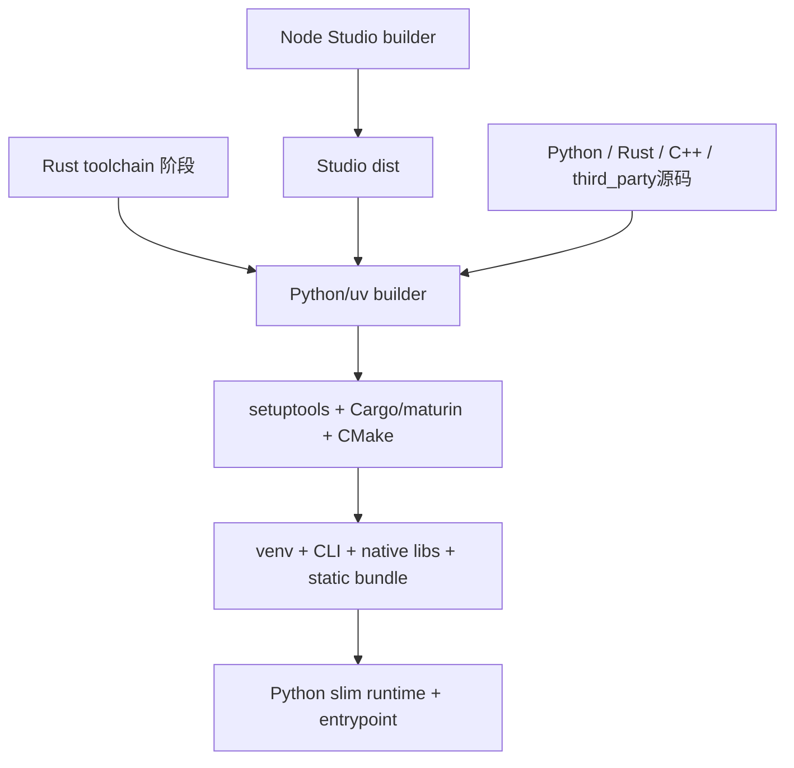

# OpenViking 部署机制、服务职能与依赖

> 日期：2026-10-02；源码基线：`df32bf6e50a40843438f9491a26069ca4bd08f1f`。依据根 Dockerfile/Compose、正式 Helm、启动脚本、应用生命周期、可选服务和发布工作流。本文是部署机制分析，没有执行部署或修改服务配置。

## 1. 默认部署形态

**核心服务是 Python HTTP 应用，内部加载 Rust 文件系统和 C++ 检索扩展；Web Studio 是随包发布的静态 SPA，默认由同一服务托管。** 无需为每个 Python 包、RAGFS 和本地向量引擎分别启动进程。可选 Bot、模型/解析服务、远端存储和监控有独立依赖边界。

| 方式 | 实际机制 | 适合的代码阅读入口 |
| --- | --- | --- |
| Python 包/源码 | openviking-server→bootstrap→Uvicorn/FastAPI，加载包内原生产物 | pyproject、setup.py、server_bootstrap、server/bootstrap |
| 官方 Docker | 多阶段构建→运行 venv/原生产物/Studio→entrypoint 配置检查 | Dockerfile、deploy/docker |
| 根 Compose | openviking 容器 + Caddy legacy 代理，工作区挂载 | docker-compose.yml、Caddyfile |
| 正式 Kubernetes/Helm | Deployment + Service + ConfigMap + PVC，可选 Ingress/ServiceAccount | deploy/helm/openviking |
| 可选 Bot 专项部署 | bot/deploy 中独立 Docker/VKE/ECS 脚本及 sandbox/观测组合 | bot/deploy、bot/config |
| GPU 开发/性能环境 | cuVS/CuPy/CUDA 与原生引擎专用开发镜像，支持 sqsh | deploy/docker/cuvs-dev |
| 示例部署 | 旧/简化 k8s chart、Grafana、LlamaParse bridge、benchmark services | examples、benchmark |

## 2. 每个运行单元的职能

| 单元 | 职能 | 默认端口 / 数据 | 上游与下游依赖 | 默认性 |
| --- | --- | --- | --- | --- |
| OpenViking HTTP Server | REST/MCP/WebDAV、鉴权、资源/记忆/检索、任务与管理、Studio 托管 | 常用 1933；workspace | 客户端→OV→文件/索引/模型及选用的外部服务 | 核心 |
| Web Studio | 浏览器资源/会话/检索/管理 UI | `/studio/` 静态 assets | 浏览器→OV API；Bot聊天经代理 | 产物存在时托管；不是独立 Node 生产服务 |
| RAGFS/PyO3 | 挂载、文件、QueueFS、锁、缓存、加密和 Git快照 | 服务进程内动态库 | VikingFS/队列→本地/SQLite/S3/Redis | 核心底座，backend可选 |
| C++ VectorDB/LevelDB | 本地召回、标量索引、KV候选/delta/TTL持久化 | 服务进程内扩展与本地目录 | Python local backend→原生引擎 | 默认local后端 |
| Queue workers | 导入/解析、语义、Embedding、重建、Session提交、外部任务、清理 | 主服务线程/事件循环，持久queue | 工作消息→消费者→业务/model/storage | 主服务内部，不是独立默认容器 |
| VikingBot gateway | AgentLoop、聊天/SSE、渠道、工具、Compile、Bot Studio | 常用18790；Bot workspace/Session | 渠道/OV代理→Bot→模型/sandbox/OV HTTP | 可选 |
| Caddy | 反向代理；可配置TLS终止 | 根配置1934→OV1933；TLS域名配置另加 | 客户端→Caddy→OV | 根Compose有；直接OV可不用 |
| Kubernetes Service/Ingress | 集群服务地址、入口路由/TLS | Service默认1933；Ingress按hosts | 外部/集群调用→Service→Pod | Service固有，Ingress默认关闭 |
| 远程模型 endpoint | VLM/tool、Embedding、可选Rerank | 配置api_base/credentials | OV/Bot→provider | 按语义功能与provider选用 |
| HTTP/Volcengine/私有VikingDB/openGauss | 远程向量/标量/全文或SQL能力 | 各自URL/连接 | OV adapter→DB | 可选，不与local同时必需 |
| S3/TOS/MinIO | 文件/快照对象、list/range/copy | bucket/endpoint/prefix | RAGFS backend→对象服务 | 可选 |
| Redis | CacheRuntime、可选缓存/路径锁/队列 | endpoints、namespace/TTL | RAGFS→Redis | 配置选用 |
| MinerU/Understanding | PDF或Files/Responses外部解析 | 配置endpoint | OV parse→解析服务 | 可选 |
| Connector / Compile provider | 特定来源导入/生成执行与任务状态 | 配置URL | OV委托→外部任务→结果写回OV | 可选，服务实现可能在仓库外 |
| LlamaParse bridge | Understanding协议转LlamaParse、产物ZIP | 示例独立FastAPI | OV→bridge→LlamaParse | 示例扩展 |
| VectorDB HTTP service | 低层collection/index/data/search API | 由独立server配置决定 | OV HTTP adapter/其他客户端→vector service | 可选，非主API别名 |
| Dataset/Rollout service | benchmark case查询、rollout提交/状态 | 运行脚本参数 | train runner→服务→环境/Agent/模型 | 训练/评估扩展 |
| WhatsApp bridge | Baileys→WebSocket→Python channel | 配置bridge_url，常用3001 | WhatsApp→Node桥→Bot | 可选渠道 |
| Sandbox服务/runtime | Agent工具的受限命令/文件环境 | SRT/OpenSandbox/AIO等配置 | Bot→sandbox；不同backend不同依赖 | 可选 |
| OTel collector | 接收trace/log/metric | 配置HTTP/gRPC endpoint | OV/Bot exporter→collector | 导出启用时需要 |
| Prometheus/Grafana | scrape/时间序列与dashboard | 示例映射30909/13000 | Prometheus→OV metrics；Grafana→Prometheus | 观测示例 |
| Langfuse | Bot模型/Agent追踪 | bot专用Compose及配置 | Bot→Langfuse；Langfuse有自身依赖 | 可选 |
| LDAP/OIDC/Vault/KMS | 外部身份或密钥管理 | 对应host/issuer/provider | OV认证/加密→服务 | 对应模式选用 |

端口是仓库默认或示例值，实际连接以所选配置为准。原生库、向量适配器和观测组件名称不自动意味着存在同名服务进程。

## 3. 官方镜像的构建依赖



[Dockerfile](../Dockerfile) 当前四阶段：Rust `1.91.1-trixie` 工具链；Node `24-trixie-slim` 执行 `npm ci`/Vite build；uv Python `3.13-trixie-slim` 构建 venv 与 native；Python `3.13-slim-trixie` 运行。版本是该镜像构建选择，不能推广成所有安装方式的最低语言版本。

构建器安装 C/C++/CMake/git/ccache，缓存 npm/uv/Cargo/ccache，复制 Studio dist；`uv sync` 选择 bot、gemini、opengauss extras。`UV_LOCK_STRATEGY=auto` 在临时构建上下文检查并可能刷新 lock；`locked` 要求现有锁文件有效。无 `_version.py` 时需提供 OPENVIKING_VERSION，否则无 Git 源上下文的版本构建会失败。

运行层复制 venv，校验 SDK/支持 `include_integrity` 的技能接口、确认 Studio 位于安装包内，安装 ca-certificates/curl/git/libstdc++，不保留整个 Node/Rust/C++ 构建工具链。官方 Docker 的 Studio阶段失败会中止构建，普通 setup.py 的可选跳过路径不能代表镜像行为。

## 4. 容器启动、缺配置状态与进程生命周期

### 4.1 entrypoint

[openviking-entrypoint.sh](../deploy/docker/openviking-entrypoint.sh) 处理配置/启动和信号：

1. 识别 `--healthcheck`，解析端口并 curl `/health`；自定义命令则执行用户命令。
2. 默认 `OPENVIKING_WITH_BOT=1`，可用 false/0或 `--without-bot` 关闭。
3. 找 `OPENVIKING_CONFIG_FILE`，默认 `/app/.openviking/ov.conf`；存在则使用。
4. 缺配置但有 `OPENVIKING_CONF_CONTENT` 时写入完整JSON；仍没有则起 pending-health 服务，所有HTTP路径返回503并等待文件出现。
5. 解析端口：OPENVIKING_SERVER_PORT→配置server.port→1933；host由容器启动默认0.0.0.0。
6. 启动 `openviking-server`，可加 `--with-bot`，等待健康；最大尝试数默认120，每秒检查，提前退出/超时则失败。
7. 转发 INT/TERM 到主服务；等待结束并返回其退出状态。

pending-health 只用于首次配置缺失期，不是正常API/Studio进程。配置存在但格式/凭证/绑定不合法仍可能启动失败，不会由503占位器自动修复所有错误。

### 4.2 服务与可选 Bot 的前后依赖

bootstrap 用共享内部 token 启动/等待受管Bot readiness，再运行HTTP主应用；Bot接收managed OV URL，实际调用数据API仍走HTTP。OpenViking lifespan初始化核心storage/config/queue/models后初始化auth/deletion与请求层；进入yield后接受流量。

```text
配置/依赖/端口确认
 → 可选受管Bot子进程就绪（不能要求此时已成功读取未启动的OV数据）
 → OpenViking core initialize
 → 模型/存储契约与任务恢复 / workers
 → auth + 删除恢复
 → 主API就绪
 → 客户端请求 / Bot回调OV
```

存在跨服务闭环不代表必须同时调用完成才能启动。HTTP worker进程与受管Bot不是同一个事件循环；主服务关闭finally停止受管子进程，lifespan先停止观测/队列/模型等资源，尽量让已开始的写操作 settle。

## 5. 单机 Compose 与同源前端

[docker-compose.yml](../docker-compose.yml) 使用发布镜像，映射服务端口，持久挂载 `~/.openviking:/app/.openviking`，设置健康检查和 `unless-stopped`。Caddy映射1934并代理OV端口，`depends_on`只表达容器启动顺序，没有health条件，不应假定它保证主应用已ready。

当前 [Caddyfile](../Caddyfile) 默认只是legacy1934代理；公网HTTPS需增加域名块、80/443映射、证书data/config卷和公网issuer相关配置。默认Compose不会仅因环境有公网URL就自动完成TLS域名部署。

Studio打包在OV内，浏览器访问 `/studio/`；不存在一个默认必须常驻的 `npm run dev` 前端容器。开发Vite可单独运行，但API base、CORS与SPA basepath需要匹配。

## 6. 正式 Helm / Kubernetes 机制

| 资源 / 字段 | 职能与关系 |
| --- | --- |
| Deployment | 单副本，Recreate；容器port来自config.server.port；probe/resources/env/securityContext可配置 |
| ConfigMap | values.config 深拷贝→pretty JSON `ov.conf`；workspace空时派生到mountPath/openviking_workspace |
| PVC | 默认20Gi、ReadWriteOnce、挂载/app/.openviking；可用existingClaim；新PVC标注keep |
| Service | 默认ClusterIP/1933，targetPort是命名http端口 |
| Ingress | 默认关闭；配置host/path/class/annotations/TLS；控制器需集群已有 |
| ServiceAccount | 按create/name决定创建/使用；不是业务API用户身份 |
| 环境与Secrets | config文件路径、OPENVIKING_WITH_BOT；extraEnv可从Secret注入凭据 |
| checksum/config | Pod annotation变化触发Deployment更新 |
| 探针 | liveness `/health`；readiness `/ready`，不同延迟/周期/阈值 |
| 调度 | nodeSelector/tolerations/affinity控制节点选择 |

正式模板 **显式拒绝 replicaCount>1**，且默认workers=1、Bot关闭、Ingress关闭。报错文案写RocksDB是历史残留，本地实际为LevelDB。不能通过values里存在replicaCount就推断当前chart已支持共享PVC的水平扩展。

`ov.conf` 用ConfigMap subPath只读挂载；凭据不宜直接写公开values，模板已支持环境变量占位和extraEnv Secret。修改ConfigMap更新Pod并不等于所有文件在现有subPath挂载即时刷新。persistence关闭会使用emptyDir，Pod替换可能丢持久状态；PVC keep意味着卸载chart后仍需按数据保留策略处理卷。

依据：[deployment.yaml](../deploy/helm/openviking/templates/deployment.yaml)、[configmap.yaml](../deploy/helm/openviking/templates/configmap.yaml)、[values.yaml](../deploy/helm/openviking/values.yaml)、[pvc.yaml](../deploy/helm/openviking/templates/pvc.yaml)。`examples/k8s-helm` 是另一套较早/简化演示，不应合并成相同默认行为。

## 7. 外部依赖的启动顺序与隔离

| 能力选型 | 应先准备 | 服务启动/请求时检查 | 注意点 |
| --- | --- | --- | --- |
| local / cuvs | workspace、native库和权限 | process锁、collection schema/model契约 | 同workspace本地数据不能随意多进程写 |
| GPU | 驱动/GPU可见性、CUDA/CuPy/cuVS包、显存预算 | route/初始化能力校验 | auto可保留native；显式cuvs不可用可报错；普通镜像无GPU包 |
| 远端VectorDB/openGauss | DB地址、认证、collection/schema/index能力 | backend初始化、账户维度/模型验证 | 不改变现有向量空间后又沿用旧索引 |
| S3/TOS | bucket/prefix/endpoint/credentials | FS mount/读写/physical-shape校验 | account/namespace、加密格式和主备路径保持一致 |
| Redis cache/queue/lock | 对应部署模式/认证/TLS、namespace | CacheRuntime capabilities与脚本 | 编译feature不等于连接启用；共享服务需范围隔离 |
| 模型provider | endpoint/credential/model/维度与媒体能力 | 配置validate、模型实际请求；可观察probe | readiness不代表所有模型调用成功；rate/concurrency/token预算需配置 |
| MinerU | endpoint健康与协议 | strategy=mineru必需preflight；auto失败可按路径回退 | required/advisory行为不同 |
| Understanding/Connector/Compile | 相应API可达、认证、协议、回调/写回权限 | 提交/轮询/超时/取消 | 接受task并不代表输出已写回/索引完成 |
| OIDC/LDAP/KMS/Vault | IdP/JWKS/目录/密钥服务与凭据 | plugin/provider初始化与实际验证 | auth模式、issuer/audience、加密key不任意变更 |
| Bot sandbox/渠道 | 可选运行包、sandbox服务/bridge、渠道凭据 | Bot readiness /连接验证 | standalone Bot可以不提供OV能力；受管Bot启动失败主启动报错 |
| OTel/Prometheus/Grafana | 配置接收/抓取地址、所需服务 | best-effort exporter与probe | 指标旁路不应当成业务依赖完成信号 |

核心启动不能用“数据库→缓存→后端→前端”的固定顺序概括所有后端组合；local、S3、remote、Bot和GPU是不同选项。接口消费者最后连接到正确入口，并确认模型/索引/身份契约。

## 8. 运行注意事项与验证点

### 8.1 健康与就绪

`/health` 是未强制认证的轻量存活/version/auth-mode入口；携带凭据时可能尝试解析身份并返回认证错误。`/ready` 核对服务initialized、文件系统、VectorDB、APIKeyManager等，失败返回503；它仍不是对所有模型/Connector/Bot/存量数据的一次端到端验证。

官方Docker健康检查只curl `/health`；Helm额外用 `/ready` 控制流量。应分别检查进程存活、核心存储就绪、模型probe，以及代表性的上传/commit/search任务状态。queue空、某条ACK、HTTP200和全部派生索引一致也不完全等价。

### 8.2 并发与持久状态

- Uvicorn可以配置workers>1，但local/cuvs默认取得workspace进程独占锁，不能直接增加workers共享嵌入式存储。`skip_process_lock` 是绕开保护的开关，不提供并发安全。
- 即使改用远端VectorDB，也要审查QueueFS、PathLock、文件mount、config source、任务恢复和进程内缓存/批合并的共享语义；单一远端数据库配置不是完整横向扩展方案。
- 持久卷要包含实际workspace、queueDB、OAuth/审计、上传/任务/文件/索引、快照等配置路径；绝对路径位于挂载外时不会自动随卷保留。
- 静态文件、向量索引和配置/密钥备份有不同生命周期，使用OVPack/Git snapshot时按其契约备份，不能认为只复制一个DB文件就完整恢复全部数据。

### 8.3 网络、凭据和升级

- 容器默认host0.0.0.0；dev auth限定localhost，网络绑定需匹配api_key/trusted/LDAP/OIDC等配置。当前Helm默认root_api_key为空，部署前需补有效认证配置。
- 公网base URL、OAuth issuer、代理scheme/host、CORS、Studio basepath和客户端URL应一致；MCP/oauth客户端依赖正确的公开地址。
- 受管Bot内部token与OV用户API Key不同；不要把内部控制连接视为公开用户访问接口。
- 使用固定镜像版本便于复现，latest/main是移动标签。确认SDK/服务/插件兼容，原生ISA/架构与镜像平台一致。
- 加密shape/key、Embedding dimension/provider/model身份、collection schema和升级后的SQLite schema需保持兼容；源码有验证/迁移限制，不是任意配置改动都能原地无损生效。
- 恢复/升级后检查正式内容、sidecar新鲜度、任务checkpoint和索引，必要时通过维护接口修复。中断期间保留工作/failed标记便于诊断。

## 9. 其他部署和发布路径

Bot专用Docker/VKE/ECS脚本与根镜像不是同一默认栈；Langfuse Compose会部署自己的数据库/对象/缓存依赖，它们属于观测应用，不自动成为OV主服务依赖。Grafana Compose只含观测服务，OV地址由scrape配置指向已有服务。

cuVS开发镜像当前选择Python3.12、cuvs-cu13/CuPy，并注入C++引擎到挂载源码；支持Enroot/Pyxis的sqsh导出，是实验/基准环境，不等于官方生产镜像启用CUDA。

GitHub Actions负责Python wheel/sdist、Rust CLI/npm、SDK、插件、Docker多架构、文档和CodeQL等发布/检查。构建/发布工作流名字不能证明已运行全部测试；例如当前 `_test_full.yml` 的内容是依赖/原生构建检查，测试执行范围要读命令。

## 10. 阅读索引与范围

| 目的 | 源码 |
| --- | --- |
| 镜像与入口 | [Dockerfile](../Dockerfile)、[entrypoint](../deploy/docker/openviking-entrypoint.sh)、[pending health](../deploy/docker/pending_health_server.py) |
| 主进程/受管Bot | [bootstrap.py](../openviking/server/bootstrap.py)、[app.py](../openviking/server/app.py)、[core.py](../openviking/service/core.py) |
| 单机与代理 | [Compose](../docker-compose.yml)、[Caddyfile](../Caddyfile) |
| Kubernetes | [Helm chart](../deploy/helm/openviking/Chart.yaml)、[正式values](../deploy/helm/openviking/values.yaml) |
| 可选环境 | [GPU镜像](../deploy/docker/cuvs-dev/Dockerfile)、[Bot部署](../bot/deploy/docker/Dockerfile)、[Grafana示例](../examples/grafana/docker-compose.yml) |
| 持久化保护 | [process_lock.py](../openviking/utils/process_lock.py)、[RAGFS builder](../crates/ragfs/src/core/builder.rs) |
| 探针/发布 | [system.py](../openviking/server/routers/system.py)、[build-docker-image.yml](../.github/workflows/build-docker-image.yml) |

进一步配置项见 [6-配置文件.md](6-配置文件.md)，工作完成/恢复边界见 [9-核心数据流.md](9-核心数据流.md)。本文按当前源码说明机制，未在本机或云端执行这些部署步骤。
