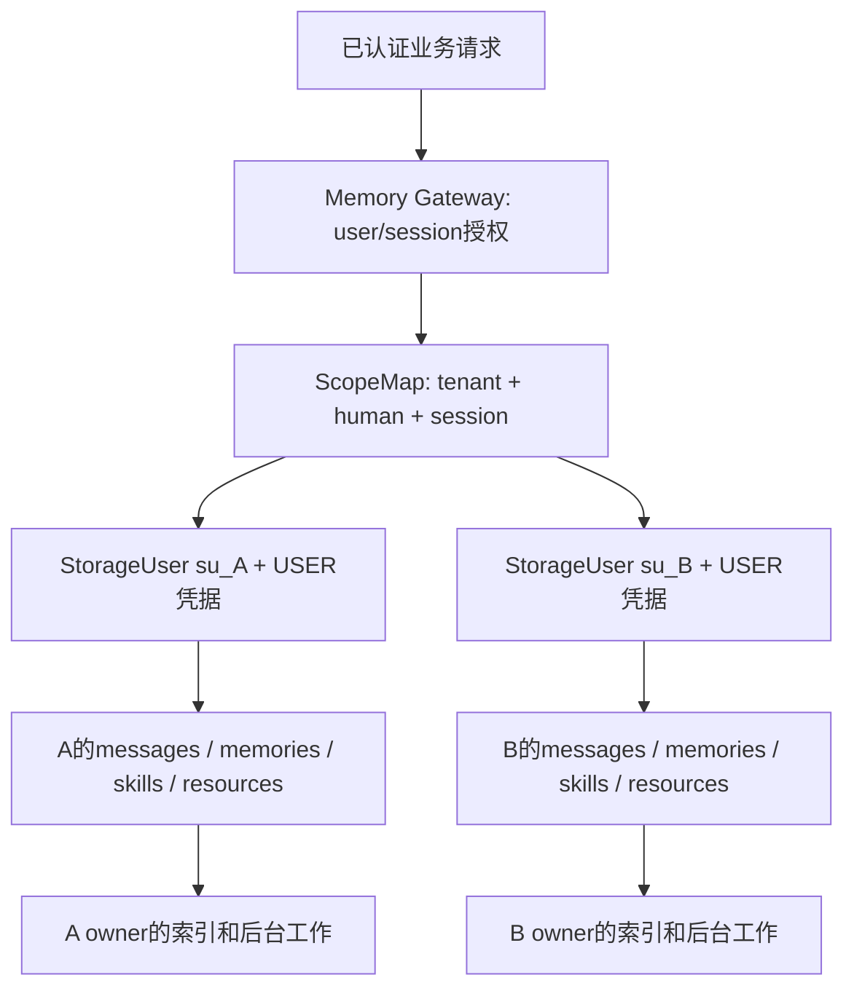

# OpenViking 与 MemOS 记忆机制对比及场景选型

> 分析日期：2026-10-02。OpenViking 源码基线：`df32bf6e50a40843438f9491a26069ca4bd08f1f`；MemOS 生产源码基线：`a7367d07e55db61099f7b4e2c1108bc5831a24f3`。分析过程中 MemOS HEAD 变为 `a8b09d4cd40f449c04f3115aecf879bcba128785`，核对差异仅新增教程，生产源码未变。比较对象是两个本地 checkout，remote 分别为 doublespring168/OpenViking 与 doublespring168/MemOS，不把品牌官网、云产品或其他分支的能力自动算入当前实现。

**用户最终确认的条件**：桌面智能体是 **Pi**，单机单用户；服务端有多用户，且**同一用户不同会话的长期记忆也必须完全隔离**。

## 阅读导航

- [1. 直接选型建议](#1-直接选型建议)
- [2. 比较前先拆开 MemOS 的几套实现](#2-比较前先拆开-memos-的几套实现)
- [3. 核心理念和记忆表示](#3-核心理念和记忆表示)
- [4. 写入、抽取和合并机制](#4-写入抽取和合并机制)
- [5. 检索、上下文组织和质量取舍](#5-检索上下文组织和质量取舍)
- [6. 你的强隔离要求：哪些现有能力不能用来替代](#6-你的强隔离要求哪些现有能力不能用来替代)
- [7. 多用户服务端：认证与授权差异](#7-多用户服务端认证与授权差异)
- [8. 推荐的 OpenViking 严格会话存储方案](#8-推荐的-openviking-严格会话存储方案)
- [9. 如果采用 MemOS，严格隔离要怎么补强](#9-如果采用-memos严格隔离要怎么补强)
- [10. Pi 桌面端的具体选择](#10-pi-桌面端的具体选择)
- [11. 运行依赖、离线、扩展和许可](#11-运行依赖离线扩展和许可)
- [12. 功能维度的优缺点归纳](#12-功能维度的优缺点归纳)
- [13. 建议的统一应用接口和分阶段落地](#13-建议的统一应用接口和分阶段落地)
- [14. PoC验收：先隔离，再质量和性能](#14-poc验收先隔离再质量和性能)
- [15. 源码依据、阅读范围与最终判断](#15-源码依据阅读范围与最终判断)

## 1. 直接选型建议

**如果希望桌面 Pi 和服务端共用一个记忆主实现，优先选择 OpenViking。** 桌面使用仓库已有的 Pi 扩展连接本机 OpenViking sidecar；服务端用可信网关把每个业务 `(tenant, user, session)` 映射为独立存储身份，再统一约束读、写、抽取、检索、技能和后台工作。

这不是“OpenViking 默认已经按会话隔离长期记忆”的结论。两边原生设计都倾向跨会话复用长期知识：OpenViking 默认按 user 归并，MemOS 的不同实现按 user/cube/agent/profile 等归并。**仅给请求加 session_id/conversation_id、换 Peer 或缩小一次查询 filter，都不足以满足你的强隔离要求。**

| 你的场景 / 取舍 | 建议 | 原因与需要付出的工作 |
| --- | --- | --- |
| Pi 桌面，优先现成接入与两端统一 | **OpenViking Pi 主扩展 + 本地服务** | 已有 capture/recall/MCP/commit/上下文管理链；需管理 Python/native sidecar、模型和安装升级 |
| Pi 桌面，优先全部在 Node/TS 内、接受自己维护适配器 | **MemOS local v2 作为候选** | SQLite/FTS/本地向量、host-agnostic core 更适合 Node 进程内；当前没有现成 Pi adapter，需接生命周期并验证候选限额/质量 |
| 服务端，多用户且长期记忆按会话完全独立 | **优先 OpenViking + session 存储身份映射** | 已有绑定身份、用户命名空间和向量权限链；需禁共享出口、做强隔离验收，不可直接沿用人级 user |
| 服务端，必须采用图结构、反馈修订、特定 KV-cache 研究能力 | **MemOS Python 可以考虑，但要投入服务端补强** | 图和多类记忆有实质实现；当前默认业务 API 的认证/授权/过滤链不足，不能直接当现成多租户平台 |
| 要求完全不改集成层、开箱即用且严格会话长期隔离 | **两者当前都不能直接承诺满足** | 需要明确的存储边界、认证路由与涵盖所有派生路径的验证 |

“统一选 OpenViking 的集成工作预计较少”是根据当前代码边界的工程判断，不是已完成工时或质量测量。若许可、安装体积、延迟或图能力有更高优先级，后文说明会改变选择的条件。

## 2. 比较前先拆开 MemOS 的几套实现

MemOS 仓库不等于一个后端。当前真实路径如下：

| 实现 | 主要入口 / 默认行为 | 本篇简称 | 与本场景的关系 |
| --- | --- | --- | --- |
| OpenViking | Python HTTP 服务 + Rust 文件系统 + C++ 检索；Pi extension 消费 HTTP/MCP | OV | 可统一桌面/服务端 |
| MemOS Python MOS 库 | MOS/MOSCore + GeneralMemCube；MOS.simple 默认 general_text | MOS 库 | 可以嵌入 Python 或封装服务，不等于默认 HTTP API |
| MemOS Python HTTP | server_api→`/product`，共享 SimpleTreeTextMemory + NaiveMemCube | MOS Server | 图节点型记忆/多路检索；真实服务入口是 server_api |
| MemOS local v1 | apps/memos-local-openclaw，声明1.0.9-beta.1 | Local v1 | OpenClaw 原文/chunk/task/混合检索插件 |
| MemOS local v2 | apps/memos-local-plugin，声明2.0.16-beta.1；默认lightweight | Local v2 | OpenClaw/Hermes/DSH 的 trace/policy/world/skill 核心，可新开发 Pi adapter |
| MemOS Cloud plugin | apps/MemOS-Cloud-OpenClaw-Plugin→云search/add API | Cloud客户端 | 云端实现不在此客户端源码中，不能用于证明OSS隔离 |
| OpenWork integration | Electron→默认云`openmem/v1` endpoint | 桌面云适配 | 不是已内嵌本地 MemOS 数据库 |
| packages/memos-core | 有53个TS源码文件，但没有独立package.json；未发现现有apps实际import它 | 尚未形成实际共享发布依赖 | 不能据目录名直接当作现成公共SDK选型 |

MemOS `AGENTS.md` 中的 `memos.api.start_api:app` 和 product_router 描述与当前树不符；实际 Docker 指向 `memos.api.server_api:app`。此前教程只作导航，以下结论按实际实现重新核验。

依据：[MOS.simple](../../MemOS/src/memos/mem_os/main.py)、[默认服务装配](../../MemOS/src/memos/api/server_api.py)、[component_init](../../MemOS/src/memos/api/handlers/component_init.py)、[Local v1清单](../../MemOS/apps/memos-local-openclaw/package.json)、[Local v2清单](../../MemOS/apps/memos-local-plugin/package.json)、[OpenWork memory service](../../MemOS/apps/openwork-memos-integration/apps/desktop/src/main/services/memory.ts)、[adapter-base](../../MemOS/packages/adapter-base/src/index.ts)。

## 3. 核心理念和记忆表示

| 维度 | OpenViking | MemOS Python / Server | MemOS Local v1/v2 |
| --- | --- | --- | --- |
| 主抽象 | 资源/记忆/技能统一URI文件视图 + Context | MemCube聚合不同memory；Server主要是图节点 | v1 chunk/task/skill；v2 trace/policy/world/skill |
| 内容来源 | 会话Message/parts、资源文件、多模态/工具原文 | Reader对话/文件/图像/工具、多类文本节点 | 宿主turn/tool capture、summary、episode与反馈 |
| 正式记忆落点 | Markdown + MEMORY_FIELDS、sidecar、版本/来源/links | memory item metadata、graph node/edges、VecDB payload、历史/状态 | SQLite rows/JSON/FTS + Float32 vectors，技能文件/日志等另有路径 |
| 组织层级 | L0摘要/L1概览/L2详细内容，是同内容的表示层次 | Working/LongTerm/User/Outer/Tool/Skill/Preference等桶与关系 | v2 L1执行trace、L2policy、L3world是抽象/学习层次 |
| 拓扑/关联 | 文件目录/URI、Memory links/backlinks、经验来源tags | 显式图关系、working_binding、MERGED_TO等 | SQL/JSON来源关系、episode/policy/world/skill evidence |
| 用户长期状态 | profile/preferences/entities等schema与字段算子 | general key/value、图类型、独立/图偏好路径 | v1无统一profile表；v2 preference/personal-fact路由等，不是独立画像管理系统 |
| 默认跨会话 | 同user的记忆文件共享更新/召回 | 同user/cube长期节点复用；session主要为metadata/软优先 | 同agent/profile长期内容复用，部分逻辑刻意排除当前session以补充旧记忆 |

**不要按名称比较层级**：OV L1“概览”不是 Local v2 L1“trace”；OV L2“原文”不是 Local v2 L2“policy”。两者解决的是不同组织问题，不能据数字层数多寡判断记忆更高级。

OV 更适合同时管理项目文档、资源、个人事实、技能和可读文件；MOS Tree 更偏图化记忆节点与关联；Local v2 full 更偏从执行证据归纳策略和技能。这些是结构倾向，不是未经测评的准确率排名。

## 4. 写入、抽取和合并机制

### 4.1 OpenViking

```text
Pi turn / SDK messages → Session Message/parts
 → 活跃JSONL与tool原文引用
 → commit Phase1：锁内归档 / 恢复意图 / 持久SessionCommitMsg
 → Phase2：工作记忆 + Schema/VLM/ExtractLoop
 → 受限DSL/JSON解析成ResolvedOperations
 → StreamingMemoryUpdater（按account/user，再分peer/type）
 → 优先回读磁盘 + immutable/replace/sum/patch / links / provenance
 → Markdown与memory_diff → Embedding队列 → 向量记录
```

优势是抽取、操作解析、合并、正式写入与索引各有边界；模型输出不能直接exec任意Python；schema、权限、page_id、来源、锁和字段策略可检查。已有profile/实体能增量修改，不必把所有历史都append成片段。

代价是模型/预取/repair/合并/工作记忆/演化/Embedding的多段成本，字段模板与事实语义耦合。普通非迁移更新在磁盘回读异常时可以退回预取快照，因此不是无条件fresh保证。`session_skills`、links和自动commit各有开关，不能说每个对话默认跑全部能力。

当前Phase2只恢复本归档的step；旧failed归档不自动重新纳入新抽取。等待关联索引超时后仍可写`.done`，所以“提交业务完成”与“索引已可查”分开。依据：[Session](../openviking/session/session.py)、[ExtractLoop](../openviking/session/memory/extract_loop.py)、[MemoryUpdater](../openviking/session/memory/memory_updater.py)、[批合并](../openviking/session/memory/streaming_memory_updater.py)。

### 4.2 MemOS Python 三条主要文本路径

| 路径 | 写入/抽取 | 检索 | 优势与限制 |
| --- | --- | --- | --- |
| naive_text | LLM JSON抽取→进程list，JSON load/dump | split词重合排序 | 易做原型；不是图/向量检索，搜索kwargs中的user/session/filter未消费 |
| general_text | LLM抽取key/value/tags→Embedding→VecDBItem | vector_db.search(query_vector,top_k) | 直接的个人语义记忆；该search没有传kwargs中的硬filter |
| tree_text / simple_tree_text | Reader fast原文/窗口节点→fine模型抽取→MemoryManager按类型写图 | goal parser→图/向量及选用的BM25/fulltext→合并/rerank | 关系/多类型与图组织可扩展；组件/模型/存储依赖和过滤链复杂 |

默认API异步add可让fast/fine阶段经scheduler处理，accepted不表示细化全部结束。metadata包含user/session/source/status/history/usage，图组织有冗余/冲突分类、融合和归档，反馈可keyword replace或模型修订。

**但默认“自动合并”不能夸大**：MultiModalReader的 `_get_maybe_merged_memory` 当前直接返回输入；真正图重组/NodeHandler有实现，reorganize默认false。version默认off、通过hook扩展，有缺provider回退；KV-cache有实质实现但默认HTTP未装配，LoRA源码明确placeholder。

Dream也有真实实现：可选启用后使用Context/Motive/Recall/Reasoning/Diary/Persistence管线，可创建、更新、融合或归档图记忆；整体默认关闭，需相应组件配置。它是MOS Python的能力，不是Local v2默认轻量链。源码：[Dream plugin](../../MemOS/src/memos/dream/plugin.py)、[Dream persistence](../../MemOS/src/memos/dream/pipeline/persistence.py)。

依据：[general.py](../../MemOS/src/memos/memories/textual/general.py)、[naive.py](../../MemOS/src/memos/memories/textual/naive.py)、[tree.py](../../MemOS/src/memos/memories/textual/tree.py)、[reader](../../MemOS/src/memos/mem_reader/multi_modal_struct.py)、[graph handler](../../MemOS/src/memos/memories/textual/tree_text_memory/organize/handler.py)、[LoRA占位](../../MemOS/src/memos/memories/parametric/lora.py)。

### 4.3 MemOS Local v1 与 v2

| 项目 | Local v1 | Local v2 |
| --- | --- | --- |
| 捕获 | agent_end success新增user/assistant/tool文本，保存原文/摘要/owner/session；过滤system/自注入等 | 默认每turn合并trace、summary-only Embedding；full模式再reflect |
| 去重/更新 | content hash + 相似摘要top候选，模型判DUPLICATE/UPDATE/NEW；旧chunk退役保留历史 | trace/episode/value、policy induction、world abstract、evidence skill在full模式组合 |
| 默认重处理成本 | 摘要/embedding、部分去重与task/skill过程 | **lightweightMemory.enabled=true**，默认不跑完整reward/L2/L3/skill链 |
| 无模型/失败 | 短文本/rule fallback，Embedding失败仍可存无vector原文 | 有skip/passthrough/cutoff等分支；lightweight仍可能做summary与LLM relevance filter |
| 任务可靠性 | ingest queue主要为进程内队列，flush不保证断电前每条捕获已持久 | SQL持久产物、retry/job/recovery等机制较多，不能统称全部exactly-once |

Local v2 full使用人类反馈/模型估计和折扣回传为trace评分，再把有证据的跨任务模式归纳为L2policy、L3world、skill。它是文本/排序/技能演化，不是Agent权重训练。其完整学习链对严格session部署必须局限在该session，不允许再跨session聚合。

依据：[v1 ingest worker](../../MemOS/apps/memos-local-openclaw/src/ingest/worker.ts)、[v2 defaults](../../MemOS/apps/memos-local-plugin/core/config/defaults.ts)、[orchestrator](../../MemOS/apps/memos-local-plugin/core/pipeline/orchestrator.ts)、[capture](../../MemOS/apps/memos-local-plugin/core/capture/capture.ts)、[reward](../../MemOS/apps/memos-local-plugin/core/reward/backprop.ts)。

## 5. 检索、上下文组织和质量取舍

| 能力 | OpenViking | MOS Tree/Server | Local v1/v2 |
| --- | --- | --- | --- |
| 主召回 | 全局dense/sparse、过滤，后端支持时keywords | 图key/tag/结构、vector，多桶；BM25/fast全文等需开关 | FTS5/trigram、LIKE/CJK/exact、JS cosine，融合/RRF/MMR/时间或价值 |
| 结果增强 | 可选rerank、意图/query expansion、event decay | goal/CoT/多路、多cube、threshold/MMR、知识/工具/技能重排 | v2 tier/ranker、relevance LLM过滤、episode去重/个人事实路由 |
| 内容按需读取 | 摘要/概览/正文层级与token预算 | memory item/graph邻居、sources/history等 | timeline/get取原文/相邻证据；v2 skill/world等hydration |
| Agent装配 | 服务端mode=context统一quota/detail/render/digest/ledger | search/chat/reader/scheduler配置组合 | adapter注入memory block与memory tools，v2full分tier |
| 确认规模边界 | local CPU flat，bitmap过滤可缩小范围；GPU/远端另选 | 索引与graph backend可选，graph/LLM多路成本需测 | 本地向量是JS scan，v2明确有候选扫描cap |

OV 的 HierarchicalRetriever 当前做一次全局召回/可选重排，目录/L0/L1存在不等于逐目录树检索。其mode=context减少客户端各自做search/read/token budget差异；摘要压缩/ledger也可能遗漏或抑制需要的信息，需测实际问题。

MOS Tree 对图关系、复杂事件、工具轨迹和反馈修订更有发挥空间，但多路召回/模型处理不自动意味着更准确/更便宜。默认几个fast/BM25/CoT/fulltext开关关闭，不能把全部候选路径当默认执行。

**Local v2 一个值得重点验证的限制**：`scanAndTopK` 先SQL `LIMIT cap`，再JS cosine，SQL没有ORDER BY。通用默认cap为5000；当前Tier2 trace常规路径按默认topK5×candidatePoolFactor4×4传入约80行hardCap（参数/分支可改变候选规模）。这不是全库ANN候选、也不是保证最近80条；cap外的相关语义记忆（包括旧记忆）可能漏召，关键词通道仍可补充。源码注释的百万向量速度不是本轮测试结果。

依据：[OV retrieval/context](../openviking/retrieve/context_assembler/pipeline.py)、[MOS recall](../../MemOS/src/memos/memories/textual/tree_text_memory/retrieve/recall.py)、[v1 recall](../../MemOS/apps/memos-local-openclaw/src/recall/engine.ts)、[v2 vector scan](../../MemOS/apps/memos-local-plugin/core/storage/vector.ts)、[v2 trace tier](../../MemOS/apps/memos-local-plugin/core/retrieval/tier2-trace.ts)。

## 6. 你的强隔离要求：哪些现有能力不能用来替代

你要求的隔离域是 **`(tenant_id, authenticated_user_id, business_session_id)`**，不是只隔离活跃聊天记录。A会话不能读到B的原文、长期事实/偏好、摘要、policy/experience、world/skill、反馈证据或由它们生成的Prompt；A关闭再重开仍可以读A自己的长期记忆。`/new`、fork或session clone是否创建新域，要由业务规则明确。

| 检查项 | OpenViking当前行为 | MemOS当前行为 | 对需求的结论 |
| --- | --- | --- | --- |
| 消息session归属 | account/user/session目录；Session清除actor-peer视图 | API有session metadata；MOS库chat history主要按user管理，Local有session/episode | 有ID/存档不等于全链长期隔离 |
| 长期记忆owner | 当前认证user；singleton profile/实体名跨sid共同更新 | user/cube；Local为agent/profile/owner | 同主体换sid仍可能共享/合并 |
| session_id硬filter | runtime Context有字段，统一向量schema无session_id；MemoryUpdater未给普通记忆Context传它 | API明示session_id软优先；图/BM25等没统一传硬filter；general/naive忽略kwargs filter | 两边都不能靠现成该参数完成 |
| targetUri / Peer / namespace | target缩小读范围不改抽取owner；actor_peer保留self记忆且不改变sessionowner | Local v2 visibility主要按agent/profile，不包含workspace/session，unknown/public/hub可见 | 这些不是session硬权限边界 |
| 共享派生/后台 | batcher按account/user，经验/skill仍默认user根 | 图组织/Dream或Localfull跨episode归纳；Hub共享另有路径 | 全部派生阶段必须同隔离域 |

### 6.1 OpenViking 的证据

- `SessionService.session` 把actor_peer设None，session所有者仍是ctx.user；不同sid的归档可以分开，但长期抽取强制当前user归属。
- 内置profile/preferences/entities等目录在 `user/{{user_space}}/memories`，不是session私有目录。
- context collection没有session_id，标准upsert过滤非schema字段，普通记忆向量化也未传session_id；不能把来源provenance中的session当可检索ACL字段。
- 一个改名的target目录也不充分：同user仍能读兄弟目录，模型预取/merge可能读共享profile，批合并registry按(account,user)而非业务sid。

源码：[SessionService](../openviking/service/session_service.py)、[isolation handler](../openviking/session/memory/memory_isolation_handler.py)、[context schema](../openviking/storage/collection_schemas.py)、[backend已知字段](../openviking/storage/viking_vector_index_backend.py)。

### 6.2 MemOS 的证据

- `/product/search` 的session_id被转换为search_priority；向量Path A无priority、Path B有priority后合并，这本来就是偏好当前session而不排除其他session。
- 即使传合法filter，结构图召回没收到search_filter、BM25实际用info生成user/session等id_filter，而非统一传递完整caller filter；候选最终合并没有统一强制session交集；依赖后续rerank不构成安全边界。
- MOSCore.search默认选用户可访问Cube，但显式install_cube_ids路径没有统一求授权交集；底层General/Naive也不传filter。安全性必须按入口/实现逐个审查。
- Local v2的visibilityWhere只将agentKind/profileId作为同owner条件，workspaceId/sessionKey不进入可见性SQL；当前session排除多用于避免重复、补跨会话记忆，方向与include-only不同。

源码：[search service](../../MemOS/src/memos/search/search_service.py)、[graph recall](../../MemOS/src/memos/memories/textual/tree_text_memory/retrieve/recall.py)、[MOSCore](../../MemOS/src/memos/mem_os/core.py)、[Local v2 namespace](../../MemOS/apps/memos-local-plugin/core/runtime/namespace.ts)。

## 7. 多用户服务端：认证与授权差异

| 维度 | OpenViking | MemOS Python当前入口 |
| --- | --- | --- |
| 身份绑定 | api_key解析account/user/role；忽略调用方伪造account/user头；trusted有不同受信机制 | 默认server_api的/product未挂verify_api_key/require_scope依赖 |
| 服务端权限链 | namespace/owner/ACL与向量过滤；身份继续传后台任务 | UserManager有user/cube权限模型，但默认handler直接读readable/writable_cube_ids，未作为服务授权结果 |
| 管理入口 | root key用于管理，api_key模式ROOT不能直接访问普通tenant data API | server_api_ext挂admin auth，但业务router仍未整体受保护；AUTH_ENABLED默认false |
| 会话绑定 | ctx决定account/user，sid只是该用户下会话ID | request.user_id/cube/session主要由请求提供，不等于已认证主体 |
| 应用需做 | 把业务user/session映射正确存储身份，限制共享出口与生命周期 | 认证+key绑定user/cube+全路径授权+强session范围+后台/结果过滤 |

MemOS存在认证代码不能证明默认API已受保护；`readable_cube_ids`这个名称也不能证明列表由服务端授权计算。当前auth内部请求判定还有源码可确认的边界：当 `X-Internal-Service` 和 `INTERNAL_SERVICE_SECRET` 都未设置时比较None==None，会判为internal；若采用这套auth，应先要求secret非空再比较并覆盖回归。这是静态代码判断，未对真实服务做攻击/渗透。

依据：[OV api_key auth](../openviking/server/auth/plugins/api_key.py)、[OV namespace](../openviking/core/namespace.py)、[MOS默认app](../../MemOS/src/memos/api/server_api.py)、[MOS扩展app](../../MemOS/src/memos/api/server_api_ext.py)、[MOS auth](../../MemOS/src/memos/api/middleware/auth.py)、[SearchHandler](../../MemOS/src/memos/api/handlers/search_handler.py)。

以上是我在你的多用户需求下优先OV的主要原因，重点是当前可复用的权限链，而非“名字包含user就一定安全”或某个模型质量宣传。

## 8. 推荐的 OpenViking 严格会话存储方案

### 8.1 可信网关 + 独立 StorageUser

这是**建议集成方案**，不是当前仓库已完整交付的业务session路由功能。

```text
真实登录主体 / API token
 → 应用校验该用户有权访问business_session_id
 → 持久 ScopeMap 的 UNIQUE(tenant, real_user, business_session)
 → opaque storage_user + 下游绑定凭据
 → 普通Role.USER身份访问OpenViking
 → ~/sessions/<sid>、~/memories、~/skills、~/resources
```

不要把真实人级user_id直接复用为所有业务会话的OV user。给A/B分别创建 `su_a...`、`su_b...`，则profile、实体、Peer子树、用户skills、用户policy、batcher key和自动提交的Session路径随StorageUser分开。



### 8.2 需要同时实施的边界

| 内容 | 应用层规则 | 为什么 |
| --- | --- | --- |
| ScopeMap | server创建opaque ID并持久化；校验业务会话归属；不让客户指定有效存储身份 | hash/随机ID本身不是权限认证；能猜到ID也不能获得授权 |
| 下游凭据 | 使用绑定StorageUser的user key；或只在私网使用经过验证的trusted网关断言USER身份 | api_key模式不靠X-User头切换；api_key模式ROOT用于管理，不能给终端；trusted网关root secret只由受保护网关持有，用来验证身份断言 |
| Query/内容 | 所有find/search/context/read/grep/tree/get/export/snapshot等统一落当前scope | 只限制一次semantic search会留下其他读取出口 |
| 写与抽取 | Session创建/追加/commit/资源/skills/feedback均用同scope；拒绝跨域target与links | 严格隔离还包括写入/合并影响，不能仅最终结果过滤 |
| 共享根 | 拒绝或隔离`viking://resources`、`viking://agent/skills`等账户共享写读；只允许当前user私有范围 | 普通USER仍能使用部分账户共享域，独立StorageUser不自动隔离它们 |
| 技能与profile注入 | 仅当前StorageUser的profile/skill；不加载汇集其它session的catalog | 已学skill/world/experience也是长期记忆，不可隐式共享 |
| 后台/离线pending | 队列、恢复、索引、merge、导出、重试都记录不可变scope；旧A backlog不得按新B凭据重放 | 连接切换/重启不能改变工作所有者 |
| Pi/客户端缓存 | session切换清context/ledger/profile/archive/cache，并绑定MCP连接及pending项的scope；不要复用一个有模块级profile缓存/固定配置的插件实例处理并发身份 | 服务器隔离正确仍可能由客户端旧上下文串线 |
| 删除 | 关闭会话不立即删除长期数据；显式forget/delete后围栏、取消工作、清理派生表示与scope映射 | A可重开自身记忆；删除后不能被迟到任务复活 |

MCP `remember` 会创建内部 `mcp-store-*` session；它仍必须使用原业务域的StorageUser，而不是因内部sid不同就走公共用户。

必须从网关验证身份得出scope，不信任body中的user_id/session_id、任意target_uri、MCP参数或HTTP身份头。阻止客户绕过网关直达后端的管理/共享入口；仅前端隐藏不是权限机制。

### 8.3 更强方案与长期代价

如果共享根很多、难以完全约束，采用**每个隔离域独立opaque Account**（或独立workspace/服务分片），把共享resources/agent也限制在该session账户中。这样边界更直观，但账户配置/目录/凭据/删除和运维对象会更多；默认账户仍可能共用向量adapter/collection并靠account条件隔离，只有独立配置后端时才形成对应独立集合。独立Account不自动等于独立数据库/进程，需按规模设计。

StorageUser方案也会增加users.json/目录/凭据/索引owner数量，不应假定百万会话无需调整即可扩展。可按tenant/account分片、idle释放资源、归档回收和并发策略管理；单会话资源限制与全局背压都需测量。它保留已有核心接口，预计比全量改成原生session schema范围更小，但这是需验证的工程判断。

若最终希望“真实user+一等SessionMemoryScope”而不创建逻辑存储用户，需二开URI分类、memory template/context、collection schema/迁移、预取/merge/batcher、技能/经验、后台身份和所有读写接口。**只新增session_id列和filter仍不够。**

## 9. 如果采用 MemOS，严格隔离要怎么补强

### 9.1 Python Server / MOS库

先把认证/业务会话授权接到所有入口，再由server计算可读写Cube，不接受客户端声明的cube权限。修复已确认auth边界，统一认证user_name与业务user_id映射，禁止未授权cube register/install。

| backend | 可以考虑的隔离承载 | 不能依赖的简化方案 |
| --- | --- | --- |
| GeneralTextMemory/Qdrant | 每scope独立collection或local path，独立memory实例；或补全并强制所有payload filter | kwargs有session字段就认为search已传到底层 |
| NaiveTextMemory | 每scope独立对象与dump目录 | 多用户共享进程list，再只在UI过滤 |
| Tree/Neo4j等 | 每scope独立DB/实例；或所有graph/vector/fulltext/BM25/邻居/详情都强制scope，并审计结果 | 只给请求filter；Community配置单DB时cube名字不能直接称物理DB隔离 |
| 独立Preference/Milvus | 每scope正确collection/namespace和实际传递filter；旧retriever固定explicit/implicit collection引用也需同步修改 | 旧retriever删除session metadata后仍声称按session隔离 |
| KV-cache | 缓存与模型推理上下文生命周期也绑定scope | 只隔离文本节点而复用未区分的activation缓存 |
| scheduler/feedback/Dream | immutable scope贯穿任务、召回、修订、版本、派生图写入 | 后台默认重新使用共享cube/user/config |

对于当前多路召回未统一传filter的情况，**物理分区更容易论证**；若使用逻辑分区，应增加统一安全访问层和候选/扩展/结果不变量检查，不能期望rerank删除越界候选。单ID读删、静态download、导出、版本恢复、hook扩展和管理入口也需覆盖。

### 9.2 Local v2做自建服务

Node生态可以封装server，但当前owner/profile的可见性不是成熟多租户session ACL。可用每 `(tenant,user,session)` 独立runtime home/SQLite/core（必要时独立进程）与可信路由；一起隔离generated skills/bundles、logs、jobs、retry、cache和config，关闭Hub/共享导入。

共享DB时必须改visibility predicate/全部CRUD/派生路径；只修改搜索WHERE不能解决unknown/public/hub记录及跨scope合并。也要审计module级host LLM bridge singleton和可变activeNamespace，避免把同一core实例同时用于多个身份。即使每scope独立core，模块级HostLlmBridge仍跨core共享；宿主模型或凭据因scope不同而变化时，优先隔离worker/进程，或改为实例注入。代价是实例/进程/连接数与资产管理，不能把本地插件的SQLite适配直接描述成已经完成服务端租户隔离。

## 10. Pi 桌面端的具体选择

### 10.1 OpenViking 已有 Pi 主扩展

当前 [pi-coding-agent-extension](../examples/pi-coding-agent-extension/index.ts) 声明0.4.9，Node要求>=22.19；类型import来自 `@earendil-works/pi-coding-agent`。安装脚本组装共享源码和locked依赖，主入口是一个可直接加载的Pi extension，而非仅接口草稿。

| Pi 生命周期 | 现有行为 |
| --- | --- |
| resources_discover | 注册配套skills，跟随MCP开关 |
| session_start / continuation启动 | health、OV session、profile、archive/takeover恢复、pending replay、MCP握手 |
| before_agent_start | 当前prompt排队recall，拼profile/overview/tools提示 |
| context | 在provider请求前等待当前query召回，注入copy后的messages，维护ledger/context转换 |
| turn_end | 捕获branch新增user/assistant/tool，同步/本地pending，按阈值安排commit/takeover |
| session_before_compact | 与Pi保留边界协作，commit并使用指定archive overview，或native compaction路径 |
| session_shutdown / agent_end | 释放MCP；默认takeover保存恢复状态，非takeover路径尝试最后commit；agent_end失效召回，不统一保证退出必然flush/commit |
| tool_call / tool_result | 防viking URI误当本地路径，动态MCP工具结果适配 |

主扩展本身有takeover，当前默认开启；`pi-experimental-context-management` 是另一套实验window/new_context实现，不要把主扩展所有context能力都误标成实验，也不要同时混装造成重复capture。

优势：你可以把工作投入在模型/质量/桌面分发和隔离，而非从零实现Pi事件适配。代价：仍需本地Python服务/原生库；插件并不自动把HTTP底座消除。现成代码不代表任意Pi版本、`/new`/resume/fork/switch、并行Pi进程和离线队列均已在你的发行环境验证，需锁定组合并实测。

### 10.2 推荐桌面拓扑

```text
Pi + OpenViking主扩展
  ├── REST capture/commit/context
  └── MCP工具
       → 127.0.0.1:应用配置的端口
       → 受管OpenViking sidecar（绑定普通用户key）
       → 应用私有workspace / local FS+VectorDB
       → 选定Embedding/LLM（本地或远程）
```

应用负责sidecar启动/ready、端口冲突、native库/模型资产、退出/重启/升级/备份和凭据。loopback不是认证替代品；可用api_key模式，root只做初始化，Pi用普通user key。桌面单用户没有要求不同会话长期禁止共享，可按正常user范围跨会话复用；若桌面也要严格隔离，采用第8节同一ScopeMap，并补Pi状态/凭据切换。

无需为桌面附带默认Bot和整套Docker/Neo4j/Redis；但OV仍非纯JS包，C++ abi3/PyO3要按macOS ARM/x86、Windows、Linux分发。abi3不消除系统/CPU差异。

### 10.3 何时改选 MemOS Local v2

若你把“不要Python sidecar、尽量Node进程内”作为硬约束，MemOS Local v2值得优先做Pi adapter PoC：可直接bootstrap host-agnostic core，也可用现有JSON-RPC bridge；接turn/session、tool/feedback、get/timeline/search与shutdown，注入Pi模型调用，并验证namespace。

当前仓库没有Pi adapter。OpenClaw桥里的Pi tool类型注释不等于Pi宿主扩展，OpenWork云适配也不是本地Pi方案。Node native SQLite、模型下载、viewer/bridge密码/API key、scope与生命周期仍要管理；使用full演化模式还要验证额外LLM成本和收益。

我的建议是：**第一阶段用OV验证Pi真实记忆收益；仅当sidecar分发或资源成本成为已测量瓶颈时，再用Local v2做对照或替换。** 如果你已决定禁止Python运行时，这个顺序应反过来：先做Local v2适配，而不是强装OV。

## 11. 运行依赖、离线、扩展和许可

| 维度 | OV | MemOS Python | MemOS Local |
| --- | --- | --- | --- |
| 默认存储负担 | 本地FS、LevelDB、SQLite QueueFS；无独立graph/vector服务必需 | 默认HTTP graph配置常见Neo4j Community+Qdrant；MOS.simple默认general+local Qdrant（共享MEMOS_DIR路径、collection默认按user命名） | better-sqlite3+FTS/BLOB，默认不需Neo4j/Qdrant |
| 语言运行时 | Pi是Node；服务是Python+Rust/C++ | Python包，基础声明还含Transformers/FastAPI等 | Node/TS，原生SQLite；本地Embedding可有模型资产 |
| 本地/离线 | local数据库不等于LLM/Embedding离线；local GGUF可选且需缓存 | 可Ollama/HF/本地向量，但选定backend/model决定 | local embedding可用Transformers.js；summary/filter/full演化可能调用host/cloud模型 |
| 扩展 | local/cuvs数据目录进程锁，官方Helm强制单副本；远端backend能力不等于完整多写集群 | 外部graph/vector/Redis/scheduler可组合，但认证/隔离需先补强 | 本地scan/cap/SQLite和可变runtime决定规模边界，Hub是另种分享服务 |
| 备份/迁移 | OVPack/Git/file+index状态及模型契约 | cube dump、graph/vector/用户/调度持久数据各自 | DB/migrations、技能文件、模型/日志/jobs各自；不同产品互不直接兼容 |

两边“本地记忆”都不能直接等同于不出网：模型请求、首次模型下载、Hub/云调用、telemetry/update检查需按所选实现核对/配置。断网验收应分别测试已缓存模型、无缓存首次启动、模型不可达和仅关键词降级，不依赖宣传中的“local”。

许可也可能影响闭源桌面分发或修改服务的部署方式。OV主体LICENSE/pyproject声明AGPL-3.0；MemOS根LICENSE为Apache-2.0；其两个local子包package.json另声明MIT，仍需核对选用子包正式许可、代码来源与第三方/模型资产。不能把OV示例插件的Apache声明当作服务许可消失，也不能推断使用HTTP sidecar自动解决全部义务。这些许可文本已按相同源码基线核对：[OV LICENSE](https://raw.githubusercontent.com/volcengine/OpenViking/df32bf6e50a40843438f9491a26069ca4bd08f1f/LICENSE)、[MemOS LICENSE](https://raw.githubusercontent.com/MemTensor/MemOS/a7367d07e55db61099f7b4e2c1108bc5831a24f3/LICENSE)。具体集成/分发方案应在确定后完成许可审查；本篇不对衍生作品范围作法律结论。

## 12. 功能维度的优缺点归纳

| 功能 | OV主要优势 / 代价 | MemOS主要优势 / 代价 | 对你的实际意义 |
| --- | --- | --- | --- |
| Pi接入 | 有主扩展、共享capture/MCP/context链；多语言sidecar | Local core和Pi同Node生态；需自写adapter | 现成接入优先OV；纯Node硬约束优先Local PoC |
| 事实/偏好 | 类型化模板、字段更新、可读文档/provenance；模型merge成本/错误仍在 | General简单；Tree/Localfull有节点/策略关系；默认合并/画像/版本不能笼统夸大 | 用真实中文纠错/时序/工具事实比较，不能按品牌判胜 |
| 资源与技能 | 资源、URI、摘要、skills统一生命周期；范围管理复杂 | reader、图Tool/Skill，Local证据crystallization；各路径功能不同 | 项目文件/资源多时OV结构更贴近 |
| 严格session | 可借现有user/account权限链映射；默认长期按user共享 | 图/Local本为跨session，API授权/硬filter缺口较大 | OV补集成层相对可控；两边都不能只换sid |
| 更新/恢复 | 持久工作/检查点/任务/稳定ID；非全局事务、done不保index-ready | graph归档/反馈/选用scheduler；Local v1内存队列与v2恢复不同 | 明确accepted/written/index-visible并做故障测试 |
| 检索 | 原生flat+bitmap、服务端budget/context；扫描规模与模型费用 | 图+多路或Local FTS/RRF/MMR；filter/cap/图扩展成本 | 数据量/旧事实/中文检索实际测，不引用注释速度 |
| 策略/经验 | cases/trajectory/experience与文本训练lineage | Tree feedback/Dream可选；Localfull reward/policy/world/skill | strict方案必须限制在本session，跨session学习收益会减少 |
| 运维 | 可视化、任务、备份、认证已有；native打包与单副本限制 | Pythongraph栈可拓展、Local SQLite易携带；多产品/入口配置漂移 | 明确选哪条实现，避免把云安全等同OSS安全 |

## 13. 建议的统一应用接口和分阶段落地

应用保留一层MemoryService，不让Pi/服务端直接依赖某个后端的user/cube/URI规则。建议接口属于未来集成设计：

```text
append_turn(authenticated_scope, events, idempotency_key)
commit(authenticated_scope, policy) → accepted/work_state
recall(authenticated_scope, query, token_budget) → evidence + context
get_evidence(authenticated_scope, reference)
forget/export/import(authenticated_scope, request)
```

scope从已认证主体和会话授权计算，不能凭调用者任意传入的对象获得权限。不同后端Adapter负责storage identity、backend scope、状态和reference转换；原始事件/来源留在应用可导出的规范格式，便于后续换引擎。

| 阶段 | 具体工作 | 交付判断 |
| --- | --- | --- |
| 1：Pi桌面 | OV主扩展+私有workspace+普通key，锁定Pi/Node/OV版本；先只开所需抽取与召回 | `/new`、resume/fork/compact、tool capture、离线pending、native安装和质量可复现 |
| 2：服务端隔离 | ScopeMap+StorageUser或Account，所有下游接口/后台工作同域，禁共享出口 | 先通过隔离矩阵，再开放多用户使用 |
| 3：质量/规模 | 同数据/模型/budget测OV与Local v2/PythonTree相应候选 | 质量、成本、P95、增长/恢复均满足目标 |
| 4：工程优化 | 按瓶颈优化sidecar、检索/后端、分片/回收；必要时替换Adapter | 不因换backend改变业务scope与证据契约 |

不建议第一版同时双写两套“自动学习”系统：不同merge/来源/异步可见性会放大排查成本。比较可用shadow replay：固定原始事件给另一方案，隔离运行并记录结果，不让两边同时改生产Agent状态。

## 14. PoC验收：先隔离，再质量和性能

以下为建议测试，未在本轮执行真实模型/服务。先用同关键词、随机唯一事实建立A/B会话，再扩展规模，不能只测HTTP返回或给不同会话不同查询。

| 维度 | 场景 | 验收内容 |
| --- | --- | --- |
| 人/会话隔离 | 同用户sidA/sidB，异用户同sid，同用户跨tenant | 原文、摘要、长期事实/实体/skill/world/Prompt不可交叉；当前域可正常重开 |
| 写入影响隔离 | A/B写相同profile/entity/policy标题、并发patch/反馈 | A不能修改B；batcher/graph merge/skill归纳不得跨域 |
| 伪造与绕过 | 改user/account/cube/owner/session/header、猜memory ID、直接访问后端 | server据认证scope判定，客户端字段不赋权；MCP/get/export/download同样覆盖 |
| 客户端隔离 | Pi新会话、fork/switch/resume、多进程、切key、旧pending replay | profile/archive/ledger/MCP/cache/捕获游标与原始scope一致 |
| 派生与后台 | Embedding、scheduler/Dream、reorganize、policy/skill、retry/恢复 | 来源和输出同域，旧A工作不能按B环境执行 |
| 详情和运维出口 | get/timeline/read/grep/tree/pack/snapshot/logs/admin | 不只semantic search安全；管理权限与业务权限分开 |
| 删除/恢复 | 删除中断/迟到任务，显式forget，进程crash与重启 | 不复活已删除记忆；失效OAuth/审计保留等有明确规则 |
| 中文/纠错/时序 | 名称/偏好纠正、否定/假设、工具失败、超长轨迹 | 有证据事实precision/recall、时序一致、无依据记忆率、错误修复 |
| 旧记忆漏召 | 超过Local v2候选cap，相关旧记录在cap之外且查询无字面重合 | 单独测语义召回，区分FTS补充；不把空结果当隔离成功 |
| 规模 | 1K/10K/100K级记忆、不同scope密度/并发 | recall P50/P95、commit/index延迟、CPU/RSS、DB/FD、模型tokens与费用 |
| 功能消融 | OV intent/rerank/rewrite/ledger；Local lightweight/full/filter；MOS graph/reorg/Dream | 同模型/输入/budget下比较收益，不把默认配置差异当算法胜负 |

隔离验收对构造的不可共享标记要求零越界，同时做同域正向命中以排除“全部查询失败”的假安全；这只是测试目标，不是当前已获得的生产保证。延迟/费用目标由你的规模和产品约束确定，不编造两项目实测排名。

### 14.1 本轮实际完成的有限验证

- 对两个仓库的身份、schema、路径、默认配置与主调用分支进行静态交叉核对，校验文档源码链接和格式。
- 在隔离临时副本中，将Pi扩展与本仓canonical shared runtime组装后运行四个既有单测文件：capture-adapter、recall-ledger、takeover-core、uri-guard。结果 **195 passed、0 failed、0 skipped、退出码0**；未改工作区、未启动真实Pi/OV/模型。初次直接使用未生成shared的源码目录会缺模块，这验证了安装时必须组装共享产物的边界。
- 从当前MemOS源码单独提取 `is_internal_request` 函数，在合成非loopback请求、空header和合成“未配置secret”环境执行，返回 **True**，确认上述None比较行为；没有真实HTTP/数据库请求，也没有读取实际凭据。

Pi测试只支持这些局部契约，不证明真实Pi版本兼容、MCP认证、全记忆质量、严格session隔离或部署性能。第14节完整PoC仍未执行，不能用195通过代替服务端隔离验收。

## 15. 源码依据、阅读范围与最终判断

本轮在OV既有全量模块分析上复核Pi、记忆owner、Session、collection、auth、队列与部署；MemOS清点src/apps/packages各实现，634个跟踪Python文件完成AST解析，并沿reader/memory/graph/search/auth/user、local capture/pipeline/storage/retrieval/namespace/adapters实际函数读取。未把大型文件每个分支、所有第三方源码和全部测试逐字阅读称为运行验证，也未读取用户真实数据库/密钥或启动服务。

| 关键判断 | 核验位置 |
| --- | --- |
| OV Pi现成事件链 | [index.ts](../examples/pi-coding-agent-extension/index.ts)、[配置](../examples/pi-coding-agent-extension/config.ts)、[sync](../examples/pi-coding-agent-extension/sync.ts)、[manifest](../examples/pi-coding-agent-extension/package.json) |
| OV长期owner与缺session索引 | [isolation](../openviking/session/memory/memory_isolation_handler.py)、[schema](../openviking/storage/collection_schemas.py)、[MemoryUpdater](../openviking/session/memory/memory_updater.py) |
| OV身份/多用户/共享域 | [api_key](../openviking/server/auth/plugins/api_key.py)、[namespace](../openviking/core/namespace.py)、[targets](../openviking/core/retrieval_targets.py) |
| MOS库/默认Server不同 | [main.py](../../MemOS/src/memos/mem_os/main.py)、[server_api.py](../../MemOS/src/memos/api/server_api.py)、[component_init](../../MemOS/src/memos/api/handlers/component_init.py) |
| MOS cube与session过滤 | [SearchHandler](../../MemOS/src/memos/api/handlers/search_handler.py)、[search service](../../MemOS/src/memos/search/search_service.py)、[recall](../../MemOS/src/memos/memories/textual/tree_text_memory/retrieve/recall.py) |
| MOS认证边界 | [auth.py](../../MemOS/src/memos/api/middleware/auth.py)、[server_router](../../MemOS/src/memos/api/routers/server_router.py)、[server_api_ext](../../MemOS/src/memos/api/server_api_ext.py) |
| Local v2默认模式/隔离/向量 | [defaults](../../MemOS/apps/memos-local-plugin/core/config/defaults.ts)、[namespace](../../MemOS/apps/memos-local-plugin/core/runtime/namespace.ts)、[vector](../../MemOS/apps/memos-local-plugin/core/storage/vector.ts)、[tier2](../../MemOS/apps/memos-local-plugin/core/retrieval/tier2-trace.ts) |
| Local v2可适配宿主 | [adapters](../../MemOS/apps/memos-local-plugin/adapters/README.md)、[契约](../../MemOS/apps/memos-local-plugin/agent-contract/memory-core.ts)、[JSON-RPC](../../MemOS/apps/memos-local-plugin/agent-contract/jsonrpc.ts) |
| 默认不等于全部能力 | [MOS Dream](../../MemOS/src/memos/dream/plugin.py)、[LoRA](../../MemOS/src/memos/memories/parametric/lora.py)、[Localfull orchestrator](../../MemOS/apps/memos-local-plugin/core/pipeline/orchestrator.ts) |

**对你已确认的需求，我的主建议仍是：Pi桌面与服务端优先统一OV，服务端必须先实现session隔离的存储身份/范围和全链验收。** MemOS Local v2是“纯Node/TS优先且愿意自写Pi适配”的合理候选；MemOS Python是“图/反馈/研究型记忆能力优先且能补足服务治理”的候选。当前源码不能支持“任意一方不改集成即可严格隔离所有会话长期记忆”的承诺。
