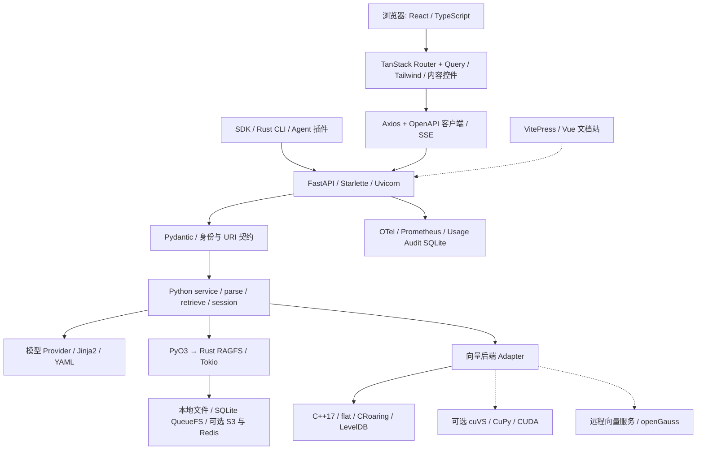

# OpenViking 前端、后端核心技术栈及作用

> 分析日期：2026-10-02。源码基线：`df32bf6e50a40843438f9491a26069ca4bd08f1f`。本文以当前源码、依赖清单、锁文件和构建配置为依据；模块之间的完整关系可结合 [1-模块关系.md](1-模块关系.md) 阅读。

## 阅读导航

- [1. 分析口径与整体结论](#1-分析口径与整体结论)
- [2. 主管理前端：web-studio](#2-主管理前端web-studio)
- [3. Python 后端：API、数据契约与并发](#3-python-后端api数据契约与并发)
- [4. AI、资源解析、提示词与记忆技术](#4-ai资源解析提示词与记忆技术)
- [5. 原生文件系统、存储与向量检索](#5-原生文件系统存储与向量检索)
- [6. 鉴权、加密、观测与运营数据](#6-鉴权加密观测与运营数据)
- [7. SDK、CLI、插件和 VikingBot 的补充技术栈](#7-sdkcli插件和-vikingbot-的补充技术栈)
- [8. 构建、开发、测试与部署技术](#8-构建开发测试与部署技术)
- [9. 一次前后端操作如何经过这些技术](#9-一次前后端操作如何经过这些技术)
- [10. 技术选用边界与源码核验](#10-技术选用边界与源码核验)

## 1. 分析口径与整体结论

本项目的主技术组合是：**React + TypeScript 管理界面，Python + FastAPI 后端，Rust 文件系统，C++ 本地检索引擎，以及可配置的模型与存储供应商。** 后端通过统一 HTTP/MCP 接口为浏览器、SDK、CLI 和 Agent 插件提供服务。

“前端”需要区分两个项目：`web-studio/` 是 React 管理界面；`docs/` 是 VitePress/Vue 文档站。Rust CLI、Node 插件和 SDK 是客户端接入组件，不能全部归为浏览器前端。VikingBot 则是可选的 Python Agent/消息渠道应用。

本次在第一份文档的源码结构分析基础上，逐类核对实际 import、入口和调用位置，并复核对应 manifest/lock/build 配置；全仓库 Git 跟踪的 1,946 个 Python 文件经 AST 导入/符号检查，全部可解析。第三方内嵌库按项目实际集成边界分析，生成代码和共享插件副本不重复视为独立技术实现。本文是静态源码分析，版本信息不代表本机安装结果，也不表示外部供应商均已运行验证。

下文采用以下状态区分：

| 状态 | 含义 |
| --- | --- |
| 核心使用 | 当前主要生产路径有明确源码使用点 |
| 条件使用 | 已有实现，按配置、后端、provider 或功能选择启用 |
| 可选扩展 | 需要额外 Python extra、Cargo feature、外部服务或运行环境 |
| 工程工具 | 用于开发、生成、测试、打包或部署 |
| 仅声明 / 占位 | manifest 有依赖或目录有名称，但当前相应生产路径未实现或未直接使用 |

版本也分两类：`>=`、`^`、`==` 是项目声明的约束；锁文件记录的是该源码快照解析的版本，包含平台/功能条件，不能当作所有环境的实际版本。未在项目声明中独立固定版本的间接依赖，不额外杜撰版本要求。

### 1.1 技术栈总览

| 层次 | 核心技术 | 主要作用 | 所在位置 |
| --- | --- | --- | --- |
| 主管理前端 | React 19、TypeScript、Vite 7、TanStack Router/Query | SPA 页面、类型检查、路由、服务数据缓存 | `web-studio/` |
| UI 与内容展示 | Tailwind CSS 4、Base UI/shadcn 组件、CodeMirror、Markdown、i18next、Recharts | 样式、交互控件、文件编辑、内容/图表与双语展示 | `web-studio/src/` |
| 前后端通信 | Axios、OpenAPI 生成客户端、SSE | 类型化 API 调用、身份/错误处理、Bot 流式输出 | Studio client、server routers |
| 文档前端 | VitePress 1.6.4、Vue、OGL | 文档站、双语导航、搜索和架构图示/背景 | `docs/` |
| HTTP 后端 | Python ≥3.10、FastAPI、Starlette、Uvicorn、Pydantic 2 | API/ASGI 服务、验证、生命周期和响应协议 | `openviking/server/` |
| 并发与后台工作 | asyncio、线程池、自建 QueueFS/TaskTracker | 异步模型/网络调用、后台工作、恢复、取消和等待 | service/storage/pyagfs |
| 模型与语义 | OpenAI SDK、Ark SDK、LiteLLM、模型 provider 抽象 | VLM、Embedding、Rerank、提示词和记忆提取 | models/config/prompts/session |
| 资源解析 | Scrapy、trafilatura、pdfplumber、AnyDoc、Tree-sitter、Feishu SDK | 网页/文档/媒体/代码获取和结构解析 | parse/ |
| 文件与队列底座 | Rust、Tokio、PyO3、rusqlite、S3 SDK、可选 Redis | 进程内文件系统、挂载、锁、队列、缓存和版本快照 | crates/ragfs、ragfs-python |
| 本地检索底座 | C++17、CPython stable ABI、flat、CRoaring、LevelDB | 稠密/稀疏召回、标量过滤、KV 持久化 | src/、storage/vectordb |
| 可选检索后端 | cuVS/CuPy/CUDA、HTTP/Volcengine/VikingDB、openGauss/psycopg2 | GPU 加速或远程/SQL 向量存储 | vectordb_adapters/ |
| 鉴权与加密 | API Key、OAuth、OIDC/LDAP、Argon2id、AES-GCM/HKDF | 身份、密钥验证、文件加密和账户隔离 | server/auth/oauth、crypto、Rust crypto |
| 观测与统计 | OpenTelemetry/OTLP、自建 Prometheus exporter、logging/Loguru/tracing、SQLite | trace、metric、log、Usage/Audit 和报表 | telemetry/metrics/observability |
| 工程交付 | setuptools、maturin、CMake、Cargo、uv、Docker、Helm、GitHub Actions | 多语言构建、打包、部署与检查 | 根配置、scripts、deploy、.github |

### 1.2 技术协作图

## 2. 主管理前端：web-studio

Studio 是浏览器中的 SPA。生产构建产物由 Python 服务在 `/studio` 提供，Vite/Node 承担开发与构建任务。表中版本“声明 → lock”分别来自本子项目的 package.json 和 package-lock.json。

### 2.1 Studio 实际使用的核心技术

| 技术 | 声明 → lock | 主要功能与实际使用范围 | 真实代码证据 |
| --- | --- | --- | --- |
| TypeScript 5、TSX | `^5.7.2` → `5.9.3` | 静态类型、API DTO 和组件类型；严格模式，ES2022/DOM、bundler resolution、noEmit；编译产物由 Vite 生成 | [web-studio/tsconfig.json](../web-studio/tsconfig.json)；[web-studio/src/main.tsx](../web-studio/src/main.tsx)；`web-studio/types/ov-server/` |
| React / React DOM 19 | 两者 `^19.2.0` → `19.2.4` | 用组件和 hooks 构建 SPA 页面，createRoot 挂载，lazy/Suspense 延迟加载编辑器、背景等 | [web-studio/src/main.tsx](../web-studio/src/main.tsx)；[src/routes/resources/-components/file-preview.tsx](../web-studio/src/routes/resources/-components/file-preview.tsx)；[src/routes/sessions/-components/thread.tsx](../web-studio/src/routes/sessions/-components/thread.tsx) |
| Vite 7、React Vite plugin | Vite `^7.3.1` → `7.3.2`；plugin-react `^5.1.4` → `5.2.0` | 开发服务器、模块处理、生产打包、按路由代码拆分；是构建技术，不是 Python API 服务器 | [web-studio/package.json](../web-studio/package.json) scripts；[web-studio/vite.config.ts](../web-studio/vite.config.ts) |
| TanStack Router | `latest` → `1.168.10`；router-plugin 固定 `1.167.12` | 文件路由、类型化导航、intent preload、basepath、滚动恢复；构建插件生成 routeTree 并自动拆包 | [web-studio/src/main.tsx](../web-studio/src/main.tsx)；[src/routeTree.gen.ts](../web-studio/src/routeTree.gen.ts)；[src/routes/__root.tsx](../web-studio/src/routes/__root.tsx)；`vite.config.ts` |
| TanStack Query 5 | `^5.96.2` → `5.96.2` | 管理服务器数据缓存、query/mutation 状态、刷新与失效；全局 QueryClient 的查询 staleTime 为 10 秒，默认关闭重试及窗口 focus 重取；资源、用户、任务、检索、首页均使用 | [web-studio/src/lib/query-client.ts](../web-studio/src/lib/query-client.ts)；[src/main.tsx](../web-studio/src/main.tsx)；[src/routes/users/route.tsx](../web-studio/src/routes/users/route.tsx)；[src/routes/resources/-hooks/viking-fm.ts](../web-studio/src/routes/resources/-hooks/viking-fm.ts) |
| Tailwind CSS 4 + Vite plugin | `^4.1.18` → `4.2.2`（两者） | utility class、主题 CSS 变量、响应式布局、组件样式；typography 插件提供 prose Markdown 样式 | [web-studio/vite.config.ts](../web-studio/vite.config.ts)；`src/styles.css` 的 `@import`/`@plugin`；[src/routes/sessions/-components/message-parts.tsx](../web-studio/src/routes/sessions/-components/message-parts.tsx) |
| shadcn + Base UI | shadcn `^4.1.2` → `4.1.2`；Base UI `^1.3.0` → `1.3.0` | shadcn 配置管理仓库内可修改的 UI 组件和 CSS；Base UI 提供 Dialog/Select/Tabs/Menu 等交互原语；UI 并非远端组件服务 | [web-studio/components.json](../web-studio/components.json)（base-vega、rsc:false）；`src/styles.css` 的 `shadcn/tailwind.css`；[src/components/ui/dialog.tsx](../web-studio/src/components/ui/dialog.tsx)、`select.tsx`、`tabs.tsx` |
| clsx、tailwind-merge、class-variance-authority、tw-animate-css | `2.1.1`、`3.5.0`、`0.7.1`、`1.4.0`（lock） | `cn` 合并/去冲突 class，定义组件 variants、状态动画；组件基础设施 | [web-studio/src/lib/utils.ts](../web-studio/src/lib/utils.ts)；[src/components/ui/button.tsx](../web-studio/src/components/ui/button.tsx)；`src/styles.css` |
| Lucide React、Sonner、next-themes | lock `0.545.0`、`2.0.7`、`0.4.6` | 图标、全局 toast 通知、system/light/dark 主题 class；next-themes 不意味着采用 Next.js | [web-studio/src/main.tsx](../web-studio/src/main.tsx)；[src/routes/__root.tsx](../web-studio/src/routes/__root.tsx)；[src/components/ui/sonner.tsx](../web-studio/src/components/ui/sonner.tsx)；大量页面 |
| Axios 1 + 生成的 OpenAPI 客户端 | Axios `^1.14.0` → `1.15.0` | REST/JSON 与上传下载请求；手写 adapter 注入 API key/account/user/telemetry，规范化错误，再绑定生成客户端 | [web-studio/src/lib/ov-client/client.ts](../web-studio/src/lib/ov-client/client.ts)、`errors.ts`；`src/gen/ov-client/client/`；[src/gen/ov-client/sdk.gen.ts](../web-studio/src/gen/ov-client/sdk.gen.ts) |
| OpenAPI TS / openapi-format | 开发依赖 `^0.95.0` → `0.95.0`；`^1.30.1` → `1.30.1` | 构建期获取本机 Server `/openapi.json`、整理 operationId、生成 Axios 模块与 TypeScript 类型；不是每个页面请求时执行 | [web-studio/script/gen-server-client/gen-server-client.sh](../web-studio/script/gen-server-client/gen-server-client.sh)；`polishOpId.js`；输出 `src/gen/ov-client` |
| Fetch + SSE + @microsoft/fetch-event-source | 包 `^2.0.1` → `2.0.1`；协议/Fetch 是浏览器标准 | POST 流式聊天，允许 body/custom headers/AbortSignal，验证 text/event-stream，将消息包装为 async generator，再解析 response/tool_call/tool_result/reasoning/delta 等；聊天 POST 出错禁止自动重放 | [web-studio/src/lib/sse.ts](../web-studio/src/lib/sse.ts)；[src/lib/sessions/api.ts](../web-studio/src/lib/sessions/api.ts)（`/bot/v1/chat/stream`）；[src/lib/sessions/sse.ts](../web-studio/src/lib/sessions/sse.ts)；`use-chat.ts` |
| CodeMirror 6 | state `6.6.0`、view `6.42.1`，语言扩展均 6.x（lock） | 资源文件编辑/只读浏览、行号、搜索、折叠、补全、括号匹配、撤销；按文件扩展名动态加载 JS/TS/Python/JSON/Markdown/Rust/C++/Java/SQL/XML/YAML 等语法 | [web-studio/src/routes/resources/-components/code-editor.tsx](../web-studio/src/routes/resources/-components/code-editor.tsx)（实际组合 extensions）；`file-preview.tsx` lazy loader |
| react-markdown / remark / rehype / highlight.js | react-markdown `10.1.0`、GFM `4.0.1`、breaks `4.0.0`、rehype-raw `7.0.0`、sanitize `6.0.0`、highlight.js `11.11.1`（lock） | 文件/经验内容 Markdown 展示、GFM 表格、换行与 HTML 处理；文件预览组合 raw 后做 sanitize，代码块按需加载高亮语言 | [web-studio/src/routes/resources/-components/file-preview.tsx](../web-studio/src/routes/resources/-components/file-preview.tsx)；[src/routes/agent-experience/-components/experience-preview-sheet.tsx](../web-studio/src/routes/agent-experience/-components/experience-preview-sheet.tsx) |
| Streamdown + code/cjk plugins | `2.5.0`、`1.1.1`、`1.0.3`（lock） | LLM 流式 Markdown/代码/CJK 排版；会话消息的 isStreaming 驱动渲染 | [web-studio/src/routes/sessions/-components/message-parts.tsx](../web-studio/src/routes/sessions/-components/message-parts.tsx) |
| Mermaid via @streamdown/mermaid | 插件 `1.0.2`（lock）；`overrides.mermaid=^11.16.1`，mermaid lock `11.17.2` | 文件 Markdown 图块渲染为 SVG，跟随主题，支持失败状态/源码显示 | [web-studio/src/routes/resources/-components/mermaid-diagram.tsx](../web-studio/src/routes/resources/-components/mermaid-diagram.tsx)；`file-preview.tsx` |
| i18next / react-i18next / browser-language-detector | `^26.0.3` → `26.0.3`；`^17.0.2` → `17.0.2`；`^8.2.1` → `8.2.1` | 中英文资源、命名空间、语言检测、useTranslation 与 fallback；页面数据格式用 Intl | [web-studio/src/i18n/index.ts](../web-studio/src/i18n/index.ts)、`resources.ts`、`locales/`；[src/routes/home/-components/context-commits-heatmap.tsx](../web-studio/src/routes/home/-components/context-commits-heatmap.tsx) |
| Recharts / React Heat Map | `^3.8.1` → `3.8.1`；`^2.3.3` → `2.3.3` | 首页 Token 趋势面积图、Context Commit 活动热力图；其他简单统计也有手写展示，不要把所有统计都说成 Recharts | [web-studio/src/routes/home/-components/token-trend-chart.tsx](../web-studio/src/routes/home/-components/token-trend-chart.tsx)、`context-commits-heatmap.tsx` |
| Three.js + postprocessing | `^0.183.2` → `0.183.2`；`^6.39.0` → `6.39.0` | WebGL shader 和特效合成器实现 PixelBlast 交互背景，是会话空状态装饰，非检索/向量引擎或业务 3D 场景 | [web-studio/src/components/ui/pixel-blast.tsx](../web-studio/src/components/ui/pixel-blast.tsx)；[src/routes/sessions/-components/thread.tsx](../web-studio/src/routes/sessions/-components/thread.tsx) lazy import |
| react-dropzone + file-type | `15.0.0`、`22.0.1`（lock） | 拖放/选择资源上传，读取 Blob 猜测 MIME 并做文件限制；后端仍负责真实解析与校验 | [web-studio/src/routes/resources/-components/upload-resource-fields.tsx](../web-studio/src/routes/resources/-components/upload-resource-fields.tsx)；`-lib/upload.ts` |
| YAML | `^2.8.1` → `2.9.0` | OKF sidecar YAML frontmatter 解析；客户端内容辅助而非配置数据库。编辑器 YAML 语法支持另来自 CodeMirror 扩展 | [web-studio/src/lib/okf-markdown.ts](../web-studio/src/lib/okf-markdown.ts)（第 1 行）；[src/routes/resources/-components/code-editor.tsx](../web-studio/src/routes/resources/-components/code-editor.tsx)（第 54 行） |
| qrcode.react | `^4.2.0` → `4.2.0` | 飞书连接授权二维码；局部渠道 UI 功能 | [web-studio/src/routes/vikingbot/-providers/feishu/connect.tsx](../web-studio/src/routes/vikingbot/-providers/feishu/connect.tsx) |
| Web App Manifest + 原生 Service Worker | 无 npm 实现；手写 | 可安装 PWA 与 standalone 展示；生产环境按 SPA basepath 注册。SW 无缓存、fetch handler 是 no-op，不能声称离线可用；未使用 Workbox/vite-plugin-pwa | [web-studio/public/manifest.json](../web-studio/public/manifest.json)、`service-worker.js`；[src/lib/service-worker.ts](../web-studio/src/lib/service-worker.ts)；[src/main.tsx](../web-studio/src/main.tsx) |

### 2.2 依赖声明与实际使用的区别

| 包/技术 | 核对结论 | 证据 |
| --- | --- | --- |
| @tanstack/react-form | package 声明 `^1.28.6`，lock `1.28.6`，全仓 web-studio 除包清单/lock 无引用。当前表单 useState、Input、onSubmit 与手写校验 | [web-studio/src/routes/compile/-components/compile-form.tsx](../web-studio/src/routes/compile/-components/compile-form.tsx)（第 4 行）、`:342`；[src/lib/form-input.ts](../web-studio/src/lib/form-input.ts) |
| @tanstack/react-table | 声明 `^8.21.3`，lock `8.21.3`，无源码引用。Table 是仓库组件封装原生 table/thead/tbody，分页/排序在业务 hook 处理 | [web-studio/src/components/ui/table.tsx](../web-studio/src/components/ui/table.tsx)；[src/routes/users/route.tsx](../web-studio/src/routes/users/route.tsx)；`-components/user-pagination.tsx` |
| gsap | 声明 `^3.14.2` → lock `3.14.2`，当前源码未引用；不要推断为 UI 动画引擎 | [web-studio/package.json](../web-studio/package.json)，全文 import/CSS 搜索 |
| @codemirror/lint | 声明 `^6.9.6` → lock `6.9.6`，未 import；编辑器的 extensions 没有 lint 集成，不应写成已提供 CodeMirror lint 实时诊断 | [web-studio/package.json](../web-studio/package.json)；[src/routes/resources/-components/code-editor.tsx](../web-studio/src/routes/resources/-components/code-editor.tsx) |
| shadcn/fontsource/tailwind/tw-animate | JS import 计数为零不代表未用，均有 CSS/config 使用 | [web-studio/src/styles.css](../web-studio/src/styles.css)、`components.json`、`vite.config.ts` |
| TanStack Devtools | dependencies 中声明 latest，lock react-devtools `0.10.1`/router-devtools `1.166.11`，但 import.meta.env.DEV 才 lazy 渲染，属于开发辅助 | [web-studio/src/routes/__root.tsx](../web-studio/src/routes/__root.tsx)；[src/components/app-devtools.tsx](../web-studio/src/components/app-devtools.tsx) |
| Vitest + Testing Library + jsdom | lock Vitest `3.2.4`、React Testing Library `16.3.2`、user-event `14.6.6`、jsdom `28.1.0`；组件/状态/API adapter 自动测试，非生产界面依赖 | [web-studio/package.json](../web-studio/package.json) devDependencies/scripts；`vite.config.ts` test；`src/test/setup.ts`；各 `.test.ts(x)` |
| ESLint + Prettier | lock `9.39.4`、`3.8.1`，包括 i18next lint；代码规范和格式，生成/基础 UI 等有排除 | [web-studio/eslint.config.js](../web-studio/eslint.config.js)；`prettier.config.js`；package scripts |

### 2.3 文档站与独立演示界面

| 位置/技术 | 版本口径 | 实际功能、与 Studio 的区别 | 证据 |
| --- | --- | --- | --- |
| VitePress | docs devDependency 固定 `1.6.4`，lock `1.6.4` | Markdown 文档站静态构建、dev/preview、导航、多语言路由、语法高亮、默认主题；docs scripts 是 vitepress，不是 Next/Nuxt | [docs/package.json](../docs/package.json)；[docs/.vitepress/config.ts](../docs/.vitepress/config.ts)；`theme/index.ts` |
| Vue 3 / Vue SFC + TS/JS/CSS | docs 没有直接声明 Vue，VitePress 的 lock 传递依赖 Vue `3.5.33`；其内部 Vite lock `5.4.21` | 自定义文档 Layout、导航/语言偏好、搜索、复制 Markdown、llms.txt、架构 SVG 图解和 docs-home；文档站框架与 Studio React 两套构建 | [docs/.vitepress/theme/index.ts](../docs/.vitepress/theme/index.ts)；`OpenVikingSearch.vue`；`components/*.vue`；`CopyMarkdownButton.vue` |
| OGL / WebGL | docs dependency `^1.0.11`，lock `1.0.11` | 文档首页 SideRays 的 WebGL shader 光线背景；Vue mounted 动态 import，离屏/隐藏暂停，WebGL 失败退回 CSS；不参与检索或向量计算 | [docs/.vitepress/theme/components/SideRays.vue](../docs/.vitepress/theme/components/SideRays.vue)（第 24 行）；`DocsHome.vue:4`、`:69` |
| 自定义 search index + fetch | 无独立搜索框架包版本 | 文档 buildEnd 生成 docs-search-index.json；浏览器搜索可请求远程 Studio gateway 的语义/keyword/file 模式，失败时读本地文档索引；不是当前配置采用 Algolia | [docs/.vitepress/config.ts](../docs/.vitepress/config.ts) buildDocsSearchIndex；`theme/OpenVikingSearch.vue` |
| 文档聊天 widget + 浏览器标准 DOM | 无 npm chat UI 包 | 主题空闲后加载外部 `/studio/embed-widget/vikingbot-widget.js`，调用全局 VikingBotWidget.mount/setLocale；仓库这部分只包含加载器，外部 widget 的 UI 技术不能从该加载器推定 | [docs/.vitepress/theme/vikingbot-widget.ts](../docs/.vitepress/theme/vikingbot-widget.ts)；`theme/index.ts` |
| 狼人杀 demo：HTML/CSS/原生 JavaScript + Fetch + Canvas 2D | 无 package/framework 版本 | 单 HTML 页面，轮询 `/api/*` 显示局势、消息、回放/排行榜，手写 Canvas 胜率图；并未使用 React/Vue/Chart.js | [bot/demo/werewolf/werewolfUI.html](../bot/demo/werewolf/werewolfUI.html)（script 830、fetch 2345、Canvas getContext 3181、poll 3853） |
| 图谱 demo：Python 生成 HTML + D3 v7 | CDN URL `https://d3js.org/d3.v7.min.js`，只固定 major，不锁 patch | SVG force simulation、zoom、drag、节点/关系互动；只有两个独立 compile 图谱展示脚本用 D3，不能列成 Studio 全局依赖 | [examples/compile/graph-show/llm-wiki/wiki_graph.py](../examples/compile/graph-show/llm-wiki/wiki_graph.py)（第 693 行）、`:1008`；`knowledge-graph/knowledge_graph.py:623`、`:1043` |

## 3. Python 后端：API、数据契约与并发

### 3.1 Web 服务技术

| 技术 | 声明 / 状态 | 技术主要功能 | 在本项目中的具体作用与依据 |
| --- | --- | --- | --- |
| Python | 主包 `>=3.10`；核心使用 | 通用语言、异步 IO、动态扩展与数据处理 | service/parse/retrieve/session/config 的业务主体；主包入口见 [pyproject.toml](../pyproject.toml) |
| FastAPI | `>=0.128.0`；核心使用 | ASGI Web API、路由/依赖注入、模型校验、OpenAPI | `create_app` 注册资源、文件、检索、会话、任务、管理等 API；复用核心服务；见 [app.py](../openviking/server/app.py) |
| Starlette / ASGI | FastAPI 间接依赖且源码直接引用；核心使用 | HTTP/流式响应、中间件、请求与应用生命周期底层 | 请求 ID、错误/观测中间件、MCP ASGI 挂载和流响应；源码使用原生 ASGI 接口维护请求/流执行路径 |
| Uvicorn | `>=0.39.0`；核心使用 | ASGI 服务运行器 | 监听端口、运行 FastAPI；启动器处理 worker/Bot 配置；见 [bootstrap.py](../openviking/server/bootstrap.py) |
| Pydantic 2 | `>=2.0.0`；核心使用 | 运行时类型验证、模型序列化、字段校验 | API 请求/错误信封、启动/账户配置、记忆 schema、向量字段、训练协议；见 [server/models.py](../openviking/server/models.py) 和 [account_config.py](../openviking/config/account_config.py) |
| HTTPX | `>=0.25.0`；核心使用 | 同步/异步 HTTP、连接池、超时与流读取 | 独立 SDK、模型调用、Connector/Understanding、Bot 网关代理、OIDC Discovery/JWKS；请求级/loop 级客户端缓存减少跨循环误用 |
| Requests | `>=2.33.0`；条件使用 | 同步 HTTP 请求 | 部分模型适配器、远端向量客户端、初始化工具、OTLP HTTP 指标传输；阻塞调用与异步路径有单独调度 |
| python-multipart | `>=0.0.31`；上传路径使用 | 解析 multipart/form-data | FastAPI 的文件/表单上传协议；客户端上传和资源暂存随后进入业务处理流程 |
| OpenAPI | FastAPI 输出；协议/生成工具使用 | 描述 HTTP 接口、参数与响应 schema | Studio 从服务 `/openapi.json` 生成 Axios 客户端，API schema 同时供文档/接入使用 |
| MCP Python SDK / FastMCP | `>=1.27,<2`；协议入口 | 将服务能力以 Model Context Protocol 工具暴露 | `/mcp` Streamable HTTP 工具调用，复用 REST 身份与 service；见 [mcp_endpoint.py](../openviking/server/mcp_endpoint.py) |
| SSE / StreamingResponse | 已实现的流式功能 | 长连接中按事件逐段传输结果 | `/bot/v1/chat/stream` 转发 Bot 文本/工具/状态事件，前端按事件更新聊天内容；见 [routers/bot.py](../openviking/server/routers/bot.py) |
| WebDAV | 项目内路由实现；条件使用 | 通过 HTTP 提供资源目录和文件操作协议 | `/webdav/resources` 的 PROPFIND/GET/PUT/MOVE 等复用文件服务与鉴权；不是另一套文件数据库 |

FastAPI 负责协议与边界，实际资源解析、向量检索和记忆处理位于项目自己的领域模块。`APIRouter`、`Depends` 和 Pydantic 请求模型连接接口与领域服务；后端并没有靠 Web 框架自动完成 RAG 或长期记忆算法。

### 3.2 并发、任务和定时工作

| 技术 / 机制 | 主要功能 | 本项目使用方式 | 边界 |
| --- | --- | --- | --- |
| asyncio / async-await | 并发网络 IO、协程调度、超时/取消 | 模型、检索、服务请求、配置刷新、Watch、会话自动提交 | 并发不等于所有底层调用都是非阻塞 |
| asyncio.to_thread / ThreadPoolExecutor | 将阻塞调用移出事件循环 | 同步向量 adapter、RAGFS binding、SQLite、LDAP、rerank 等；服务可配置默认 executor 大小 | 函数取消不能自动终止底层已开始的阻塞写操作，相关组件有 settle 边界 |
| threading + 独立 event loop | 管理队列 worker 并发 | QueueManager 为工作队列创建线程与 asyncio loop；生产者/消费者通过持久队列通信 | 不是把所有工作塞进 HTTP 请求所在 event loop |
| contextvars | 在异步调用链传播请求上下文 | 身份/actor peer、trace、operation telemetry、任务归属、请求 Embedding 缓存 | 与全局可变用户状态区分 |
| 自建 QueueFS / TaskTracker | 持久工作、状态、恢复、取消和等待 | 导入、语义、Embedding、重建、Session commit、外部任务和清理 | pending/processing/ACK 具有至少一次交付边界，业务需要幂等性 |
| APScheduler | 声明 `>=3.11.0`；周期后台作业 | `LocalCollection` 的 `BackgroundScheduler` 执行本地索引维护/持久化、TTL 等清理 | 实际使用点在 [local_collection.py](../openviking/storage/vectordb/collection/local_collection.py)；Watch 和 SessionAutoCommit 是自建 asyncio 检查循环 |
| Python/Rust/OS 锁 | 保护共享状态与文件更新 | keyed async lock、线程锁、数据目录进程锁、Rust exact/tree lease 与 handoff | 作用域不同；不能把进程内 lock 等同于全部跨进程存储锁 |

任务状态与工作消息各有职责：TaskTracker 保存用户可查询的任务记录，QueueFS 保存可恢复的实际工作。会话提交先持久化归档/意图并入队，后续模型提取和向量工作由消费者推进；返回 task_id 表示任务已接受，是否等到处理结束取决于请求契约。

### 3.3 配置和内容协议

| 技术 | 功能 | 本项目用途 |
| --- | --- | --- |
| JSON / Pydantic | 结构化配置与 API 数据 | `ov.conf`、`ovcli.conf` 是 JSON 配置；账户/集群运行时配置经 RuntimeField 校验、锁内更新与备份 |
| YAML / PyYAML | 可读的结构化模板 | prompts、记忆类型 schema、skill frontmatter、声明式资产，以及部署配置；YAML 不等于所有配置文件格式 |
| Markdown / Jinja2 | 可读内容和参数化文本渲染 | 资源转换、`.abstract.md`/`.overview.md`、记忆文件和 SKILL.md；Jinja2 渲染提示词、内容/描述模板 |
| JSONL | 逐记录写入/分析 | Session 消息、录制/训练事件/使用报告、OVPack 可移植索引记录 |
| 项目 URI 与多层内容协议 | 统一文件与上下文地址 | `viking://`、账户/用户/Peer 归属、L0/L1/L2、侧车元数据和新鲜度；由 core/storage 实现 |
| hashlib / xxhash | 指纹和主键/label 映射 | 内容 MD5、包校验 SHA256、向量稳定 record ID、字符串主键到原生 uint64 label；作用不同，不把所有 hash 都称加密 |
| zipfile / OVPack | 打包与可移植内容 | 上传目录、解析容器、资源备份/迁移；OVPack 有 manifest、路径/哈希/向量契约检查 |

## 4. AI、资源解析、提示词与记忆技术

### 4.1 模型接口与三类 AI 能力

| 技术/声明版本 | 安装与运行性质 | 在项目中的实质功能 | 源码证据 |
|---|---|---|---|
| OpenAI Python SDK `openai>=1.0.0` | 基础依赖；provider 按配置选择，外部 API 或兼容服务 | `OpenAI`/`AsyncOpenAI` 和 Azure 对应客户端提供文本/图片理解、工具调用与 dense embedding；对外归一成 VLMBase/EmbedResult。Azure 使用同一个 SDK；GLM/Kimi 的 endpoint/model/header 适配继承 OpenAIVLM | [models/vlm/backends/openai_vlm.py](../openviking/models/vlm/backends/openai_vlm.py)（第 77 行）、[models/embedder/openai_embedders.py](../openviking/models/embedder/openai_embedders.py)（第 29 行）、[models/vlm/backends/glm_vlm.py](../openviking/models/vlm/backends/glm_vlm.py)（第 15 行）、`kimi_vlm.py:26` |
| 火山引擎 Ark SDK `volcengine-python-sdk[ark]>=5.0.3` | 基础依赖；实际导入名 `volcenginesdkarkruntime`；外部 Ark 服务 | `Ark`/`AsyncArk` 提供 LLM/VLM、dense/sparse/hybrid embedding；音视频上传 Files，等待文件处理，用 Responses 获得理解文本，再清理远程文件。Ark SDK 是模型接入，不能与整个向量存储引擎混为一谈 | [models/vlm/backends/volcengine_vlm.py](../openviking/models/vlm/backends/volcengine_vlm.py)（第 115 行）、`volcengine_media.py:260`、`:302`、[models/embedder/volcengine_embedders.py](../openviking/models/embedder/volcengine_embedders.py)（第 9 行） |
| 火山引擎基础 SDK `volcengine>=1.0.216` + requests | 基础依赖；VikingDB 等服务按配置调用 | VikingDB 请求签名（Credentials/SignerV4/Request）及 rerank API，相关 embedding adapter 对接 VikingDB 服务。不是必须同时启用所有云端服务 | [models/rerank/volcengine_rerank.py](../openviking/models/rerank/volcengine_rerank.py)（第 15 行）、`:59`、`:88`、[models/embedder/vikingdb_embedders.py](../openviking/models/embedder/vikingdb_embedders.py) |
| LiteLLM `>=1.83.7,<1.91.2` | 基础依赖；多 provider 路由按配置启用 | 统一多厂商 chat completion/acompletion、embedding、rerank；模型前缀/厂商识别、鉴权透传、usage 归一化。项目仍有自己定义的 VLM/Embedder/Rerank 接口、故障转移和凭证包装，LiteLLM 是适配层之一 | [models/vlm/backends/litellm_vlm.py](../openviking/models/vlm/backends/litellm_vlm.py)（第 15 行）、`:156`；[models/embedder/litellm_embedders.py](../openviking/models/embedder/litellm_embedders.py)（第 12 行）；[models/rerank/litellm_rerank.py](../openviking/models/rerank/litellm_rerank.py)（第 64 行） |
| Google GenAI `google-genai>=1.39.0` | 可选 extra `gemini` / `gemini-async`；后者还声明 `anyio>=4.0.0` | Gemini dense embedding，针对 query/document 设置 task type、调用同步/异步 embedding，截断并归一化维度。Gemini VLM 的多厂商接入还可走 LiteLLM，不能写成单独存在 `gemini_vlm.py` | [models/embedder/gemini_embedders.py](../openviking/models/embedder/gemini_embedders.py)（第 7 行）、`:72`、`:192`、`:237`；[models/embedder/__init__.py](../openviking/models/embedder/__init__.py)（第 36 行） |
| llama-cpp-python `>=0.3.0` / GGUF | 可选 extra `local-embed`；本地推理，不要求远程模型 API | LocalDenseEmbedder 动态导入 `llama_cpp.Llama`，按需下载/缓存 GGUF，`embedding=True`，通过 `create_embedding` 生成 dense vector；当前内建 model spec 为 `bge-small-zh-v1.5-f16`、固定 512 维，可指定本地模型路径 | [models/embedder/local_embedders.py](../openviking/models/embedder/local_embedders.py)（第 77 行）、`:112`、`:165`、`:195` |
| HTTPX `>=0.25.0` / requests `>=2.33.0` | 基础依赖；同步/异步 HTTP transport | 云端模型和内容获取；Jina、Voyage、Cohere、DashScope、MiniMax 等 embedding adapter 使用直接 HTTP 请求，不能因为有 provider 文件就列出不存在的专用 Python SDK | [models/network.py](../openviking/models/network.py)（第 16 行）；`models/embedder/*_embedders.py`；[models/rerank/cohere_rerank.py](../openviking/models/rerank/cohere_rerank.py)（第 14 行）、`jev_rerank.py:21` |
| json-repair `>=0.25.0` + Pydantic `>=2.0.0` | 基础依赖；结构化输出工具 | 从模型文本提取 JSON，修复常见格式，`model_validate` 校验；为结构化结果和记忆 schema 约束提供可靠转换。默认 Python 记忆协议另有 AST 编译器 | [models/vlm/llm.py](../openviking/models/vlm/llm.py)（第 13 行）、`:23`、`:87`、`:95`；[session/memory/schema_model_generator.py](../openviking/session/memory/schema_model_generator.py)（第 13 行） |

#### LLM/VLM、Embedding 和 Rerank 的分工

- LLM/VLM：生成资源/目录 L0 摘要和 L1 概览、查询意图、图片/音视频描述、工作记忆、长期记忆与技能抽取、经验演化；视觉输入仅由具备对应能力的 provider 承担。
- Embedding：将资源、记忆、检索 query 转换成 dense 或 sparse/hybrid 向量，交给存储/检索层；它生成特征，不自行替代向量数据库。OpenAI adapter 仅 dense，Volcengine/VikingDB 有 sparse/hybrid；CompositeHybridEmbedder 可组合能力。
- Rerank：对已召回的候选文本再评分；支持 VikingDB、OpenAI-compatible、Cohere、LiteLLM 和 Jev；许多失败分支返回 None，检索层再决定降级。仅是检索的可配置增强，不代表所有 find/search 都会强制调远程 rerank。

关键分发证据：[models/vlm/base.py](../openviking/models/vlm/base.py)（第 349 行） 的 VLMFactory 按 provider 选择 Volcengine、OpenAI/Azure、Codex、Kimi、GLM，否则走 LiteLLM；[models/rerank/volcengine_rerank.py](../openviking/models/rerank/volcengine_rerank.py)（第 192 行） 的 from_config；embedding 配置层再构造各 backend。模型包装还实现 retry、多凭证切换、failover、token/错误/时延统计、event-loop scoped async client cache。

Codex provider 在 [models/vlm/backends/codex_vlm.py](../openviking/models/vlm/backends/codex_vlm.py) / `codex_responses_adapter.py` / `codex_auth.py` 将 Responses payload 映射成项目使用的 chat completions/tool-call 形态，支持设备码/本地认证存储/刷新令牌；这是代码中的 provider 功能，不是平台自身依赖来源。

### 4.2 文档、网页、代码和媒体解析

| 技术/声明版本 | 性质 | 主要用途 | 源码证据 |
|---|---|---|---|
| pdfplumber `>=0.10.0` + pdfminer-six `>=20251230` | 基础依赖；PDF 本地策略 | 逐页抽取文字、表格、图片，用书签或字体检测标题，生成 Markdown。同步解析放入 `asyncio.to_thread` 避免阻塞事件循环，页面缓存按需释放 | [parse/parsers/pdf.py](../openviking/parse/parsers/pdf.py)（第 220 行）、`:234`、`:261` |
| firecrawl-anydoc `>=0.2.4,<0.3`（import 名 `anydoc`） | 基础依赖；Office/EPUB 解析可配置 enabled | 本地字节识别格式→`anydoc.to_document` 结构化 document→自有 Markdown renderer；保留段落、inline 样式、表格、列表、链接、脚注/图片资产，交给 MarkdownParser 再组织内容。AnyDoc converter 显式拒绝 PDF，PDF 是独立路线 | [parse/parsers/anydoc.py](../openviking/parse/parsers/anydoc.py)（第 38 行）、`:67`、`:73`；`anydoc_converter.py:29`、`:33`、`:48`；`anydoc_renderer.py:65` |
| Scrapy `>=2.11.0` | 基础依赖；网页站点递归导入 | 在独立 multiprocessing worker 启动 CrawlerProcess，递归获取静态网页/下载资源，控制域、路径、深度、页面数、robots 等；middleware 做请求/重定向验证。不是前端 SSR 或浏览器自动化框架 | [parse/accessors/web_crawler/web_crawler.py](../openviking/parse/accessors/web_crawler/web_crawler.py)（第 18 行）、`:77`、`:81`；`scrapy_spider.py:33` |
| trafilatura `>=1.12.0` | 基础依赖；HTML 正文抽取 | 抽取网页正文和标题 metadata，输出 Markdown，保留链接/表格；交给通用 MarkdownParser。不同于 Scrapy 的“获取网页”职责 | [parse/parsers/html.py](../openviking/parse/parsers/html.py)（第 157 行）、`:174`、`:218` |
| BeautifulSoup（`bs4`） | 实际生产 import；主包经 Volcengine→google 的间接依赖获得，bot extra 明确声明 `beautifulsoup4>=4.12.0` | 清理特殊页面、处理微信隐藏正文和 lazy image、读取 noscript、轻量 title 探测。不要将它标为根主依赖列表中的直接依赖 | [parse/parsers/html.py](../openviking/parse/parsers/html.py)（第 145 行）、`:205`；[parse/accessors/web_importer.py](../openviking/parse/accessors/web_importer.py)（第 285 行）；`uv.lock:6799` volcengine→google→beautifulsoup4 |
| feedparser `>=6.0.0` + defusedxml `>=0.7.1` | 基础依赖 | RSS/Atom feed 条目和正文获取；安全 XML 解析 sitemap/sitemapindex；在同主机/include/exclude、robots、页数/深度/并发等限制下镜像内容 | [parse/accessors/web_feed_accessor.py](../openviking/parse/accessors/web_feed_accessor.py)（第 390 行）、`:414`、`:527`、`:689` |
| lark-oapi `>=1.5.3` | 基础依赖；飞书/Lark 外部云端服务按来源启用 | 飞书 docx/wiki/旧 doc、sheet、bitable、mindnote、Drive file/folder 获取与 Markdown 转换、图片/媒体下载；请求级用户 token / 应用凭证、token 缓存隔离；带权限 preflight 与递归预算 | [parse/accessors/feishu_accessor.py](../openviking/parse/accessors/feishu_accessor.py)（第 25 行）、`:459`、`:663`、`:1337`、`:1674`、`:2361`；`feishu_session.py`、`feishu_token.py` |
| Tree-sitter `==0.25.2` + tree-sitter-language-pack `==1.13.3` + grep-ast `==0.9.0` | 基础依赖、固定版本以控制 grammar/API 变化 | 代码的 AST/符号/结构摘要；维护 tags `.scm` 查询结合 grep_ast/TreeContext 提取定义骨架，缺少维护查询的语言使用 language-pack 的 `process`；最终与 LLM 摘要结合 | [parse/parsers/code/ast/aider_repomap.py](../openviking/parse/parsers/code/ast/aider_repomap.py)（第 53 行）、`:62`、`:119`、`:138`；`process_engine.py:8`、`:141`；`providers.py:47` |
| Tree-sitter 单语言 grammar | 基础依赖；固定版本 | 根声明 Python `0.25.0`、JS `0.25.0`、TS `0.23.2`、Java `0.23.5`、C++ `0.23.4`、Rust `0.24.0`、Go `0.25.0`、C# `0.23.1`、PHP `0.24.1`、Lua `0.5.0`，供已验证的代码解析栈，不宜把每个 grammar 称作单独业务模块 | [pyproject.toml](../pyproject.toml)（第 62 行）–`:74` |
| pathspec `>=1.1.1` | 基础依赖 | GitIgnoreSpec 解释嵌套 `.gitignore`，与 include/exclude、隐藏目录、符号链接、资源限制共同管理目录/Git 导入 | [parse/gitignore.py](../openviking/parse/gitignore.py)（第 11 行）、`:56`；[parse/directory_scan.py](../openviking/parse/directory_scan.py)（第 180 行） |
| charset-normalizer `>=3.4,<4` | 基础依赖 | 文本编码探测和统一解码；防止非 UTF-8 文件直接失败 | [parse/parsers/text_encoding.py](../openviking/parse/parsers/text_encoding.py)、`base_parser.py` |
| Pillow（`PIL`） | 生产 import；根主依赖未单独声明版本，由解析依赖栈间接安装 | 图片解码/损坏检查、尺寸调整、切片与大图 overview/区域坐标 overlay，支持 VLM 输入和媒体资产 | [parse/image_validation.py](../openviking/parse/image_validation.py)（第 27 行）；[parse/parsers/media/image.py](../openviking/parse/parsers/media/image.py)（第 17 行）、`large_image_processor.py:19` |
| Markdown + YAML frontmatter / JSON manifest | 内容与持久化格式，不是独立数据库产品 | Markdown 是通用中间产物，按标题/token/表格切分，重写文档/图片引用；长期记忆文件也是 Markdown，结构字段另存尾注；manifest 记录产物 metadata/hash | [parse/parsers/markdown.py](../openviking/parse/parsers/markdown.py)（第 265 行）、`:385`、`:467`；[parse/output.py](../openviking/parse/output.py)（第 160 行）；[session/memory/utils/memory_fields.py](../openviking/session/memory/utils/memory_fields.py) |
| Git CLI / zipfile | 外部命令 + Python 标准库 | Clone Git/SSH 仓库，处理 branch/commit/鉴权和源码 ZIP fallback，ZIP 安全解压 | [parse/accessors/git_accessor.py](../openviking/parse/accessors/git_accessor.py)（第 377 行）；[parse/parsers/zip_parser.py](../openviking/parse/parsers/zip_parser.py) |

#### 代码骨架与语义回退的路由

代码骨架实际分支在 `providers.py:47`：

1. 有维护的 tags query：调用 grep_ast，结果有效则返回；失败或没有有效结构直接请求 LLM fallback。
2. 没有维护的 tags query：调用 tree-sitter-language-pack process；无有效结构才请求 LLM fallback。

不能画成“tags 任意失败→process→LLM”的统一串行链。

普通 Markdown/Text 解析不靠 LLM 才能完成；结构化解析后的 L0/L1 语义生成在后续阶段。ImageParser 本身先用 Pillow 验证、转换/切片并保存图片产物；后续图片语义描述调用视觉 VLM。音视频通过模型 provider 媒体能力调用，源码不是一个以 FFmpeg/pydub 为核心的本地音视频解码系统。

### 4.3 外部解析服务与预留能力

- **MinerU**：PDFParser 的远程 `strategy=mineru`，通过 HTTPX 请求 `/file_parse`，取得 Markdown 与 base64 图片；`auto` 先尝试本地解析，失败且配置 endpoint 时回退。是可选外部解析服务，不是根安装依赖中的 `mineru` Python SDK，也不在主服务内训练/加载 MinerU 模型。证据 [parse/parsers/pdf.py](../openviking/parse/parsers/pdf.py)（第 198 行）、`:208`、`:684`、`:726`。
- **Understanding API**：ParserRouter 按 backend/白名单选择，HTTP Files/Responses 协议完成上传、分块上传、异步状态轮询、checkpoint 恢复、结果 ZIP 下载/安全解压。是外部服务协议和自定义适配器，不是一定依赖某个“Understanding” pip 包。飞书已转换 Markdown 的内容保留内部解析。证据 [parse/parser_router.py](../openviking/parse/parser_router.py)（第 47 行）、`:108`；[parse/understanding_api.py](../openviking/parse/understanding_api.py)（第 316 行）、`:629`、`:717`。
- **LlamaParse**：位于 `examples/llamaparse-understanding-bridge` 的独立桥接示例。FastAPI/HTTPX 将 Understanding Files/Responses 映射到 LlamaParse v2 upload/parse/status，并把 Markdown/图片封装为 ZIP；主项目的 parse 只需接入该服务。示例自身约束 FastAPI `>=0.115,<1`、HTTPX `>=0.27,<1`、Uvicorn `>=0.30,<1`、multipart `>=0.0.20`，未依赖 `llama-parse` SDK。证据该目录 [pyproject.toml](../pyproject.toml)（第 14 行）、`bridge.py:3`、`:167`。
- **SVG 转 PNG**：[parse/parsers/media/utils.py](../openviking/parse/parsers/media/utils.py)（第 155 行） 先尝试 cairosvg，再尝试 wand/ImageMagick；二者是按需 import，根 pyproject 没有声明安装约束，需要环境另外提供。不是所有图片必经依赖。
- **OCR**：根 extra `ocr` 声明 `pytesseract>=0.3.10`，但当前生产源码没有 pytesseract import/调用；`ImageConfig.enable_ocr` 说明 `not implemented`。应标记预留能力，不写成“当前已使用 Tesseract 自动 OCR”。证据 [pyproject.toml](../pyproject.toml)（第 132 行）、[openviking_cli/utils/config/parser_config.py](../openviking_cli/utils/config/parser_config.py)（第 309 行）。

### 4.4 提示词、记忆 schema 与文本策略

| 技术 | 功能与边界 | 证据 |
|---|---|---|
| PyYAML `>=6.0` + Jinja2 `>=3.1.6` | YAML 保存 prompt 元信息/变量/正文/LLM 参数以及记忆 schema；`yaml.safe_load` 读取，Jinja Template 以默认变量/类型检查/长度截断渲染提示词。自定义目录/配置覆盖内置模板，缓存由 RLock 保护；该处 Jinja 是后端提示词技术，不是前端页面模板系统 | [prompts/manager.py](../openviking/prompts/manager.py)（第 10 行）、`:52`、`:128`、`:162`、`:204`；[session/memory/memory_type_registry.py](../openviking/session/memory/memory_type_registry.py) |
| Pydantic v2 + 动态 `create_model` | 校验模板数据、会话/记忆模型、schema，按 YAML schema 动态生成输出模型与 JSON Schema；配合字段 merge operator、身份隔离，管理类型化记忆 | [prompts/manager.py](../openviking/prompts/manager.py)（第 12 行）、`:20`；[session/memory/schema_model_generator.py](../openviking/session/memory/schema_model_generator.py)（第 13 行）、`:221`、`:335`；[session/memory/dataclass.py](../openviking/session/memory/dataclass.py) |
| RapidFuzz `>=3.14,<4` | Levenshtein 距离对模型给出的 SEARCH/REPLACE/DELETE patch 做模糊定位，处理缩进、行号、文本轻微变化；它服务记忆文本合并，不是向量相似度搜索引擎 | [session/memory/merge_op/patch_handler.py](../openviking/session/memory/merge_op/patch_handler.py)（第 27 行）、`:75` |
| Python `ast` 标准库的受限 DSL 编译器 | 模型输出类似 Python SDK 调用代码，先 `ast.parse`，仅允许简单赋值、受限 SDK/记忆对象方法和可控表达式，形成 upsert/edit/delete 等 operations，再由 MemoryUpdater 在权限和锁约束下写文件；没有用普通 Python `eval`/`exec` 直接执行模型生成代码 | [session/memory/extraction_output_protocol/python_protocol.py](../openviking/session/memory/extraction_output_protocol/python_protocol.py)（第 618 行）、`:648`、`:694`、`:739`、`:818`、`:1211` |
| asyncio + thread/process offload | 会话提交后的持久队列消费、异步模型/HTTP 请求、并发抽取/分批合并；同步 PDF/飞书下载放线程池、Scrapy 运行子进程。它们服务后端并发和延迟，不是新的 Web 框架 | [session/compressor_v3.py](../openviking/session/compressor_v3.py)、[session/memory/streaming_memory_updater.py](../openviking/session/memory/streaming_memory_updater.py)、[parse/parsers/pdf.py](../openviking/parse/parsers/pdf.py)（第 223 行）、[parse/accessors/feishu_accessor.py](../openviking/parse/accessors/feishu_accessor.py)（第 605 行）、`web_crawler.py:81` |
| JSONL/Markdown/JSON + Context/Message 分片协议 | 消息保存为 JSONL；文本、引用、图片、工具分片形成会话与抽取输入；归档/工作记忆/长期记忆/工具原文各自生命周期，避免把全部历史一直发送模型。文件和向量索引由存储模块维护 | [message/message.py](../openviking/message/message.py)（第 19 行）、`part.py`；[session/archive_store.py](../openviking/session/archive_store.py)、`working_memory.py`、`tool_result_store.py`、`retention.py` |

`session.train` 的 **semantic gradient / policy optimization**：从样例 rollout 和轨迹分析，用 VLM/ExtractLoop 给经验或技能文件提出 before/after 文本修改，经 policy optimizer 整理修改计划，再由 MemoryUpdater/SkillOperationUpdater 写回；离线管线可在 epoch 写回后执行可选评估。`PatchSemanticGradient` 明确携带 MemoryFile before/after；不存在在这些文件中进行神经网络权重梯度下降或 PyTorch/TensorFlow 微调的实现。证据 [session/train/gradients.py](../openviking/session/train/gradients.py)（第 14 行）、`components/gradient_estimator.py:39`、`policy_updater.py:72`、`skill_policy_updater.py`。

### 4.5 可选评估与框架集成

| 技术/安装约束 | 实际功能与范围 | 证据 |
|---|---|---|
| RAGAS `>=0.1.0`（eval/test extras） | 可选 RAG 评估；Faithfulness、AnswerRelevancy、ContextPrecision、ContextRecall；评估模型可从环境/项目配置构造 LangchainLLMWrapper + ChatOpenAI | [openviking/eval/ragas/__init__.py](../openviking/eval/ragas/__init__.py)（第 113 行）、`:216`、`:260`、`:300` |
| Hugging Face datasets `>=2.0.0` + pandas `>=2.0.0`（eval/test/benchmark） | `Dataset.from_dict` 将问题/context/answer/ground truth 转为评估数据；RAGAS 结果 `to_pandas` 汇总指标。它们用于评估数据处理，不是在线向量库或业务 ORM | [openviking/eval/ragas/__init__.py](../openviking/eval/ragas/__init__.py)（第 285 行）、`:314` |
| LangChain / langchain-core / langchain-openai `>=1.0.0`（benchmark extra） | benchmark/RAG 用 ChatOpenAI 和 LangChain messages 生成/评价回答；RAGAS 适配也按需 import。核心 parse/session/retrieve 的编排由 OpenViking 自己实现，不能据 benchmark 依赖宣称整个后端以 LangChain 构建 | [benchmark/RAG/src/core/llm_client.py](../benchmark/RAG/src/core/llm_client.py)（第 2 行）、`judge_util.py:4`；[pyproject.toml](../pyproject.toml)（第 179 行） |
| tiktoken `>=0.5.0`（benchmark extra 直接声明；LiteLLM 也间接依赖它） | benchmark 的精确 tokenization/预算，LongMemEval 评估支持 tokenizer；主后端许多计数使用自有 CJK-aware estimate_text_tokens，并非所有业务均依赖 tiktoken | [benchmark/RAG/src/core/vector_store.py](../benchmark/RAG/src/core/vector_store.py)（第 9 行）；[benchmark/longmemeval/openviking/run_eval.py](../benchmark/longmemeval/openviking/run_eval.py)（第 33 行）；[openviking/utils/token_estimation.py](../openviking/utils/token_estimation.py)；`uv.lock:2333` |
| python-docx `>=1.0.0`（benchmark extra） | SyllabusQA benchmark 的原始 docx→Markdown 数据准备；当前主生产 Office 导入走 AnyDoc，不应沿用旧文档把 python-docx 写成主解析方案 | [benchmark/RAG/src/adapters/syllabusqa_adapter.py](../benchmark/RAG/src/adapters/syllabusqa_adapter.py)（第 211 行）、`:222` |
| 独立 `langchain-openviking` 包（examples/langchain） | OpenVikingRetriever、Tools、ChatMessageHistory、ContextRunnable/上下文装配、session recorder、Store；最低基础 LangChain-core `>=1,<2`、SDK `>=0.1.1`、Pydantic `>=2`；`langgraph` extra 声明 LangChain 和 LangGraph `>=1,<2`，用于 agent middleware/graph 示例 | [examples/langchain/pyproject.toml](../examples/langchain/pyproject.toml)（第 26 行）；`src/langchain_openviking/retrievers.py`、`history.py`、`context.py`、`recording.py`、`middleware.py`；[examples/langchain-langgraph/langgraph/agent/live_app.py](../examples/langchain-langgraph/langgraph/agent/live_app.py)（第 21 行） |

这些评估库属于可选评估或框架集成。在线资源、检索、会话的主要编排由 OpenViking 自身实现，评估依赖不构成全部服务请求的必经运行链。

## 5. 原生文件系统、存储与向量检索

OpenViking 主服务是 Python，两个高性能底层分别通过不同的 Python 原生扩展接入：

- 本地向量/标量检索及 KV：Python `storage/vectordb` → CPython stable ABI C API → C++17 引擎。
- 聚合文件系统、持久任务队列、路径锁、文件快照：Python `pyagfs` → PyO3 `ragfs_python` → Rust RAGFS/Tokio。
- 可选 GPU dense 检索：Python LocalIndex → CuPy/cuVS/CUDA；本地 C++ 引擎继续承担标量过滤、持久记录、稀疏/混合查询与必要的回退。
- 可选数据库向量检索：统一 CollectionAdapter → HTTP/VikingDB/openGauss；不是把这些数据库同时启动为必需服务。

本地文件树与向量记录是两条独立存储通路：RAGFS 存正式内容、摘要文件和队列；向量后端存向量/标量索引及记录。LevelDB 与 SQLite 不能混为一个数据库。

### 5.1 C++ 本地向量与标量引擎

| 技术 | 声明版本/形式 | 在项目中的主要功能 | 属性与源码证据 |
|---|---|---|---|
| C++17 | `CMAKE_CXX_STANDARD 17` | 实现本地 IndexEngine、scalar bitmap/filter/sort、dense/sparse vector recall、Schema/BytesRow 与持久 KV；热点计算从 Python 移到原生层 | 默认本地 VectorDB 底层；`src/CMakeLists.txt:27`、[src/index/detail/index_manager_impl.cpp](../src/index/detail/index_manager_impl.cpp)、[src/store/bytes_row.cpp](../src/store/bytes_row.cpp) |
| CPython stable ABI / abi3 | `Py_LIMITED_API=0x030A0000`，以 Python 3.10 为 ABI 基线 | 通过 C API 与 PyCapsule 暴露 IndexEngine/Schema/BytesRow/KVStore；耗时检索/IO 用 `call_without_gil` 释放 GIL；使同平台扩展可跨受支持 CPython 小版本分发 | **不是 pybind11**；[src/abi3_engine_backend.cpp](../src/abi3_engine_backend.cpp)（第 3,51 行）；[setup.py](../setup.py)（第 541,570 行）；`src/CMakeLists.txt:232` |
| LevelDB | vendored `1.23`，头文件 `kMajorVersion=1,kMinorVersion=23` | `PersistStore` 的嵌入式持久 KV：records/delta 等批写与删、snapshot 批读、字典序 seek/page；CMake 静态链接入扩展 | 默认本地持久层；[src/store/persist_store.cpp](../src/store/persist_store.cpp)（第 21,36,55 行）；[third_party/leveldb-1.23/include/leveldb/db.h](../third_party/leveldb-1.23/include/leveldb/db.h)（第 18 行）；**不是 RocksDB** |
| CRoaring | vendored `ROARING_VERSION "1.1.2"` | 压缩 bitmap 表示 scalar 匹配 label 集合；交/并/差、contains/cardinality，过滤结果可缩小 dense 扫描范围 | 默认 scalar 索引；[src/index/detail/scalar/bitmap_holder/bitmap.h](../src/index/detail/scalar/bitmap_holder/bitmap.h)（第 16 行）；[third_party/croaring/roaring.h](../third_party/croaring/roaring.h)（第 85 行） |
| RapidJSON | vendored 头文件标记 `1.1.0` | C++ JSON/DSL 解析、索引 metadata、字段字典和结构化结果序列化 | 默认原生依赖；[src/common/json_utils.h](../src/common/json_utils.h)（第 8 行）；[third_party/rapidjson/rapidjson.h](../third_party/rapidjson/rapidjson.h)（第 70 行） |
| spdlog | vendored `1.14.1` | C++ 多线程原生日志，按 Python 配置设置级别/format，输出到 stdout、stderr 或文件 | 默认原生依赖；[src/common/log_utils.cpp](../src/common/log_utils.cpp)（第 4,17,35 行）；[third_party/spdlog-1.14.1/include/spdlog/version.h](../third_party/spdlog-1.14.1/include/spdlog/version.h)（第 6 行） |
| x86 SIMD / SSE3、AVX2、AVX512 | 编译器 ISA 选项，无独立 package 版本 | 为 L2/inner-product kernels 编译多个 CPU 扩展变体；CPUID 与 XGETBV 同时检查 CPU/OS 支持，Python loader 自动选择可加载的变体 | 平台相关加速；`src/CMakeLists.txt:8,154,163,180`；[src/abi3_x86_caps.cpp](../src/abi3_x86_caps.cpp)（第 62 行）；[openviking/storage/vectordb/engine/__init__.py](../openviking/storage/vectordb/engine/__init__.py)（第 24 行） |
| KRL / ARM NEON 距离 kernels | 仓库内实现，未发现语义版本声明 | ARM 本地 L2、inner product 向量运算，调用 `krl_L2sqr/krl_ipdis` | ARM 时构建链接；`src/CMakeLists.txt:82`；[src/index/detail/vector/common/space_l2.h](../src/index/detail/vector/common/space_l2.h)（第 127 行）、`space_ip.h:114`；`third_party/krl` |
| 本地 flat brute-force 算法与 FP32/INT8 编码 | 仓库自研算法/布局 | dense 全扫描或在 filter bitmap 内扫描；heap top-k；连续向量布局与 label-offset 映射；FP32/INT8 编码；sparse 与 dense 权重混合 | 默认 CPU 能力，**本地只接受 flat**；[src/index/detail/index_manager_impl.cpp](../src/index/detail/index_manager_impl.cpp)（第 57,91 行）、[src/index/detail/vector/common/bruteforce.h](../src/index/detail/vector/common/bruteforce.h)、`quantization_int8.h`、`vector/sparse_retrieval` |

`third_party` 的这几种库是源码内置并参与原生编译，不是运行时要另起的服务。仓库本地 CPU 引擎没有 FAISS、HNSW/ANN 的集成实现；数据库后端的 HNSW 和 GPU 的 CAGRA 分别属于另一路径。

### 5.2 Rust RAGFS 与 Python 绑定

Rust workspace 有 `crates/ov_cli`、`crates/ragfs`、`crates/ragfs-python` 三个成员，workspace release 启用 `opt-level=3`、LTO 与 strip。RAGFS/RAGFS-Python 采用 Rust edition 2021；CLI 用 edition 2024；三个 manifest 均要求 `rust-version="1.91.1"`。

| 技术 | Manifest 声明 | 在项目中的主要功能 | 默认/可选及关键证据 |
|---|---|---|---|
| Rust | 最低 `1.91.1`；RAGFS edition 2021 | 原生嵌入式聚合文件系统：mount 路由、local/memory/S3/SQLite 等插件、QueueFS、文件锁、多写备份、加密、统计和 snapshots | Python 常规服务需要 ragfs binding；[crates/ragfs/Cargo.toml](../crates/ragfs/Cargo.toml)（第 5 行）、`core/builder.rs`、[openviking/pyagfs/__init__.py](../openviking/pyagfs/__init__.py)（第 101 行） |
| Tokio + async-trait + futures | RAGFS `tokio="1.38"`/`full`、`async-trait="0.1"`、`futures="0.3"`；binding `tokio="1"` | async filesystem traits、并发 I/O、后台任务、锁/挂载异步同步；binding 自带 Tokio runtime；异步任务局部 FsContext 传账号和租约上下文 | 核心 runtime；[crates/ragfs/src/core/filesystem.rs](../crates/ragfs/src/core/filesystem.rs)、`core/context.rs`；[crates/ragfs-python/src/lib.rs](../crates/ragfs-python/src/lib.rs)（第 1484,1519 行） |
| PyO3 + abi3 | `pyo3="0.27"`，features `abi3,abi3-py310` | 生成 `ragfs_python` Python 扩展，Python/Rust 类型与异常转换；以 GIL detach + `FS_CTX.scope` + `block_on` 执行原生操作 | 核心绑定；[crates/ragfs-python/Cargo.toml](../crates/ragfs-python/Cargo.toml)、`src/lib.rs:7,1484`；不是 C++ 那座 C API 桥 |
| serde / serde_json / TOML | serde `1.0`/derive、serde_json `1.0`；binding TOML `0.8` | 配置、QueueFS 消息、缓存协议、多写同步日志、snapshot/index metadata 的结构化读写；binding 支持读取 TOML 等配置接口 | 原生核心；`core/types.rs`、`multibackend/meta.rs`、`cache_runtime/api.rs`、`ragfs-python/src/lib.rs` |
| rusqlite + bundled SQLite | `rusqlite="0.32"`/`bundled` | SQLFS 存文件 metadata/content；SQLiteQueueBackend 持久化 pending/processing 消息、ACK 与崩溃恢复；bundled 编译 SQLite | QueueFS 默认选 `sqlite`；SQLFS 为可选 mount；`plugins/sqlfs/backend.rs:7,109`、`plugins/queuefs/backend.rs:380`；[openviking_cli/utils/config/agfs_config.py](../openviking_cli/utils/config/agfs_config.py)（第 118 行） |
| fred / Redis | `fred="10.1.0"`，optional；features 包含 keys/lists/scripts/sets、Sentinel auth、vendored OpenSSL；native-tls `0.2` optional | 内置 Redis CacheRuntime provider；支持 standalone/cluster/sentinel；共享 typed KV/list/set/Lua script 能力供 CacheFS、分布式 QueueFS 和 PathLock 使用 | **按配置启用，Redis 外部服务不是默认必需**；`cache_runtime/redis/client.rs:8,453`；`core/builder.rs:233`；binding 编译时强制 ragfs/cache |
| libloading + v1 C provider ABI | `libloading="0.8"` optional；自定义入口 `openviking_cache_provider_v1` | 动态装载用户缓存 provider 的原生共享库；验证 ABI version、功能表/能力、内存归属；接入统一 CacheRuntime | 可选缓存扩展；`cache_runtime/dynamic/loader.rs:27,61`；[crates/ragfs/include/openviking_cache_provider_v1.h](../crates/ragfs/include/openviking_cache_provider_v1.h)（第 339 行） |
| AWS SDK for Rust / S3 | aws-config/aws-sdk-s3/aws-types 均 `version="1"`，optional | S3FS 对象存储读写、range、copy/list分页，prefix 模拟目录；可兼容 AWS S3/MinIO/LocalStack/TOS；snapshot 支持 S3 ObjectStore/RefStore/IndexStore | `s3` feature；Python binding 默认带 s3，但默认文件 backend 仍是 local；`plugins/s3fs/client.rs:7`、`git/backends/s3.rs` |
| lru | `0.12` | S3/SQL 的 list/stat 元信息缓存，降低重复目录/元信息查询代价 | 具体插件使用；`plugins/s3fs/cache.rs`、`plugins/sqlfs/cache.rs`；不等同分布式 Redis provider |
| regex / globset / ignore / grep 家族 | regex `1.10`、globset `0.4`、ignore `0.4.25`、grep `0.4.1`、grep-matcher `0.1.8`、grep-regex `0.1.14`、grep-searcher `0.1.16` | 本地 glob/tree/grep、忽略规则、in-process 文本搜索与匹配；LocalFS 可并发遍历，不要求外部 grep 命令 | 文件系统检索工具；`plugins/localfs/mod.rs`、`core/glob.rs`、`core/grep.rs` |
| gitoxide gix-* + flate2 + SHA-1 | gix-hash `0.14`、gix-object `0.42`、gix-features `0.38`/zlib、gix-actor `0.31`、gix-date `0.8`、flate2 `1.0`、sha1 `0.10` | 自己构造/hash/压缩 Git loose objects 与 commit/tree，维护按账号快照、branch refs/CAS、show/log/diff/restore；local/S3 object/ref/index stores | 实际实现能力；`git/commit.rs:22`、`git/util.rs:49,166`、`git/service.rs`；快照主流程不是 shell 调用 `git` |
| AES-256-GCM + HKDF-SHA256 + rand | aes-gcm `0.10`、hkdf `0.12`、sha2 `0.10`、rand `0.8` | 与 Python 加密字节协议一致的 envelope encryption：根 key 派生 account key，随机 file key 加密内容；每 backend 的加密 wrapper 处理逻辑读写 | 按加密配置启用；`crypto/mod.rs:11,45,60`、`core/encryption_wrapper.rs`、`core/builder.rs:221` |
| tracing / tracing-subscriber / tracing-appender | tracing `0.1`；binding subscriber `0.3`、appender `0.2` | Rust structured logging、格式化 subscriber、non-blocking 文件输出和 guard 生命周期 | 原生可观测性；`ragfs-python/src/lib.rs:16`、RAGFS 内 tracing 点 |
| thiserror / anyhow | 均 `1.0` | typed filesystem/cache/git errors、错误封装并通过 binding 转成 Python 对应异常 | 基础错误处理；`core/errors.rs`、`cache_runtime/error.rs`、`git/error.rs` |

#### 编译能力与运行开关

- `ragfs` 库本身 `default=[]`，`cache` 选择 fred/libloading/native-tls，`s3` 选择 AWS SDK，`full=[s3,cache]`。
- `ragfs-python` 默认 `[extension-module,s3]`，对 ragfs 的 dependency 额外 `features=[cache]`；maturin 配置也选择 s3。
- 这些 feature 说明 wheel 具备缓存/S3 功能，不意味着普通进程自动连接 Redis 或 S3。Python 配置的正式文件 `agfs.backend` 默认 local，QueueFS 默认 sqlite，PathLock provider 默认 filesystem；缓存共享 runtime 按 top-level `cache.provider/cache.params` 配置创建。
- 当前实际 wrapper 栈是 `Stats → PathLock → MountableFS`，加密在每个 backend 注入；binding 顶部部分注释还保留旧栈描述，功能以 `core/builder.rs:209-278` 为准。
- RAGFS SQLFS 的 MySQL/TiDB 分支直接返回 `not yet implemented`；`sqlx="0.8"` 虽在 manifest 作为 optional dependency（sqlite/mysql features）声明，但未在源码发现使用，不能列为已实现核心数据库。
- `ragfs-shell` 只有 `Coming soon` 输出，不是当前可用终端文件系统客户端；实际用户 CLI 是 `ov_cli`。

### 5.3 GPU、远程向量服务与 SQL 后端

默认 `VectorDBBackendConfig.backend="local"`。统一 factory 注册 local/cuvs/http/volcengine/vikingdb/opengauss，另支持 `module.ClassName` 加载自定义 `CollectionAdapter`。配置文件选择的是实现方案，不是同时启用所有系统。

| 技术/后端 | 声明/版本来源 | 主要功能和边界 | 关键使用点 |
|---|---|---|---|
| NVIDIA cuVS | 根 pyproject 不含 cuVS extra；独立开发镜像默认 `cuvs-cu13==26.6.0` | GPU dense top-k 检索，支持 brute-force/CAGRA；background rebuild、GPU memory budget、filter、micro-batch 路由等；GPU 能力仅覆盖 dense；auto 模式显存不足/不可用时保留 native，显式 cuvs 模式对应情况报错；不支持的 filter 或 sparse/hybrid 按 fallback_to_native 处理 | [storage/vectordb/index/cuvs_index.py](../openviking/storage/vectordb/index/cuvs_index.py)（第 465 行）、`local_index.py:958`；`deploy/docker/cuvs-dev/Dockerfile:5` |
| CuPy + CUDA | GPU 开发镜像 `cupy-cuda13x[ctk]==14.1.1`；错误提示支持对应 cu12/cu13 package | GPU array/内存与 device/runtime 管理，把本地 dense 连续布局送到 CUDA；需要可见 NVIDIA GPU；并非核心 CPU wheel 的自动依赖 | `cuvs_index.py:464`、`deploy/docker/cuvs-dev/Dockerfile:6` |
| cuVS 配置 | `auto_enable=False`、`fallback_to_native=True` | 可以显式 backend=cuvs，也可 local+auto_enable 选择 GPU；自动路由只有开启后并满足可用性/显存等条件才发生；GPU 不接管 LevelDB/RAGFS | [openviking_cli/utils/config/vectordb_config.py](../openviking_cli/utils/config/vectordb_config.py)（第 284,291,403 行） |
| openGauss DataVec + psycopg2 | `openviking[opengauss]` extra：`psycopg2-binary>=2.9,<3`；manifest 注释为 DataVec 7.0 验证的 wire-compatible 驱动，不能推断所有 openGauss 版本可用 | 外部 SQL 数据库的 dense vector、SQL scalar filters、表和 metadata、threaded connections/事务，创建 HNSW/IVF/DiskANN 物理向量索引及配置支持的量化；当前拒绝 sparse/hybrid。它不同于本地 flat | [storage/vectordb_adapters/opengauss/connection.py](../openviking/storage/vectordb_adapters/opengauss/connection.py)（第 114 行）；`collection.py:549,1071`；[openviking_cli/utils/config/vectordb_config.py](../openviking_cli/utils/config/vectordb_config.py)（第 107 行） |
| Volcengine VikingDB 云服务 | 根依赖 `volcengine>=1.0.216`（相关签名/SDK），使用 requests 网络客户端 | 云端 collection/index 管理与 vector search；AK/SK(+STS) 或 API-key data-plane 认证；外部服务由配置选择 | [storage/vectordb_adapters/volcengine_adapter.py](../openviking/storage/vectordb_adapters/volcengine_adapter.py)；[storage/vectordb/collection/volcengine_clients.py](../openviking/storage/vectordb/collection/volcengine_clients.py)（第 24,45 行）、`volcengine_api_key_collection.py` |
| 私有部署 VikingDB | 项目 adapter/client；没有另一个 mandatory database package | 连接私有部署的 collection/index HTTP 服务，屏蔽差异，为上层提供统一后端能力 | [storage/vectordb_adapters/vikingdb_private_adapter.py](../openviking/storage/vectordb_adapters/vikingdb_private_adapter.py)、[storage/vectordb/collection/vikingdb_clients.py](../openviking/storage/vectordb/collection/vikingdb_clients.py) |
| HTTP collection + Requests | 根依赖 `requests>=2.33.0` | 连接远端 VectorDB HTTP collection/index API，执行创建、upsert、search、query、删除；不是 Python FastAPI 服务本身 | [storage/vectordb/collection/http_collection.py](../openviking/storage/vectordb/collection/http_collection.py)（第 7,64 行）、[storage/vectordb_adapters/http_adapter.py](../openviking/storage/vectordb_adapters/http_adapter.py) |

独立 GPU 镜像是开发/测试路径，当前主 Dockerfile 没有安装 cuVS/CuPy，也没有要求 GPU；其版本固定值不应写成项目全部安装方式的统一要求。

## 6. 鉴权、加密、观测与运营数据

### 6.1 身份与安全相关技术

以下说明代码中的用途，不把协议名称视为所有部署已经开启的功能。

| 技术 | 状态 / 版本 | 主要功能 | 本项目使用方式与依据 |
| --- | --- | --- | --- |
| API Key / HMAC 比较 / 身份注册 | 核心鉴权机制，按 auth_mode 使用 | 校验调用身份、账户、用户与角色 | APIKeyManager 保存账户/用户/组/密钥，auth plugin 生成 RequestContext；见 [api_keys/new.py](../openviking/server/api_keys/new.py) |
| Argon2id / argon2-cffi | 声明 `>=23.0.0`；哈希开关启用时使用 | 保存和验证高成本密钥摘要 | API Key storage hashing、旧格式迁移/验证；`PasswordHasher` 实现在 [legacy.py](../openviking/server/api_keys/legacy.py)，当前 manager 复用相应逻辑 |
| OAuth 授权 / PKCE / MCP SDK auth | 可选服务能力 | MCP 客户端授权、授权码/token/client 注册与撤销 | 使用 SDK auth routes 和项目 OAuthProvider/SQLite；当前 OAuth access/refresh token 是 opaque token，存储以 SHA256 索引；见 [oauth/provider.py](../openviking/server/oauth/provider.py) |
| OIDC / JWT / JWKS / python-jose | `auth` extra：`python-jose[cryptography]>=3.3.0` | 验证外部 IdP JWT，取得身份 claims | OIDC 插件获取 Discovery/JWKS，验证签名、issuer/audience/expiry，再映射账户/用户；见 [auth/plugins/oidc.py](../openviking/server/auth/plugins/oidc.py) |
| LDAP / python-ldap | `auth` extra：`>=3.4.0` | 通过目录服务验证用户 | 同步 OpenLDAP binding 在后台线程执行，支持 LDAP/LDAPS/StartTLS 设置和属性映射；见 [auth/plugins/ldap.py](../openviking/server/auth/plugins/ldap.py) |
| ACL / namespace / scope filter | 项目内实现；按配置启用 ACL | 控制可见和可写范围 | 文件侧 namespace/权限检查与向量侧账户/owner/ACL 条件协作；API 身份头的意义由鉴权模式决定 |
| cryptography | 声明 `>=48.0.1`；加密启用时使用 | AES-GCM、HKDF 等密码学原语 | Python FileEncryptor/KeyProvider 形成 `OVE1` envelope；见 [encryptor.py](../openviking/crypto/encryptor.py) 和 [providers.py](../openviking/crypto/providers.py) |
| Rust aes-gcm / hkdf / sha2 / rand | crate 依赖；挂载加密配置启用 | 与 Python 相同协议的 AES-256-GCM/HKDF-SHA256 和随机文件 key | 后端文件包装层进行透明加解密，账户 key 与随机文件 key 分工；见 [Rust crypto](../crates/ragfs/src/crypto/mod.rs) |
| Vault / hvac、Volcengine KMS | 条件外部 key provider | 从外部密钥系统管理根密钥/封装能力 | providers 按配置选择 LocalFile/Vault/KMS；Vault 分支按需 import hvac，根清单将 hvac 列在 test extra，使用时仍需依赖可用 |
| 技能隐私占位符 | 项目内功能 | 将敏感值与可共享技能内容分开 | 模型识别敏感值，保存占位，按用户配置/版本在读取时恢复；与文件加密是两种机制 |

OAuth 自有 opaque token 与外部 OIDC JWT 是两条路径。文件静态加密也不能被泛化成向量数据库、所有日志和所有模型网络请求均自动加密或脱敏。

### 6.2 可观测性与运营统计

| 技术 / 组件 | 主要功能 | 项目具体使用 |
| --- | --- | --- |
| OpenTelemetry API/SDK | 请求/操作 span、trace 上下文和日志关联 | HTTP root span、资源/检索/会话操作阶段、模型调用与异步 instrumentation；根清单 OTel API/SDK `>=1.14` |
| OTLP HTTP / gRPC / Protobuf | 将 trace/log/metric 发给 collector | tracer、OTel 日志 handler、指标 exporter；按 server observability 配置选择协议、endpoint 和启用状态 |
| 自建 MetricRegistry / PrometheusExporter | Counter/Gauge/Histogram 和 Prometheus exposition | `/metrics` 输出项目 registry；datasource/collector 分离，支持 TTL/SWR 探测刷新；见 [prometheus.py](../openviking/metrics/exporters/prometheus.py) |
| Python logging / QueueHandler / QueueListener | 统一日志、线程安全输出和轮转 | 核心/server/Uvicorn 日志与 request/trace 关联；队列 listener 避免输出阻塞业务线程；见 [logger.py](../openviking_cli/utils/logger.py) |
| Loguru | 简化日志、结构和上下文处理 | 主要在 Bot 等模块使用，trace 集成也有相应 bridge；声明 `>=0.7.3` |
| Rust tracing / tracing-subscriber | 原生结构化日志与 span | RAGFS/绑定的内部 IO/锁/配置错误日志，配合 Python 轮转重新打开日志文件 |
| 自建事件总线 | 一次业务事件向多个旁路消费者分发 | ObservabilityEventBus 是进程内、best effort；metrics 与 Usage Audit 订阅事件 |
| SQLite + Python sqlite3 | 关系化状态/聚合持久化 | OAuth state、Usage/Audit 投影、ingest cursor、Bot Studio index；不同用途分属各组件 |
| WAL / asyncio.to_thread | SQLite 并发/异步适配 | Usage Audit 开 WAL，以锁和后台线程包装同步 DB 调用；OAuth 也使用 stdlib sqlite3 与线程包装 |
| Prometheus / Grafana | 外部指标采集和可视化 | `examples/grafana` 提供 scrape/dashboard 示例；Grafana 不参与核心请求业务 |
| Langfuse | 可选 Agent 追踪服务 | VikingBot 的 integration/配置，可记录 Agent/模型执行；属于 bot extra 的外部观测能力 |

Prometheus 是输出协议和部署生态，当前 exporter 是项目自己的实现。SQLite 在多处承担元数据/队列/审计用途，不能仅看到 SQLite 依赖就认为向量索引也统一存进 SQLite。

## 7. SDK、CLI、插件和 VikingBot 的补充技术栈

### 7.1 三语言 SDK 与命令行

| 组件 | 主要技术 | 功能与边界 |
| --- | --- | --- |
| Python SDK | Python `>=3.8`、HTTPX、asyncio/contextvars、zipfile | 独立 `openviking-sdk`，运行依赖只声明 httpx；HTTP 操作、远程 Session 句柄、actor peer、上传/下载与同步桥；服务端算法仍在核心包 |
| TypeScript SDK | TypeScript、标准 Fetch API、AbortSignal、fflate、tsup | HTTP transport、类型/错误、取消与超时；Node 文件/目录压缩；构建 ESM/CJS/类型声明；声明 Node `>=18` |
| Go SDK | Go 1.22、net/http、context、encoding/json、archive/zip | 标准库 HTTP 客户端、接口 DTO、目录上传、超时/取消；go.mod 没有第三方 module 依赖 |
| Rust `ov` CLI | Rust、clap、Tokio、reqwest/rustls、Serde | 参数/子命令、异步 HTTP、配置/JSON/错误信封；数据操作调用服务 API |
| Rust TUI/交互 | ratatui、crossterm、rustyline、termimad、indicatif、viuer/image | 目录/文本/图片界面、行编辑、Markdown、进度与终端图片 |
| Python/npm CLI 启动器 | exec/subprocess、Node platform package 分发 | 启动同一个 Rust `ov` 可执行文件；Python doctor/server init 另有 Python 实现 |
| 旧 Python 客户端兼容桥 | SDK 子类 + 旧异常映射 | 保留超时/连接池/commit 扩展差异，不能把旧路径当作与新 SDK 完全相同的默认行为 |

依据：[Python SDK 清单](../sdk/python/pyproject.toml)、[TypeScript SDK 清单](../sdk/typescript/package.json)、[Go module](../sdk/go/go.mod)、[Rust CLI 清单](../crates/ov_cli/Cargo.toml)。Studio 的生成客户端与独立 TypeScript SDK 是不同代码路径。

### 7.2 Agent 接入和可选 Bot

| 范围 | 技术 | 主要功能 |
| --- | --- | --- |
| 共享记忆插件 | Node.js ESM、HTTP Fetch、JSON/JSONL、文件锁/持久 retry queue | 宿主事件→profile/recall/context 注入→会话消息 capture/commit；共享源码经 sync/installer 生成发布副本 |
| 通用 MCP proxy | Node stdio JSON-RPC → Streamable HTTP | 把宿主 MCP 调用转到 OpenViking `/mcp`，处理连接配置和身份；不在本地重写工具业务 |
| OpenClaw/Pi/OpenCode/DSH 等插件 | TypeScript/JavaScript；TypeBox/fflate（OpenClaw）、官方 MCP client（Pi）、DSH peer APIs（DSH）、Node ESM hooks（OpenCode）及各宿主 API | 适配宿主 session/prompt/tool/compact 生命周期；当前 OpenClaw 配置是 remote HTTP 模式 |
| Hermes 插件 | Python、HTTPX、宿主 MemoryProvider 接口 | 读取/捕获记忆、技能和会话，带重试/离线恢复；不要求把完整核心当内嵌服务使用 |
| 独立 LangChain/LangGraph adapter | LangChain core + HTTP SDK，LangGraph 扩展 | Retriever、ChatHistory、Store、recording/middleware/context；核心旧路径只转发独立包 |
| VikingBot 基础 | Python、Pydantic/Pydantic-settings、Typer、FastAPI、asyncio MessageBus | AgentLoop、配置、CLI/HTTP 网关、渠道、工具、Session、Compile 与 Bot Studio |
| Bot 模型/数据访问 | 核心 VLM adapter + HTTP SDK | 模型复用核心 models；数据操作调用 OV HTTP，因此 Bot 并非只有 HTTPX 依赖的纯 SDK 消费者 |
| Bot 交互与计划 | Rich、prompt-toolkit、Pygments、croniter | 终端聊天/输出、语法展示和 cron 定时 Agent 工作 |
| Bot 消息渠道 | Telegram、lark-oapi、DingTalk、Slack、QQ、WebSocket/Socket.IO 等 SDK | 各 IM 平台消息/图片/事件与内部 MessageBus 转换；按渠道配置启用 |
| WhatsApp bridge | Node ≥20、TypeScript、Baileys、ws、pino、qrcode-terminal | WhatsApp 会话→localhost WebSocket→Python channel；属于独立桥组件 |
| Bot sandbox / FUSE | SRT Node runtime、OpenSandbox/AIO/Direct、可选 fusepy | 工具执行与文件工作区适配；不同 sandbox 要求不同外部服务/系统环境 |

这些外围技术不是主 HTTP 服务全部必须连接的依赖。安装 bot extra 会增加大量可选运行库；是否使用 Telegram、sandbox、Langfuse 等由配置决定。

## 8. 构建、开发、测试与部署技术

### 8.1 构建与包分发

| 工具/技术 | 声明/来源 | 主要功能与当前组合方式 | 证据 |
|---|---|---|---|
| setuptools + wheel | `setuptools>=61.0`，wheel；PEP 517 `setuptools.build_meta` | 根 Python 包构建，扩展自定义 `build_ext/build_py/bdist_wheel`，把 Rust CLI、ragfs library、C++ extensions、Studio dist 一起打入平台 wheel | `pyproject.toml:[build-system]`、[setup.py](../setup.py)（第 107,513,537,546 行） |
| setuptools-scm | build `>=8.0`（dev extra另 `>=10.0`） | 从 Git tag 解析 Python 包版本并写 `_version.py`；同一版本注入原生 CLI；无 Git 上下文可使用预设版本 | `pyproject.toml:[tool.setuptools_scm]`、[scripts/build_support/versioning.py](../scripts/build_support/versioning.py) |
| CMake + C/C++ 编译器 | `cmake>=3.15`；C++17；Makefile 检查 GCC>=9 或 Clang>=11 | vendored 库与原生引擎 variant 构建，配置 Python headers/abi3、链接 threads/LevelDB/spdlog/ARM KRL | `src/CMakeLists.txt:1`、[setup.py](../setup.py)（第 433 行）、`Makefile:9` |
| Cargo / rustc | Rust最低 `1.91.1`；Cargo workspace/lockfile | 构建 `ov_cli` binary 和 ragfs 库，features 管理，测试/优化；setup 调用 cargo release build | [Cargo.toml](../Cargo.toml)、`Cargo.lock`、[setup.py](../setup.py)（第 214 行） |
| maturin | `>=1.0,<2.0` | 将 PyO3 cdylib 编成 abi3 wheel，再提取到 `openviking/lib`；ragfs-python 自己也有独立 maturin pyproject | [crates/ragfs-python/pyproject.toml](../crates/ragfs-python/pyproject.toml)、[setup.py](../setup.py)（第 263,305 行） |
| uv / pip / uv.lock | uv未在 manifest 固定版本 | Python dependency/virtualenv 管理、安装与锁定；CI用 `uv sync --frozen`，Docker可 locked 或 auto 检查/刷新锁文件策略 | `uv.lock`、`Makefile`、`Dockerfile:83`、[.github/workflows/_test_lite.yml](../.github/workflows/_test_lite.yml)（第 73 行） |
| npm / Node.js / Vite | Studio Vite `^7.3.1`；Docker Node `24`，Python发行 workflow Studio构建 Node `22` | `npm ci` + `vite build --base=/studio/` 编译浏览器 SPA，复制到 Python 包静态目录；Node 是开发/构建工具，不是 Studio 生产期必需服务 | [web-studio/package.json](../web-studio/package.json)、[setup.py](../setup.py)（第 465 行）、`Dockerfile:9`、[.github/workflows/_build.yml](../.github/workflows/_build.yml)（第 168 行） |
| Make | 无版本声明 | `check-deps/build/build-cli/build-studio/clean` 统一开发命令；委托 setup.py、Cargo、maturin 和 npm | `Makefile` |
| auditwheel / patchelf、cross-build | CI步骤，未固定库版本；Linux CLI使用 cargo-zigbuild/Zig/musl | Linux wheels共享库修复/分发兼容、CLI跨平台编译与多平台产物发布 | [.github/workflows/_build.yml](../.github/workflows/_build.yml)（第 278,290 行）、[.github/workflows/rust-cli.yml](../.github/workflows/rust-cli.yml)（第 75,128 行） |

[setup.py](../setup.py) 的 `build_ext.run` 顺序是 Rust CLI → ragfs binding → C++ 引擎；`build_py` 另处理 Studio与bot assets。Studio缺 npm/源码或构建失败在普通 setup 路径可以跳过；官方 Docker 的独立 Studio 构建阶段检查 dist/index.html，失败阻止镜像构建。因此不能泛称所有打包命令都会严格保证 Studio 存在。

### 8.2 部署与工程基础设施

| 技术 | 当前仓库形式 | 主要功能与默认边界 | 证据 |
|---|---|---|---|
| Docker / BuildKit 多阶段构建 | Root Dockerfile syntax `1.9`，Rust `1.91.1-trixie`、Node `24-trixie-slim`、uv Python `3.13-trixie-slim`，runtime Python `3.13-slim-trixie` | 分离工具链、Studio build、Python/native编译和运行层；uv/Cargo/npm/ccache 持久 build cache；runtime bundle验证、entrypoint、持久工作区和 healthcheck | `Dockerfile:1-126`；[deploy/docker/openviking-entrypoint.sh](../deploy/docker/openviking-entrypoint.sh) |
| Docker Compose | YAML声明 `version:"3.8"`，服务 openviking + caddy | 单机容器启动、端口与 `~/.openviking` 持久挂载、健康检查/重启；OpenViking默认 API1933，Caddy legacy入口1934 | [docker-compose.yml](../docker-compose.yml) |
| Caddy 2 | Compose image `caddy:2` | reverse_proxy；现有默认 Caddyfile1934入口是兼容部署路径；新部署可直接访问服务自身；可按注释添加域名块/80/443/TLS证书存储来做HTTPS | `Caddyfile`；默认配置并没有自动开启公网域名HTTPS |
| Kubernetes + Helm | chart apiVersion v2，chart version `0.1.1`（不是服务实际版本） | Deployment/Service/PVC/ConfigMap/Ingress/ServiceAccount 模板；values指定资源、env、持久卷和健康探针；默认replica=1、Recreate、bot关闭、ingress关闭、PVC20Gi | [deploy/helm/openviking/Chart.yaml](../deploy/helm/openviking/Chart.yaml)、`values.yaml`、`templates/deployment.yaml` |
| GitHub Actions | `.github/workflows` | PR/主分支/定时检查，构建Python wheels+sdist、Rust CLI/npm包、TypeScript/Python SDK与plugins、Docker多架构镜像，文档构建部署与CodeQL | `_build.yml`、`pr.yml`、`rust-cli.yml`、`build-docker-image.yml`、`release.yml`、`_codeql.yml` |
| Prometheus + Grafana | `examples/grafana` Compose/prometheus scrape/Grafana provisioning；镜像未固定tag | 可选观测部署示例，抓取OpenViking metrics与预配置dashboard；不属于根Compose默认服务 | [examples/grafana/docker-compose.yml](../examples/grafana/docker-compose.yml)、`prometheus.yml`、`grafana/provisioning` |

Helm template目前实际拒绝 replicaCount>1，报错文字仍写RocksDB，这是历史字符串；底层源码实际LevelDB。文档可以描述当前单副本模板限制，但不能照抄错误消息而认定使用RocksDB。

### 8.3 测试、静态分析与质量工具

| 技术 | Manifest/配置 | 作用与实际边界 | 证据 |
|---|---|---|---|
| pytest + pytest-asyncio | test extra pytest>=7、asyncio>=0.21；dev group另pytest>=9.0.2；asyncio_mode=auto | Python单元/集成/异步测试，integration/cli_remote标记；CI有服务配置与原生构建依赖；默认testpaths tests | `pyproject.toml:[tool.pytest.ini_options]`、`tests` |
| pytest-cov + pytest-xdist | >=4.0 与 >=3.5 | coverage（默认 `--cov=openviking --cov-report=term-missing`）与并行执行；API test另有pytest-html>=4生成报告 | `pyproject.toml:test/addopts`、`tests/api_test/requirements.txt` |
| Ruff + mypy | dev extra ruff>=0.1、mypy>=1.0 | Python lint/format 与静态类型分析；Ruff target py310、100列、third_party排除；PR部分SDK/integration路径实际调用 | `pyproject.toml:[tool.ruff]/[tool.mypy]`、[.github/workflows/pr.yml](../.github/workflows/pr.yml)（第 299,314 行） |
| Rust cargo test / Tokio tests / tempfile | Cargo内建；tempfile `3.12` | Rust模块与integration测试，async Tokio test、临时目录/SQLite/S3/Redis/provider边界；不同测试要求s3/cache/test-utils features | `crates/ragfs/tests`、`crates/ragfs/src/**` 的内联tests；[crates/ragfs/Cargo.toml](../crates/ragfs/Cargo.toml) 的 `[[test]]` |
| CMake C++测试 executable | C++17；未见测试框架依赖 | `test_common/test_index_engine` 两个原生引擎测试目标，直接link engine_impl/Threads | `tests/engine/CMakeLists.txt`、`test_common.cpp`、`test_index_engine.cpp`；不要误写使用GoogleTest |
| Vitest + Testing Library + jsdom | Studio vitest `^3.0.5`、testing-library/react `^16.3.0`、user-event `^14.6.6`、dom `^10.4.1`、jsdom `^28.1.0` | 浏览器前端逻辑/React交互的测试和DOM模拟；OpenClaw插件也有自己的Vitest suite | [web-studio/package.json](../web-studio/package.json)、`vite.config.ts:22`、`src/test/setup.ts`；[.github/workflows/pr.yml](../.github/workflows/pr.yml)（第 109 行） |
| ESLint + Prettier | Studio eslint `^9.39.4`、prettier `^3.8.1` | TypeScript/React质量规则、格式检查与修复；部分generated/ui文件在lint命令排除 | `web-studio/package.json:scripts` |
| Node.js 内建 node:test | 工具链版本按 workflow | 插件共享runtime/installer/marketplace测试；docs theme/search使用类型剥离node:test | [.github/workflows/pr.yml](../.github/workflows/pr.yml)（第 65 行）、[docs/package.json](../docs/package.json)、`examples/memory-plugin-shared/*.test.mjs` |
| CodeQL | GitHub Action v4；matrix python/cpp | Python/C++ security-and-quality 静态扫描，C++扫描前先构建原生extensions | [.github/workflows/_codeql.yml](../.github/workflows/_codeql.yml)（第 21,48,58 行） |
| Criterion | `criterion="0.5"` dev-dependency | 只在Cargo manifest发现声明，未发现bench/source使用点；不作为当前已运行性能测试框架 | [crates/ragfs/Cargo.toml](../crates/ragfs/Cargo.toml)（第 128 行） |

当前 `_test_lite.yml` 在 native build 后显式执行 cuVS CPU-only regression 四个测试文件；`_test_full.yml` 当前只包含 dependency sync、cargo check与native build，没有实际pytest执行步骤。不要凭workflow的Full Test名字就写成已跑全部Python测试。

## 9. 一次前后端操作如何经过这些技术

以 Studio 的“导入资源并检索”为例：

1. React 组件和本地状态保存表单输入；TanStack Router 负责页面，Query 管理服务端数据获取与缓存。
2. 前端通过生成的 Axios client 调用上传/资源 API，手写 adapter 加入连接、API key/身份和错误处理。
3. Uvicorn 将 HTTP 请求交给 FastAPI/Starlette；Pydantic 验证输入，鉴权产生 RequestContext。
4. ResourceService 持久化任务和导入工作；解析链按来源选择网页、PDF、Office、代码或媒体技术，输出统一产物。
5. Python 业务代码经 PyO3 调用 Rust RAGFS，把正式内容保存到配置的文件后端。
6. 语义 worker 通过 Jinja2/YAML 提示词调用选定 VLM，生成摘要/概览；Embedding 消息由另一消费者调用选定模型。
7. 向量 adapter 将记录写入 C++/LevelDB 本地体系，或配置选定的 GPU/远端/SQL 后端。
8. 前端通过任务 API 查询进度并刷新缓存。检索请求则经查询 Embedding、租户/ACL 条件、召回/可选 rerank 返回结果。
9. Markdown/CodeMirror/图表组件展示内容和状态；OTel、指标、日志与 Usage Audit 在旁路记录执行情况。

这条链说明：UI、HTTP 服务、模型、文件底座和向量底座各自承担一段职责。依赖清单里存在一个库，只能证明项目可安装/解析它；具体调用链才说明它是否用于当前功能。

## 10. 技术选用边界与源码核验

### 10.1 当前实现中值得区分的事实

| 事项 | 当前源码结论 |
| --- | --- |
| Studio 与文档站 | Studio 用 React；文档站是 VitePress/Vue，两个前端各有 manifest |
| TanStack 组件使用 | Router/Query 有实际核心路径；Form/Table 是否使用按当前业务 import 说明，不能照 package.json 直接认定 |
| API 客户端 | Studio 由 OpenAPI 生成 Axios client；独立 TS SDK 用 Fetch，两者不同 |
| 后端与客户端最低 Python | 主服务 ≥3.10，独立 Python SDK ≥3.8 |
| 本地 ANN 类型 | 当前 C++ 只支持 flat；openGauss/cuVS 的其他检索算法属于不同可选后端 |
| 本地 KV 引擎 | PersistStore 实际是 LevelDB，部分历史注释/函数名仍有 RocksDB 字样 |
| 两个原生桥 | 文件系统用 PyO3，C++ 检索用 CPython stable ABI；职责和动态库不同 |
| 文件系统数据库 | SQLFS 已实现 SQLite；MySQL/TiDB 尚是占位，sqlx 声明不等于已有对应实现 |
| 缓存和消息系统 | Redis 是可选 cache/lock/queue runtime；核心工作协议是自建 QueueFS，不依据“异步任务”名称推断通用外部任务框架 |
| 定时工作 | APScheduler 用于本地 collection；Watch/SessionAutoCommit 是 asyncio 检查循环 |
| 鉴权 token | OAuth opaque token 与 OIDC JWT 验证不同；JWT 库不是所有 token 的统一实现 |
| Prometheus | 自建 registry/exporter 输出协议，并未由库名自动决定内部采集架构 |
| 训练 | session.train 更新经验/技能文本策略，不能据名称写成神经网络权重训练 |
| PWA | 当前手写 Service Worker 不缓存应用/API，PWA 注册不能等同于离线数据能力 |
| OCR | pytesseract 在 ocr extra 中声明，但当前生产源码无调用，enable_ocr 是未实现预留 |
| 文档/图表图形 | Three/OGL 用于界面背景，D3 用于独立图谱 demo，与 CUDA 向量计算不同 |
| 只声明的依赖 | Form/Table、GSAP、CodeMirror lint、sqlx、Criterion 等按实际引用/实现说明，不能自动列为已落地功能 |
| 默认启动 | 依赖安装、Cargo feature 编译、配置启用和外部服务可达是四个不同条件 |

### 10.2 核验方式

主要结论同时核对“依赖声明”和“源码使用位置”。Python 通过 AST 检查包含函数内延迟 import 的导入关系；前端以手写业务 import 区分生成 client/UI 代码与只声明的包；Rust/C++ 对照 Cargo/CMake、实际工厂/分支和后端实现。

交付前校验文档内本地源码链接、Markdown 表格列数、标题与代码块，不因文档变更额外运行需要模型/数据库/外部账号的完整业务测试。本文没有改变生产源码或任何外部服务配置。

### 10.3 后端关键依赖的声明与锁文件示例

本表补充 `uv.lock` 记录，便于核对宽松安装约束与本仓锁定快照的区别。lock 内可选 extra 的记录并不表示普通安装一定使用该功能，平台或 Python 条件也可能影响解析结果。

| 依赖 | 根 pyproject 声明约束 | uv.lock 中记录的版本 |
| --- | --- | --- |
| `fastapi` | `>=0.128.0` | `0.135.1` |
| `uvicorn` | `>=0.39.0` | `0.41.0` |
| `pydantic` | `>=2.0.0` | `2.12.5` |
| `httpx` | `>=0.25.0` | `0.28.1` |
| `openai` | `>=1.0.0` | `2.24.0` |
| `volcengine-python-sdk` | `>=5.0.3` | `5.0.14` |
| `litellm` | `>=1.83.7,<1.91.2` | `1.83.12` |
| `mcp` | `>=1.27,<2` | `1.27.0` |
| `pdfplumber` | `>=0.10.0` | `0.11.9` |
| `scrapy` | `>=2.11.0` | `2.16.0` |
| `firecrawl-anydoc` | `>=0.2.4,<0.3` | `0.2.4` |
| `jinja2` | `>=3.1.6` | `3.1.6` |
| `pyyaml` | `>=6.0` | `6.0.3` |
| `apscheduler` | `>=3.11.0` | `3.11.2` |
| `cryptography` | `>=48.0.1` | `49.0.0` |
| `argon2-cffi` | `>=23.0.0` | `25.1.0` |
| `tree-sitter` | `==0.25.2` | `0.25.2` |
| `tree-sitter-language-pack` | `==1.13.3` | `1.13.3` |
| `grep-ast` | `==0.9.0` | `0.9.0` |

依据：[根 Python 依赖清单](../pyproject.toml)、[Python 锁文件](../uv.lock)。前端版本依据见 [Studio 清单](../web-studio/package.json) / [Studio 锁文件](../web-studio/package-lock.json)，文档站依据见 [docs 清单](../docs/package.json) / [docs 锁文件](../docs/package-lock.json)。原生版本/feature 依据见 [RAGFS Cargo 清单](../crates/ragfs/Cargo.toml)、[绑定 Cargo 清单](../crates/ragfs-python/Cargo.toml)、[CMake 配置](../src/CMakeLists.txt) 和 `third_party` 中实际内嵌源码。
