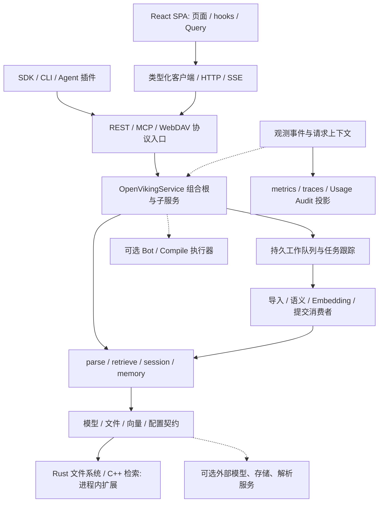

# OpenViking 前端与后端架构模式

> 日期：2026-10-02；源码基线：`df32bf6e50a40843438f9491a26069ca4bd08f1f`。本文延续 [1-模块关系.md](1-模块关系.md) 和 [2-技术栈.md](2-技术栈.md) 的源码分析，按运行架构、代码组织、数据一致性和局部设计模式说明。架构名称是对代码的归纳，具体实现与适用边界分别列出，不能把名称当作项目正式宣称的设计规范。

## 1. 总体结论

**主管理前端采用 React SPA、组件组合、功能目录内聚和 hooks 状态编排；核心后端可归纳为模块化单体、逻辑分层、可替换适配器和持久工作队列驱动的处理管线。** Rust 文件系统与 C++ 检索引擎以进程内原生扩展接入。模型、远端存储、Connector、Compile 和 VikingBot 可以跨进程或网络协作，但不是所有模块都独立部署成微服务。

| 层面 | 实际采用的模式 | 主要代码 |
| --- | --- | --- |
| 前端运行 | 浏览器 SPA / 客户端路由 / HTTP 契约连接 | `web-studio/src/main.tsx`、`routes` |
| 前端组织 | 按功能路由内聚、组件组合、自定义 hooks、Provider/Context | `routes/*/-components`、`-hooks`、`-lib`、共享 `hooks/lib/components` |
| 前端数据 | 服务状态缓存与 UI 状态分工、mutation 后失效、身份切换清缓存 | QueryClient、AppConnectionProvider、业务 hooks |
| 后端组织 | 模块化单体、协议/业务/领域算法/存储逻辑分层、组合根 | server、service、parse/retrieve/session、storage、service/core |
| 可替换实现 | Facade、Adapter、Proxy、Strategy、Factory/Registry、局部端口契约 | VikingFS、CollectionAdapter、模型/解析/认证/配置源接口 |
| 重型处理 | 管线编排、producer/consumer、持久工作记录、可恢复阶段与状态机 | QueueFS、TaskTracker、RNFV/ContextUpdatePlan、Session commit |
| 数据表示 | 正式内容与派生索引分离、L0/L1/L2、增量差异计划、重建/补偿 | 文件树、sidecar、向量 collection、resource_diff/plan |
| 原生组合 | 进程内 FFI、接口实现、包装层装饰、挂载路由 | pyagfs→PyO3→RAGFS；C API→C++；Stats/PathLock/FS |
| 横切能力 | middleware、请求上下文传播、旁路发布订阅、资源借用/退役 | ASGI/Queue middleware、contextvars、EventBus、config providers |
| 文档站 | 静态站点生成、Vue 主题扩展、浏览器渐进增强 | docs/.vitepress |



## 2. 前端运行和代码组织模式

### 2.1 SPA 与客户端路由

[main.tsx](../web-studio/src/main.tsx) 使用 `ReactDOM.createRoot` 挂载 `#app`，由 TanStack Router 渲染页面；[根路由](../web-studio/src/routes/__root.tsx) 把 AppShell、Outlet、Toaster 和开发辅助组件组合起来。Vite 根据文件路由生成 `routeTree.gen.ts`，支持自动代码拆分与 intent preload。

```text
静态 index.html / assets
 → createRoot + Provider
 → AppShell + Router Outlet
 → 功能页和 hooks
 → API 请求 / SSE
 → React 状态变化和重绘
```

生产时 [server/app.py](../openviking/server/app.py) 从包内或 `OPENVIKING_WEB_STUDIO_DIR` 托管 `/studio`；深链接没有真实文件时返回 index.html。前端也可连接另一个服务器地址，因此**逻辑前后端分离与默认同源部署并不矛盾**。这是客户端渲染的 Studio，不能依据 `next-themes` 或组件中的 `use client` 判定为 Next.js/动态 SSR。

### 2.2 功能目录内聚与组件组合

| 组织方式 | 实际表现 | 作用与边界 |
| --- | --- | --- |
| 按功能内聚 | retrieval/resources/users/tasks 等就近放 `-components/-hooks/-lib/-types` | 同一功能的交互、API 适配和数据转换容易定位；不是独立部署的微前端 |
| 跨页复用 | `src/lib/sessions`、共享 hooks、基础 UI 和连接管理 | 会话、身份、控件跨路由复用；依赖并非处处严格单向 |
| 组件组合 | 基础 UI 原语→业务组件→页面→AppShell | props 下传数据、callback 回传操作；组件也可以有查询/状态，未严格分成容器/展示两类 |
| 自定义 hooks | `viking-fm`、`use-retrieval-query`、`use-sessions`、`use-chat` | 复用查询、派生数据和操作；受 React 生命周期约束，不自动等同 MVVM 的 ViewModel |
| Provider 组合 | Theme/Query/Tooltip/Router，AppConnection，局部 ResourceUpload | 供给共享环境和动作；缺 Provider 时消费者可能报错，作用域应清楚 |

依据：[资源 hooks](../web-studio/src/routes/resources/-hooks/viking-fm.ts)、[检索 hook](../web-studio/src/routes/retrieval/-hooks/use-retrieval-query.ts)、[会话 hooks](../web-studio/src/lib/sessions/use-sessions.ts)、[AppShell](../web-studio/src/components/app-shell.tsx)。资源功能目录与访问路由不是简单一一对应，工作台也组合资源和会话能力，应以生成路由树为准。

### 2.3 服务状态与交互状态分工

[query-client.ts](../web-studio/src/lib/query-client.ts) 创建共享 QueryClient：默认 staleTime 为 10 秒，查询/变更默认不重试，窗口 focus 默认不重取。服务数据由 queryFn 获取，成功的 mutation 再失效相应 query；输入草稿、弹窗、选择和流式累积由 `useState/useRef/Context` 管理。

检索页区分输入值与已提交值，提交后才形成查询参数和 queryKey；页面不会必然每输入一个字符都发搜索。任务/仪表盘可以有局部轮询周期。这个分工减少组件自行维护多份服务数据，但失效范围、queryKey 和 freshness 仍由功能实现维护，不能认为缓存永远与后端实时一致。

### 2.4 身份切换：同步客户端、清缓存、重挂载

[use-app-connection.tsx](../web-studio/src/hooks/use-app-connection.tsx) 用服务地址、模式、账户、用户和凭据标识生成 `identityScopeKey`。连接提交先同步 imperative HTTP client，再 `queryClient.clear()` 和更新 React connection；AppShellInner 的 key 变化使子树重挂载。首页指标、部分标题缓存显式包含 scope；其他资源/检索/会话 Query 更多依赖切换清缓存。

```text
连接或身份变化
 → normalize / 客户端同步
 → 清 Query 缓存
 → 更新 Context
 → key 变化重挂载路由子树
 → 新身份请求与 UI 重置
```

这是一种客户端状态隔离措施，最终权限仍在服务端。不能说所有 queryKey 都天然带租户，也不能把凭据 hash 分区标识视为密码学保护。全清/重挂载会损失临时交互状态和跨身份缓存复用。

### 2.5 Adapter/Facade 与构建期契约生成

```text
组件/hook 输入
 → 手写功能 API / 参数转换
 → OpenAPI 生成 endpoint 和类型
 → 统一 Axios adapter / 拦截器
 → 服务错误信封
 → getOvResult + normalize
 → 视图模型与 Query 缓存
```

[HTTP client](../web-studio/src/lib/ov-client/client.ts) 集中连接、身份头、telemetry、错误处理；[资源 API](../web-studio/src/routes/resources/-lib/api.ts) 把 camelCase 选项转为服务字段，并归一化旧/宽松响应。[生成脚本](../web-studio/script/gen-server-client/gen-server-client.sh) 从 `/openapi.json` 整理 operationId 并生成客户端。

可归纳为类型化 Adapter/Facade，以及局部 DTO 防腐转换；生成代码不是运行时完整 JSON 校验。Studio 的生成客户端与独立 TypeScript SDK 是两条实现，SSE 也不走同一 Axios 调用链。

### 2.6 流式过程、按需加载与局部计算隔离

| 模式 | 实现 | 用处 / 边界 |
| --- | --- | --- |
| 流式协议适配 | `fetchSse` 包装 AsyncGenerator，事件解析后由 useChat 累积文本/工具/推理 parts | 传输与 UI 分离、AbortSignal 取消；聊天 POST 出错不自动重放 |
| 显式过程状态 | status/error、控制器、累积器与结束后消息合成 | 便于中止和保留部分内容；是代码中的过程状态，未使用通用状态机框架 |
| lazy/Suspense | 路由、文件预览、编辑器、图示与语言高亮按需加载 | 降低入口负担；首次使用有等待/加载失败可能 |
| 错误边界 | 根路由 errorComponent 和 retry/reload | 承接路由渲染错误；异步 Query 的错误仍需页面处理 |
| Web Worker | JSON 格式化 worker，postMessage 返回结果 | 局部移出主线程；不是通用后台业务服务 |
| PWA 外壳 | manifest + 手写 Service Worker | 安装/独立窗口；fetch no-op，无应用/API 离线缓存 |

依据：[sse.ts](../web-studio/src/lib/sse.ts)、[use-chat.ts](../web-studio/src/lib/sessions/use-chat.ts)、[json-format.worker.ts](../web-studio/src/routes/resources/-lib/json-format.worker.ts)、[Service Worker](../web-studio/public/service-worker.js)。

## 3. 文档站与其他交互入口

`docs` 使用 **Markdown 内容驱动的静态站点生成 + Vue 主题增强**。导航、首页目录、翻译页表、`llms.txt` 和本地搜索索引在构建期从内容派生；浏览器处理偏好、语言切换、复制、交互图示与外部 widget。

[OpenVikingSearch.vue](../docs/.vitepress/theme/OpenVikingSearch.vue) 可先访问远程搜索，失败时回落本地文本索引。该本地模式仍是文本匹配/加权，不能描述为离线向量语义检索。文档 widget 只有外部脚本加载器，不能据此确认其内部框架或给整个项目套上微前端架构。

Rust CLI/TUI、三语言 SDK、Node/Python 宿主插件和 demo 是独立交互入口，主要通过 HTTP/MCP 消费核心服务；它们不是 Studio 的页面模块。插件共享源码通过生成/打包复制，属于构建期复用，不是发布时必须访问 `examples` 源目录。

## 4. 后端整体组织：模块化单体与逻辑分层

### 4.1 为什么可归纳为模块化单体

主服务把 server、service、parse、retrieve、session、storage、config 和 models 组合在 Python 应用内。RAGFS 和本地检索是原生库，不需要分别启动文件系统/检索微服务。队列 worker 默认是同进程线程和事件循环，而不是每个模块一个独立远程服务。

| 逻辑层 | 职责 | 主要入口 |
| --- | --- | --- |
| 传输/协议 | HTTP/MCP/WebDAV 参数、鉴权、URI、响应/错误 | server/app、routers、mcp_endpoint |
| 业务编排 | 生命周期、资源/会话/文件操作、持久任务、外部服务委托 | service/core 和各子服务 |
| 领域算法 | 获取解析、内容组织、检索装配、记忆抽取/合并、策略训练 | parse/retrieve/session/memory/train |
| 存储与模型接口 | 逻辑文件、索引、队列、ACL、账户资源、模型能力 | VikingFS/VikingDBManager/QueueManager、providers |
| 基础设施实现 | Rust/C++、HTTP/SQL/对象存储、厂商 SDK | ragfs、native engine、backend adapters |

这是逻辑职责分层，**不是严格无环的 Clean Architecture**：storage 导入 server.identity/error_mapping，队列导入 service.task_work_index，session 也导入 server/service 共享定义，配置工厂与模型有双向关联。部分延迟 import、Protocol 和注入降低初始化耦合，但没有统一保证所有依赖只能向内。

### 4.2 组合根、显式注入与进程级登记

[OpenVikingService](../openviking/service/core.py) 先创建基础设施和子服务，再用构造参数/`set_dependencies` 接线，恢复队列工作后启动 workers；关闭时按所有权释放调度器、模型、队列、向量和文件底座。

REST 使用 FastAPI `Depends(get_request_context)`；服务对象由 [dependencies.py](../openviking/server/dependencies.py) 的进程级注册读取。多个模块还有 singleton/全局 registry。因此这里是**手动组合 + 框架请求依赖 + 局部 Service Locator**，不是全项目均由一个 IoC 容器管理。测试可以注入 fake storage/model，但全局登记和跨循环资源仍需生命周期管理。

### 4.3 多协议复用与可选远程协作

REST、MCP、WebDAV 入口复用服务、身份和文件/索引能力。SDK、CLI、插件共享数据契约，避免把业务算法复制到每个消费者中。Connector 负责特定外部来源导入，Compile/Bot 提供执行能力；这些是明确网络边界的可选协作者。

部分 server route 仍承担复杂边界编排，如技能替换锁/回滚和上下文装配。`search(mode=context)` 是面向 Agent 的服务端聚合，不意味着整个后端是浏览器专属 BFF；同一能力供多个客户端使用。

## 5. 后端局部设计模式

| 模式 | 成立证据 | 本项目用途 | 适用边界 |
| --- | --- | --- | --- |
| Facade 门面 | VikingFS 组合多个 mixin；VikingDBManager 包装统一向量后端 | 业务统一使用 URI、文件/检索操作和队列能力 | mixin 是代码拆分，不是独立服务；大门面仍有跨域复杂性 |
| Adapter 适配器 | CollectionAdapter、各模型 backend、AsyncAGFSClient | 把远端/SQL/本地/原生差异映射成稳定契约 | 同名能力仍需后端能力校验；不能保证全部后端 keywords/sparse 都可用 |
| Proxy 代理 | VikingDBManagerProxy 绑定 RequestContext | 每次调用携带账户和可见性上下文 | 不创建另一套数据库，也不能代替底层授权过滤 |
| Strategy 策略 | BaseParser/DataAccessor、VLM/Embedding/Rerank、AuthPlugin | 按内容来源、类型、provider/auth_mode 选择实现 | 普通参数分支也存在，不是每个选择都用类策略 |
| Factory/Registry | parser/accessor/provider/auth/source/adapter factory | 注册与创建扩展实现，按配置选择 | Accessor 是按优先级选择首个可处理实现，不是让每个实现依次处理输入 |
| 端口契约与局部依赖反转 | ConfigSource、FileSystem、TaskStore、ExternalTaskProvider、PolicyTraining interfaces | 对基础设施定义最小接口，便于替换与测试 | 只能称局部端口/适配器思想，全局仍有直接具体类型和反向 import |
| 包装/Decorator | Rust Stats/PathLock、backend encryption/cache/multiwrite；ASGI/Queue middleware | 横切统计、锁、加密、缓存、重试和任务归属 | 包装顺序影响锁/逻辑 bytes/统计语义；不同包装不构成全局事务 |
| schema 驱动与受限 Interpreter | YAML memory schema、动态模型、AST 输出协议 | 声明字段/合并算子，解析模型操作后再授权写入 | 模型生成内容不能任意执行 Python；字段/URI/模板必须校验 |
| Observer / Pub-Sub | ObservabilityEventBus、config update consumers | 一个事件/变更通知多个旁路消费者 | 观测事件进程内 best effort；持久任务系统另有 QueueFS |
| 生命周期借用/退役 | Account VLM/Embedding provider | 配置失效后撤下缓存资源，借用中的调用结束再关闭 | 需要跨循环与并发控制，不是简单删除全局 HTTP client |

源码入口：[Collection 工厂](../openviking/storage/vectordb_adapters/factory.py)、[配置源协议](../openviking/config/source/base.py)、[VLM resolver](../openviking/config/vlm.py)、[Embedding provider](../openviking/config/embedding.py)、[AST 输出协议](../openviking/session/memory/extraction_output_protocol/python_protocol.py)、[事件总线](../openviking/observability/events.py)。

## 6. 内容与索引：事实、差异与计划执行

### 6.1 正式内容和派生表示分离

```text
正式内容 / 消息 / 结构元数据
   ├── 语义处理 → L0 摘要 / L1 概览
   └── Embedding → 向量 + 可检索标量/全文字段
```

文件后端保存正文和 sidecar，向量后端保存检索表示。L0/L1/L2 是分层内容表示，**当前 HierarchicalRetriever 做全局召回再可选重排**，不能从名称推断逐层树搜索。目录摘要存在依赖关系，更新叶节点可能触发父目录新鲜度与汇总更新。

文件提交和派生索引完成有时间窗口，需要通过任务/wait、freshness、MD5、stable record ID、diff、reindex 和 consistency checks 管理。`index_consistency` 当前检查 URI+level 是否缺失；详细内容指纹由 resource_diff/resource_rfv 比较，不能混称一个检查器。

### 6.2 RNFV 快照与声明式增量更新计划

RNFV 分别表示请求意图 R、新产物 N、正式树 F、实际向量状态 V。[resource_diff.py](../openviking/storage/resource_diff.py) 比较事实，[context_update_plan.py](../openviking/storage/context_update_plan.py) 编译动作，再执行内容同步、SemanticPlan 和 DirectIndexAction。已有正式内容的维护使用 RFV，不虚构新的输入树。

```text
R/N/F/V 快照
 → 内容/类型/拓扑/指纹/索引差异
 → ContextUpdatePlan
     ├── 内容树动作：同步正式文件
     ├── 语义计划：需要刷新节点与依赖
     └── 直接索引动作：Embedding/字段更新/删除
 → 执行时按最新标量基值应用 tags/ACL 意图
```

这种模式减少无变化内容的重复解析/模型调用，使缺索引、过期语义与内容变更能分别处理。它是快照差异和计划编排，**不是 Event Sourcing**；历史队列/任务/JSONL 并非恢复全部领域状态的唯一事件日志。

## 7. 异步任务与可恢复工作流

### 7.1 持久队列、状态机与至少一次交付

QueueFS 保存 pending/processing 工作，消费完成后 ACK；TaskTracker 保存可查询状态，TaskWorkIndex 从队列重建工作归属和活跃计数。任务状态和工作消息是两种模型，完成某条消息不代表整个父任务的所有子工作均完成。

| 机制 | 解决的问题 | 边界/代价 |
| --- | --- | --- |
| 持久入队 + worker | 请求与模型/索引耗时分离，重启继续处理 | 接受后需查询任务；可见性可能延后 |
| 至少一次交付 | 未 ACK 工作可恢复 | 可能重复，需要稳定 ID、检查点、幂等/去重 |
| 分阶段标记与 checkpoint | 已完成步骤不必重新应用 | 写入顺序/失败标记需精确，不能只靠进程内状态 |
| 显式取消与后代跟踪 | 防止取消后继续产生子工作 | 阻塞写/外部调用需 settle，不能立即粗暴丢弃 |
| 重试/错误分类/熔断 | 临时模型或网络错误恢复 | 永久错误应终止；重试不是所有异常无条件循环 |
| exact/tree lease、handoff | 跨阶段移交文件锁与范围所有权 | 与本机进程锁、URI 协调器作用域不同 |
| 串行键/请求幂等键 | 防目标并发冲突、避免重复外部提交 | 幂等范围由 task/provider/request hash 定义 |

依据：[named_queue.py](../openviking/storage/queuefs/named_queue.py)、[task_work_index.py](../openviking/service/task_work_index.py)、[task_tracker.py](../openviking/service/task_tracker.py)、[external_task_service.py](../openviking/service/external_task_service.py)。这些机制不等于通用分布式工作流引擎，也不保证 exactly-once。

### 7.2 会话两阶段提交与恢复

[Session.commit_async](../openviking/session/session.py) 的两阶段是业务阶段划分：Phase 1 在锁下归档消息、写恢复意图、持久化提交消息，再发布 ready；Phase 2 由消费者恢复归档，执行工作记忆和长期记忆/技能处理，持久化已完成 step/message 标记，完成必需步骤后写 done，否则保留 failed 与任务状态。

当前消费者只处理当前归档；已有 `.failed.json` 会被当作终态失败，不自动补旧失败归档原文。Phase2 对关联索引的等待超时可记录错误后继续写 `.done`，该标记不能代表 index-ready。

它**不是数据库两阶段提交 2PC**，没有跨文件、向量库、外部模型的 prepare/commit 分布式事务。局部写入失败由恢复、重试、检查点和补偿处理；跨会话 StreamingMemoryUpdater 的缓冲注册表是进程内共享，不能称全部缓冲都持久化/分布式。

### 7.3 依赖 DAG、抽取循环和策略训练

语义目录处理使用自底向上的依赖调度：先文件/子目录摘要，再父目录汇总；minimal semantic plan 与 freshness 避免全树同步重复计算。记忆用 `ExtractLoop → ResolvedOperations → StreamingMemoryUpdater → MemoryUpdater`，将模型建议、操作解析、跨会话合并和优先回读后的字段写入分开。

`session.train` 通过 Case/Rollout/Analyzer/GradientEstimator/Optimizer/Updater 的接口组合文本策略管线，可更换执行器/评估器、采用批处理或流式合并。语义梯度是记忆文件 before/after 改动，训练更新经验/技能文本；不是神经网络权重优化。此处体现可组合管线与模板方法式编排，不需给整个系统贴 Agent 框架标签。

## 8. 原生底座、账户资源与横切模式

### 8.1 进程内 FFI 与包装层

```text
VikingFS → AsyncAGFSClient → PyO3 binding → Tokio RAGFS
                                      → Stats → PathLock → MountableFS → backend
Python LocalCollection/Index → CPython C API abi3 → C++ IndexEngine / KV
```

Rust `FileSystem` trait 统一 backend，MountableFS 按最长挂载前缀路由。加密在每个挂载后端注入，缓存和多写也在对应层组合；实际顺序以 [builder.rs](../crates/ragfs/src/core/builder.rs) 为准。C++ 提供 flat 与标量位图，持久 KV 是 LevelDB。两座原生桥不同，单独可选 GPU/SQL/远端向量实现仍由 adapter 选择。

### 8.2 账户上下文与配置资源生命周期

身份通过 RequestContext 传入服务/文件/向量/模型，账户映射物理根，owner/ACL/actor peer 决定可见范围。同一逻辑 URI 在不同账户不是同一数据；actor peer 是视图而非新租户身份。

Cluster 与 Account 配置是独立模型，ConfigSource 提供锁/CAS 意义的读改写，manager 负责构建/发布视图，业务 resolver 决定默认与组合。三态 PATCH 为“缺字段保持、null 删除该 scope 的值、具体值修改”，不等于无限制逐字段继承。更新通知使模型/向量资源失效并安全退役。

### 8.3 可观测性旁路

请求 ID、trace/telemetry 和任务上下文通过 middleware/contextvars 传播；metrics 和 Usage Audit 从事件或快照获取数据。EventBus 是进程内 best effort，Usage Audit 是 SQLite 查询投影。可描述为局部发布订阅与读模型投影，但不能据此称全系统是 CQRS/事件溯源。

## 9. 部署模式和架构标签边界

主服务可以从源码/包启动或以容器运行，默认同源托管 SPA；Bot 是可选子进程/远程执行器，Caddy/Ingress 是可选入口，模型与存储按配置远程连接。正式 Helm 目前强制单副本并采用 Recreate；该模板不能推断为共享本地数据目录的水平扩展方案。

| 标签 | 是否适合直接描述全项目 | 更准确的说法 |
| --- | --- | --- |
| MVC / MVVM | 不足以概括 | 前端组件/hooks/状态/API 分工；后端协议/业务/算法/存储分层 |
| 微前端 | 无统一独立子应用治理证据 | 功能路由内聚的单 SPA；docs 是独立静态站 |
| 微服务 | 不是默认核心组织 | 模块化单体 + 可选远程能力协作 |
| DDD / Clean / Hexagonal | 有局部契约思想，非严格全局实现 | 领域模块、端口/adapter、手动组合；共享类型与反向 import 仍存在 |
| CQRS | 有内容写入与检索/报表表示分离 | 派生索引和观测投影，不是完整命令/查询总线制度 |
| Event Sourcing | 不成立为整体事实来源 | 正式文件/记录、快照、任务和检查点共同管理状态 |
| 2PC | 会话两阶段不是该协议 | 可恢复业务阶段与最终索引同步 |
| Saga | 不宜直接认定全局框架 | 局部补偿/回滚、删除围栏、恢复和重试 |
| offline-first | Studio 不成立 | 可安装 PWA 外壳，仍依赖实时 API |

## 10. 各语言的职能

| 语言 / 格式 | 本项目主要职责 | 代表目录 |
| --- | --- | --- |
| Python | HTTP/MCP、业务编排、解析、检索、会话/记忆、模型接入、配置、观测、Bot、评估与 Python SDK | openviking、openviking_cli、bot、sdk/python、benchmark |
| Rust | RAGFS 文件/挂载/锁/队列/缓存/加密/快照、PyO3 绑定、原生 CLI/TUI | crates/ragfs、ragfs-python、ov_cli |
| C++ | 本地向量/稀疏召回、标量位图过滤、KV/BytesRow 与 CPython stable ABI 接口 | src |
| C | 主要是内嵌 CRoaring 等底层实现和 C ABI 契约 | third_party/croaring、cache provider header |
| TypeScript / TSX | React Studio、独立 TS SDK、宿主插件、WhatsApp 桥与部分文档主题工具 | web-studio、sdk/typescript、examples、bot/bridge、docs |
| JavaScript / MJS | Node MCP/共享插件 runtime、安装/同步/发布脚本、浏览器 SW 和 demo | agent-plugins、examples、npm、web-studio/public |
| Go | 独立 HTTP SDK；当前核心文件系统不是 Go 服务 | sdk/go |
| Vue SFC / HTML / CSS | 文档站主题与图示、SPA 入口/样式、独立 demo 展示 | docs/.vitepress、web-studio、bot/demo |
| Shell | 构建、安装、容器启动、部署与 benchmark 驱动 | scripts、deploy、Make/示例配套 |
| SQL / Lua / SCM | SQL 持久化/过滤；Redis 原子 queue/lock 脚本；Tree-sitter 标签查询规则 | Python/Rust 内嵌 SQL、ragfs cache scripts、parse AST queries |
| JSON / YAML / TOML / Markdown | 配置、schema、依赖/部署清单、内容、提示词、技能及教程 | 跨目录资源；这些是声明/数据格式，不是独立业务进程 |

## 11. 阅读与校核范围

本文复用同一基线的全量目录/导入/符号清点，再沿模式成立的位置核对控制流与存储行为。未把每个辅助分支/第三方测试逐字复述为架构结论。关键路径的阅读顺序是 `main/route/hook/client` 和 `app/router → service/core → processor/queue → FS/vector/model`；更细模块、技术、接口、数据关系、配置和测试分别见本教程其他文档。

交付校验覆盖源码链接、Markdown 表格与图块；未启动模型/数据库服务，也未改变生产逻辑。源码名称与旧注释存在差异时，以上模式按实际实现归纳。
