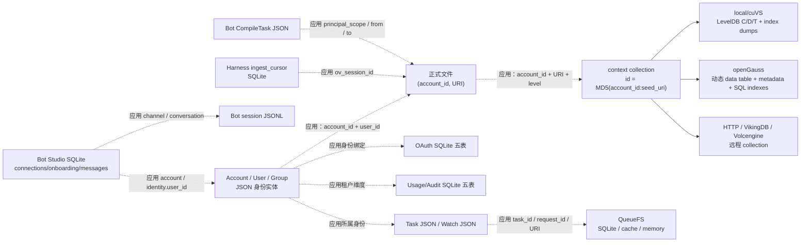
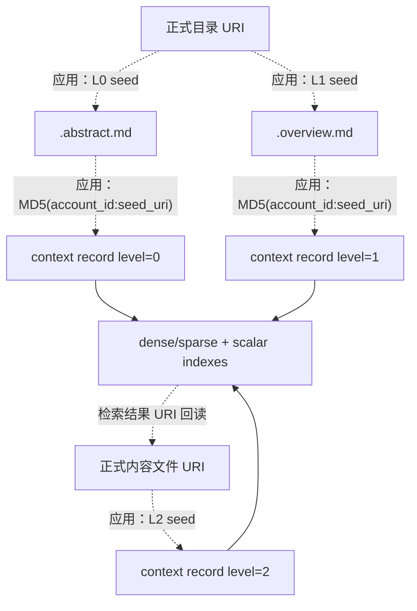
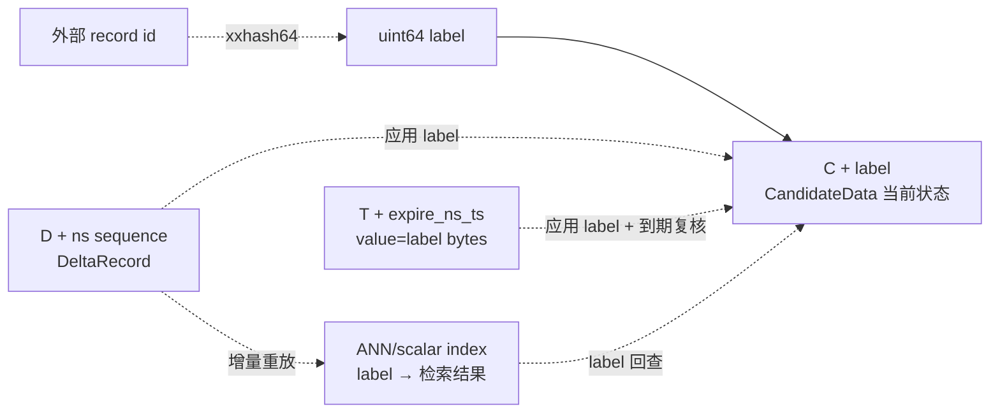
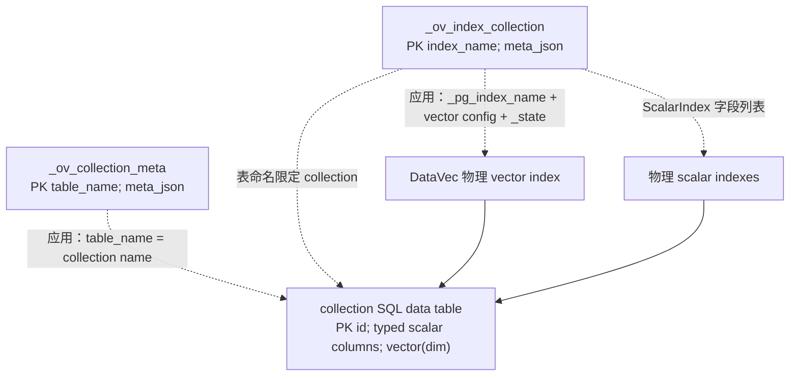
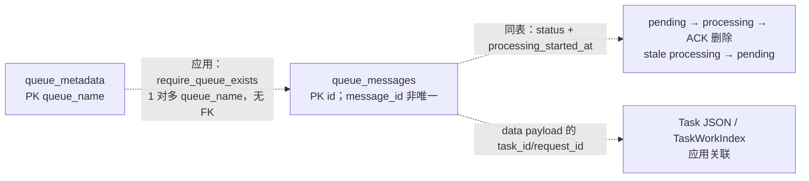
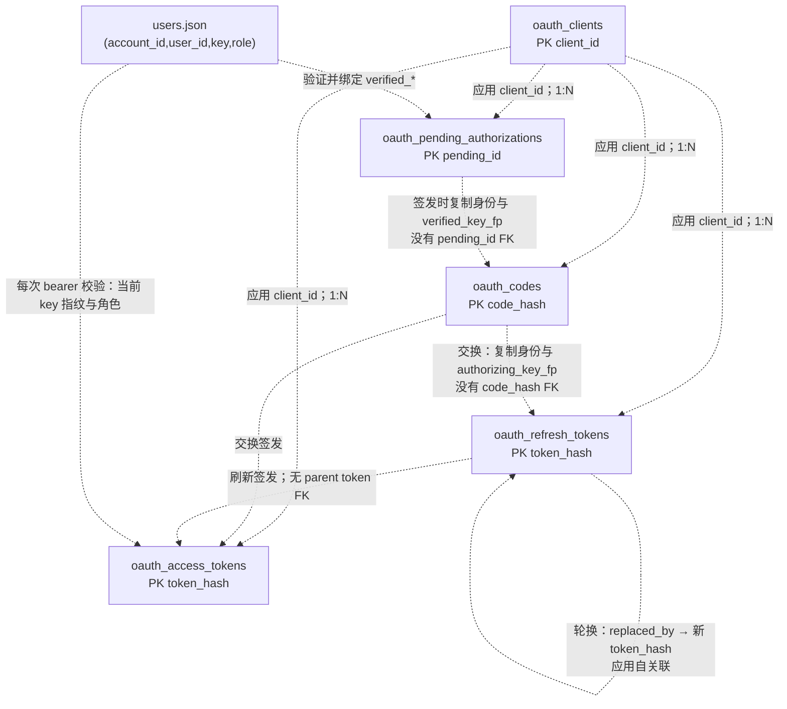
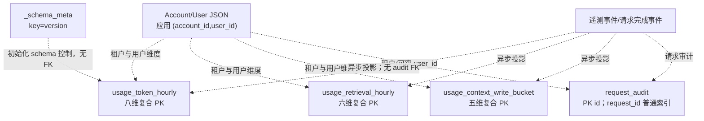
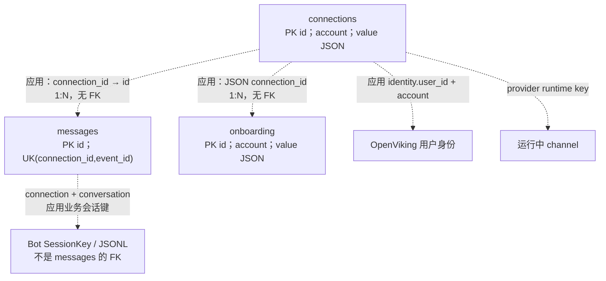
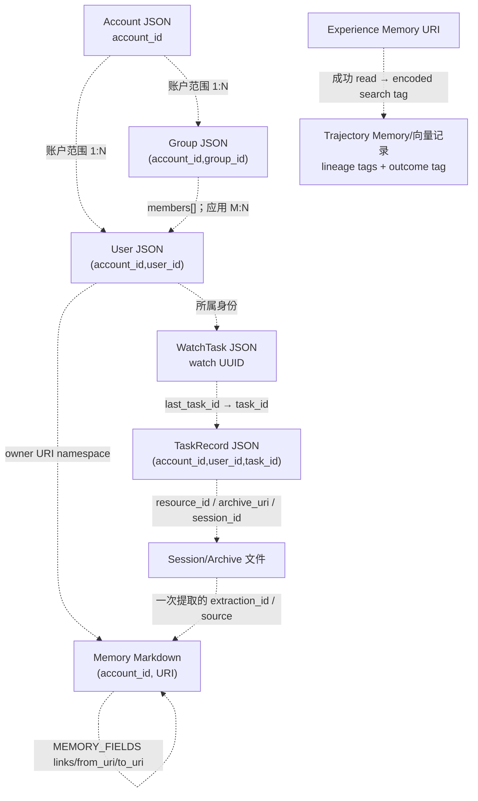

# 5. 表关系：从上下文主记录到各类持久化实体

> 分析日期：2026-10-02；源码基线：`df32bf6e50a40843438f9491a26069ca4bd08f1f`。本文按真实 DDL/逻辑实体区分字段与关联。

OpenViking 没有一套覆盖所有业务的关系型数据库，也没有统一 ORM。资源、记忆、技能和会话的正式内容首先是 VikingFS 文件；检索使用统一 context collection；本地向量后端把候选数据和增量日志放入 LevelDB；OAuth、用量审计、导入游标、SQLFS、QueueFS 和 VikingBot Studio 分别维护自己的 SQL schema。账户、用户、组、任务、Watch、Memory links 则主要是 JSON 或 Markdown 中的逻辑实体。

本文以当前工作区源码中的字段定义、DDL、迁移和写入代码为准。`PK` 表示数据库主键；`UK` 表示数据库唯一约束；“业务键”表示应用用于定位、去重或隔离的字段组合。**箭头标注“应用关联”时，数据库没有声明对应 FK。**启用 `PRAGMA foreign_keys=ON` 也不等于建了外键。本章所列生产 DDL 没有声明 `FOREIGN KEY`，因此不能把账户删除、URI 迁移、任务清理描述成数据库级联。

## 5.1 先分清存储类型与数据归属

| 数据域 | 实际形式 | 主记录或入口 | 持久化边界 |
|---|---|---|---|
| 资源、记忆、技能、会话内容 | VikingFS 文件、Markdown、JSON/JSONL、sidecar | `(account_id, canonical URI)` | RAGFS 挂载的 local/S3/SQLFS 等后端；没有统一 `resources`、`memories`、`sessions` SQL 表 |
| 检索上下文 | 向量 collection | `id`，由账户与 seed URI 确定 | local/cuVS、HTTP、VikingDB、Volcengine、openGauss 等适配器 |
| 本地向量候选/增量/TTL | LevelDB 前缀逻辑表 | `C`、`D`、`T` | 一个 collection 的 KV store；不是三张 SQL 表 |
| 本地 collection/index 元数据 | JSON 文件 | collection name、index name | `collection_meta.json`、`index_meta.json`；ANN/scalar index dump 是独立文件 |
| openGauss 向量后端 | 动态 SQL 数据表 + 两类元数据表 + 物理索引 | collection 数据表的 `id` | PostgreSQL/openGauss/DataVec 数据库；只在选择该后端时存在 |
| SQLFS | SQLite `files` | `path` | 每个 SQLFS 实例自己的连接；未配置路径时为 `:memory:` |
| QueueFS | SQLite、cache 或内存后端 | queue name、message ID | SQLite 两表，或 Redis/Valkey 风格 key 集合；三种是可选实现 |
| OAuth | SQLite 五表 | client/code/pending/token 标识 | 默认 workspace 下 `oauth.db` |
| Usage/Audit | SQLite 五表 | 聚合维度复合 PK、audit 自增 ID | 默认 `<workspace>/_system/usage_audit/usage_audit.sqlite3` |
| Harness ingest | SQLite 一表 | `(harness, native_session_id)` | 导入器 state dir 下 `state.db`；不与服务器业务表自动 JOIN |
| VikingBot Studio | SQLite 三表，JSON 值列 | connection/onboarding ID、message ID | `<bot_data_path>/studio.sqlite3`；前端 `web-studio` 本身不建业务数据库 |
| 主服务任务 / Bot Compile 任务 | 每任务 JSON 文件 | task ID + 所属身份范围 | 主服务 AGFS `_system/tasks`；Bot `compile_tasks/cmp_*.json`，二者不同 |
| 账户/用户/组/Watch/Memory links | JSON 或 Markdown 逻辑实体 | 账户局部用户/组 ID、Watch UUID、URI | 由业务服务、文件写入和锁维护关系，没有 SQL FK |

源码入口：[context schema](/Users/darcy/mwp/ala-platform-other/OpenViking/openviking/storage/collection_schemas.py:75)、[本地 collection 创建](/Users/darcy/mwp/ala-platform-other/OpenViking/openviking/storage/vectordb/collection/local_collection.py:198)、[SQLFS DDL](/Users/darcy/mwp/ala-platform-other/OpenViking/crates/ragfs/src/plugins/sqlfs/backend.rs:107)、[QueueFS DDL](/Users/darcy/mwp/ala-platform-other/OpenViking/crates/ragfs/src/plugins/queuefs/backend.rs:412)、[OAuth DDL](/Users/darcy/mwp/ala-platform-other/OpenViking/openviking/server/oauth/storage.py:37)、[usage 路径](/Users/darcy/mwp/ala-platform-other/OpenViking/openviking/observability/usage_audit/runtime.py:45)、[Bot Studio 路径](/Users/darcy/mwp/ala-platform-other/OpenViking/bot/vikingbot/studio/service.py:16)。

图中实线是后端实现归属，虚线是业务关联；这些存储通常分属不同文件或系统，不存在跨它们的统一数据库事务。

## 5.2 主记录：统一 context collection

### 5.2.1 字段与索引

`CollectionSchemas.context_collection(name, vector_dim)` 定义了一张逻辑上的统一检索记录集，不是每个资源类型一张表。以下是其**全部字段**。

| 字段 | schema 类型 / 默认值 | 意义与强关联字段组 |
|---|---|---|
| `id` | string，`IsPrimaryKey=True` | 逻辑主键；与 `account_id + seed_uri(uri, level)` 的确定性规则关联 |
| `uri` | path | 正式内容的规范 URI；是检索结果回读文件和 URI scope 过滤的关联点 |
| `type` | string | 保留字段；当前 schema 注释明确“未使用”，不宜当成可靠资源种类枚举 |
| `context_type` | string | `resource` / `memory` / `skill`，通常从 URI namespace 推导 |
| `vector` | vector，`Dim=vector_dim` | dense embedding；维度必须匹配 collection 与模型的向量空间 |
| `sparse_vector` | sparse_vector | sparse 词项权重；是否支持 sparse/hybrid 查询取决于适配器 |
| `created_at`、`updated_at` | date_time | 创建/更新时间；底层可能规范化为 epoch milliseconds |
| `active_count` | int64 | 上下文活跃统计 |
| `level` | int64 | `0=L0 abstract`、`1=L1 overview`、`2=L2 detail/content` |
| `name`、`description` | string | 名称/描述；技能等业务会填充 |
| `tags` | string | 展示/兼容标记字段 |
| `search_tags` | list\<string\> | 可索引、规范化的检索标签；也用于 Experience lineage 等精确过滤 |
| `abstract` | string | 检索摘要 |
| `content` | text | schema 中的全文字段；**不代表每个后端都会保存正文**，见下文 |
| `md5` | string，默认 `""` | 最终存储文件字节的内容指纹；空/缺失是未知，不能判为“内容相同” |
| `account_id` | string | 租户范围；与请求账户、文件路径和 owner 一起校验 |
| `owner_user_id` | string | 私有 namespace 的所有者；由 URI/身份规则推导 |
| `acl_mode` | string，默认 `none` | 物化 ACL 模式 |
| `acl_direct_grants`、`acl_inherited_grants` | list\<string\>，默认 `[]` | 直接授权和祖先继承授权的编码 token；与 `acl_mode` 作为同一权限快照维护 |

标量索引字段为：`uri, type, context_type, created_at, updated_at, active_count, level, name, tags, search_tags, account_id, owner_user_id, acl_mode, acl_direct_grants, acl_inherited_grants`。schema 还声明 `content` 的 FullText，standard tokenizer + symbol stop words filter。`description`、`abstract`、`md5` 不在这份默认 ScalarIndex 列表中；向量索引由 adapter 的默认 index 构建路径另外创建。

证据：[完整字段与 ScalarIndex/FullText](/Users/darcy/mwp/ala-platform-other/OpenViking/openviking/storage/collection_schemas.py:94)、[ACL 字段名](/Users/darcy/mwp/ala-platform-other/OpenViking/openviking/storage/acl.py:49)、[adapter collection/index 构建](/Users/darcy/mwp/ala-platform-other/OpenViking/openviking/storage/vectordb_adapters/base.py:160)。

ACL 模式为 `none/inherit/restricted`；grant token 的编码是 `<mask>:<principal>`，mask 为 read=1、write=3、manage=7，principal 为 `user:<id>`、`group:<id>` 或 `user:*`，不支持 `group:*`。组 ID 的解释必须带当前 account；这些字符串不是外键列。直接授权和继承授权物化到向量记录供过滤，与正式语义 sidecar 的权限元数据由 ACL 管理器协调。[编码与主体](/Users/darcy/mwp/ala-platform-other/OpenViking/openviking/storage/acl.py:171)。

`CollectionAdapter.USE_CONTENT_FIELD` 默认是 `False`，标准适配写入路径会丢弃 `content`；VikingDB 系列后端为服务端全文 grep 保存它。本地向量索引并不因此成为正式正文库。openGauss 更明确地不创建 `content` 物理列，对显式 `content` 投影返回 `NULL`。schema 宣告、直接调用底层 collection 的能力和主服务标准 adapter 的实际写入行为必须分开看。[正文能力开关](/Users/darcy/mwp/ala-platform-other/OpenViking/openviking/storage/vectordb_adapters/base.py:116)、[openGauss content 投影](/Users/darcy/mwp/ala-platform-other/OpenViking/openviking/storage/vectordb_adapters/opengauss/collection.py:352)。

### 5.2.2 PK、业务唯一性和同一记录内约束

| 约束组 | 实际规则 | 实现层次 |
|---|---|---|
| `account_id + uri + level → id` | `id = MD5(f"{account_id}:{seed_uri}")`；L0 seed 加 `/.abstract.md`，L1 加 `/.overview.md`，L2 用文件 URI | 应用确定性主键；没有独立的 SQL `UNIQUE(account_id,uri,level)` 声明 |
| `uri + level + seed_uri` | 区分同一目录的 L0/L1，以及真正 L2 文件；使用统一 helper，避免各写入点自行算 ID | 应用规则；`uri` 本身不能被理解为每账户只有一条向量记录 |
| `account_id + owner_user_id + URI namespace` | 租户/所有者应与身份和 URI 一致；查找与写入都需要 RequestContext | 应用权限与 namespace 校验，无账户/用户 FK |
| `acl_mode + acl_direct_grants + acl_inherited_grants` | 权限字段由 ACL 层物化；普通 upsert 会移除调用者传入的 ACL scalar，再重新物化 | 应用维护同一权限快照，非数据库 CHECK |
| `vector + vector_dim + provider/model/model_identity` | collection Description 中嵌入模型签名，比较 `provider/model/dimension/model_identity`；同维度并不自动代表同向量空间 | 初始化/重建兼容性检查，非数据库关系 |
| `uri + md5` | 指纹对应最终正式文件字节；旧记录缺少 md5 时回读文件确认 | 增量处理业务规则 |
| `tags + search_tags` | 展示标记和检索标记不是互为 SQL 外键；patch/merge/replace 在应用层执行 | field patch、tag normalization |

证据：[ID helper](/Users/darcy/mwp/ala-platform-other/OpenViking/openviking/storage/vector_ids.py:33)、[模型签名](/Users/darcy/mwp/ala-platform-other/OpenViking/openviking/storage/collection_schemas.py:198)、[ACL 物化 upsert](/Users/darcy/mwp/ala-platform-other/OpenViking/openviking/storage/viking_vector_index_backend.py:1327)、[Context 的 URI/owner 推导](/Users/darcy/mwp/ala-platform-other/OpenViking/openviking/core/context.py:95)。

`core.Context` 是领域对象，包含 `parent_uri/temp_uri/is_leaf/category/meta/related_uri/session_id/user/owner_space` 等运行时字段；这些不能照搬成 collection 的物理列。本章字段表只取 `collection_schemas.py` 的实际字段。[Context 序列化](/Users/darcy/mwp/ala-platform-other/OpenViking/openviking/core/context.py:152)。

### 5.2.3 与正式文件的关系

正式内容与向量派生状态通过账户、URI、层级、指纹和实际 record ID 协调。删除或移动目录需要分别维护文件、sidecar、向量和引用；向量更新常通过持久队列异步完成，不是文件写入和向量写入的一次 SQL commit。

## 5.3 本地向量后端：LevelDB 逻辑表与元数据文件

### 5.3.1 C/D/T 的键和值

`StoreEngineProxy` 用 `table_name + key` 作为原生 KV key。常量 `C/D/T` 只是前缀；非空 path 选 C++ `PersistStore`，其实际调用 `leveldb::DB::Open`，空 path 选内存 `VolatileStore`。不能根据 `clean_stale_rocksdb_locks` 这个函数名把当前引擎写成 RocksDB。[前缀与引擎选择](/Users/darcy/mwp/ala-platform-other/OpenViking/openviking/storage/vectordb/store/local_store.py:15)、[C/D/T 常量](/Users/darcy/mwp/ala-platform-other/OpenViking/openviking/storage/vectordb/utils/constants.py:13)、[C++ LevelDB 打开](/Users/darcy/mwp/ala-platform-other/OpenViking/src/store/persist_store.cpp:12)。

| 逻辑表 | 实际 KV key | value 字段 | “主键”、关联和用途 |
|---|---|---|---|
| 候选 `C` | `"C" + str(label)` | `CandidateData(label, vector, sparse_raw_terms, sparse_values, fields, expire_ns_ts)` | label 定位当前完整候选；`fields` 是 scalar JSON 字符串，含外部业务 ID 等字段；ANN/scalar index 结果用 label 回查 |
| 增量 `D` | `"D" + str(base_time_ns + i)` | `DeltaRecord(type, label, vector, sparse_raw_terms, sparse_values, fields, old_fields)` | KV key 是增量时间序号；`type=0 UPSERT / 1 DELETE`；label 应用关联到 C，old/new fields 用于更新 scalar index 和恢复重放 |
| TTL `T` | `"T" + str(expire_ns_ts)` | `str(label).encode("utf-8")` | 按过期时间范围扫描，再由 value 的 label 查 C；复核候选自己的 expire timestamp 后删除 C、记录 DELETE delta 并清 T |

`TTLData(label)` 在 `data.py` 中也有声明，但当前 `StoreManager.add_cands_data` 的 T 值是 label UTF-8 字节，不能把它写成正在序列化存储的 TTLData 行。C 和 D 使用自有二进制 row 编码，不是 SQL 列；字段的 schema 定义仍由 collection meta 解释。[Candidate/Delta/TTLData 定义](/Users/darcy/mwp/ala-platform-other/OpenViking/openviking/storage/vectordb/store/data.py:11)、[真实 C/D/T 写入](/Users/darcy/mwp/ala-platform-other/OpenViking/openviking/storage/vectordb/store/store_manager.py:83)、[TTL 清理](/Users/darcy/mwp/ala-platform-other/OpenViking/openviking/storage/vectordb/store/store_manager.py:279)。

外部字符串 ID 通过 `xxhash.xxh64(...).intdigest()` 转为内部 uint64 label。label 是 C、D、ANN 与 scalar index 的共同关联键；**这是 hash 映射，不是数据库 FK，也不是字符串 ID 的无碰撞唯一性证明**。dense vector 与 sparse 的 `raw_terms/values` 属于同一候选，词项和值应逐项对应；`fields/old_fields/type` 则属于同一增量事件，不能拆成独立最终状态表。[label helper](/Users/darcy/mwp/ala-platform-other/OpenViking/openviking/storage/vectordb/utils/str_to_uint64.py:6)。

当前 T key 只包含到期时间，不含 label。`add_cands_data` 为同一批候选设置相同 `expire_ns` 后，以相同 key 写 T；因此不能虚构 `(expire_ns_ts,label)` 复合 PK，也不能假定每个候选都有独立 TTL entry。按这份布局，同 expiry 的 KV put 存在覆盖可能，实际 TTL 覆盖能力应结合调用批次和运行数据确认。[同批 expiry/key 构造](/Users/darcy/mwp/ala-platform-other/OpenViking/openviking/storage/vectordb/store/store_manager.py:102)。

### 5.3.2 原子写入范围与元数据

C、D、T 的一组操作经 `exec_sequence_batch_op` 合成一次原生 batch；C++ 使用 `leveldb::WriteBatch`，`WriteOptions.sync=true`。这是该 KV 批次的原子写入/同步持久化边界，**不是**覆盖文件内容、所有 index dump 和业务 JSON 的统一事务。[StoreManager 批操作](/Users/darcy/mwp/ala-platform-other/OpenViking/openviking/storage/vectordb/store/store_manager.py:126)、[原生批执行](/Users/darcy/mwp/ala-platform-other/OpenViking/src/store/persist_store.cpp:154)。

| 元数据实体 | 字段或内容 | 与其他实体的强关联 |
|---|---|---|
| `collection_meta.json` | 用户 schema 的 `CollectionName/Description/Fields/FullText` 等；内部补 `HasPrimaryKey, FieldsCount, FieldsDict, Dimension, PrimaryKey, VectorKey, SparseVectorKey`；Fields 里补 FieldID | collection 的字段解释、主键、dense/sparse key；无显式 PK 时补 `AUTO_ID` int64。统一 context 已声明 `id`，不需要 AUTO_ID |
| `index_meta.json` | index 用户配置；内部 `CollectionName`、转换后的 ScalarIndex；VectorIndex 中 `IndexType/Dimension/Distance/NormalizeVector/Quant/EnableSparse/SearchWithSparseLogitAlpha` 等 | `CollectionName + index name` 定位某 collection 的 index；Dimension 从 collection 来，字段名须在 FieldsDict 中存在 |
| index version dump + `.write_done` | ANN/scalar 引擎自有持久格式及完成标记 | version 与 delta 重放位置用于恢复；完成标记避免把未完整写出的 dump 当成可恢复版本 |

这些元数据由 `PersistentDict → FileStore` 存为 JSON，采用临时文件、fsync 和 replace；不是 LevelDB 的第四张 SQL/逻辑表。本地 metadata path 分别在 collection/index 目录下。cosine 在本地索引元数据中转成 normalized vector + IP distance，这是配置字段组的联合含义。[collection 内部 meta](/Users/darcy/mwp/ala-platform-other/OpenViking/openviking/storage/vectordb/meta/collection_meta.py:53)、[index 内部 meta](/Users/darcy/mwp/ala-platform-other/OpenViking/openviking/storage/vectordb/meta/index_meta.py:63)、[JSON 持久字典](/Users/darcy/mwp/ala-platform-other/OpenViking/openviking/storage/vectordb/meta/local_dict.py:85)、[文件原子写](/Users/darcy/mwp/ala-platform-other/OpenViking/openviking/storage/vectordb/store/file_store.py:83)、[index meta 路径](/Users/darcy/mwp/ala-platform-other/OpenViking/openviking/storage/vectordb/collection/local_collection.py:1353)、[dump 完成标记](/Users/darcy/mwp/ala-platform-other/OpenViking/openviking/storage/vectordb/index/local_index.py:1498)。

## 5.4 openGauss：真实动态 SQL 表、目录表与物理索引

这个 adapter 一 collection 一数据表，另有全局 collection meta 表和每 collection 的 index meta 表。它们不是全项目共用的 `contexts`、`resources` 表；数据表名来自已验证的 collection name，派生 SQL 标识符超长时会截断并附 hash。[命名规则](/Users/darcy/mwp/ala-platform-other/OpenViking/openviking/storage/vectordb_adapters/opengauss/sql.py:132)。

| SQL 表 | 全部固定字段 / 动态字段 | PK、UK、FK与索引 |
|---|---|---|
| `<collection_name>` | 固定 `id VARCHAR(256)`；由 schema 生成其他 scalar 列；有 dense schema 且 dim>0 时加 `vector vector(dim)` | PK=`id`；无额外 UK/FK；按 index 配置建 DataVec vector index 和 scalar indexes |
| `_ov_collection_meta` | `table_name VARCHAR(256)`, `meta_json TEXT NOT NULL` | PK=`table_name`；无 FK；value 存完整 collection schema/description，table_name 应用关联物理数据表名 |
| `_ov_index_<collection_name>`，必要时使用 bounded 派生名 | `index_name VARCHAR(256)`, `meta_json TEXT NOT NULL` | PK=`index_name`；无 FK；该表名限定所属 collection，meta 指向物理 index 名和配置 |

数据表的物理列映射如下。`DefaultValue`、`IsPrimaryKey` 等 collection 元信息并未被 `_field_to_column_ddl` 转成每列的 NOT NULL/DEFAULT/CHECK；数据表除固定 `id` PK 外，不应宣称所有业务字段在 DDL 层必填。

| collection 类型 | SQL 类型 |
|---|---|
| string / path / text | TEXT |
| int64 / date_time | BIGINT；date_time 写入规范化成 epoch ms |
| int32 | INTEGER |
| float / float32 | DOUBLE PRECISION |
| bool | BOOLEAN |
| list\<string\> / list\<int64\> | TEXT[] / BIGINT[] |
| sparse_vector | JSONB |
| vector | 单独生成 vector(dim) |

当前代码显式跳过 `content`，所以 context schema 的其余字段才映射为该表物理列；metadata 中仍可能列有 content。sparse_vector 可以存成 JSONB，但 `search_by_vector` 对 sparse/hybrid 查询显式报不支持；`upsert_data(..., ttl=...)` 的当前 SQL 写入逻辑没有 TTL 列/到期表，不能把本地 C/D/T 到期规则套给 openGauss。[实际数据表 DDL](/Users/darcy/mwp/ala-platform-other/OpenViking/openviking/storage/vectordb_adapters/opengauss/catalog.py:277)、[全局 meta DDL](/Users/darcy/mwp/ala-platform-other/OpenViking/openviking/storage/vectordb_adapters/opengauss/catalog.py:336)、[index meta DDL](/Users/darcy/mwp/ala-platform-other/OpenViking/openviking/storage/vectordb_adapters/opengauss/collection.py:223)、[类型映射](/Users/darcy/mwp/ala-platform-other/OpenViking/openviking/storage/vectordb_adapters/opengauss/sql.py:73)、[字段 DDL 生成](/Users/darcy/mwp/ala-platform-other/OpenViking/openviking/storage/vectordb_adapters/opengauss/sql.py:339)、[sparse 查询边界](/Users/darcy/mwp/ala-platform-other/OpenViking/openviking/storage/vectordb_adapters/opengauss/collection.py:1069)、[SQL upsert](/Users/darcy/mwp/ala-platform-other/OpenViking/openviking/storage/vectordb_adapters/opengauss/collection.py:1314)。

物理 vector index 名、IndexType、distance/operator class、量化/build/search 参数是同一索引契约；metadata 的 `_state=pending` 表示已请求但等待数据训练/物化，不等于物理索引已经存在。启动时读取 metadata 并与 catalog 校对。ScalarIndex 按字段生成普通 `CREATE INDEX`，名字由 collection/index/field 派生；这些是查询索引，不是 UK。部分 metadata 与 scalar index 写入在同一个数据库 commit 内完成，vector index 的创建/删除/重建还有自己的步骤；只能描述源码明确的局部事务，不能说三个表和 ANN 生命周期总在一个原子事务中。[索引规范化](/Users/darcy/mwp/ala-platform-other/OpenViking/openviking/storage/vectordb_adapters/opengauss/collection.py:494)、[scalar index 建立与 metadata 事务](/Users/darcy/mwp/ala-platform-other/OpenViking/openviking/storage/vectordb_adapters/opengauss/collection.py:645)、[pending/index reconcile](/Users/darcy/mwp/ala-platform-other/OpenViking/openviking/storage/vectordb_adapters/opengauss/collection.py:850)。

index metadata JSON 的规范化字段还包括 `IndexName/build_params/search_params/parallel_workers/maintenance_work_mem_mb/_pg_index_name/_pg_index_type/_logical_index_type/_quantization/_operator_class/_distance/VectorIndex`，ScalarIndex 从请求配置沿用，pending 时追加 `_state`。它们都在 `meta_json` 中，不是 index meta 表各自的 SQL 列。数据 upsert 的 batch 在一个 commit 内，提交之后才尝试 materialize pending ANN；索引物化失败时日志明确说明数据已提交，这是数据与索引生命周期不同的具体例子。[规范化字段](/Users/darcy/mwp/ala-platform-other/OpenViking/openviking/storage/vectordb_adapters/opengauss/collection.py:493)、[提交后物化](/Users/darcy/mwp/ala-platform-other/OpenViking/openviking/storage/vectordb_adapters/opengauss/collection.py:1433)。

distributed 模式的数据表按 `id` 分布，metadata 按环境能力变成 reference table 或按 `table_name/index_name` hash 分布。这里仍没有账户 FK；租户隔离依赖 collection/backend 选择及账户过滤，不会因物理分片而自动获得权限约束。[分布式数据表](/Users/darcy/mwp/ala-platform-other/OpenViking/openviking/storage/vectordb_adapters/opengauss/catalog.py:288)、[分布式 metadata](/Users/darcy/mwp/ala-platform-other/OpenViking/openviking/storage/vectordb_adapters/opengauss/catalog.py:339)。

## 5.5 Rust SQLFS 与 QueueFS 的 SQLite 表

### 5.5.1 SQLFS 主表 `files`

| 字段 | DDL | 业务含义/同表约束组 |
|---|---|---|
| `path` | TEXT PRIMARY KEY | SQLFS 挂载内部规范路径，目录/文件共同占用路径空间 |
| `is_dir` | INTEGER NOT NULL | `1` 表示目录；没有 DDL CHECK 限定为 0/1 |
| `mode` | INTEGER NOT NULL | 文件权限位 |
| `size` | INTEGER NOT NULL | 文件字节长度；与 data 一同更新 |
| `mod_time` | INTEGER NOT NULL | UTC epoch seconds；与 data/size 一同更新 |
| `data` | BLOB，可空 | 文件字节；目录通常空；读取 NULL 按空字节处理 |

PK=`path`，无 UK/FK。`idx_parent` 的实际定义是 `ON files(path)`，**表中没有 parent 字段**；父子关系由 path 计算和 LIKE/目录层级查询维护。插件检查父目录存在且为目录、文件/目录类型和大小；5 MiB 上限是应用常量，不是数据库 CHECK。`path + is_dir + data/size/mode/mod_time` 是文件状态字段组。[DDL 与根目录初始化](/Users/darcy/mwp/ala-platform-other/OpenViking/crates/ragfs/src/plugins/sqlfs/backend.rs:107)、[大小上限](/Users/darcy/mwp/ala-platform-other/OpenViking/crates/ragfs/src/plugins/sqlfs/backend.rs:11)、[父目录校验](/Users/darcy/mwp/ala-platform-other/OpenViking/crates/ragfs/src/plugins/sqlfs/mod.rs:149)。

条件写/删用 `WHERE path=? AND is_dir=0 AND data=expected` 的单条 SQL 实现 compare-and-update/delete；data 更新同时设置 size 和 mod_time。数据库以 Mutex 串行共享连接，WAL + synchronous NORMAL；可文件持久化或 `:memory:`。若 VikingFS 选择 SQLFS 存储，其业务 account/URI 是映射进 `path` 的应用身份，不是 files 表中独立 account/user FK。[条件 SQL](/Users/darcy/mwp/ala-platform-other/OpenViking/crates/ragfs/src/plugins/sqlfs/backend.rs:273)。

### 5.5.2 QueueFS 主表 `queue_metadata` 与明细表 `queue_messages`

| 表 | 全部字段及 DDL | PK/UK/FK/index |
|---|---|---|
| `queue_metadata` | `queue_name TEXT PRIMARY KEY`; `created_at INTEGER DEFAULT strftime('%s','now')`; `last_updated INTEGER DEFAULT strftime('%s','now')` | PK=queue_name；无 UK/FK；队列存在性目录，空队列也保留 |
| `queue_messages` | `id INTEGER PRIMARY KEY AUTOINCREMENT`; `queue_name TEXT NOT NULL`; `message_id TEXT NOT NULL`; `data TEXT NOT NULL`; `timestamp INTEGER NOT NULL`; `status TEXT NOT NULL DEFAULT 'pending'`; `processing_started_at INTEGER`; `created_at INTEGER DEFAULT strftime('%s','now')` | PK=id；无 UK/FK；`idx_queue_status(queue_name,status,id)`、`idx_queue_message_id(queue_name,message_id)` 均为普通索引 |

迁移给旧消息表添加 `status/processing_started_at` 和两个索引，并从现有消息的非空 queue_name 回填 queue_metadata。没有 `UNIQUE(queue_name,message_id)`；message UUID 是应用标识，SQLite row `id` 才是 FIFO 排序/领取的主键。data 存序列化的 `StoredMessage{id,data,timestamp}`，其 data 是字节数组，兼容旧 string；外层 `message_id/timestamp` 与内层值应指向同一消息，内层 RFC3339 纳秒时间保留精度，外层 timestamp 是秒。[建表](/Users/darcy/mwp/ala-platform-other/OpenViking/crates/ragfs/src/plugins/queuefs/backend.rs:412)、[迁移](/Users/darcy/mwp/ala-platform-other/OpenViking/crates/ragfs/src/plugins/queuefs/backend.rs:454)、[StoredMessage](/Users/darcy/mwp/ala-platform-other/OpenViking/crates/ragfs/src/plugins/queuefs/backend.rs:50)。

dequeue 在局部 SQLite transaction 内选最小 pending id，再更新成 processing 并设置 processing_started_at；ACK 删除对应 processing 消息。超时/重启恢复将 stale processing 变回 pending，所以是至少一次交付。`queue_name + status + id` 是领取字段组，`queue_name + message_id` 是 ACK 定位字段组，`status + processing_started_at` 是恢复字段组；status 没有 SQL CHECK。业务 task_id 在 payload 中，不是 queue_messages 外键。删除队列由代码显式删消息和 metadata，不是 `ON DELETE CASCADE`。[enqueue/dequeue](/Users/darcy/mwp/ala-platform-other/OpenViking/crates/ragfs/src/plugins/queuefs/backend.rs:642)、[stale 恢复](/Users/darcy/mwp/ala-platform-other/OpenViking/crates/ragfs/src/plugins/queuefs/backend.rs:495)、[显式队列删除](/Users/darcy/mwp/ala-platform-other/OpenViking/crates/ragfs/src/plugins/queuefs/backend.rs:573)。

`TaskWorkIndex` 是对持久 queue 工作的**内存索引**：启动从所有未 ACK 消息重建，之后由 enqueue/ACK hook 更新；它不另外持久化任务计数表。消息 payload 中的 `task_id/_task_work_id` 与 account/user 是重建关联，不是 SQLite 的额外列。[索引持久边界](/Users/darcy/mwp/ala-platform-other/OpenViking/openviking/service/task_work_index.py:3)、[恢复入口](/Users/darcy/mwp/ala-platform-other/OpenViking/openviking/storage/queuefs/queue_manager.py:172)。

### 5.5.3 QueueFS cache key 不是数据库表

设 `P={key_prefix}:ov:queue:`，其中 `{key_prefix}` 的花括号是 Redis hash tag。cache 后端使用以下实体：

| key | 类型/值 | 强业务关联 |
|---|---|---|
| `Pnames` | set，queue names | 队列存在性集合 |
| `P<queue>:meta` | hash，created_at、last_updated | 与 names 中的 queue 对应 |
| `P<queue>:pending` | list，message IDs | FIFO 待领取列表 |
| `P<queue>:processing` | sorted set，member=`message_id\|instance_id`，score=领取时间 | 未 ACK 消息及领取者；通过实例存活状态恢复 |
| `P<queue>:msg:<message_id>` | string，StoredMessage JSON | pending/processing 中 ID 对应 payload |
| `Pinstance:<instance_id>:alive` | 心跳 key，TTL=30s，每 10s 刷新 | 判断领取实例是否还存活；无存活 key 的 processing 消息重新放入 pending |

enqueue/dequeue/ACK/recovery 通过注册的 Redis Lua 风格脚本把相关 key 操作组合；这不表示有 SQL FK 或 SQL transaction。cache 方案是否持久化由 Redis/Valkey 服务的实际配置决定；内存 QueueFS 更没有进程重启后的持久记录。不能把“cache queue”和“SQLite queue”同时画成必写的两份任务表。[key 名](/Users/darcy/mwp/ala-platform-other/OpenViking/crates/ragfs/src/plugins/queuefs/cache_protocol.rs:159)、[Lua 与心跳常量](/Users/darcy/mwp/ala-platform-other/OpenViking/crates/ragfs/src/plugins/queuefs/cache_protocol.rs:5)、[cache 后端初始化](/Users/darcy/mwp/ala-platform-other/OpenViking/crates/ragfs/src/plugins/queuefs/cache_backend.rs:88)。

## 5.6 OAuth：五张 SQLite 表与 API Key 派生凭据

默认路径为 `<workspace>/oauth.db`，可配置文件名。使用单共享 SQLite connection、async lock、WAL、synchronous NORMAL、statement autocommit；初始化开启 foreign_keys 但以下 DDL **没有任何 FK**。文件开头的“three tables”注释是历史描述，当前 schema 有五张表。[路径配置](/Users/darcy/mwp/ala-platform-other/OpenViking/openviking_cli/utils/config/oauth_config.py:63)、[初始化](/Users/darcy/mwp/ala-platform-other/OpenViking/openviking/server/oauth/storage.py:147)。

### 5.6.1 `oauth_clients`：OAuth 客户端主表

| 字段 | DDL | 含义 |
|---|---|---|
| `client_id` | TEXT PRIMARY KEY | DCR 客户端标识 |
| `client_secret_hash` | TEXT，可空 | client secret 的 SHA256 hash；public client 可不设 |
| `redirect_uris` | TEXT NOT NULL | JSON array；注册要求非空 |
| `token_endpoint_auth_method` | TEXT NOT NULL DEFAULT `none` | token endpoint 的客户端认证方式 |
| `grant_types` | TEXT NOT NULL DEFAULT `["authorization_code","refresh_token"]` | JSON array |
| `response_types` | TEXT NOT NULL DEFAULT `["code"]` | JSON array |
| `client_name`、`scope` | TEXT，可空 | 展示名、允许 scope |
| `created_at` | INTEGER NOT NULL | epoch seconds |

PK=client_id，无额外 UK/index/FK。`client_id + redirect_uris + auth_method + grant/response types + scope` 是客户端授权契约；JSON 内容和 URI 合法性由应用验证，不是 SQL JSON CHECK。[DDL](/Users/darcy/mwp/ala-platform-other/OpenViking/openviking/server/oauth/storage.py:38)、[注册校验与 hash](/Users/darcy/mwp/ala-platform-other/OpenViking/openviking/server/oauth/storage.py:194)。

### 5.6.2 `oauth_pending_authorizations`：跨设备授权请求

| 字段 | DDL | 含义 |
|---|---|---|
| `pending_id` | TEXT PRIMARY KEY | 尚未完成的授权请求 |
| `client_id`、`redirect_uri` | TEXT NOT NULL | 所属客户端、回调地址 |
| `redirect_uri_provided_explicitly` | INTEGER NOT NULL | 是否显式提供回调地址 |
| `code_challenge` | TEXT NOT NULL | PKCE challenge |
| `scopes`、`resource`、`state` | TEXT，可空 | 授权范围、目标资源、客户端状态 |
| `display_code` | TEXT NOT NULL DEFAULT `""` | 人工输入的跨设备短码；不是主键 |
| `verified` | INTEGER NOT NULL DEFAULT 0 | 验证状态 |
| `verified_account_id`、`verified_user_id`、`verified_role`、`verified_key_fp` | TEXT，可空 | 验证成功绑定的身份、角色、授权 API Key 存储值指纹 |
| `expires_at`、`created_at` | INTEGER NOT NULL | 到期与创建时间 |

PK=pending_id；普通索引 `idx_oauth_pending_expires(expires_at)`、`idx_oauth_pending_display(display_code)`。**display_code 不是 SQL UK**。`verified` 必须和 verified 身份四字段作为一个授权快照理解；`client_id/redirect_uri/code_challenge/scopes/resource/state` 是同一请求的授权上下文。[DDL](/Users/darcy/mwp/ala-platform-other/OpenViking/openviking/server/oauth/storage.py:94)、[身份绑定更新](/Users/darcy/mwp/ala-platform-other/OpenViking/openviking/server/oauth/storage.py:709)。

### 5.6.3 `oauth_codes`：一次性 authorization code

| 字段 | DDL | 含义 |
|---|---|---|
| `code_hash` | TEXT PRIMARY KEY | code 原文的 SHA256，不存 code 原文 |
| `kind` | TEXT NOT NULL CHECK IN (`otp`,`code`) | 保留旧 OTP 行兼容；当前只写 code |
| `client_id`、`redirect_uri`、`code_challenge`、`code_challenge_method` | TEXT，可空 | code 绑定客户端、回调地址和 PKCE |
| `scope`、`resource` | TEXT，可空 | 授权 scope/resource |
| `account_id`、`user_id`、`role` | TEXT NOT NULL | 验证后的身份快照 |
| `authorizing_key_fp` | TEXT，可空 | 对授权 API Key 的绑定；NULL 只为兼容旧行 |
| `expires_at`、`created_at` | INTEGER NOT NULL | 到期/创建时间 |
| `used` | INTEGER NOT NULL DEFAULT 0 | 单次消费状态 |

PK=code_hash；普通索引 `idx_oauth_codes_expires(expires_at)`、`idx_oauth_codes_user(account_id,user_id)`。`kind` 是本域明确的 DDL CHECK，used 没有布尔 CHECK。消费用单条 `UPDATE ... WHERE used=0 AND expires_at>now RETURNING ...`，避免两个消费者都成功；这项原子性是单条语句，不应扩展成所有派生 token 一次总事务。[DDL](/Users/darcy/mwp/ala-platform-other/OpenViking/openviking/server/oauth/storage.py:50)、[code 消费](/Users/darcy/mwp/ala-platform-other/OpenViking/openviking/server/oauth/storage.py:355)。

### 5.6.4 `oauth_refresh_tokens`：轮换 refresh token

| 字段 | DDL | 含义 |
|---|---|---|
| `token_hash` | TEXT PRIMARY KEY | refresh token 原文 SHA256 |
| `client_id`、`account_id`、`user_id`、`role` | TEXT NOT NULL | 客户端与身份快照 |
| `scope`、`resource`、`authorizing_key_fp` | TEXT，可空 | 授权契约与 key 指纹 |
| `expires_at`、`created_at` | INTEGER NOT NULL | 到期/创建时间 |
| `consumed` | INTEGER NOT NULL DEFAULT 0 | 单次轮换/撤销状态 |
| `replaced_by` | TEXT，可空 | 替代 refresh token 的 hash；应用自关联，非 FK |

PK=token_hash；普通索引 `idx_oauth_refresh_expires(expires_at)`、`idx_oauth_refresh_user(account_id,user_id)`。`consumed + replaced_by` 是轮换字段组；consume 写 `consumed=1,replaced_by=hash(new_token)` 并带未消费/未过期条件。replaced_by 不保存 token 原文、不保证数据库外键存在，也没有唯一索引约束。[DDL](/Users/darcy/mwp/ala-platform-other/OpenViking/openviking/server/oauth/storage.py:77)、[refresh 消费](/Users/darcy/mwp/ala-platform-other/OpenViking/openviking/server/oauth/storage.py:443)。

### 5.6.5 `oauth_access_tokens`：opaque access token

| 字段 | DDL | 含义 |
|---|---|---|
| `token_hash` | TEXT PRIMARY KEY | opaque access token 原文 SHA256 |
| `client_id`、`account_id`、`user_id`、`role` | TEXT NOT NULL | 客户端与身份快照 |
| `scope`、`resource`、`authorizing_key_fp` | TEXT，可空 | 授权契约与 key 指纹 |
| `expires_at`、`created_at` | INTEGER NOT NULL | 到期/创建时间 |
| `revoked` | INTEGER NOT NULL DEFAULT 0 | 显式撤销状态 |

PK=token_hash；普通索引 `idx_oauth_access_expires(expires_at)`、`idx_oauth_access_user(account_id,user_id)`。`token_hash + revoked + expires_at` 决定存储层是否可加载；`account_id/user_id/role/authorizing_key_fp` 决定后续身份校验是否通过。[DDL](/Users/darcy/mwp/ala-platform-other/OpenViking/openviking/server/oauth/storage.py:117)。

跨表最强业务键是 `client_id` 和 `(account_id,user_id)`；派生授权链的关键是 `verified_key_fp → authorizing_key_fp` 的复制与回验。**实际指纹是 `SHA256(users.json 中 key 的存储表示)`**：关闭 hash 时是明文 key，开启 hash 时是 Argon2id 字符串，不能一概写成“原始 API Key 的 SHA256”。账户/用户缺失、当前/记录指纹缺失或不匹配、已发生角色降级，都使 bearer 校验失败。role 是快照，不是“永远有效”的角色授权。[真实 fingerprint](/Users/darcy/mwp/ala-platform-other/OpenViking/openviking/server/api_keys/legacy.py:1213)、[bearer 回验与角色降级防护](/Users/darcy/mwp/ala-platform-other/OpenViking/openviking/server/auth/plugins/api_key.py:130)。

迁移用 PRAGMA table_info 后按需补：clients.scope、codes.authorizing_key_fp、pending.verified_key_fp、refresh.authorizing_key_fp、access.authorizing_key_fp。token/code hash 和 client_secret_hash 用 `hash_secret`；短 display_code 单独生成，二者不是同一种身份键。expires 索引用于过期清理，按用户撤销由代码更新/删除相关行，没有 cascade。[迁移列表](/Users/darcy/mwp/ala-platform-other/OpenViking/openviking/server/oauth/storage.py:164)、[hash_secret](/Users/darcy/mwp/ala-platform-other/OpenViking/openviking/server/oauth/otp.py:28)、[按身份撤销](/Users/darcy/mwp/ala-platform-other/OpenViking/openviking/server/oauth/storage.py:571)。

## 5.7 Usage/Audit：聚合表、请求审计与 schema 版本

当前 `SCHEMA_VERSION=5`。这些表保存遥测事件投影与请求审计，不是资源内容主表；date_utc/hour_utc/created_at 以 UTC 保存，用户时区只在查询时转换。[完整 schema](/Users/darcy/mwp/ala-platform-other/OpenViking/openviking/observability/usage_audit/schema.py:14)。

| 表 | 全部字段 | PK/UK/FK/index |
|---|---|---|
| `_schema_meta` | `key TEXT PRIMARY KEY`, `value TEXT NOT NULL` | PK=key，当前 key=`version` 保存版本字符串；无 FK |
| `usage_token_hourly` | `account_id TEXT NN`, `user_id TEXT NN`, `date_utc TEXT NN`, `hour_utc INTEGER NN`, `source TEXT NN`, `token_type TEXT NN`, `provider TEXT NN`, `model_name TEXT NN`, `token_count INTEGER NN DEFAULT 0`, `updated_at TEXT NN` | PK=`(account_id,user_id,date_utc,hour_utc,source,token_type,provider,model_name)`；index=`idx_usage_token_account_date(account_id,date_utc,hour_utc)`；无 FK |
| `usage_retrieval_hourly` | `account_id TEXT NN`, `user_id TEXT NN`, `date_utc TEXT NN`, `hour_utc INTEGER NN`, `operation TEXT NN`, `status TEXT NN`, `request_count INTEGER NN DEFAULT 0`, `result_count INTEGER NN DEFAULT 0`, `updated_at TEXT NN` | PK=`(account_id,user_id,date_utc,hour_utc,operation,status)`；index=`idx_usage_retrieval_account_date(account_id,date_utc,hour_utc)`；无 FK |
| `usage_context_write_bucket` | `account_id TEXT NN`, `user_id TEXT NN`, `date_utc TEXT NN`, `hour_utc INTEGER NN`, `operation TEXT NN`, `count INTEGER NN DEFAULT 0`, `updated_at TEXT NN` | PK=`(account_id,user_id,date_utc,hour_utc,operation)`；index=`idx_usage_context_write_account_date(account_id,date_utc,hour_utc)`；无 FK |
| `request_audit` | `id INTEGER PRIMARY KEY AUTOINCREMENT`, `request_id TEXT`, `account_id TEXT NN`, `user_id TEXT`, `method TEXT NN`, `route TEXT NN`, `api_type TEXT NN`, `status_code INTEGER NN`, `duration_ms REAL NN`, `error_code TEXT`, `error_message TEXT`, `error_details TEXT`, `created_at TEXT NN` | PK=id；request_id 非 UK；四个普通索引如下；无 FK |

`NN` 表示 NOT NULL。request_audit 的索引是 `idx_request_audit_account_created(account_id,created_at DESC,id DESC)`、`idx_request_audit_request_id(request_id)`、`idx_request_audit_account_api(account_id,api_type)`、`idx_request_audit_account_status(account_id,status_code)`。所有计数/状态/时间的业务取值校验不能被描述成这里没有声明的 CHECK。

同表强业务组：token 表的八维 PK 决定一个小时内哪类 token 可以累加；retrieval 表的身份/小时/operation/status 决定请求数和结果数的聚合桶；write 表的身份/小时/operation 决定写入计数桶；audit 表的 request_id、route/method/api_type、status/error、duration/created_at 描述一次请求。三类 usage bucket 并没有 audit_id 或 request_id，因此不能宣称能从每个聚合行还原全部原始请求。

表关系以共同身份维度和时间桶为主，不是传统主明细 FK。request_id 可用于关联日志、遥测和 task meta，但此处不唯一。审计错误详情可能包含业务上下文，是敏感数据处理和留存范围；不能只把 token hash 当成唯一敏感存储。

v4→v5 是明确的增量迁移：在局部 BEGIN/COMMIT 中补 request_audit 的三个 error TEXT 列，保留 v4 usage 数据；早于 v4 的不兼容本地 schema 使用 reset/drop 路径，版本高于当前支持值或未实现的新过渡失败退出。`usage_token_daily/usage_retrieval_daily` 只出现在旧版 reset 列表，**不是当前在用新表**。usage/audit 有独立保留策略；按 account/user 删除先 drain 已接受事件，再在局部 SQLite transaction 中删四张业务表，避免待处理事件立即补回。不能把这种显式应用清理写成 FK cascade。[迁移与版本处理](/Users/darcy/mwp/ala-platform-other/OpenViking/openviking/observability/usage_audit/sqlite_store.py:86)、[显式身份清理](/Users/darcy/mwp/ala-platform-other/OpenViking/openviking/observability/usage_audit/sqlite_store.py:137)、[flush 后删除](/Users/darcy/mwp/ala-platform-other/OpenViking/openviking/observability/usage_audit/runtime.py:39)。

## 5.8 ingest_cursor：外部会话到 OpenViking 会话的检查点

这是 Harness ingest 的本地 SQLite `state.db`，只有一张业务表。它用 `(harness,native_session_id)` 标识来源会话；SQL 表**没有 account_id/user_id**，隔离依赖 state dir、导入器配置及请求身份，不能给它虚构跨租户复合 PK。[DDL 与路径](/Users/darcy/mwp/ala-platform-other/OpenViking/openviking/ingest/cursor_store.py:32)。

| 字段组 | 全部实际字段及 DDL | 联合含义 |
|---|---|---|
| 来源身份 | `harness TEXT NOT NULL`, `native_session_id TEXT NOT NULL` | 复合 PK；harness 区分 Claude Code/Codex/OpenClaw 等来源 |
| 目标/定位 | `ov_session_id TEXT`, `locator TEXT`, `title TEXT` | ov_session_id 应用关联服务端 session；locator 是来源定位，不是 FK |
| 已确认游标 | `cursor_kind TEXT NOT NULL`, `cursor_value TEXT NOT NULL` | cursor kind 决定 value JSON 的解释方式 |
| 待协调批次 | `pend_cursor TEXT`, `pend_count INTEGER NOT NULL DEFAULT 0`, `pend_baseline INTEGER NOT NULL DEFAULT 0` | append 前记录 intent；崩溃后按待提交游标/批次大小/基线判断恢复，不宜只改其中一列 |
| 提交状态 | `last_appended_count INTEGER NOT NULL DEFAULT 0`, `pending_tokens INTEGER NOT NULL DEFAULT 0`, `needs_commit INTEGER NOT NULL DEFAULT 0`, `last_committed_at TEXT`, `updated_at TEXT` | 已追加量、累积 token、是否还需 commit、最后 commit/更新时刻 |

无额外 UK/FK/显式 index，复合 PK 支持按来源会话定位；迁移只补 `needs_commit/pend_cursor/pend_count/pend_baseline`。`ov_session_id` 不是 SQL session 表 FK；一个新的 native session ID 即使同名，也要带 harness 才能找对游标。`set_pending` 在 append 之前 durable 写 intent，确认后的推进由应用步骤维护；不要描述成 append 到服务器和更新 state.db 的跨系统事务。[迁移](/Users/darcy/mwp/ala-platform-other/OpenViking/openviking/ingest/cursor_store.py:94)、[pending intent](/Users/darcy/mwp/ala-platform-other/OpenViking/openviking/ingest/cursor_store.py:183)。

## 5.9 VikingBot Studio 的三张 SQL 表

`bot/vikingbot/studio/store.py` 创建的是 Bot 后端管理即时通信连接的数据库，不是 web-studio 浏览器的数据库。数据库文件显式创建并 chmod 为 `0600`；这反映其中 JSON value 可以持有 provider 凭据和身份配置。[初始化 DDL/权限](/Users/darcy/mwp/ala-platform-other/OpenViking/bot/vikingbot/studio/store.py:9)。

| 表 | 全部 SQL 字段 | PK/UK/FK/index |
|---|---|---|
| `connections` | `id TEXT PRIMARY KEY`, `account TEXT NOT NULL`, `value TEXT NOT NULL` | PK=id；无其他 UK/FK/显式 index |
| `onboarding` | `id TEXT PRIMARY KEY`, `account TEXT NOT NULL`, `value TEXT NOT NULL` | PK=id；无其他 UK/FK/显式 index |
| `messages` | `id INTEGER PRIMARY KEY AUTOINCREMENT`, `connection_id TEXT NOT NULL`, `conversation TEXT NOT NULL`, `event_id TEXT NOT NULL`, `value TEXT NOT NULL` | PK=id；**UK=(connection_id,event_id)**；无 FK/额外显式 index |

connections.value 是完整 JSON record：`id/account/type`、provider 准备的凭据字段、`identity/settings/enabled/revision`；不是这些 JSON 字段各自一列。`id/account` SQL 列应与 JSON 内值一致。provider runtime key 的全局重复检查由 service 完成；revision 比较避免旧页面覆写新配置；都不是 DDL UK/CHECK。更换凭据若带新 identity，user_id 必须与原 Bot 用户相同。[连接创建/重复检查](/Users/darcy/mwp/ala-platform-other/OpenViking/bot/vikingbot/studio/service.py:55)、[revision 与凭据身份约束](/Users/darcy/mwp/ala-platform-other/OpenViking/bot/vikingbot/studio/service.py:81)。

onboarding.value 存 provider 安装/验证任务 record，`connection_id` 若存在位于 JSON 内。messages.value 存平台消息/交付历史的 JSON（role/content/sender/time/title 等由消息生产者填充）；connection+conversation 是历史/会话列表范围，connection+event_id 是真正 SQL 幂等键，append 用 INSERT OR IGNORE。`conversation` 没有参与 UK，所以同 connection 的同 event_id 不能仅靠换 conversation 重复入库。[append/历史查询](/Users/darcy/mwp/ala-platform-other/OpenViking/bot/vikingbot/studio/store.py:53)、[onboarding 保存](/Users/darcy/mwp/ala-platform-other/OpenViking/bot/vikingbot/studio/store.py:138)。

删除连接时 `with self.db` 内显式删 messages、匹配 JSON connection_id 的 onboarding 和 connections；是代码维护的局部事务，不是数据库 cascade。onboarding 正在运行时 service 会阻止删除。SQL 表的 account 关联与主服务账户是应用协议，两套数据库不共享 FK。[显式删除](/Users/darcy/mwp/ala-platform-other/OpenViking/bot/vikingbot/studio/store.py:42)、[运行任务删除保护](/Users/darcy/mwp/ala-platform-other/OpenViking/bot/vikingbot/studio/service.py:88)。

## 5.10 JSON 与 Markdown：账户、用户、组、任务、Watch、Memory

本节中的“主键”均是**逻辑业务键**，没有 SQL PK/UK/FK；它们需要与前面的 SQL/collection 身份字段一起理解。

### 5.10.1 账户、用户和组

| 逻辑实体 | 文件与 JSON 形状 | 主业务键/字段 | 关联与强业务规则 |
|---|---|---|---|
| Account | `/local/_system/accounts.json` → `accounts[account_id]` | account_id；`created_at`，可选 `deletion` | 一个账户含用户与组；deletion 标记关联清理 task 并阻止继续使用 |
| User | `/local/<account_id>/_system/users.json` → `users[user_id]` | `(account_id,user_id)`；`role/key`，hash 开启时 `key_prefix`，可选 `deletion` | user_id 只在账户范围定位；role 只能 user/admin，ROOT 来自服务端 root key；key/role/prefix 是同一身份配置 |
| Group | `/local/<account_id>/_system/groups.json` → `groups[group_id]` | `(account_id,group_id)`；`members:[user_id,...]` | group→users 是账户局部多对多关系；members 去重，增加成员验证账户内用户，删非空组失败 |
| 内存 key 索引 | `UserKeyEntry(account_id,user_id,role,key_or_hash,is_hashed)`；prefix→entries | key_prefix 是候选检索前缀，不是唯一主键 | 同一前缀可有多条候选，最终仍校验实际 key/hash；不是 API key SQL table |

新用户 key 可以随机生成或 seed 派生；关闭 hashing 保存明文，开启 hashing 保存 Argon2id 并带原 key 的 prefix。不能声称 users.json 总是只存 hash。组成员删除、最后管理员保护、账户删除状态、key rotation 等由 APIKeyManager 维护；账户/用户创建涉及多个 JSON 文件并有补偿路径，不能称为数据库原子提交。[路径常量](/Users/darcy/mwp/ala-platform-other/OpenViking/openviking/server/api_keys/legacy.py:44)、[账户/用户存储字段](/Users/darcy/mwp/ala-platform-other/OpenViking/openviking/server/api_keys/legacy.py:480)、[组写入/校验](/Users/darcy/mwp/ala-platform-other/OpenViking/openviking/server/api_keys/legacy.py:1148)、[Role 限制](/Users/darcy/mwp/ala-platform-other/OpenViking/openviking/server/api_keys/models.py:12)、[内存 models](/Users/darcy/mwp/ala-platform-other/OpenViking/openviking/server/api_keys/models.py:24)。

账户运行配置、用户 settings/memory policy 是另外的配置文档，不等于 users.json 的 SQL 列。内置 FileConfigSource 用 `/local/<account_id>/_system/setting.json` 保存账户配置，使用 `setting.backup.json` 保存旧字节；Cluster runtime 配置另在 `/local/_system/runtime_config/cluster.json`，不是 accounts.json 的子记录。用户配置 URI 为规范 user root 下 `settings/user_config.json`（有 backup）；模型服务 credential、账户 embedding/vector 配置含敏感字段且有创建时固定的向量空间契约。文件加密跟随实际 AGFS mount 配置，不能默认所有 JSON 都已经加密。[账户/Cluster 配置文件](/Users/darcy/mwp/ala-platform-other/OpenViking/openviking/config/source/file_source.py:37)、[用户配置路径](/Users/darcy/mwp/ala-platform-other/OpenViking/openviking/server/user_config.py:33)、[embedding 不可变契约](/Users/darcy/mwp/ala-platform-other/OpenViking/openviking/config/account_vector.py:30)。

### 5.10.2 主服务 Task 与 Watch

| 实体 | 持久字段与位置 | 业务关联 |
|---|---|---|
| `TaskRecord` | `/local/<account_id>/_system/tasks/<user_id>/<task_id>.json`；`task_id/task_type/status/created_at/updated_at/processing_seconds/resource_id/account_id/user_id/meta/stage/result/error/execution_events/auth`，兼容保留未知 extra 字段 | `(account_id,user_id,task_id)` 为存储范围；resource_id 的语义随 task_type 变化，可能是 session/resource 等；queue payload/TaskWorkIndex 用 task_id 关联工作 |
| 系统任务 | system task account 使用专用 `_system` 路径规则 | 不应把系统任务伪装成普通账户用户的任务 |
| `WatchTask` | 每账户逻辑 `viking://resources/.watch_tasks.json`，另有 bak/tmp；`task_id/path/source_type/to_uri/to_is_directory/parent_uri/reason/instruction/watch_interval/build_index/summarize/processing_mode/processor_kwargs/auth_state/connector_states/created_at/last_execution_time/last_task_id/last_status/last_error/next_execution_time/is_active/account_id/user_id/original_role` | Watch UUID 和普通 ingestion task ID 不同；last_task_id 指向最近执行的 ingestion Task；account/user/role 绑定执行身份，path/source/to 决定重新导入目标 |

Task 的 `status/stage/updated_at/result/error/processing_seconds` 是同一执行状态字段组；`auth` 是恢复工作的私有执行身份，不能按公有列表字段对待。Watch 的 `watch_interval/last_execution_time/next_execution_time/is_active` 是调度组；`path/source_type/to_uri/to_is_directory/parent_uri/processor_kwargs` 是同一次资源导入契约；`last_task_id/last_status/last_error` 是执行结果组。普通查询看见任务 ID 不代表有权限读其他账户的任务。

TaskStore 不是有 revision/CAS 的数据库：源码明确由 TaskTracker 串行维护 per-task 变更，存储内部写入使用 `auto_pathlock=False`。这项单 owner 更新约定不能扩展成“多个独立进程修改同一任务文件仍由数据库事务保证一致”。公有 TaskRecord.to_dict 也不会返回私有 auth，并过滤部分 submission 元数据。[存储更新边界](/Users/darcy/mwp/ala-platform-other/OpenViking/openviking/service/task_store.py:222)、[任务公开序列化](/Users/darcy/mwp/ala-platform-other/OpenViking/openviking/service/task_tracker.py:97)。

WatchManager 的内存目标索引是 `(account_id,to_uri) → set(task_id)`；Native watch 要独占目标根，因为刷新会替换整个根；Connector watches 以相对路径写入，可以在相同目标共存。故 `to_uri` 既不是全局唯一键，也不是简单 `(account_id,to_uri)` UK；排他规则取决于 auth_state 的 provider 和已有任务种类。[目标索引](/Users/darcy/mwp/ala-platform-other/OpenViking/openviking/resource/watch_manager.py:199)、[互斥判断](/Users/darcy/mwp/ala-platform-other/OpenViking/openviking/resource/watch_manager.py:413)。

Watch 的公有 `to_dict` 隐去 auth_state/connector_states，持久 `to_storage_dict` 才写入这些私有状态；git/Feishu connector 状态和凭据因此必须按敏感文件处理，不能据 public API 字段断言持久文件无 secret。[Task 领域字段](/Users/darcy/mwp/ala-platform-other/OpenViking/openviking/service/task_tracker.py:75)、[Task 路径/序列化](/Users/darcy/mwp/ala-platform-other/OpenViking/openviking/service/task_store.py:240)、[Watch 字段与公私序列化](/Users/darcy/mwp/ala-platform-other/OpenViking/openviking/resource/watch_manager.py:56)、[Watch 文件名](/Users/darcy/mwp/ala-platform-other/OpenViking/openviking/resource/watch_storage.py:9)。

### 5.10.3 Memory 文件、links/backlinks 与来源 lineage

Memory 是 Markdown 正文加末尾 `<!-- MEMORY_FIELDS ...JSON... -->`；动态 memory schema 定义字段/merge strategy，不自动创建 SQL table。逻辑 MemoryFile 包含 `uri/content/links/backlinks/memory_type/extra_fields`，持久 metadata 包括动态字段与 system fields/version；`_uri/user_id/user_ids` 不作为正常持久 metadata 写入。URI 与账号/owner namespace 才是稳定身份。[MemoryFile](/Users/darcy/mwp/ala-platform-other/OpenViking/openviking/session/memory/dataclass.py:289)、[Markdown trailer 序列化](/Users/darcy/mwp/ala-platform-other/OpenViking/openviking/session/memory/utils/memory_file_utils.py:78)。

| 逻辑关系实体 | 字段与键 | 约束/关联 |
|---|---|---|
| `WikiLink` | 临时 `f/t` page ID；`link_type/weight/match_text/description` | LLM 输出；page ID 只在一次 extraction/compile 的 page map 中解析，非数据库持久 PK；忽略/拒绝空、未知、自链接 |
| `StoredLink` | `from_uri/to_uri/link_type/weight/match_text/description/created_at` | 持久 URI 关系；from/to 应用关联 Memory 文件；没有 SQL FK |
| links merge | 去重 key=`from_uri\|to_uri\|match_text` | 相同 key 取最大 weight；link_type/description 最新写胜出；保留原 created_at；**不是** `(from,to,link_type)` SQL UK |
| links / backlinks | 分别位于 MemoryFile metadata | 双向视图由应用维护，引用迁移/删除需要业务修复；不存在数据库自动反向边或 cascade |
| `MemoryOperationSource` | `extraction_id/session_id/archive_uri/task_id/trace_id/extracted_at` | extraction_id 标识一次归档/commit extraction，不是整个 session；用于流式批次来源范围和 provenance |
| Experience→Trajectory lineage | experience URI 编码形成 `search_tags` 中的 `<escaped URI>=1`，另有 `trajectory_outcome=...` | 通过 tag 精确查询/聚合；URI/tag/outcome 联合关联，没有独立 lineage SQL 表 |

WikiLink 在模型层把 label 规范成有限形状的 snake_case，weight 规范到 [0,1]；解析时优先同 memory namespace 的 URI pair。一次 resolve 的完整去重 tuple 和持久 merge 的去重 key 不是同一个规则，不能混写。Experience URI 校验限定当前用户 `viking://user/<user_id>/memories/experiences/...`，排除摘要/关系 sidecar；只有会话中成功 read 的 Experience 才进入 consumed lineage。outcome 规范为 success/failure/partial/unknown/unfinished。[Link 定义](/Users/darcy/mwp/ala-platform-other/OpenViking/openviking/session/memory/dataclass.py:56)、[resolve 校验与 pair](/Users/darcy/mwp/ala-platform-other/OpenViking/openviking/session/memory/utils/link_resolver.py:11)、[merge 去重](/Users/darcy/mwp/ala-platform-other/OpenViking/openviking/session/memory/merge_op/link_merge.py:15)、[provenance](/Users/darcy/mwp/ala-platform-other/OpenViking/openviking/session/memory/dataclass.py:157)、[lineage URI/tag/成功 read](/Users/darcy/mwp/ala-platform-other/OpenViking/openviking/session/memory/experience_lineage.py:32)。

Trajectory 还写 `source_archive_uri` 来源字段，并为每个产出的 trajectory URI 生成 consumed Experience tags + outcome tag；这个来源 URI 与 extraction/session/task provenance 一起提供可追溯关联，仍不构成 SQL FK。[Trajectory 来源与检索 tags](/Users/darcy/mwp/ala-platform-other/OpenViking/openviking/session/train/components/trajectory_analyzer.py:435)。

`.relations.json` 是保留的关系 sidecar 名，当前访问层明确排除其向量派生；不应仅凭文件名推断存在通用 SQL relations 表，或把所有 Memory links 都说成写在这里。当前 StoredLink 的明确落点是 MEMORY_FIELDS。[无向量派生 sidecar](/Users/darcy/mwp/ala-platform-other/OpenViking/openviking/storage/viking_fs/_access.py:87)。

## 5.11 Bot Compile、source 清单与 Bot 会话文件

Bot Compile 任务不在 Studio SQLite 的 onboarding 表中，也不在主服务 TaskRecord JSON 里；它有自己的 `CompileTaskStore`，落在 `<bot_data_path>/compile_tasks/<cmp_task_id>.json`。ID 必须以 `cmp_` 开头且无 `/`、`\`，创建拒绝已有文件；以进程内 per-task asyncio lock + 临时文件 replace 更新。[store](/Users/darcy/mwp/ala-platform-other/OpenViking/bot/vikingbot/compile/store.py:21)。

| 文件/逻辑实体 | 字段 | 关联/同实体强约束 |
|---|---|---|
| `CompileTask` JSON | `task_id/principal_scope/sanitized_request/status/stage/created_at/updated_at/meta/result/error` | principal_scope 与 sanitized_request 限定调用身份和 from/to/skill；status 是 accepted/running/committing/cancelling/completed/failed/cancelled |
| `CompileResult` | `from/to/skill/okf_version/created/updated/unchanged/page_count/link_count/warnings` | from 是 source roots，to 是写入目标；结果 URI 按创建/更新/不变分组 |
| source catalog（运行时） | `source_id=src_<index>/directory_uri/overview/file_count/total_bytes/entries/catalog_truncated`；entry 有 name/title/uri/is_dir/size/summary | source_id 仅在该 Compile 任务中定位来源，不是全局 source SQL PK |
| `compile_resources/_manifest.tsv` | `source_id/uri/workspace_path/size/status` | 连接正式源 URI 与 sandbox 物化路径；status=materialized 或 skipped:binary/download-error；文件在 `compile_resources/<source_id>/...` |
| `__compile_staging__/tmp/readlist.md` | 已读来源路径的跟踪记录 | 任务工作区中的阅读去重/进度文件，不是数据库表 |
| Bot session JSONL | 第一行 metadata：`_type/session_key/session_key_fields/created_at/updated_at/metadata`，后续每行 message JSON | SessionKey=`(type,channel_id,chat_id)` 是逻辑身份；portable 文件名避免路径非法字符；从消息 metadata 可关联 OpenViking session，但没有 FK |

CompileTask 的 result/error 与 status/stage/updated_at 组成状态快照；重启后未完成记录会转 failed，cancelling 转 cancelled；终态按保留时间与最大条数清理。这些恢复规则由 store 代码维护。draft 文件的 `path/update_uri` 必须二选一，`content/workspace_path` 必须二选一，是 Pydantic shape 校验，不是 SQL CHECK。Bot session 保存会合并 metadata、写临时 JSONL 并 replace，不能称为 SQL append transaction。[Compile models](/Users/darcy/mwp/ala-platform-other/OpenViking/bot/vikingbot/compile/models.py:200)、[draft shape](/Users/darcy/mwp/ala-platform-other/OpenViking/bot/vikingbot/compile/models.py:162)、[重启/留存](/Users/darcy/mwp/ala-platform-other/OpenViking/bot/vikingbot/compile/store.py:84)、[source catalog](/Users/darcy/mwp/ala-platform-other/OpenViking/bot/vikingbot/compile/service.py:1917)、[manifest](/Users/darcy/mwp/ala-platform-other/OpenViking/bot/vikingbot/compile/service.py:1953)、[readlist](/Users/darcy/mwp/ala-platform-other/OpenViking/bot/vikingbot/compile/readlist.py:21)、[session JSONL](/Users/darcy/mwp/ala-platform-other/OpenViking/bot/vikingbot/session/manager.py:311)。

Bot SessionKey 的 hash 与逻辑名称都来自三个字段，channel key 来自 type+channel_id；Studio conversation 的映射由 provider/channel 生成，不能给它凭空声明到 SessionKey 的一对一数据库关系。[SessionKey](/Users/darcy/mwp/ala-platform-other/OpenViking/bot/vikingbot/config/schema.py:1066)。

## 5.12 跨存储最强关联键与持久化检查

| 强业务键/字段组 | 关联范围 | 排查时需要同时核对 |
|---|---|---|
| `(account_id,user_id)` | users、OAuth 身份、usage buckets/audit、任务/Watch、Bot identity | 用户 ID 不能脱离账户；role/key/deletion 取当前状态，不只看旧 token 快照 |
| `(account_id,group_id)` + members | 组、用户组反向内存索引、ACL grant tokens | group/account 一致、成员仍存在、直接和继承 ACL 是否同步 |
| `(account_id,URI,level)` / `seed_uri → vector id` | 正式文件、L0/L1 sidecar、context collection、导出/迁移/重建 | 规范 URI、seed、实际旧 record ID、md5、owner、权限；不能只按 uri 删除所有层级而不确认范围 |
| `collection name + index name + dimension/model identity` | collection meta、index meta、本地 dump/openGauss catalog、模型配置 | 同维度是否同模型空间；metadata 是否对应真实存在的物理 index；pending 与 ready 状态 |
| 外部 record ID → uint64 label | 本地 C/D/T、ANN/scalar index | 外部 PK 的 scalar 值与 label 映射、delta 重放进度、TTL key 布局 |
| `client_id + redirect_uri + PKCE + scope/resource` | pending、code、refresh、access 的授权契约 | 各阶段的值是否从正确请求复制、过期和单次消费条件 |
| `verified_key_fp/authorizing_key_fp + account/user/role` | users.json 与 OAuth 派生链 | 存储 key 表示是否轮换、身份是否删除/降权、旧 NULL 指纹是否被拒绝 |
| `task_id/request_id/resource_id` | Task JSON、队列 payload/TaskWorkIndex、Watch last_task、日志/audit | 三者语义不同；Watch UUID、Compile cmp ID 与 ingestion task ID 不可互换；request_id 不是 SQL UK |
| `(harness,native_session_id) + ov_session_id` | ingest cursor 与服务端会话 | state dir 对应哪个服务账户、pending cursor/基线与已追加消息数 |
| `connection_id + event_id` / `connection_id + conversation` | Studio 消息去重、历史、Bot SessionKey | 前者是真 SQL UK，后者是应用会话范围；连接账户和 identity 是否匹配 |
| `from_uri/to_uri/match_text` / extraction provenance | Memory links、backlinks、session archive、task/trace | 持久 link merge 与临时 page ID 解析规则、移动/删除后的双向引用、提取批次来源 |
| encoded Experience URI tag + outcome tag | Experience 文件与 Trajectory 检索/效果聚合 | URI 所属用户、成功读取证据、大小写/特殊字符编码、search_tags 是否物化 |

本仓库的数据库约束主要解决行定位、有限唯一性、查询索引和少数局部状态原子更新；账户权限、URI 所有权、跨后端一致性和工作流恢复大量依赖应用规则。读 schema 时应先确认当前后端与文件路径，再沿这些业务键追踪，而不是假定所有实体都能在一套数据库里 JOIN。

持久化和敏感范围至少包括：正式文档/记忆/会话正文；users 的明文或 Argon2id key、OAuth hash 与授权身份；账户模型/连接器凭据；Task.auth、Watch.auth_state/connector_states；Bot connections.value 中 provider secret；audit error_details 和来源 locator。默认本地向量路径、文件挂载、各 SQLite 文件、Bot 数据目录、cache 服务的持久化配置是独立边界。备份、恢复或账户清理必须按实际部署覆盖这些边界；源码的局部事务和文件 replace 不构成跨它们的总事务。
