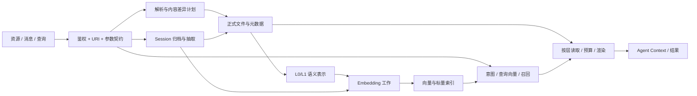
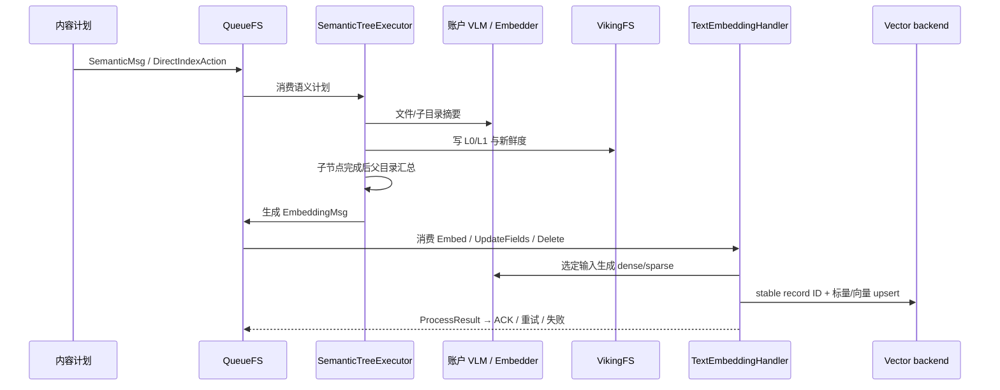

# OpenViking 核心数据流

> 日期：2026-10-02；源码基线：`df32bf6e50a40843438f9491a26069ca4bd08f1f`。这里沿输入、转换、持久化、索引与读取说明数据实际流向，覆盖资源、记忆、检索、任务和运维路径。用户编号中该项写作“11”，本文按指定文件名编号为 9。

## 1. 全局数据地图

| 数据 | 主要来源 | 中间表示 | 主要持久化/输出 |
| --- | --- | --- | --- |
| 资源 | 本地上传、HTTP、Git、飞书、站点/Feed、Connector | LocalResource、ParseResult、ParseArtifactRef、Context/BuildingTree、RNFV/plan | 正式文件树、L0/L1、向量记录、导入 task |
| 消息 | SDK/CLI、插件 capture、日志回放、Bot | Message/parts、peer/time/turn、tool ref | 活跃 messages.jsonl、Session meta、archive、工具原文 |
| 记忆 | 归档消息、已有记忆、cases/轨迹 | Schema、ExtractContext、模型 DSL/JSON、ResolvedOperations、MemoryFile | 用户/Peer Markdown、MEMORY_FIELDS、links/provenance、memory_diff、索引 |
| 查询 | 文本/图像、目标、filter、session | TypedQuery/计划、dense/sparse、候选、MatchedContext | 返回结果；context mode 再生成预算条目/rendered/digest/ledger |
| 身份 | API Key/Bearer、LDAP/OIDC、trusted headers | ResolvedIdentity→RequestContext | 账户文件路径、owner/ACL filter、账户模型/DB 绑定 |
| 工作 | 资源/会话/维护/外部操作 | TaskRecord、持久 QueueFS payload、lease/handoff/checkpoint | task 状态、pending/processing/ACK、恢复标记 |
| 观测 | HTTP/模型/队列/FS/检索事件 | telemetry/span、ObservabilityEvent、指标/审计投影 | 响应 telemetry、log/OTLP、Prometheus、Usage Audit SQLite |



文件、向量库、工作队列和观测投影分别有自己的状态，不能理解为一条自动原子提交的数据库事务。以下每条流都说明完成边界。

## 2. 请求身份、URI 和模型/存储路由

```text
请求凭据 / 认证模式
 → AuthPlugin.resolve_identity
 → ResolvedIdentity(account/user/role)
 → RequestContext(group_ids/actor_peer/api_key 等)
 → 请求边界展开 viking://~ 和路径变量、验证目标类型
 → service
 → VikingFS 账户路径/namespace/ACL
 → VikingDBManagerProxy 租户/owner/ACL 过滤
 → 账户 VLM/Embedding/Vector resolver
```

账户通常不显示在逻辑 URI 中，由 `/local/{account_id}/...` 与向量后端/过滤体现。actor_peer 不改变账户/用户身份，只影响当前用户下的 Peer 视图；API Key 模式也不会任由客户端身份头覆盖密钥身份。

因此，同名 URI、session_id、model 配置在另一账户不应直接复用。前端连接切换同步 HTTP client、清 Query cache 和重挂载，也是这条身份流的客户端侧配合。依据：[identity.py](../openviking/server/identity.py)、[namespace.py](../openviking/core/namespace.py)、[文件路径映射](../openviking/storage/viking_fs/_access.py)、[vector backend](../openviking/storage/viking_vector_index_backend.py)。

## 3. 启动与恢复数据流

```text
ov.conf / 启动参数
 → OpenVikingConfig + ServerConfig
 → workspace 进程锁 / 加密配置
 → RAGFS 挂载 + QueueFS + VikingDBManager + TaskTracker
 → 上下文集合契约 / RuntimeConfigManager
 → 账户模型/向量资源 resolver
 → VikingFS / 目录 / 处理器 / 子服务依赖注入
 → 扫描持久队列，重建 TaskWorkIndex，恢复外部任务归属
 → 注册并启动 worker / Watch / 自动提交 / 配置刷新
 → AuthPlugin / 删除恢复 / 接受流量
```

[core.py](../openviking/service/core.py) 负责核心组合，[app.py](../openviking/server/app.py) 负责 HTTP 生命周期和鉴权/观测启动。恢复在工作执行前建立任务归属，避免把重启后的消息误看成无主工作。关闭流程停止新后台工作后，依次退出队列/模型/向量/文件资源并释放数据目录锁。

## 4. 资源入库：上传、获取、解析和增量同步

### 4.1 原生路径

| 阶段 | 输入与处理 | 输出 / 关键状态 | 实现 |
| --- | --- | --- | --- |
| 上传/请求 | 本地文件或目录被客户端压缩/上传；远程源直接提交 | temp_file_id / shared upload 或远程 path、to/parent、processing_mode/tags/ACL | server/resource_ingest、temp_upload_store、resources router |
| 校验和路由 | 身份、URI、来源、权限、参数、目标占用和 Watch 冲突 | 持久 TaskRecord、阶段消息和目标/来源状态 | ResourceService |
| 获取 | AccessorRegistry 按优先级选来源；下载/clone/飞书转换/Feed 镜像 | LocalResource 与来源 metadata；任务源必要时 stage/shared | accessors、staged_source/shared_source |
| 内容解析 | ParserRouter→内部 ParserRegistry 或外部 Understanding | ParseResult + ParseArtifactRef、本地/AGFS 解析产物、MD5 manifest | parse/output/parsers |
| 定位 | TreeBuilder 规范化资源名、单文件折叠、parent/to | 最终 URI 元数据及临时→正式对应关系 | tree_builder |
| 快照比较 | RequestIntent + N/F/V inventories，比较 bytes/type/topology/index | ResourceDiffResult | resource_rnfv/resource_diff |
| 编译计划 | 内容树动作、语义依赖计划、直接索引动作 | ContextUpdatePlan | context_update_plan |
| 内容提交 | 锁范围内同步正式目标、图片/链接/metadata | 正式文件树；未包含的同步目标内容可能删除 | ResourceProcessor/AgfsResourceTarget/VikingFS |
| 后处理 | semantic_and_vectors 或 vectors_only 决定路径 | SemanticMsg/EmbeddingMsg、freshness 与子任务 | QueueFS/embedding_utils |
| 完成 | 工作和子工作收敛、状态更新/释放锁/临时资源 | root_uri、task_id、统计/warnings；wait 按请求契约等待 | TaskTracker/RequestWaitTracker |

`to` 是精确目标同步；`parent` 是父目录，碰撞预留新的名字。这两种语义影响旧内容删除、Watch 占用和增量计划。解析产物是中间状态，不能把 ParseResult 返回直接等同于正式资源/索引均完成。

### 4.2 外部导入和解析分支

- **Connector**：ResourceService→ConnectorDelegate→远端 task→状态监控→OV TaskRecord/Watch 状态。TOS 属 Connector-only；Git 可原生或委托；显式 add_type 不会任意降级。外部 Connector 自身实现不在核心源码中。
- **Understanding**：Files/Responses 上传或直传 URL→poll/checkpoint→结果 ZIP→统一 ParseOutputStore，再回主计划链。
- **MinerU**：PDF 外部策略返回 Markdown/图片，再进入 Markdown/产物阶段。
- **LlamaParse bridge**：示例服务把 Understanding 协议转到 LlamaParse，再打包结果；调用方向是 OV→bridge。

## 5. 语义树、Embedding 与检索表示



`SemanticTreeExecutor` 按依赖自底向上处理，复用未变节点语义，不是同步递归对全树逐节点调用模型。Embedding handler 根据 action 可以只改字段或删除，未必每条消息都重新调用模型。

向量稳定 ID 由账户与 level seed 生成：L0/L1 使用对应 sidecar seed，L2 使用内容 URI；实际旧记录 ID 可能在维护计划中保留。外部字符串 ID 转原生 label 是另一映射，不能混同内容 MD5。内容/summary 的 Embedding 输入选择、token 截断、多模态图片与 scalar/tags/ACL 由 helper 和配置共同决定。

依据：[semantic_executor.py](../openviking/storage/queuefs/semantic_executor.py)、[embedding_utils.py](../openviking/utils/embedding_utils.py)、[collection_schemas.py](../openviking/storage/collection_schemas.py)、[vector_ids.py](../openviking/storage/vector_ids.py)。

## 6. 消息追加、工具原文与 Session 提交

### 6.1 活跃会话

消息输入被转换为 Message：role、parts、id、peer、created_at、turn_id、message_kind、source IDs。文本/Context/Image/Tool 分片共同保存；`content` 快捷属性不能代表全部 parts。

追加时在会话路径锁下重新读取权威活跃消息/metadata，去重并写回。大工具输出可外置到 tool-results，消息保留 synopsis/ref/hash/source range；普通上下文用 synopsis/引用，抽取前 hydrate 原文。图片 data URI 在文本副本/观测和抽取前有专门处理，不能把 base64 当普通自然语言记忆。

### 6.2 两阶段业务提交

```text
Session.commit_async
 → 锁内读取最新活跃消息/meta + 计算策略
 → retention 按条数或 turn budget 分配归档与近期保留
 → archive_NNN/messages.jsonl + phase1 恢复意图
 → SessionCommitMsg 持久入队 / TaskRecord
 → 写保留活跃消息/meta → phase1 ready → 返回 task_id

SessionCommitProcessor
 → resume_queued_commit / phase1 就绪与已有标记核验
 → 读取当前归档、恢复其 completed_memory_steps / hydrate 工具原文
 → 并行工作记忆摘要/checkpoint 与长期记忆/技能处理
 → 持久完成步骤与覆盖消息ID / memory_diff
 → 尝试等待本请求索引工作（超时记错误但继续完成）/ 更新会话 meta
 → 必需步骤成功后 .done；失败保留 .failed.json 与任务失败
```

当前 Phase2 只处理本次归档；已经有 .failed.json 的归档会按失败终态处理，不自动把以前失败归档原文纳入新抽取。索引等待超时后仍可发布 .done，所以 .done 不等于所有派生索引已就绪。

这是恢复阶段，不是跨文件/向量/模型的数据库 2PC。工作记忆供当前会话延续，长期记忆跨会话复用；context reset、保留原文和 checkpoints 有各自边界。源码：[session.py](../openviking/session/session.py)、[archive_store.py](../openviking/session/archive_store.py)、[retention.py](../openviking/session/retention.py)、[checkpoints.py](../openviking/session/checkpoints.py)。

## 7. 长期记忆、技能和经验演化

### 7.1 普通记忆写入流

| 阶段 | 数据变化 | 责任组件 |
| --- | --- | --- |
| 有效策略/模板 | account/user/session/commit memory policy、enabled types、self/peer/working memory | SessionService、MemoryTypeRegistry、account_templates |
| 输入构建 | 带消息索引/时间/说话人、固定记忆/集合候选、图片描述 | SessionExtractContextProvider、isolation handler |
| 模型抽取 | ReAct 工具读取、DSL/JSON 输出 | ExtractLoop / VLM / schema_model_generator |
| 操作解析 | 校验 schema、page_id/URI、字段/patch、资源引用和 links | 输出协议、resolve/finalize operations |
| 批合并 | 按账户/用户/peer/type 聚合；add_only 快路，其余 patch merge | StreamingMemoryUpdater / PatchMergeContextProvider |
| 优先回读再应用 | 优先读磁盘 MemoryFile；非迁移回读异常可退回预取快照，执行 immutable/replace/sum/patch、版本/provenance、删除/改名与引用 | MemoryUpdater |
| 保存 | Markdown + MEMORY_FIELDS、link/backlink、目录 overview、memory_diff | VikingFS |
| 索引 | Context→EmbeddingMsgConverter→enqueue_embedding_msg | EmbeddingQueue→TextEmbeddingHandler |

模型生成的 Python-shaped 输出由受限 AST 编译器解析，不直接 exec 任意代码。StreamingMemoryUpdater registry 是进程内缓冲/共享，实际写入靠锁和文件/队列持久化；它不是一个完整持久分布式流处理集群。

### 7.2 技能与训练

session_skills 经独立技能 schema→SkillOperationUpdater→SkillProcessor 保存 SKILL.md/辅助文件/隐私占位与索引。它与默认禁用的 `memories/skills`、`memories/tools` 卡片模板不是同一数据类型。

经验演化流：canonical cases→Rollout/归档轨迹→Trajectory analyzer→trajectories→ExperienceGradientEstimator→文本改动梯度→PolicyOptimizer→MemoryFilePolicyUpdater→experiences；技能梯度使用 SkillPolicyUpdater。来源 case/trajectory/experience 链接帮助追溯结果。批训练可以经远端 dataset/rollout 服务和 SessionCommitPolicyTrainer 走 HTTP 写回，eval 与 train 的路径不同。

依据：[compressor_v3.py](../openviking/session/compressor_v3.py)、[memory_updater.py](../openviking/session/memory/memory_updater.py)、[skill](../openviking/session/skill/session_skill_context_provider.py)、[train/pipeline.py](../openviking/session/train/pipeline.py)。

## 8. 检索与上下文装配

### 8.1 find/search

```text
文本/图像 + target/filter/level/时间/标签 + ctx
 → 边界验证和 filter 合并
 → SearchService → VikingFS
 → search 在启用/适用时取 Session 上下文与意图查询
 → 账户 Embedder 生成 query dense/sparse（关键词模式不同）
 → 租户代理组合 account/owner/ACL/target 条件
 → 后端全局向量或关键词召回
 → 同 URI 去重 / 可选 rerank / 阈值 / level 显示 URI 转换
 → MatchedContext / FindResult / 统计
```

当前 HierarchicalRetriever 是全局召回，层级体现为内容和过滤，不是逐目录优先队列算法。关键词要后端/全文索引支持；图片需要模型多模态能力，并有默认 L2/跳过文本重排等路径。skills/find 专门做包级分页/归并，普通 find/search 仍是 item 级。

### 8.2 mode=context

查询扩展→分组并发候选获取→请求级 query Embedding 缓存→去重/排除/Peer惩罚→只读需要正文的候选→类别 detail 层级与 token 预算→rendered→可选 query planner digest→RecallLedger 更新。

当 digest 判断无相关记忆并清空输出时，不把未展示 URI 写入冷却 ledger。ledger 失败为 best effort；这不是后端数据库级永久去重。旧 recall endpoint 折叠为同一装配流程并标记弃用。

源码：[SearchService](../openviking/service/search_service.py)、[Retriever](../openviking/retrieve/hierarchical_retriever.py)、[context pipeline](../openviking/retrieve/context_assembler/pipeline.py)。

## 9. 文件修改、移动删除和索引维护

| 操作 | 关键数据流 | 一致性边界 |
| --- | --- | --- |
| write/batch-write/tags | 校验→锁/最新值→写正式内容或字段意图→按模式安排语义/直接索引→父目录 freshness | 用户不能任意覆盖保护的 sidecar 元数据 |
| cp/mv | URI mutation 稳定范围→source/target锁→文件转移→sidecar/link重写→vector URI/owner/ID/ACL迁移→补偿 | 不能只执行底层 rename 而忽略向量/Watch/引用 |
| rm | 权限/占用/锁→先删向量再删文件→Watch同步/父目录刷新→资源记忆引用清理 | before_resource_delete 虽名为before，当前FSService调用在实际删除之后；部分失败没有全局原子回滚 |
| reindex | 正式 F/V 快照→选择语义/向量维护→锁handoff/队列→新记录/字段修复 | 可修复派生索引，不需要虚构新来源 N |
| consistency | 正式树推导应有 URI+level→查询缺失记录 | 当前不执行全面内容MD5比较；diff/RFV另负责指纹 |

## 10. Watch、日志回放和 Agent 插件

| 流程 | 数据来源→输出 | 持久状态/恢复 |
| --- | --- | --- |
| Resource Watch | due Watch→保存的来源/目标/认证→refresh_resource→导入task→last_status/next执行时刻 | Watch 控制文件、private auth、last_task_id；间隔以分钟，URI变更协调 |
| 日志 backfill/watch | Agent JSONL/SQLite→LogSource→NormalizedMessage→请求part→SDK HTTP追加→commit | cursor_store SQLite保存游标、幂等/commit状态；支持源与实验/未实现源分开 |
| 共享宿主插件 | SessionStart profile→prompt context recall→Stop/compact capture→messages/batch→commit | 本地 retry/pending queue、宿主session→OV session映射；服务端仍负责抽取 |
| VikingBot聊天 | channel→MessageBus→AgentLoop→ContextBuilder/模型/tools→stream/outbound；hooks同步OV | Bot本地Session与OV Session是两个对象，有同步水位 |
| Bot远程技能 | OV技能发现/下载→按principal/version物化cache→sandbox工具 | 客户端缓存不能替代服务端授权 |

## 11. 配置、外部任务、备份快照、删除与观测

| 流程 | 主要步骤 | 持久结果 / 边界 |
| --- | --- | --- |
| 运行时配置 PATCH | RuntimeField/冻结/兼容校验→ConfigSource锁内读改写/备份→发布视图→notify→资源失效/借用退役 | Cluster/Account独立文档；resolver决定缺值语义 |
| Compile/外部任务 | from/to/skill/幂等key验证→OV task+provider状态→提交/轮询/取消→执行器写回 | target串行、request hash、外部task ID与恢复；可远端/Bot或memory runner |
| Git快照 commit | 按账户范围枚举/ignore→blob hash→tree/commit→RefStore CAS | local/S3 object/ref/index；与导入时git clone不同 |
| Git restore | diff/新commit/ref CAS→VFS回写→受影响索引重建 | ref已前移但回写部分失败有专用错误，不能假设全部原子 |
| OVPack | 内容+manifest+portable scalar→ZIP；可选兼容dense snapshot→验证→owner/URI映射→导入/重算 | 不是直接复制LevelDB目录；vector require/auto有不同失败策略 |
| account/user删除 | 身份撤销/删除围栏→持久清理任务→取消工作→向量/文件/配置/上传/审计清理与OAuth授权撤销（token/code行失效、verified pending删除、client metadata保留）→完成 | 幂等恢复；单条DELETE接受不表示全部清理已完 |
| 观测 | request/task上下文→模型/HTTP/队列事件→EventBus→metrics/trace/Usage Audit投影 | 进程内best effort旁路，不参与业务ACK事实来源 |

## 12. 排查数据流时的观察点

| 现象 | 优先核对 |
| --- | --- |
| 已上传但不可搜索 | upload是否仅暂存、导入task阶段、正式root_uri、Semantic/Embedding子工作、账户/ACL与level |
| 会话已commit但记忆未出现 | phase1是否ready、archive failed/done、有效memory policy/type、抽取结果/skip、索引等待 |
| 原文变更但摘要旧 | processing_mode、freshness/pending、最小语义计划、模型错误/队列重试 |
| 同名内容在客户端显示不一致 | 服务地址/身份scope、前端Query失效、账户物理路径、target/owner/Peer filter |
| 移动后仍命中旧URI | 文件步骤、vector transfer补偿/旧记录删除、sidecar引用、对应task |
| 重启后仍有处理中任务 | 队列pending/processing snapshot、恢复TaskWorkIndex、checkpoint、外部provider状态和锁lease |

对应接口、表/实体、配置和测试目录分别见 [4-接口列表.md](4-接口列表.md)、[5-表关系.md](5-表关系.md)、[6-配置文件.md](6-配置文件.md)、[7-测试用例.md](7-测试用例.md)。本篇只说明源码数据路径，不代表外部服务和每种恢复场景均已实机验证。
